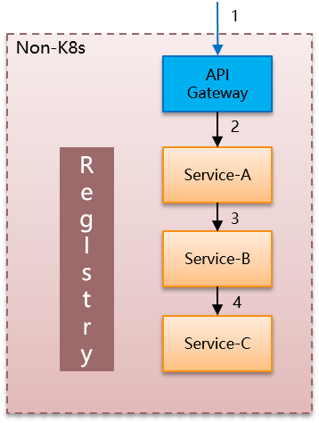
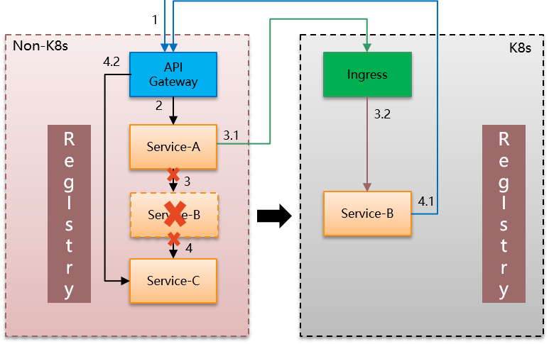
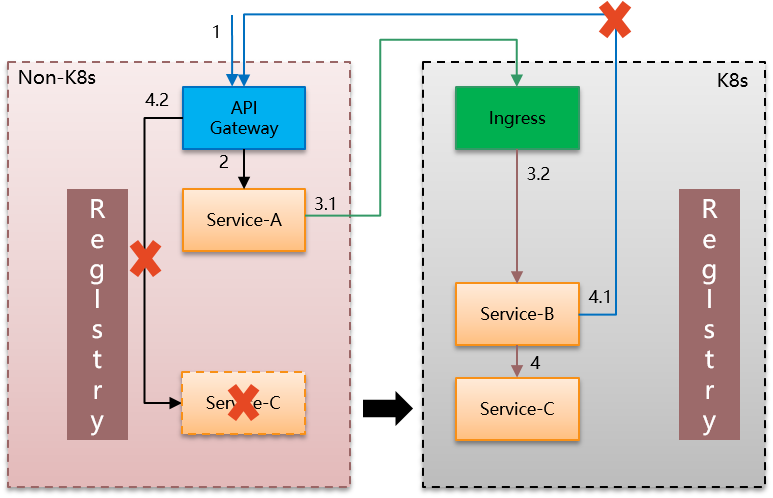
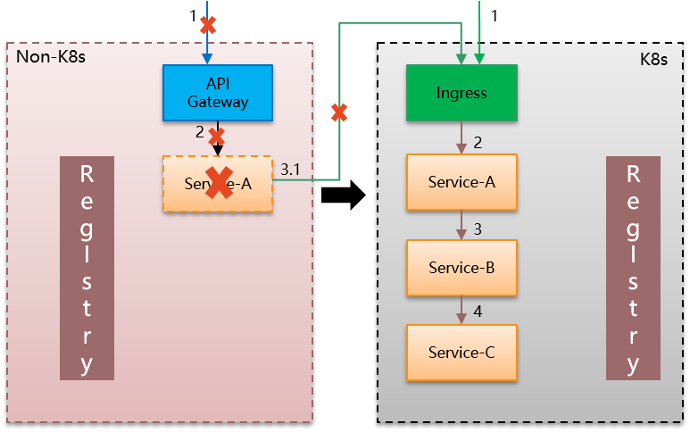

+++
title = "DreamMesh抛砖引玉(3)-艰难的过渡"

date = 2018-02-11
lastmod = 2018-02-11
draft = false

tags = ["DreamMesh"]
summary = "一部分应用开始搬迁到Service Mesh，大部分还停留在原有体系。那么，在过渡阶段，Service Mesh内的服务和Service Mesh外的服务在通讯时会遇到哪些问题？"
abstract = "一部分应用开始搬迁到Service Mesh，大部分还停留在原有体系。那么，在过渡阶段，Service Mesh内的服务和Service Mesh外的服务在通讯时会遇到哪些问题？"

[header]
image = ""
caption = ""

+++

在上一篇中，我们讨论的话题是：如果没有做好Cloud Native的准备，该怎么上Service Mesh。本章继续讨论，假定Cloud Native已经准备好，看看Service Mesh的道路是否就一帆风顺。

## 问题所在

**如何从非Service Mesh体系过渡到Service Mesh？**

我们需要考虑的是：

* 即使一切准备就绪，对于一个有存量应用的系统而言，绝无可能将所有应用都一起改为Service Mesh，然后一夜之间上线。

* 必然会有一个中间过渡状态，一部分应用开始搬迁到Service Mesh，一部分还停留在原有体系。

那么，在过渡阶段，Service Mesh内的服务和Service Mesh外的服务在通讯时会遇到哪些问题？

## 场景分析

我们来看一个具体的例子，有三个服务，调用关系分别是A->B->C，然后在最前面架设API Gateway。非常典型的微服务体系：

这里可以是spring cloud/dubbo/motan等各种侵入式微服务架构，左边的注册中心/registry的实现也可以有多种，服务间通讯的方式也不尽相同。但是，都不影响我们的讨论。

上图可以看到，在标准的微服务框架中，处理这样一个请求，调用方式是清晰明了的。

如果开始转向Service Mesh体系，无论是Istio/Conduit，都会引入一个新的k8s体系。为了充分演示，我们选择将服务B转移到Service Mesh。调用关系就一下变成复杂：

这里我们引入两个术语（TBD：应该是业界通用术语吧？待确认）：

1. 东西向通讯：指微服务间相互调用
2. 南北向通讯：指外界访问微服务体系，通常是通过API Gateway

当B被迁移后，B原有的上游调用（A调用B）和下游调用（B调用C），虽然业务语意上依然还是东西向通讯，但是由于跨了体系导致原有的调用方式被打破。只能另想办法，目前看通常的做法都是改走南北向通讯。

## 影响

而这个改变会带来巨大的工作量：

1. B的所有上游服务都要修改

	原有的标准服务间通讯（通过sdk进行服务发现/负载均衡等）都废弃，需要改为对k8s体系入口如Ingress的调用。然后在Ingress这边也要做好对服务B的配置。

2. B对所有下游服务的调用方式都要修改

	同样，原有的标准服务间通讯都废弃，需要改为对API Gateway的调用。然后在API Gateway这边也要做好对下游服务的配置。

而通讯机制改变带来的工作量不是唯一的问题，还有一个内部服务对外暴露的问题：

* 在原有体系中，服务B和服务C都是内部服务，完全可以不对外暴露，API Gateway访问的只是服务A
* 迁移之后，为了让服务B的上游服务能够访问到服务B，就不得不将服务B暴露出来。
* 同样，为了让服务B能够访问它的下游服务，就不得不将服务C暴露出来

原体系中只有服务A对外暴露，现在服务B和服务C也不得不暴露。而对外暴露服务，就意味着必然还会有一堆相关的工作需要完成：

- 认证
- 授权
- 加密
- ......

而这些都意味着：工作量/复杂度/更多的开发测试上线。

## 后续影响

随着应用往Service Mesh体系的逐渐迁移，我们开始迁移服务C和服务A。

先看服务C迁移到来的变化：

此时服务B到服务C的调用从原来的走API Gateway改变为Service Mesh体系内的服务间调用。然后API Gateway不再需要调用服务C，可以去除和服务C相关的内容。

再看服务A的迁移：

此时服务B不再需要暴露，而服务A的暴露方式发生变化，另外服务A调用服务B的方式也有改变。

我们抛开细节，只看整体：在服务A/B/C迁移到Service Mesh体系的过程中，**服务间调用方式和对外暴露方式的变化**，带来了一系列的工作量。而耗费这些工作量的中间环节，在整体迁移完成之后都会消失。换言之，都是迫不得已的临时投入，对最后的系统不产生增益。

直白一点：在过渡阶段的这诸多折腾，只是完成了服务迁移，而不能带来任何收益。这一点，无疑是令人沮丧的。

## 问题本质

反思一下：为何服务只是体系间迁移一下，就需要增加这么多不带来实际收益的工作量和复杂度？到底我们上面这些折腾是在做什么？

很明显，在这个过程中，我们没有任何业务改动，三个服务的实现也没有发生任何变化。

那么，改变的东西是什么？

是**服务间通讯**:

迁移过程中，服务A/B/C之间的通讯在业务语意上虽然依然属于东西向的服务间通讯机制，但是在实现上，却不得不临时转为南北向的网关到服务的通讯机制。

这个转变是无奈的，两个体系之间存在以下问题导致无法继续走东西向服务间通讯机制：

1. 没有共同的registry，因此无法相互感知
2. 没有可以直接连通的网络通道，原有的服务间通讯被迫走公开的API Gateway和Ingress通道
3. 两个体系的服务间通讯机制也可能不同，导致迁移之后不得不重新实现服务间通讯机制
4. API Gateway和Ingress对于服务暴露的方式也不尽相同，各种特性如认证/加密/服务路由等方式也很可能完全不同。

这就如同江河中的淡水鱼，如果要随波汇入大海，就必须要能适应海水。

然后我们的问题在于，在过渡阶段，不得不花费大量投入来的完成被两个体系分割的服务间通讯，增加了大量额外的工作。

## 后记

有没有办法解决这个问题，或者部分减轻工作量，为将来的Service Mesh转型做好准备？

后续章节会深入探讨这个话题，给出部分解决方案，也欢迎大家给出意见或者参与讨论。

有兴趣的朋友，请联系我的微信，加入DreamMesh内部讨论群。

## 讨论和反馈

- 冉启春：任何两个架构体系的迁移都是痛苦的

- 于文涛：运维团队负责容器化和k8s,基础架构部负责数据库拆分和分库分表以及底层中间件，业务平台部门参与微服务业务改造，其实路径没有统一的，得看不同团队的执行结果和如何协调了。谁强势先突破可能会有主导权。不过一般的路径是先底层后业务层。