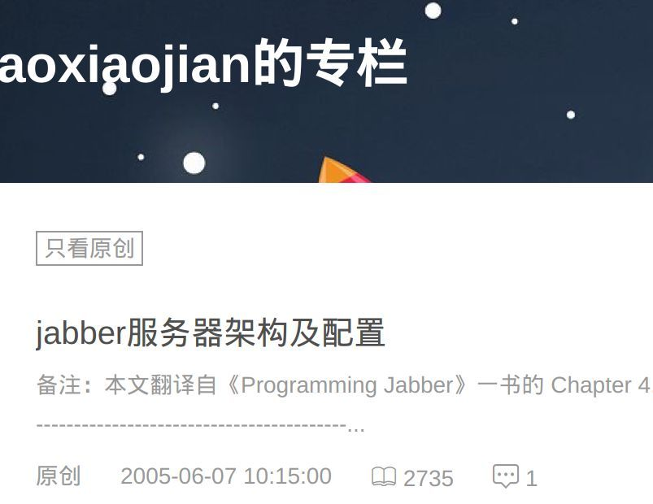
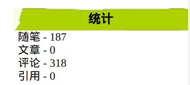
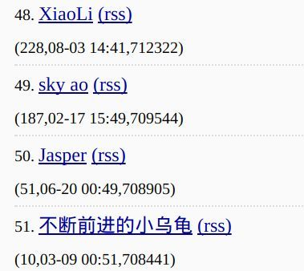
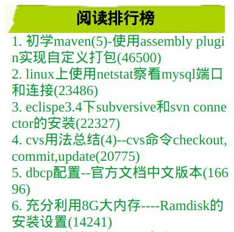
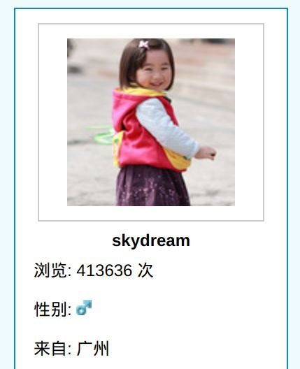
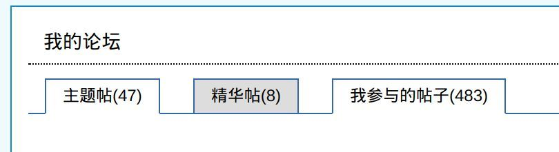
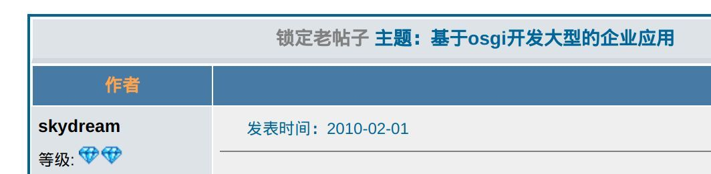

+++
title = "十年一觉扬州梦，赢得青楼薄幸名"

date = 2018-02-06
lastmod = 2018-02-06
draft = false

tags = ["杂谈"]
keywords = ["hugo","博客","个人技术博客"]
summary = "今天重启个人博客，借此机会回顾一下过去十三年间的个人技术博客的历程。"
abstract = "今天重启个人博客，借此机会回顾一下过去十三年间的个人技术博客的历程。"

[header]
image = ""
caption = ""

+++

自从两年前停止更新博客之后，一直以gitbook的方式写各种学习笔记。

今天，重启博客网站。

借此机会回顾一下过去十三年间的个人技术博客的历程。

## 遥远的2005年

直到今天翻自家的blog历史记录，才意外的发现：我的第一个技术博客，居然是在CSDN！

http://blog.csdn.net/aoxiaojian

当时我才刚加入亚信，做第一个项目，给邮箱系统增加即时通讯功能。

当时选择的是Jabber，然后没啥中文资料，我就只能用我那蹩脚的英文能力啃英文资料！

十几年后回想，当时亚信的AIMC邮箱团队，阵容是何其的强大！这十几年职业生涯见过的最强大的团队莫过于此。

然而当时我只是一个才毕业两三年的毛头小伙，还不知道身边的那些貌不惊人的年轻人日后会成为高山仰止的对象。

人生如梦！

## 从2006-07到2013-02：blogjava

好像当时csdn的访问速度有些问题，我就将blog搬到了当时流行的blogjava网站。

http://www.blogjava.net/aoxj

陆陆续续写了这么多：

当时blogjava很是热闹，博客一发出去，就可以看到阅读数蹭蹭就上去了，很有成就感。

然后就记得blogjava首页有一个阅读数排行版，我当时很努力的发文章，后来终于杀进100名进入首页，再慢慢一点点的往前爬。想想也真是闲的蛋疼。

今天特意去首页看了一眼，都停止更新长达五年了，sky ao还在排在前50名：

顺便瞅了一眼，江南白衣还排在23名，最后一次更新在2011年。

可见今天的blogjava有多败落。

关于这个排行版，有个小插曲：当年就是在blogjava的排行榜中认识的白衣，所以后来某人在爱立信第一次亮相时做自我介绍的场景就成为经典：大家好，我叫肖桦（一片沉默：谁啊，不认识）...... 网名叫做江南白衣（掌声四起：啊，原来是你啊，久仰久仰）

看看当时都在写些啥：

这里比较搞笑的是第一篇，2009年初学maven时写的总结，用来打包应用到zip包然后解压即可运行。2016年我在做dolphin框架时，忘了怎么打包了，一顿百度/google，最后找出来的比较靠谱的文章居然还是自己写的这篇。——可见没事总结一下还是有意义的，天知道若干年后会不会有需要。

dbcp文档中文翻译那个，貌似从那个时候起我就喜欢翻译文档，不过早期翻译水平很烂，经常被人在评论里面说还不如看英文。无地自容的感觉，当然现在水平也没好到哪里去。但是，我经常安慰自己的是：贵在坚持。

最后一个更是搞笑，文章写于2009年，当时就上了8g内存。现在2018年，整整九年过去了，我现在用来敲这个文档的笔记本也才16g内存，十年间几乎没啥变化。摩尔定律失效的典型下场。

## 从2006-07到2013-02：javaeye

当时还叫javaeye，某人还叫肉饼，当时还盛行ror。

Javaeye的博客推出之后，因为可以导入blogjava的博客，我就同时使用blogjava和javaeye的博客，互为备份。

http://skydream.iteye.com/

庆幸的是，十余年后这两个网站都还幸存，我的博客内容也都还健在。只是javaeye改名iteye，物是人非。

当年一起泡javaeye的朋友们，一向可好？

2009/2010年间备受EJB/weblogic困扰的我，当时的想法就是一定要找个方法解决掉**系统太大模块太多复杂度太高维护太难**的问题，于是深入研究了一把当时火热的OSGI技术。后来，放弃......

时隔五年，直到2014年底/2015年初，在深入了解微服务之后，终于找到满意的结果。

额外补充一个：当年也是在blogjava的排行版上认识的BlueDavy，受他影响了解到osgi。不过据说BlueDavy后来自己也从osgi的坑中跳出来了，这是后话。

所以说：技术选型有风险，防火防盗防跟风。

## 从2014-04到2016-01：github page

2014年的时候想法改变，博客更多的是想写给自己，作为自己思考和记录的一种工具，学习工具。

有没有访客倒不再重要，也不再关注阅读数和评论。

当时博客好像也有些寂寥，blogjava和已经更名的iteye也找不回最初的热闹感觉。

于是，将博客搬到了github，利用hexo + github page搭建了基本上没啥人看的博客。

http://skyao.github.io/

**当才能不足以撑不起雄心壮志时，就应该静下心好好学习**

这句话是当时无意间在某处读到，深以为然，就一直作为座右铭放在博客首页提醒自己：人丑就要多读书！

然后就这么陆续写了两年。

## 从2016-01到2018-01：gitbook

当博客内容越来越多之后，发现以博客的方式来组织学习类的资料是一件非常不方便的事情，尤其有很多琐碎内容分散在几十个知识体系时。

后来偶尔接触到gitbook，发现以gitbook的方式来组织同一个知识体系是一件非常便利的事情，我称之为学习笔记。

https://www.gitbook.com/@skyao

陆陆续续建立了接近40个学习笔记，有些内容还算充实，有些只有聊聊几句，有些甚至空白来不及开始学习。

好在只是写给自己，除了偶尔分享给同事朋友，也懒得推。

意外的是，在github上各个笔记都很少有人star，反倒是gitbook上的star比较多，陆陆续续也攒了估计六七百个star，小小的安慰一下自己。

## 从2018-01开始：skyao.io

gitbook虽好，奈何速度总是不够快，2017年年中之后更是经常被墙导致无法访问。

最大的麻烦在于doczh.cn上的文档翻译，当时和service mesh社区的一帮人一起辛辛苦苦翻译的istio/conduit文档，放在gitbook上经常被告之无法访问，怒。

忍无可忍，于是在2017年年底的时候，掏钱在腾讯云买了一个最便宜的主机，然后把这堆翻译资料扔腾讯云上，访问速度飞快。

2018年，被[宋净超](https://jimmysong.io/)同学"勾搭"，发现hugo是个好东西：编译内容到静态文件的速度超快，十倍于gitbook。当时正在苦于gitbook本地生成速度的我发现这似乎是一个不错的选择。

适逢其会，2017年年底因为推service mesh，发了一些文章和分享，演讲实录。都是发在公司或者infoq等的微信公众号里面，非常散乱，而且夹杂着大量广告也不便阅读。期间偶尔还被朋友们索要资料，ppt/视频等，想想干脆自己整理起来好了，要给的时候也方便，避免到处找。

简单研究了一下，发现hugo貌似做这个事情不错。于是在hugo的一堆theme中找到了今天正在使用的这个[Academic theme](https://sourcethemes.com/academic/)，感觉挺适合作为个人网站兼博客。

顺便赶个时髦，申请了io域名，在高人指点下顺便搞定了https，于是有了下面这个个人网站：

https://skyao.io/

前段时间，将之前两年的几个觉得不错的分享整理出来放在网站上，也算是给自己留一个备份吧。

此外，有些内容不适合以学习笔记的方式存放在gitbook中的内容，以后会慢慢以博客的形式发在这里，比如说本文。

废话说了一大筐，其实就一个意思：**以后继续写个人技术博客**

## 结束语

再一次警醒自己：

**当才能不足以撑不起雄心壮志时，就应该静下心好好学习**

还有：

**少说，多做**

