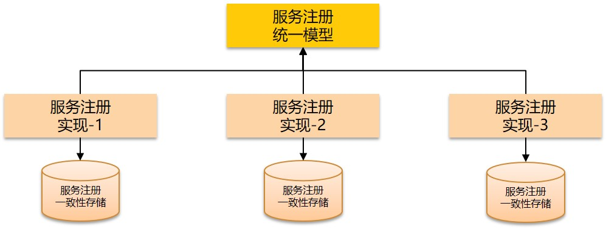
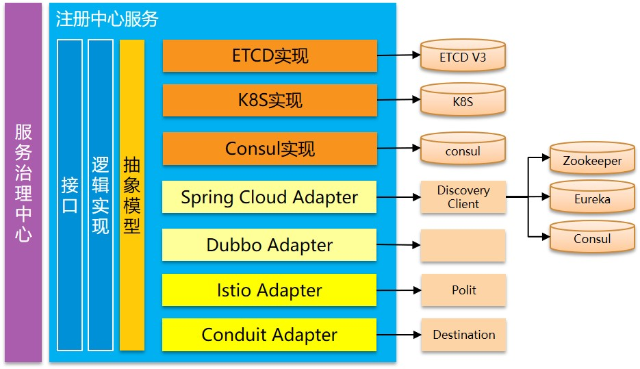

+++
title = "DreamMesh服务注册(1)-统一模型"
subtitle = ""
summary = "在前面的讨论中，我们探索了打通多个服务注册中心的思路。另外在服务治理中心的构想，也是希望能提供统一的方式对各家微服务体系进行服务治理。而要做到这两点，服务注册模型的统一势在必行。"
date = 2018-04-18
draft = false

tags = ["DreamMesh", "服务注册"]

[header]
image = ""
caption = ""
+++

在前面的讨论中，我们探索了打通多个服务注册中心的思路。另外在服务治理中心的构想，也是希望能提供统一的方式对各家微服务体系进行服务治理。

而要做到这两点，服务注册模型的统一势在必行。

## 背景回顾

首先回顾一下，需求来自哪里：

1. Service Mesh体系和非Service Mesh体系并存/过渡的需要

	见前文 [DreamMesh抛砖引玉(3)-艰难的过渡](../201802-dreammesh-brainstorm-transition/)

2. 多集群部署的需要

	见前文 [DreamMesh抛砖引玉(10)-多集群](../201804-dreammesh-brainstorm-mutiple-cluster/)

这两个需要迫使我们要想办法打通多个服务注册体系，使得他们可以相互交换数据，从而实现服务跨集群的彼此感知。

要实现这个想法，需要做到几点：

1. 能够跨集群的交换服务注册数据
2. 能够理解交换而来的服务注册数据
3. SDK有能力根据服务注册数据实现跨集群的请求发送

我们先来关注第二点：如何让多个服务注册体系彼此理解对方的服务注册数据？

## 模型是关键

每个服务注册体系，都会有自己的服务注册模型，记录服务注册时提交的信息，以便在服务发现时返回。简单的信息如IP，端口告知客户端"我在哪"，复杂一点的则典型如k8s中引入的label，可以实现基于lable的过滤。

服务注册模型通常都不会太过复杂，尤其是常见的基本信息大体上各家实现上大同小异。

但是，基本上，每家都是各自设计自己的一套模型，起码目前看不到有任何规范或者协同的迹象。因此，当今天我们试图打通多个服务注册体系时，面临的第一个事情，就是如何统一这些服务注册模型。

### 理想化的模型

先看看最理想的状态，如果我们能够提炼出一个统一的服务注册模型，然后让自家的服务注册产品都遵循这个统一模型。那我们就能得到一个非常理想的架构：

当然，自家的底层实现是可以完全不同的，各自发挥，但是最终对外都表现为一个统一的模型。类似于代码里面的interface和类实现，这里就是一个规范模型+各种具体实现。

### 基于统一模型的体系

有了统一的服务注册模型，上层的注册中心服务，就可以依托于这个统一模型而建立起独立于底层模型和存储实现的服务注册逻辑实现。以及注册中心服务之上的服务治理中心，则可以由此提供实现统一的服务治理功能。

在这个理想化的体系中，上层服务和UI是独立于底层实现的，通过中间的抽象模型来实现对接。因此，在这个体系中可以自由的选择/替换底层实现。而如果这个抽象的服务注册模型能够成为业界标准，则不同厂商可以分别提供不同组件，客户任意组合依然可以得到一个可工作的系统。

这是理想化的场景，一切很美好的样子，现在让我们回到现实。

## 模型适配

现实中，这个理想化的被大家一致认可并且严格遵循的统一的服务注册模型，是不存在的。

而且，很残酷的是，即使现在我们能找到并提出一个足够优秀的服务注册模型，业界也未必愿意接受，而说服现在的厂商和开源实现来修改代码适配这个模型，则无异于痴人说梦。

但是，这并不意味着事情就此打住，无以为继。因为，我们还有一个大杀器，虽然原理简单，虽然了无新意，虽然已经用的烂大街，但是，依然可以解决问题：适配器！

相信设计模式中Adapter的概念大家都是烂熟于胸的，随便抄一段适配器模式的定义：

> 适配器模式将某个类的接口转换成客户端期望的另一个接口表示，主要目的是**兼容性**，让原本因接口不匹配不能一起工作的两个类可以协同工作。其别名为包装器(Wrapper)。

### Dream Registry的构思

在Dream Mesh体系中，我们的服务注册子项目（项目名  [Dream Registry](https://github.com/dreamfly-io/dream-registry)）将提供三个原生实现和多种适配器：

其中，spring cloud adapter和dubbo adapter将适配到spring cloud和dubbo的服务注册发现，当然这两个框架的服务注册也是支持多种实现，我们将通过访问他们提供的抽象接口如spring cloud的discovery client来实现。

为了支持主流的service mesh，我们将提供Istio和Conduit的adapter，通过访问Istio的Polit和Conduit的Destination来实现。

### 参考实现

坦白说，上述Dream Registry的设计，本身并无过人之处，业界也有很多类似的实现。

比如Istio的Pilot，其中的Abstract Model和Platform Adapter的设计，就如出一辙：

Spring Cloud和更久远的Dubbo，设计也是类似的方案。

## 优势何在

设计上的雷同，一方面说明我们Dream Registry的设计是合乎常理，中规中矩的，可行性没有问题，这是好事；另一方面则是质疑和挑战：我们在今天掏出一个和别人三五年前（甚至dubbo已经是六七年前）的设计雷同的东西，价值何在？

这是一个无法回避的问题，我对此的回答是：

1. 更先进的模型

	Dubbo和Spring Cloud提出的服务注册模型，实在是太老了，尤其Spring Cloud，在2015年提出，给出的discovery client定义，却简陋到令人发指！

	Dream Registry的服务注册模型，会向k8s的服务模型靠拢，诸如label和lable filter这样的特性会在Dream Registry中发挥的淋漓尽致。具体实现中，我会尽量参考Istio pilot的Abstract Model，并结合Conduit Destination的设计，给出一个起码令我个人最为满意的服务注册模型（所谓Dream！）

2. 更广泛的用途

	和Istio pilot的Abstract Model相比，在功能和模型细节可以高度类似的情况下，我更希望将这样一个优秀的服务注册模型用于更加广泛的用途：不限于istio，不限于service mesh，而是在所有需要用到服务注册与发现的场合，甚至有改造spring cloud和dubbo的想法。

3. 更高的社区认可度

	有一个大胆的想法，由来已久，在Dream Mesh中，我希望能摸索出一条路，证明：一个优秀而统一的服务注册模型，可以帮助我们统一和规范服务注册的行为，并由此规范基于服务注册的各种服务治理功能。

	关于这个思路，曾经和多方讨论，基本上大家觉得还是可行的，虽然在能否统一社区想法和让社区接受上大家觉得难度颇大。但是，本着事在人为的想法，我觉得不妨努力试试。

篇幅所限，后续很多的细节将在接下来的文章中继续阐述。下一章，我们将聚焦这个服务注册模型的定义。

## 讨论和反馈

TBD：等收集后整理更新

## 后记

有兴趣的朋友，请联系我的微信，加入Dream Mesh内部讨论群。