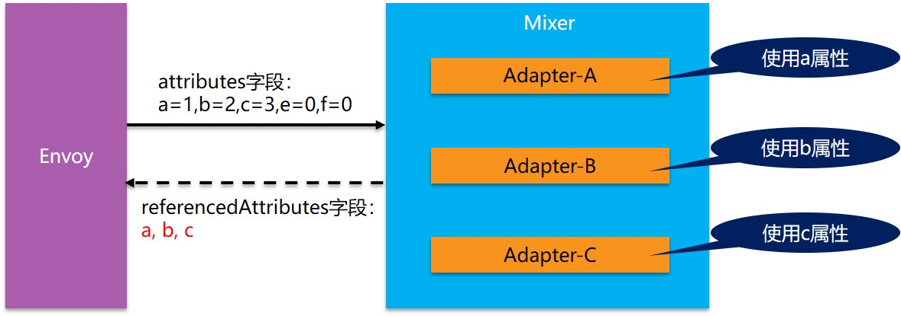
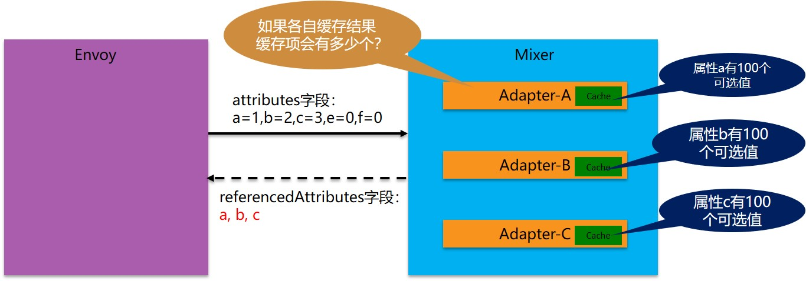

+++
title = "Mixer Cache: Istio的阿克琉斯之踵?"
subtitle = ""
summary = "为了架构的优雅，Istio设计了Mixer，将大量的功能从Sidecar中搬了出来。为了减少Mixer远程调用带来的性能，又精心设计了一套复杂的缓存。只是，这个Mixer Cache，有一个地方需要探讨......"
date = 2018-04-27
draft = false

tags = ["Istio", "Mixer"]

[header]
image = "headers/post/201804-istio-achilles-heel.jpg"
caption = ""
+++

## 前情回顾

在我的上一个博客文章中，出于对性能的担心，我和大家探讨并反思了Service Mesh的架构。关注的焦点在于mixer的职责和设计的初衷，以及由此带来的问题：

[Service Mesh架构反思：数据平面和控制平面的界线该如何划定？](../201804-servicemesh-architecture-introspection/)

> 注：如果对Mixer不太了解，推荐在阅读本文之前先阅读上面这个文章。

期间，对于Mixer Cache我存在几个质疑，由于官方文档和网上资料都几乎找不到任何相关的详细信息。因此，我不得不通过阅读源代码的方式来深入了解细节。

而从目前分析的情况看，Istio的这个mixer cache实现有些复杂，设计倒是挺精巧的。只是发现，**在特定场景可能会失效**。为了确认这个问题是否真实存在，我决定将问题消息描述出来，希望和大家一起分析和推断。

事情有一点复杂，让我们从mixer的工作原理，缓存的设计开始本文。

## Mixer缓存工作原理

我们先看看mixer是如何工作的， 简单的说，是envoy从每次请求中获取信息，然后发起两次对mixer的请求：

1. 在转发请求之前：这时需要做前提条件检查和配额管理，只有满足条件的请求才会做转发
2. 在转发请求之后：这时要上报日志等，术语上称为遥感信息，**Telemetry**，或者**Reporting**。

### Check方法介绍

我们的焦点落在转发之前的这次请求，称为Check方法，方法如下：

```properties
rpc Check(CheckRequest) returns (CheckResponse)
```

请求 `CheckRequest` 的内容如下（其他字段暂时忽略）：

| 字段            | 类型                                     | 描述                                                         |
| --------------- | ---------------------------------------- | ------------------------------------------------------------ |
| attributes      | CompressedAttribute                      | 用于此次请求的属性。<br> mixer的配置决定这些属性将被如何使用以创建在应答中返回的结果。 |

attributes 属性是envoy从请求中提取出来的，其内容类似如下：

```properties
request.path: xyz/abc
request.size: 234
request.time: 12:34:56.789 04/17/2017
source.ip: 192.168.0.1
target.service: example
```

Mixer中的Adapter将根据这些 attributes 属性来进行判断和处理，比如进行前置条件检查。然后将结果发送回envoy。简单起见，我们只看前置条件检查相关的内容。应答返回名为precondition的字段，表示前置条件检查的结果，具体如下(忽略其他字段)：

| 字段                 | 类型                                    | 描述                                                         |
| -------------------- | --------------------------------------- | ------------------------------------------------------------ |
| status               | [google.rpc.Status](#google.rpc.Status) | 状态码OK表示所有前置条件均满足。任何其它状态码表示不是所有的前置条件都满足，并且在detail中描述为什么。 |
| referencedAttributes | ReferencedAttributes                    | 在匹配条件并生成结果的过程中使用到的全部属性集合。           |

从Check方法的输入输出，我们可以看到：

1. 前置条件检查输入主要是attributes字段，这是envoy提取的属性列表，注意此时envoy是没有办法得知mixer中的adapter到底会关心哪些属性，因此envoy只能选择将所有属性都发送给mixer
2. 前置条件检查的输出中，status代表检查结果，referencedAttributes则有些费解，而这个referencedAttributes的设计，则是本次讨论的焦点。

### referencedAttributes的特殊设计

referencedAttributes是mixer中的adapter在做条件匹配并生成结果的过程中使用到的全部属性集合。

为什么要有这么一个设计呢？我们来看mixer请求过程中输入情况：我们假定当前mixer中有三个生效的adapter，其中每个adapter的逻辑都和特定的属性相关。



再假设envoy在处理traffic请求时，从请求中提取出5个属性，这五个属性中a/b/c是三个adapter分别使用到的属性，然后e/f两个属性当前没有adapter使用（实际情况属性会远比这个复杂，提取的属性有十几二十，其中有更多的属性不被adapter使用）。

在这个请求应答模型中，注意envoy是不能提前知道adapter要哪些属性的，因此只能选择全部属性提交。按照通常的缓存设计思路，我们应该将输入作为key，输出作为value。但是，如果我们将“a=1,b=2,c=3,e=0,f=0”作为key时，我们会发现，当e/f两个属性发生变化时，产生的新key “a=1,b=2,c=3,e=1,f=1”/“a=1,b=2,c=3,e=3,f=4”/“a=1,b=2,c=3,e=10,f=30” 对应的value会大量的重复，而这些属性值的变化对于adapter来说完全没有意义：e/f两个属性根本不被adapter使用。

因此，Istio在设计mixer cache时，选择了一个特殊方式来处理缓存的key：

1. 在mixer的response中，返回adapter使用到的属性名，在这个例子中就是"a/b/c"。
2. envoy在收到response之后，检查这个使用的属性列表，发现只有"a/b/c"三个属性被adapter使用
3. envoy在缓存这个应答结果时，会选择将属性列表简化为只有adapter使用的属性，如“a=1,b=2,c=3”
4. 因此mixer在构建缓存项时，可以就针对简化后的属性进行hash计算，mixer中将此称为签名

> 这些被adapter使用的属性在Check 方法的response中以 referencedAttributes 字段表示。

这样缓存的key的数量就大为减少，否则每次提交的key有十几二十个，有些属性的值还每次都变化如request.id。如果不进行这样的优化，则缓存根本无从谈起。

### 缓存的保存和查找方式

经过 referencedAttributes 字段的优化之后，输入的属性就被简化为“a=1,b=2,c=3”，然后envoy将保存这个输入到缓存中：

1. envoy将记录mixer关注"a/b/c"这样一组属性组合（注意会不止一组）
2. envoy将“a=1,b=2,c=3”这个实际被使用的属性值进行签名（理解为某种hash算法）得到缓存的key

缓存保存之后，envoy在处理后面的请求，如“a=1,b=2,c=3,e=1,f=1”/“a=1,b=2,c=3,e=3,f=4”/“a=1,b=2,c=3,e=10,f=30” 这三个请求时，就会尝试从缓存中查找：

1. envoy会先根据保存的被关注属性组合，看请求是否命中，比如这里的"a/b/c"属性组合就可以匹配这三个请求。
2. 然后根据"a/b/c"组合简化请求的属性为“a=1,b=2,c=3”，再进行签名计算
3. 然后再以计算得到的签名为key在缓存中查找。
4. 如果找到，返回缓存结果。如果没有找到，继续发送请求到mixer，然后保存得到的response到缓存中

这就是mixer cache的工作原理，而实际上，mixer cache的实现细节远比这里描述的复杂，有很多细节如absence key，有效时间，有效使用次数，匹配方式的优化。理论上说，有了这么一个明显是精心设计的mixer cache的加持，Istio中mixer和sidecar分离造成的性能问题得以解决，而mixer从sidecar拆分出来带来的架构优势就更加明显。

就如图中，英勇无敌的阿克琉斯，手持盾牌，就不惧箭雨。


> 备注：后面会单独出一个系列文章，详细介绍mixer cache的工作机制，外加源码分析。在本文中我尽量简化以便聚焦我们的关注点。

## Mixer缓存的问题

有了这个知识作为背景，我们开始本文的正题：这个mixer缓存的问题在哪里？

我们将关注点放在这里：“a=1,b=2,c=3”。这是经过简化之后的实际被adapter使用的属性名和属性值的表示，表示这里有三个属性以及他们的当前值。

### 缓存总数的计算

我们给出一个简单的场景：如果a/b/c三个属性的取值范围都固定为100个，那么，envoy中的mixer cache理论上最多有多少缓存项？


相信这么简单的问题难不倒大家，我们很容易的得到答案：Mixer Cache的数量=属性a的取值数量 * 属性b的取值数量 * 属性c的取值数量 = 100 * 100 * 100 = 100万。从数学的角度说，是每个取值范围的笛卡尔乘积。

有没有发现这个缓存数量总数有点夸张？明明是3个属性的取值范围都只有100这么小，为何直接膨胀变成100万？

我们对比一下，如果缓存不是存放在envoy一侧，而是存放在Mixer中，让每个adapter各自缓存自家的处理结果。那得到的缓存总数会是如何？



这是小学二年级的数学题了，总数=100+100+100=300，和前面的100万差异巨大。

为什么会有这么大的差异？根据在于计算方式，当缓存在Mixer一侧时，缓存总数是各个adapter缓存的总数，也就是每个属性数量的简单相加。而当缓存在Mixer一侧时，缓存总数是每个属性取值数量的笛卡尔乘积。

### 为何不能把缓存放Mixer？

从上面的计算我们可以看到，当缓存在mixer一侧时，缓存数量是简单相加，只要不出现单个缓存数量过大，总和就不会离谱。多几个属性，如果取值范围只是几个，几十，甚至几百，几千也不会对结果有任何实质性的影响。

而当缓存放在envoy一侧时，由于算法从各项和变成了各项的笛卡尔乘积，导致数量急剧增加，甚至有些本来取值范围非常小的属性，哪怕只是个位数，也会因为乘法的原因，*2 *3 *10 *100 导致最终总数量爆炸性膨胀。

两相对比，将缓存放在mixer一侧，从缓存的角度上说毫无疑问是更好的选择。但是，在Istio的架构设计中，明确的要求Mixer和Envoy划分开，将Envoy归为数据平面，而Mixer归为控制平面。在具体实现上，Envoy是重用原有项目，Mixer是全新编写。在编程语言上，Envoy是c++，而Mixer是Golang。

以上种种，一步一步演进，终于造就了我们目前不得不面对的尴尬局面：

- 要明确划分数据平面和控制平面的界限，Mixer就必须独立于Envoy
- Mixer和Envoy之间就变成了远程访问，存在性能瓶颈
- 为了解决性能问题，避免远程访问，就需要将cache加在envoy一侧
- 然后就不得不面对缓存总数呈现笛卡尔乘积的威胁

或者说，只要Istio不重新规划数据平面和控制平面的界限，不将Mixer的功能移到sidecar，此问题，貌似就无解？

> TBD: 这个结论暂时只是我的个人理解，需要等待大家讨论和分析，给出权威的结论之后根据讨论情况更新。

## 问题严重程度

然而，并非所有的问题都一定需要解决，如果问题不造成不可接受的影响，也未尝不能接受。

### 缓存数量的影响

我们重新回到问题所在，让我们来评估一下，在实际的使用中，这个缓存数量是否真有膨胀到不可忍受的地步。计算公式：

<u>Mixer Cache的数量=各个引用属性取值数量的笛卡尔乘积</u>

要控制缓存总数，有两个思路：

1. 控制引用属性的个数：也就是别开启太多的adapter，或者别开启那些使用多个属性的adapter。这条路很难行得通，因为开启哪些adapter是由功能需求决定的，如果担心缓存数量太多就不开启，未免有些......
2. 控制引用属性的取值范围：尽量不要用取值范围较大的属性，绝对要躲开那些危险的属性比如每次都变化的 `request.id`，这条路同样不容易，要对adapter和它使用的属性有明确的了解和控制

也就是说，从此之后，在使用mixer的adapter时，最好检查一下这些adapter使用了哪些属性，这些属性的可能取值范围，大致评估一下缓存的理论最大总量。如果自己开发adapter，那么在使用属性时也要特别谨慎。

### LRU的帮助

Mixer Cache的实现，是基于LRU算法。所以，对于单个属性，如果取值范围非常大，但是分布集中，则LRU算法可以帮助我们，缓存大部分经常使用的项，少数偶尔出现的项无法命中对全局的影响也不止于太大。

Mixer的缓存可以通过在构造cache时传递的option对象来设置最大缓存数量，配合LRU算法来平衡缓存数量和命中率。

不过这里也有个限制，因为mixer的缓存key是需要计算所有被使用的属性的。因此，即便有一个分布很集中的理想属性，但是如果还有其他值域变化的属性参与签名计算，则计算结果将无法再保持分布集中。

> 鸣谢Hu Yusuo同学在讨论中针对此处给出的说明。

### 缓存其他设置的影响

Mixer缓存还有有效时间和有效使用次数的设置，这会进一步削弱缓存的使用效果。如果强调加强缓存减少对mixer的调用，则需要修改这两个的配置。

### 属性的风险系数分析

简单分析了一下现有属性词汇中各个属性的危险程度：

| 属性名                          | 描述                                                         | 危险程度                                                     |
| ------------------------------- | ------------------------------------------------------------ | ------------------------------------------------------------ |
| source.user                     | 请求的直接发送者的身份，由mTLS验证                           | 取决于user的数量，会让总数*N                                 |
| destination.ip                  | 服务器IP地址                                                 | 如果目标服务有很多实例，那么这里的取值范围就会变大，比如几十上百 |
| request.headers                 | HTTP 请求 headers. 对于 gRPC, 则是它的 metadata.             | 取决于具体的header名称，会让总数*N                           |
| request.id                      | 请求的ID，具有统计上较低的碰撞概率。                         | 绝对不能使用！                                               |
| request.path                    | HTTP URL 路径，包括 query string                             | 非常危险，尤其query string包含参数时                         |
| request.host                    | HTTP/1.x host header 或者 HTTP/2 authority header.           | 取决于服务器端实例的个数，会让总数*N                         |
| request.method                  | HTTP method.                                                 | 数量不多，但也会让总数*N                                     |
| request.referer                 | HTTP referer header.                                         | 非常危险，尤其客户从外部地址直接进入时，可能会有非常多的取值可能性 |
| request.scheme                  |                                                              | 数量不多，但也会让总数*N                                     |
| request.size                    | 以字节计算的请求大小。对于HTTP请求，等同于Content-Length header. | 非常危险，除非请求的大小非常固定                             |
| request.time                    | 目的地接收到请求的时间戳。这等同于Firebase "now".            | 绝对不能使用！                                               |
| request.useragent               | HTTP User-Agent header.                                      | 数量不多，但也可能有多个值，也会让总数*N                     |
| connection.id                   | 对于一条连接，在最后一次Report()之后，目的地服务在此连接上接收到的字节数量 | 绝对不能使用！                                               |
| connection.received.bytes_total | 在连接的生命周期中，目的地服务接收到的全部字节数量           | 绝对不能使用！                                               |
| connection.sent.bytes           | 对于一条连接，在最后一次Report()之后，目的地服务在此连接上发送的字节数量 | 绝对不能使用！                                               |
| connection.sent.bytes_total     | 在连接的生命周期中，目的地服务发送的全部字节数量             | 绝对不能使用！                                               |
| connection.duration             | 连接打开的时间总数量                                         | 绝对不能使用！                                               |
| context.time                    | Mixer 操作的时间戳.                                          | 绝对不能使用！                                               |
| api.operation                   | 用于辨别操作的唯一字符串。在特定的`<service, version>` 描述的所有操作中，这个ID是唯一的。 | 取决于操作的数量，会让总数*N                                 |

### Adapter的风险系数分析

> TBD：稍后更新，需要逐个检查现有的adapter，看看会使用哪些属性，以及这些属性可能的取值数量。

## 总结

对于istio，在使用时，需要留意adapter使用的属性，以避免mixer cache数量过大的风险。

对于每个adapter，每个使用到的属性，以及这些属性的每一个可能的取值，都会让笛卡尔乘积的结果放大。而上面列出来的被标注为“绝对不能使用！”的属性，则是一个一个的致命点，务必小心谨慎。

## 讨论和反馈

TBD：等收集后整理更新

## 后记

在前几日偶然间发现这个问题存在的可能性之后，我便有些为难，因为我无法确认这个问题的严重程度，也许只是皮肉之痒忍忍就过去了，也许真是致命弱点。而如前面推断的，如果问题成立，则矛头直指Istio的架构设计，这是一个非常严肃的质疑，以至于我在写下此文之后，深感压力。

郑重申明：我保留因为才疏学浅能力不足造成错误判断从而修改/撤回本文的一切权力。此文只求为进一步深入讨论提供一个基础，可以描述清楚问题和可能的疑虑，欢迎参与技术讨论。