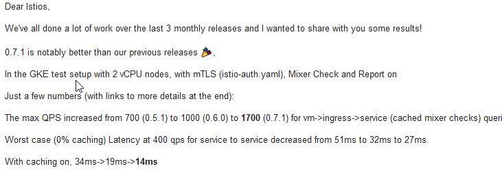

+++
title = "Service Mesh架构反思：数据平面和控制平面的界线该如何划定？"
subtitle = ""
summary = "苦等一年，始终不见Istio的性能有实质性提升，失望之余，开始反思Istio而至Service Mesh的架构。焦点所在：proxy到底该做哪些事情？架构的优美和性能的实际表现该如何平衡？"
abstract = "苦等一年，始终不见Istio的性能有实质性提升，失望之余，开始反思Istio而至Service Mesh的架构。焦点所在：proxy到底该做哪些事情？架构的优美和性能的实际表现该如何平衡？"
date = 2018-04-20
draft = false

tags = ["服务网格"]

[header]
image = ""
caption = ""
+++

苦等一年，始终不见Istio的性能有实质性提升，失望之余，开始反思Istio而至Service Mesh的架构。焦点所在：proxy到底该做哪些事情？架构的优美和性能的实际表现该如何平衡？

## 问题所在

Istio的性能，从去年5月问世以来，就是一块心病。

前段时间Istio 0.7.1版本发布，不久我们得到了这个一个"喜讯"：Istio的性能在0.7.1版本中得到了大幅提升！

最大QPS从0.5.1的700，到0.6.0的1000，再到0.7.1的1700，纵向比较Istio最近的性能提升的确不错，都2.5倍性能了。

但是，注意，QPS **700/1000/1700**。是的，没错，你没有看错，没有漏掉一个零或者两个零。

稍微回顾一下近年中有自己有实际感受的例子：

- 几个月之前写了一个基于netty4.1的HTTP转发的demo，没做任何优化和调教，轻松10万+的QPS
- 两年前写的dolphin框架，gRPC直连，15万QPS轻松做到
- 然后，白衣和隔壁老王两位同学轻描淡写的好像说过，OSP极致性能过了20万QPS了（背景补充：OSP是唯品会的服务化框架，sidecar模式，它的Proxy是被大家诟病以慢著称的Java）。

当然Istio测试场景稍微复杂一些，毕竟不是空请求，但是如论如何，从QPS十几二十万这个级别，直落到QPS一两千，中间有几乎100倍的差距。这个差距未免有些太大，从实用性上说，2000级别的QPS，低了点。

反思的第一个怀疑对象是proxy转发性能，但是随即否决：多了proxy肯定会有影响，但是远不至于此。而且，唯品会的OSP，还有华为的Service Mesher的性能表现也说明了问题不是出在proxy转发上。

> 注：关于proxy可能带来的性能开销，在之前的文章 [DreamMesh抛砖引玉(6)-性能开销](../201802-dreammesh-brainstorm-cost/) 一文中曾经有过详细的分析，可以参考。

## 背景回顾

Istio的性能问题其实由来已久，很早就暴露，官方也为此做了改进，我们现在看到的 700/1000/1700 已经是改进之后的结果。

今天来好好聊下这个问题，这涉及到Istio的架构设计，甚至涉及到Service Mesh的演进过程。

> 注：关于Service Mesh的演进过程，在之前的演讲 [DreamMesh抛砖引玉(6)-性能开销](../../publication/service-mesh-next-generation-microservice/) 。

Service Mesh刚出现时，以Linkerd/Envoy为代表:

这时的service mesh，主要是以proxy/sidecar的形式出现，功能基本都在sidecar中（linkerd有个named的模块分出了部分功能）。请求通过sidecar转发，期间发生的各种检查/判断/操作，都是在sidecar中进行。

因此，从性能上说，与客户端/服务器端直接连接相比，做的事情基本一致，只是多了proxy转发的开销。而这个开销，与服务器端业务处理的开销相比，非常小，大多数情况下是可以忽略的。

然后Service Mesh演进到了第二代，Istio出现，和后面紧跟的Conduit。这个时候，在第一代的基础上，Service Mesh开始在对系统的掌控上发力，控制平面由此诞生：

控制平面的加入，是一个非常令人兴奋的事情，因为带来了太多的实用型的功能，istio因此备受关注和推崇，随后紧跟Istio脚步的Conduit也沿用了这套架构体系：

在这个架构当中，控制平面的三大模块，其中的Pilot和Auth都不直接参与到traffic的处理流程，因此他们不会对运行时性能产生直接影响。

需要审视的是，需要参与到traffic流程的Mixer模块，请注意上图中，从envoy到mixer的两个箭头，这代表着两次调用，而且是两次远程调用。下面这个图，可以看的更清楚一些：

## Mixer的职责

我们直接搬出mixer官方文档对mixer的介绍：

https://istio.io/docs/concepts/policy-and-control/mixer.html

Mixer 提供三个核心功能：

- **前提条件检查**。在响应来自服务调用者的传入请求之前，使得调用者能够验证许多前提条件。允许服务在响应来自服务消费者的传入请求之前验证一些前提条件。前提条件可以包括服务使用者是否被正确认证，是否在服务的白名单上，是否通过ACL检查等等。
- **配额管理**。 使服务能够在多个维度上分配和释放配额，当服务消费者对有限的资源发生抢占时，配额就成了一种有效的资源管理工具，它为服务之间的资源抢占提供相对的公平。频率控制就是配额的一个实例。
- **遥测报告**。使服务能够上报日志和监控。在未来，它还将启用针对服务运营商以及服务消费者的跟踪和计费流。

然后，最关键的的是：

>  这些机制的应用是基于一组[属性](http://istio.doczh.cn/docs/concepts/policy-and-control/attributes.html)的，每个请求都会将这些属性呈现给Mixer。在Istio中，这些属性是由对Sidecar代理（一般是Envoy）的每一次请求产生的。

也就是说，为了让mixer能够工作，就需要envoy从每次请求中获取信息，然后发起两次对mixer的请求：

1. 在转发请求之前：这时需要做前提条件检查和配额管理，只有满足条件的请求才会做转发
2. 在转发请求之后：这时要上报日志等，术语上称为遥感信息，**Telemetry**，或者**Reporting**。

## 设计初衷

继续搬运官方文档：

> 后端基础服务为构建的服务提供各种支持功能。这些功能包括访问控制系统、计量收集捕获系统、配额执行系统、计费系统等。传统服务会直接和这些后端系统打交道，与后端紧密耦合，并集成其中的个性化语义和用法。
>
> Mixer在应用程序代码和基础架构后端之间提供通用中介层。它的设计将策略决策移出应用层，用运维人员能够控制的配置取而代之。应用程序代码不再将应用程序代码与特定后端集成在一起，而是与Mixer进行相当简单的集成，然后Mixer负责与后端系统连接。
>
> Mixer的设计目的是改变层次之间的边界，以此来降低总体的复杂性。从服务代码中剔除策略逻辑，改由运维人员进行控制。

非常优秀的设计，从系统架构上没得说，解开应用和后端基础设施的耦合，好处多多，这也是我们爱Istio的重要理由。

但是，注意，这段文字解释的是：为什么要将这些功能从应用里面搬出来放进去service mesh和mixer。这点我举双手赞成，而我的疑问在于：这些逻辑从应用中移动到service mesh之后，为什么要放mixer中，而不是proxy？

这就涉及到第二代service mesh的核心设计了：原有的sidecar被归结为data plane，然后在data plane上增加control plane。那么，最最重要的设计问题就来了，在这个架构中，从职责分工和部署上：

**data plane和control plane的界限在哪里？**

## Istio的选择

当前，istio在这个问题上，选择的是非常理想化的划分方式：

- data plane 只负责转发，其中部分数据来自Pilot和Auth。
- 和后端基础设施相关的功能放置在mixer中，通过各种adapter实现

这个方式架构清晰，职责分明，在不考虑性能时，无可挑剔。

再考虑到Istio的背景，Istio项目启动时:

- envoy已经基本成熟。这样istio的data plane直接有现成的一个基础，在这个基础上新加control plane，合乎情理。
- 新写的control plane用golang编写，也是符合情理，毕竟中间件用go是个潮流，加上是google自己的产品。
- 同时envoy是基于c++的，写各种很具体很繁琐的外围功能未免有些难受，比如mixer中和各种后端打交道的adapter。

所有，在我看来，istio当时选择现在这样一个架构，合乎情理，也比较自然。

只是，选择这个方式之后，有些问题就无可回避：

- 为了在请求处理过程中调用到mixer，就只得在转发前后发起两次对mixer的调用
- 由于envoy是c++，新的mixer是go，独立部署
- 导致，这两次调用， 都是远程调用，而且也不是localhost的本地调用

这样一来，性能开销就无可避免。Istio去年5月出来之后，就被发现性能非常糟糕，比现在的QPS 700/1000/1700 还要糟糕很多。

##Istio的改进

之后，Istio给出了一个改良的方案：在envoy中增加mixer filter。这个Filter和控制面的Mixer组件进行通讯，完成策略控制和遥测数据收集功能。

关键之处，在于增加了缓存：

> - Mixer Filter中保存有策略判断所需的数据缓存，因此大部分策略判断在Envoy中就处理了，不需要发送请求到Mixer。
>
>
> - 另外Envoy收集到的遥测数据会先保存在Envoy的缓存中，每隔一段时间再通过批量的方式上报到Mixer。

从官方博客  [Mixer and the SPOF Myth](https://istio.io/blog/2017/mixer-spof-myth.html) 给出的信息看，这里的缓存实现还做的很周到，甚至实现了两级缓存： 

缓存的工作方式如下：

> - Sidecar 中包含本地缓存，一大部分的前置检查可以通过缓存来进行。
> - 另外，sidercar 会把待发送的指标数据进行缓冲，这样可能在几千次请求之后才调用一次 Mixer。
> - 前置检查和请求处理是同步的
> - 指标数据上送是使用 fire-and-forget 模式异步完成的。

从描述上看非常令人满意，如果这个方式实现了，那么Mixer带来的性能瓶颈应该可以解决。但是，对照一下时间，这个博客发表于2017年12月，在这之后的小半年，istio的性能还是徘徊在 QPS 700/1000/1700 的水准。

这里，个人存在几个质疑：

1. "一大部分的前置检查可以通过缓存来进行"，大部分？可是只要有一个前置检查不能缓存，就必须去mixer里面请求

2. 没有看到任何关于quota的说明。到底quato怎么办？配额按说是没法缓存的，否则配额就不准确了。而一旦需要执行配额管理，还是必须发起请求到mixer

3. envoy中要执行前置检查，不仅仅需要缓存前置检查的各种配置信息，也必须要求envoy有执行前置检查的能力，即原来在mixer中实现前置检查的所有逻辑代码必须在envoy里面再实现一次。

其中的第三条，会带来一个悖论：

- 如果envoy没有把所有的前置检查的代码逻辑都实现一遍，那么走缓存就会造成执行结果和走mixer不一致，这不是一个严谨的做法；
- 如果envoy做的足够严谨，保证了envoy的前置检查可以100%覆盖mixer里面的实现，那何苦再保留mixer的前置检查逻辑，去掉就好了，否则维持同一个代码逻辑的两套实现版本

> TBD: 这几个疑问貌似误解，只能去翻代码了。稍后更新这块内容。

## 另一个选择

Istio的选择出发点，我理解是让data plane保持简单，尽可能将其它功能移出来。然而遇到性能问题，终究还是要做妥协，比如cache的出现。

如果我们放弃proxy最简化的想法，不再将系统架构优美放在第一位，而是将性能放在首位，那么，我们就可以有另外一种选择。

我们再次审视mixer的三大功能：

- **前置条件检查**。这个是必须在请求的traffi处理流程中完成的，因为traffic必须等待检查结果来决定下一步的行为，是拒绝请求还是继续转发，必须有明确答案。

- **配额管理**。 同上，必须同步等待结果才能继续。

- **遥测报告**。这个可以优化，两个方式，可以异步提交，可以批量提交，当时实际代码实现时会选择异步＋批量。

因此，优化的方向很明显，前置条件检查和配额管理都是同步操作，应该移回proxy。遥测可以通过异步＋批量的方式减少对mixer请求的数量级来进行优化。

但是，对于遥测报告，还有一个重要的考量点：遥测报告涉及到日志等数据提交，如果都集中式的先行提交给mixer，然后mixer再连接后端基础设施，则数据量（尤其批量之后）会集中在mixer这个单点。因此，从性能考虑，遥测报告最好也是proxy直接提交合适。

按照这个思路，mixer几乎被全部合并回proxy。Istio的架构需要做巨大的调整：control plane只留下Pilot和Auth，在envoy中重新实现一份mixer。

我不知道Istio会不会有这么大的决心。

然而，快一年了，istio的性能始终徘徊在一个低的离谱的地步，总该找到某种方式来解决问题，对吧？

## Conduit的选择

作为linkerd惨遭istio阻击之后的绝地反击，conduit从出生开始就带有悲剧色彩，强大的对手，小小的团队，不翻盘就等死的处境。

这种情况下的conduit，在架构上选择了直接吸收istio的优点，因此，istio提出的控制面板conduit几乎照样来了一份。也因此，istio mixer遇到的问题，conduit也没躲过。从这个角度说，istio把自己和conduit都带进坑了。

本周，带着前面的疑问和担忧，跑去conduit的slack上，简单做了一下交流。得到的答复如下：

> kl [1:49 AM]
> @Sky Ao/敖小剑 thanks for the suggestions! totally agree that the policy stuff should be pushed out asynchronously. and in 0.4.0 we moved telemetry to a setup where prometheus scrapes stat data directly from the proxies themselves, separate from the request path, and no longer reliant on the controller

> william [4:03 AM]
> @Sky Ao/敖小剑 we're looking at ways to push policy into the proxies, rather than polling the controller per requet (and caching). but it's still early. like Kevin says, telemetry is no longer pushed from the proxy in 0.4.0 already

也就是：

1. 在新发布的0.4.0版本中，遥测报告已经从控制平面移出，现在是从proxy直接走
2. 未来将会继续将policy的部分移到proxy中（只是现在还没有动）

可以说，conduit已经意识到坑的存在了，现在一条腿已经拔出来，另外一条腿要拔出来的话还需要一点时间。

颇感欣慰。

## 其它人的选择

很早之前，和白衣同学深入讨论这个话题，当时白衣就对mixer的做法有异议，因为性能问题是明摆着的。唯品会的OSP框架，选择的是将功能都在proxy中完成，性能还是有足够的保障。

近日在群内讨论时，了解到华为的兄弟们从一开始就绕开了这个坑，直接在proxy中实现功能。

更新：联系到新浪微博的同学，确认motan mesh的做法也是直接做进去proxy的。

## 总结

好多年前，某位同学（依稀是白衣）曾经打过一个比喻，非常生动，大意如下：

> 架构师就是艺术家，精心雕刻了一个精美绝伦的花瓶，然后，为了某些考虑，又不得不在花瓶的底下垫了一块板砖

Service Mesh中数据平面和控制平面的关系，到了该重新认真审视和反思的时候了：花瓶虽美，但是那块板砖，是不是该考虑垫上去了 :)

未来的一段时间，我们不妨关注istio和conduit对此的选择。

## 脑洞时间

最后，脑洞一下：如果用go重写proxy，替代envoy，那么mixer里面的功能要搬过来就是轻松自如。

做这个事情的前提: 是能提供一个go版本的proxy，做到足够好，以便替代envoy的位置。

感叹一下：如果当年envoy不是用c++，而是用go，事情就完全不一样了。然后，conduit的proxy是rust写的，rust用来实现proxy倒是神器，但是用来写各种adapter，想必也为难。也许，未来我们会见到一个纯go版本的service mesh？

