+++
title = "Mixer Cache: Istio的阿克琉斯之踵?微信讨论实录"
subtitle = ""
summary = "在Service Mesh技术社区的微信群中，针对Istio Mixer Cache设计中缓存存放和逻辑分离的潜在分险，进行了深入探讨，截屏实录，原汁原味。"
date = 2018-07-19
draft = false

tags = ["Istio", "Mixer"]
categories = []

[header]
image = "headers/post/201804-istio-achilles-heel.jpg"
caption = ""
+++

## 前情回顾

在Service Mesh技术社区的微信群中，针对Istio Mixer Cache设计中缓存存放和逻辑分离的潜在分险，进行了深入探讨。以下为截屏实录，确保原汁原味。

## 讨论实录

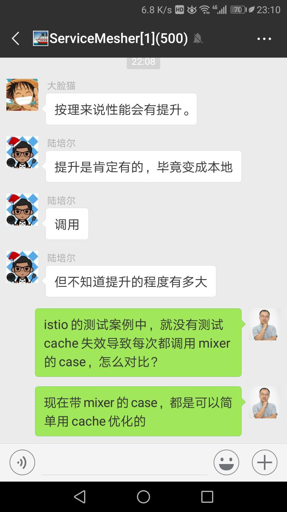
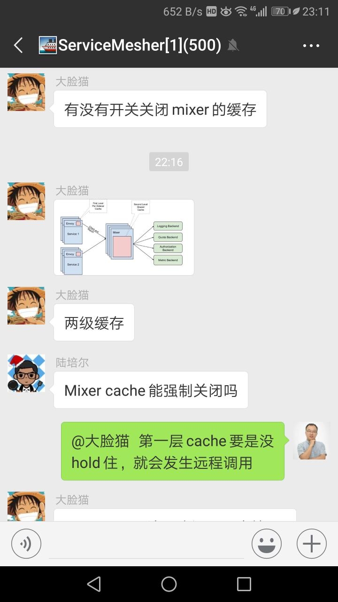
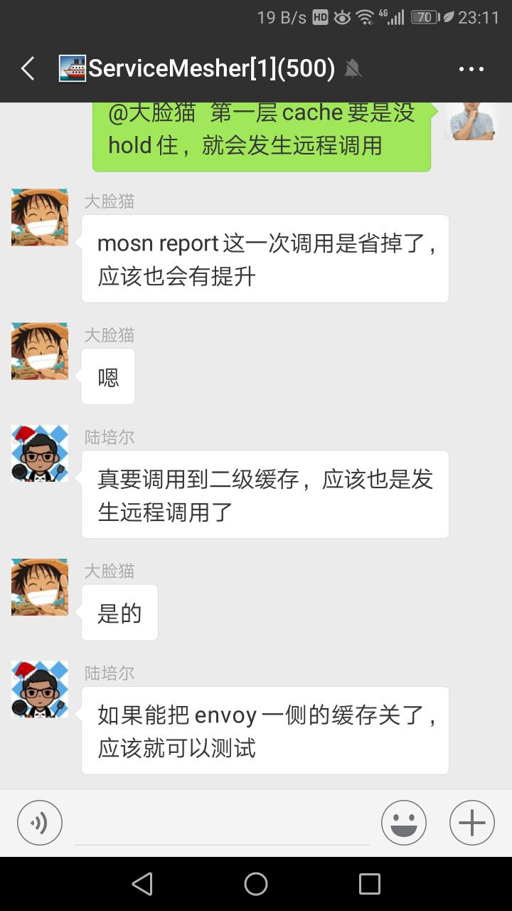
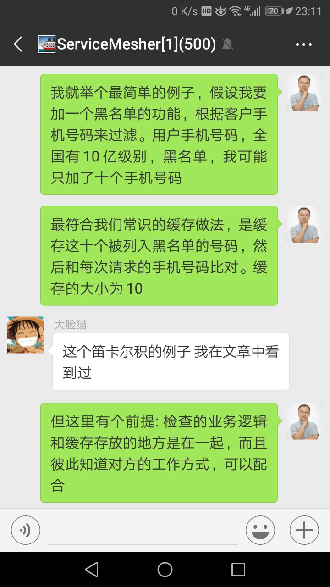
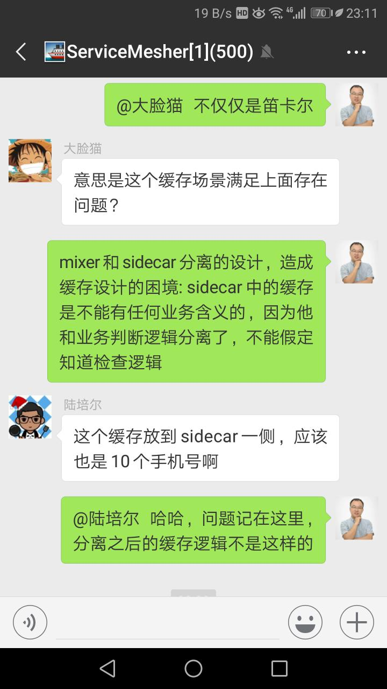
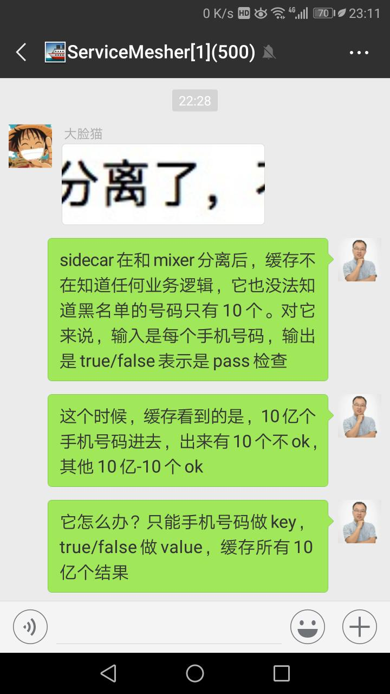
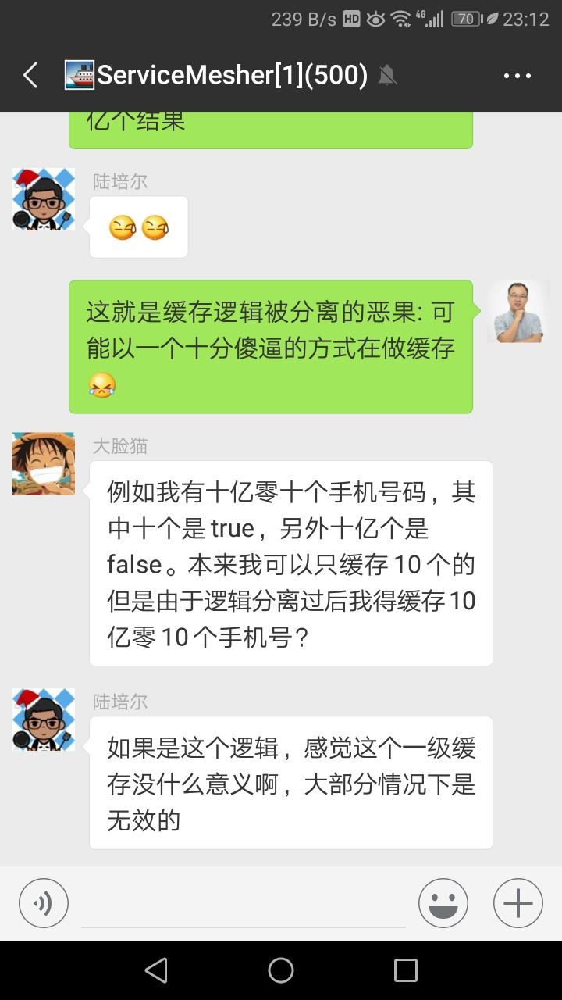
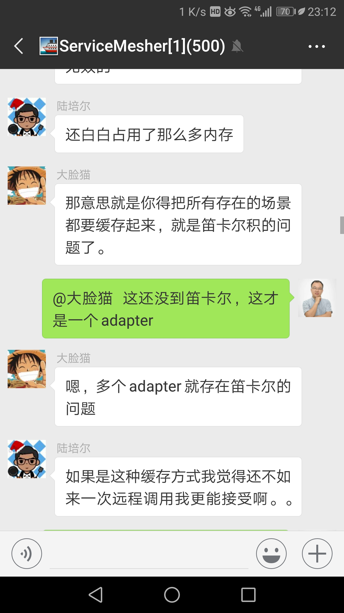
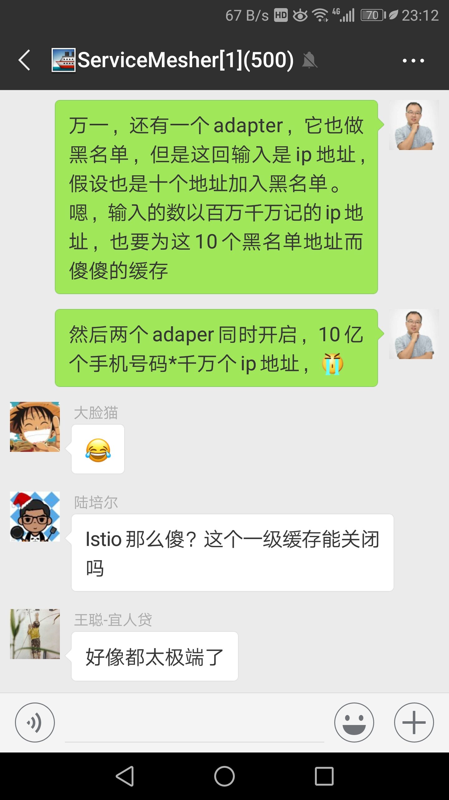
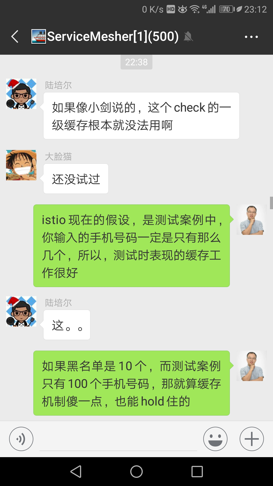
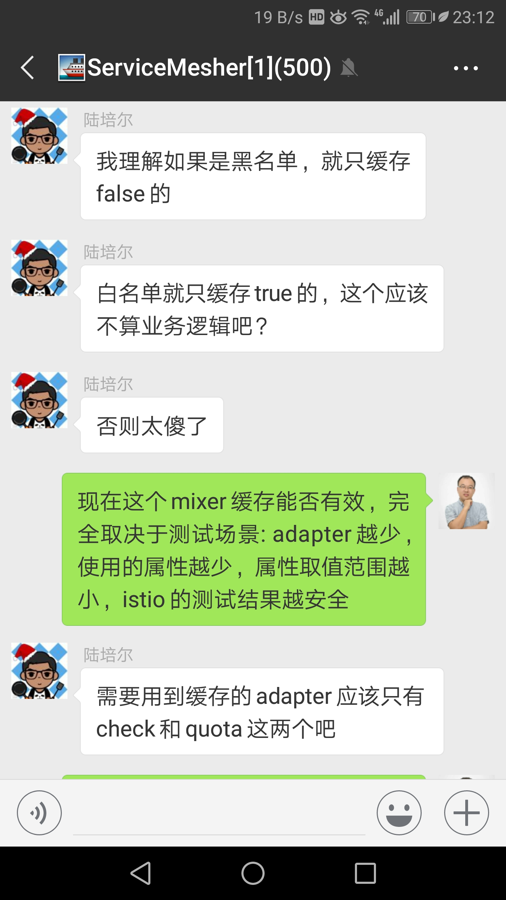
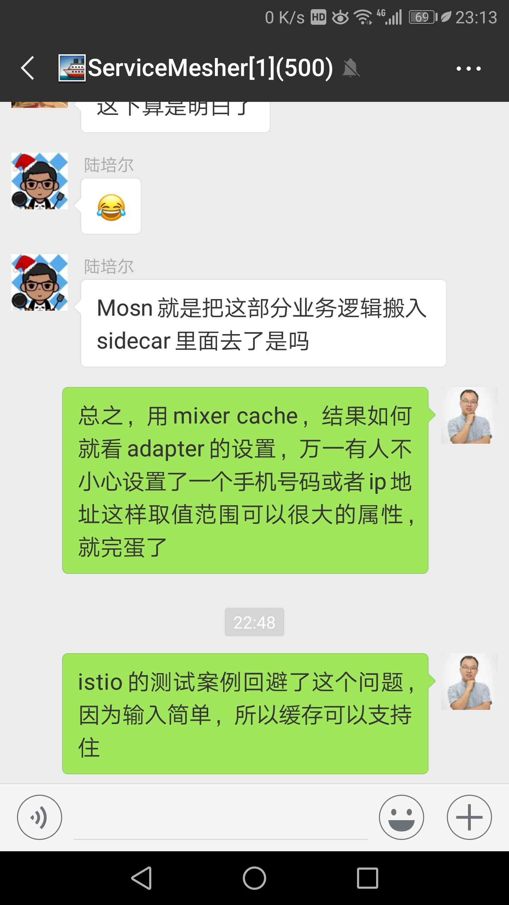
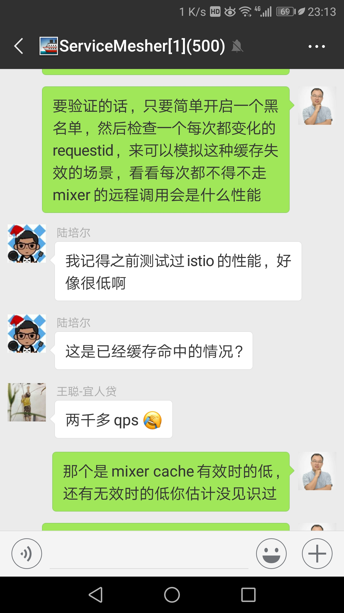
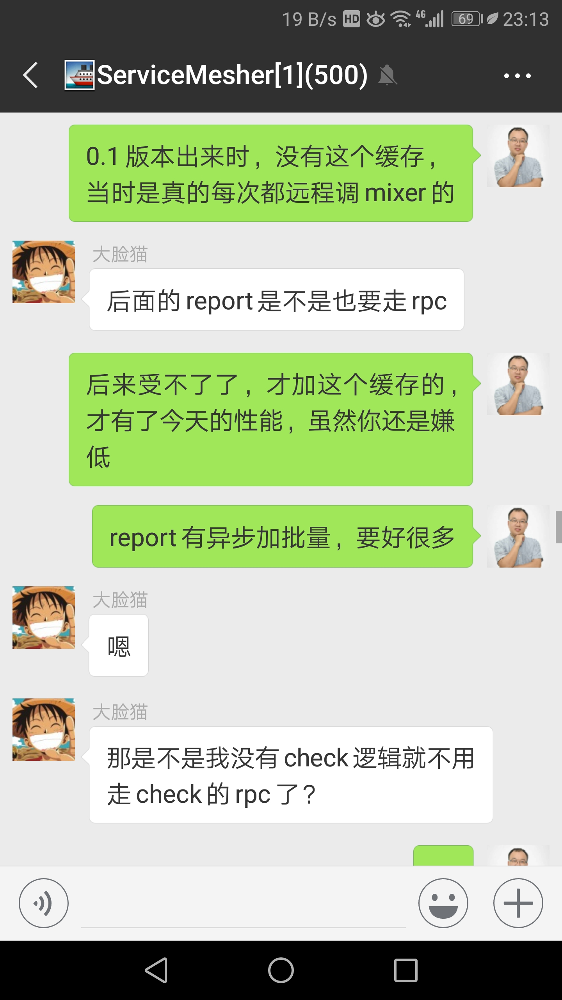
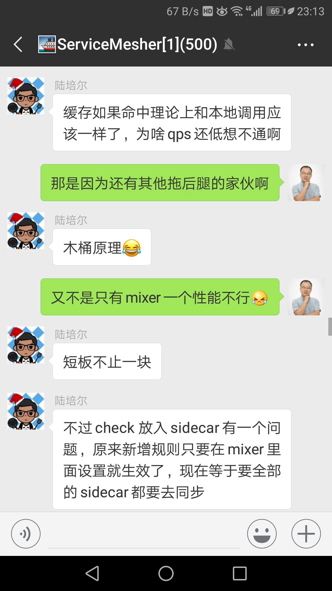
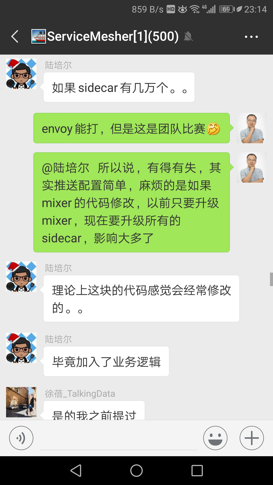
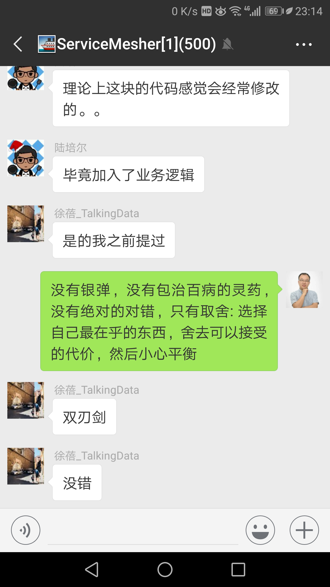

## 后记

鸣谢几位积极参与讨论的朋友！