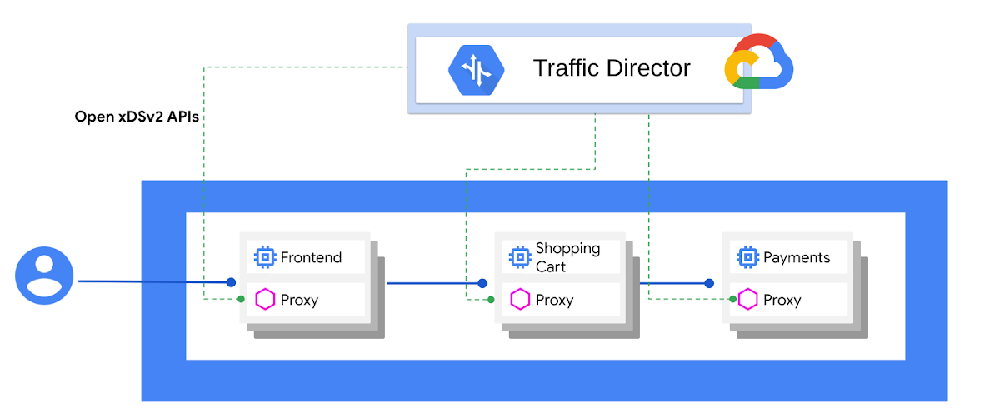
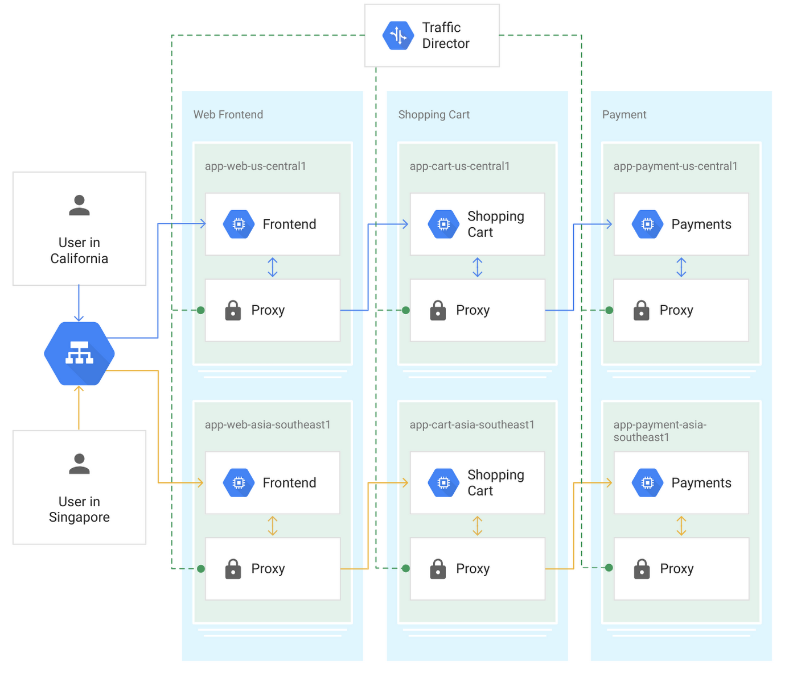
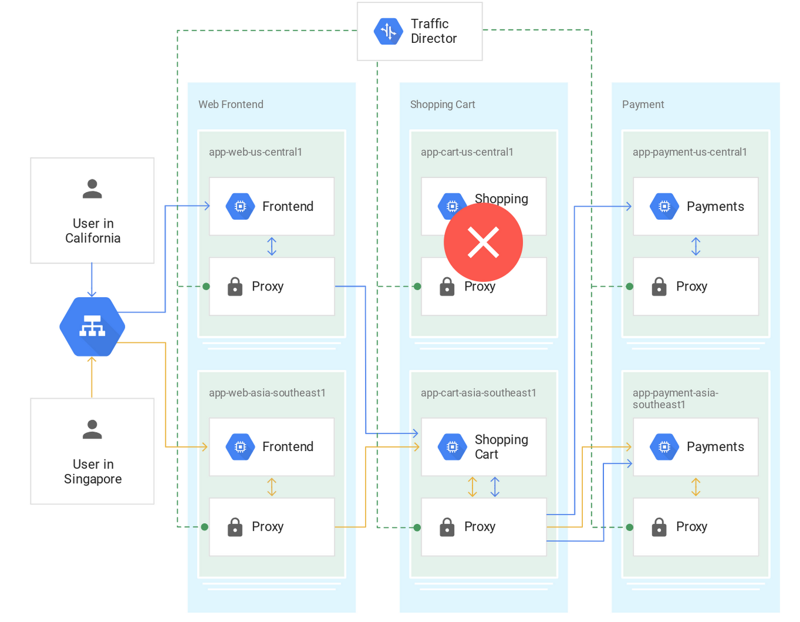
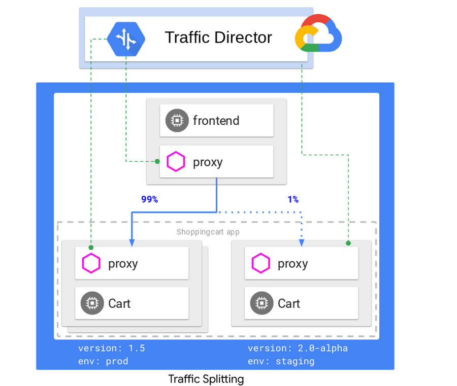
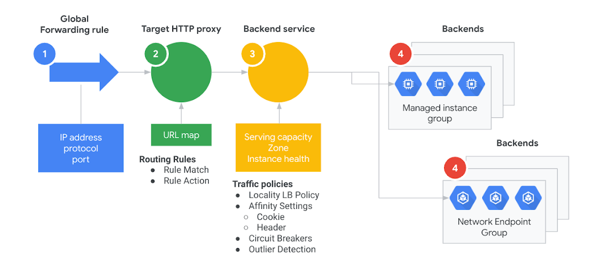

+++
title = "[译] Traffic Director如何为开放服务网格提供全局负载均衡"

date = 2019-05-06
lastmod = 2019-05-06
draft = false

tags = ["服务网格", "Traffic Director"]
summary = "在上周的Next '19，我们宣布了用于服务网格的Traffic Director，为您的VM和容器服务带来全局流量管理。我们还在博客中向您展示了Traffic Director的功能。今天，我们将深入探讨其特性和优势。"
abstract = "在上周的Next '19，我们宣布了用于服务网格的Traffic Director，为您的VM和容器服务带来全局流量管理。我们还在博客中向您展示了Traffic Director的功能。今天，我们将深入探讨其特性和优势。"

[header]
image = ""
caption = ""

+++

> 备注：英文原文来自Google Cloud网站博客文章 [Google Cloud networking in depth: How Traffic Director provides global load balancing for open service mesh](https://cloud.google.com/blog/products/networking/traffic-director-global-traffic-management-for-open-service-mesh)，发布时间 2019-04-18

在上周的Next '19，我们宣布了用于服务网格的[Traffic Director](https://youtu.be/PZ1Lqxfs1yw?t=330)，为您的VM和容器服务带来全局流量管理。我们还在博客中向您展示了[Traffic Director的功能](https://cloud.google.com/blog/products/networking/powering-enterprise-transformation-announcing-new-additions-to-google-cloud-networking)。今天，我们将深入探讨其特性和优势。

## 用于服务网格的Traffic Director

服务网络的核心在于为独立微服务提供基础，这些微服务可以使用不同语言编写，并由不同团队维护。服务网格有助于将开发与运维解耦。开发人员不再需要在他们的应用程序中编写和维护策略和网络代码，这些会转移到服务代理（如Envoy）和服务网格控制平面，它们提供并动态管理代理。

*“Traffic Director可以更轻松地将服务网格和Envoy的优势带到生产环境中，” Envoy Proxy的创建者Matt Klein说。*

Traffic Director是Google Cloud用于服务网格的完全托管的流量控制平面。Traffic Director开箱即用，可以用于VM和容器。它使用开源 [xDS API](https://www.envoyproxy.io/docs/envoy/latest/api-v2/api) 与数据平面中的服务代理进行通信，确保不会被锁定在专有接口中。

## Traffic Director功能

### 全局负载均衡

许多人使用Google的全局负载均衡来实现面向互联网的服务。Traffic Director为服务网格中的内部微服务带来全局负载均衡。借助全局负载均衡，您可以在全世界的[Google Cloud Platform](https://cloud.google.com/)（GCP）区域中配置服务实例。Traffic Director为客户端提供智能，以便将流量发送到具有可用容量的最近的服务实例。这优化了发起流量的服务和使用流量的服务之间的全局流量分配，为每个请求采用最短往返时间（RTT）。

如果最接近客户端服务的实例已关闭或过载，则Traffic Director会提供智能，以便将流量无缝转移到下一个最近区域中的健康实例。

### 集中式的健康检查

大型服务网格会生成大量的健康检查流量，因为每个sidecar代理都必须对服务网格中的所有服务实例进行健康检查。随着网格的增长，让每个客户端代理健康检查每个服务器实例，这种做法会产生一个 n^2 健康检查问题，这将成为增长和扩展部署的障碍。

Traffic Director通过集中运行健康检查来解决此问题，其中全局分布的弹性系统监控所有服务实例。然后，Traffic Director使用 [EDS API](https://www.envoyproxy.io/docs/envoy/latest/api-v2/api/v2/eds.proto#envoy-api-file-envoy-api-v2-eds-proto) 将聚合的健康检查结果分发到全局网格中的所有代理。

### 基于负载的自动伸缩

Traffic Director 根据代理向其报告的负载信号启用自动伸缩。Traffic Director通知 Compute Engine autoscaler 流量变化，并让 autoscaler 一次性增长到所需的大小（而不是像其他 autoscaler 那样重复步骤），从而减少 autoscaler 对流量峰值做出反应所需的时间。

当 Compute Engine autoscaler 正在增加所需的容量时，Traffic Director 会暂时将流量重定向到其他可用实例 - 即使在其他区域也是如此。一旦 autoscaler 增加了足够的工作负载容量以维持峰值，Traffic Director 就会将流量移回最近的zone和region，再次优化流量分配以最小化每个请求的RTT。

### 内建弹性

由于 Traffic Director 是GCP提供的完全托管服务，因此您无需担心其正常运行时间，生命周期管理，可扩展性或可用性。Traffic Director 基础设施在全世界范围内具有全局分布和弹性，并使用与Google面向用户的服务相同的经过实战检验的系统。Traffic Director将在GA时提供99.99％的服务水平协议（SLA）。

### 流量管理功能

Traffic Director允许控制流量，而无需修改应用代码本身。

您可以创建自定义流量控制规则和策略，通过指定：

- HTTP匹配规则：指定参数，包括要在传入请求中匹配的host，path和header。
- HTTP操作：匹配后根据请求执行的操作。这些包括重定向，重写，header转换，镜像，故障注入等。
- 每服务流量策略：这些策略指定负载均衡算法，熔断器参数和其他以服务为中心的配置。
- 配置过滤：将配置推送到客户端子集的能力

使用上述路由规则和流量策略，您可以获得复杂的流量控制功能，而无需繁琐的工作。

让我们看一下 Traffic Director 的流量控制功能的示例：**流量分割**。通过Traffic Director，您可以轻松配置场景，例如推出新版本的服务，如购物车，并逐步增加路由到该服务的流量。

您还可以配置流量控制以根据HTTP header引导流量，使用故障注入来测试服务的弹性，镜像以便将生产流量的副本发送到影子服务等等。

您可以通过注册 [流量控制alpha](https://services.google.com/fb/forms/trafficdirectoralphas/) 来使用这些功能。

## VM和容器服务的一致流量管理

Traffic Director 允许您无缝地部署和管理由容器和VM服务组成的异构部署。每个服务的实例可以跨越多个区域。

使用Traffic Director，可以使用 [托管实例组](https://cloud.google.com/compute/docs/instance-groups/#managed_instance_groups) 和容器端点将VM端点配置为 [独立网络端点组](https://cloud.google.com/kubernetes-engine/docs/how-to/standalone-neg)。如上所述，像 [Envoy](http://envoyproxy.io/) 这样的开源服务代理被注入到每一个实例中。容器和VM的其余数据模型和策略保持不变，如下所示：

此模型在服务部署时提供一致性，并且能够提供无缝地全局负载均衡，跨越服务的VM实例和容器实例。

