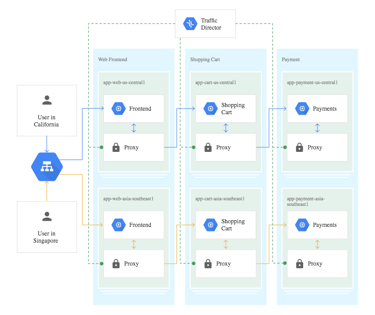

+++
title = "[译] Google Cloud的Traffic Director - 介绍以及与Istio服务网格的关系"

date = 2019-05-05
lastmod = 2019-05-05
draft = false

tags = ["服务网格", "Traffic Director"]
summary = "在这篇文章中，我将介绍Traffic Director是什么，它与Istio服务网格有什么关系，以及对于那些已经在GKE上运行生产Istio网格的人来说意味着什么。"
abstract = "在这篇文章中，我将介绍Traffic Director是什么，它与Istio服务网格有什么关系，以及对于那些已经在GKE上运行生产Istio网格的人来说意味着什么。"

[header]
image = "headers/post/201904-microservice-anti-patten.jpg"
caption = ""

+++

> 备注：英文原文来自Medium网站博客文章 [Google Cloud’s Traffic Director — What is it and how is it related to the Istio service-mesh?](https://medium.com/cloudzone/google-clouds-traffic-director-what-is-it-and-how-is-it-related-to-the-istio-service-mesh-c199acc64a6d)，原作者为 [Iftach Schonbaum](https://medium.com/@iftachsc)，发布时间 2019-04-16

对于最近跟进 Google Cloud 路线图的人来说，可能听说过Traffic Director。对于那些了解 Istio 的人来说，可能听起来有些重叠和混乱（特别是如果使用了最新的 GKE Istio 插件）。

在这篇文章中，我将介绍Traffic Director是什么，它与Istio服务网格有什么关系，以及对于那些已经在GKE上运行生产Istio网格的人来说意味着什么。

在这篇文章中，我不会介绍 Istio 或服务网格是什么。

------

Traffic Director是：

> “Enterprise-ready traffic management for open service mesh”…
>
> “用于开放式服务网络的企业级流量管理”......

它是用于服务网格的完全托管的控制平面，可以通过智能流量控制策略，在Kubernetes集群（托管或非托管）和虚拟机之间全局地控制流量。与任何其他服务网格控制平面一样，它控制网格内服务代理的配置。

Traffic Director拥有99.99％的SLA（需要在达到GA时，目前处于beta测试阶段），这意味着您可以管理网格配置，而无需担心控制平面的健康和维护。Traffic Director也在后台伸缩以适应网格的大小，因此您不必担心这一点。

概括的说，可以使用Traffic Director执行以下操作：

1. **复杂的流量管理**

    - 流量操纵，如拆分，镜像和故障注入
    - 智能部署策略，如易于使用的A/B和金丝雀
    - 请求操纵，如URL重写
    - 基于内容的路由，通过header，cookie等

2. **构建弹性服务**  - 使用单个IP和服务代理实现全局跨区域感知负载均衡，实现低延迟、最近端点访问，并在出现问题时故障转移到另一个端点。最近端点可以是同一zone的其他集群，不同zone或不同region。此外，在服务之间配置弹性功能，例如熔断器检测，解放开发人员。

3. **大规模的健康检查**  - 使用GCP管理的健康检查，取代网格内代理的健康检查，以减少网格大小相关的健康检查。

4. **现代化非云原生服务**  - 由于它也适用于VM，因此它允许您为遗留应用程序引入高级功能。

全局负载均衡部署中的Traffic Director（cloud.google.com）

------

我们之间的 Istio 管理员可能跳起来说“这是一个托管的Istio控制平面”。那是因为Istio支持上面的许多功能。（更确切地说，是Istio使用的Envoy代理）。当然，使用Istio可以实现上述许多功能 - 但它将包括大量的管理工作（特别是在扩展到多个Kubernetes集群和VM时）。此外，控制平面和整个网格的维护也可能造成麻烦。

那么它确实是某种托管的Istio控制平面吗？嗯，不完全......可以说是以某种方式重叠。

让我简化一下......

------

Istio和 Google Cloud 的 Traffic Director 有几个地方不同。

### SLA和管理

Istio是一个开源项目，当包含在 Openshift 或 IBM Cloud Private 等产品中时，它们具有一些生产级支持，目前没有公共云完全托管的Istio服务。Istio的大多数公共云部署都是纯开源，非托管，非SLA部署 - 通常用官方的Istio helm chart 安装。

相反，Traffic Director拥有99.99％的SLA，是一项完全托管的服务。

### 控制平面

Istio有三个核心组件：**用于流量管理的Pilot**，**用于可观察性的Mixer**和**用于服务到服务安全的Citadel**。

Traffic Director 提供 GCP 托管的 Pilot 以及所提及的其他功能，如全局负载均衡和集中式健康检查。

### 缩放控制平面

在Istio中，控制平面组件（如Citadel，Mixer和Pilot）通过默认设置来用HPA（HorizontalPodAutoscalers）交付 - HAP是一个负责部署的自动伸缩的Kubernetes资源。您需要调整这些设置以适合Mesh，以备在需要时使用。您还需要指定 PodAntiAffinity 规则以确保控制平面跨越多个Kubernetes 节点。

使用Traffic Director，控制平面可以与网格一起缩放，无需担心。

### API

作为Beta版本，无法使用 Istio API 来配置 Traffic Director。可以使用GCP API进行配置。Traffic Director和Pilot都使用开放标准API（xDS v2）与服务代理进行通信。使用Istio API配置Traffic Director在Traffic Director的路线图中。

### 数据平面代理

Traffic Director使用开放式xDSv2 API与数据平面中的服务代理进行通信，从而确保您不会被锁定到专有接口。这意味着Traffic Director可以使用像Envoy这样的xDSv2兼容的开放服务代理。**值得注意**的是，Traffic Director仅使用Envoy代理进行了测试，并且在当前的beta版本中仅支持Envoy版本1.9.1或更高版本。

另一方面，Istio目前仅与Envoy一起发行，虽然有像[nginMesh](https://github.com/nginxinc/nginmesh)这样的项目，使用 nginx 作为 Sidecar 代理配合 Istio 控制平面，但这是一个单独的项目。

值得一提的是，Envoy拥有领先的网格代理，为服务网格而设计，具有高性能和低内存占用。

### Sidecar注入和部署

在 Istio 和 Traffic Director 中，代理可以在 Kubernetes 部署（最终是POD）和VM上。在VM上部署的两种情况下，都会提供多个脚本和文件来安装代理并使用控制器对其进行配置。

对于Kubernetes工作负载，Istio开箱即用，具有自动注入机制（与MutatingAdmissionController 配合使用），当在标记为自动注入的命名空间或使用专用POD注释创建POD时，它会自动将Sidecar代理注入到POD。

使用 Traffic Director，您当前需要手动注入 Sidecar。并且还要使用注释从服务创建NEG（[请参阅GCP网络端点组](https://cloud.google.com/load-balancing/docs/negs/)），以便可以将其作为服务添加到Traffic Director中。

考虑到创建 [MutatingAdmissionWebhook](https://kubernetes.io/docs/reference/access-authn-authz/admission-controllers/) 和注入服务相对容易，我相信Traffic Director 迟早会提供自动注入的...

### 多集群网格

在Istio中，为了让网格跨越多个Kubernetes 集群，Istio提供了一个专用 chart 用于扩展网格，名为 istio-remote。我这里就不再展开。

由于 Traffic Director 是一个控制平面，位于 Kubernetes 集群之外，可以从任意集群添加Kubernetes工作负载到 Traffic Director，没有跨越多个集群的网格的特定演练。

### 网格可观测性

目前，Istio推出了Kiali - 一个很好用的网格可观测性，极大的帮助了我们的客户在微服务应用程序中调试问题。Kiali一直在不断发展，迅速发布新版本。

Traffic Director的特点是可以使用多个工具进行观测，包括[Apache Skywalking](http://skywalking.apache.org/)。

### $ Pricing $

Istio是开源和免费的。Traffic Director目前免费提供Beta版本。

------

### “如果我已经在GKE上使用Istio运维生产网格怎么办？”

如上所述，Traffic Director是一个托管的Pilot（具有额外功能），它将支持使用 Istio API 进行管理。因此，如果您想要使用具有高SLA的完全托管的版本替换您集群内的非托管版本，它应该能够轻松选择更换。据我所知，将有适当的选择指示。

------

[Google Cloud](https://medium.com/@googlecloud)最近发布了 Traffic Director。由于它基于Istio的核心模式，而谷歌是Istio主要贡献者之一，我预测它会有美好未来。现在正是所有公有云提供商宣布他们自己的Mesh解决方案的时候了。

------

Traffic Director 的路线图目前包括：

- 支持Istio的安全特性，如mTLS，RBAC（Istio RBAC）
- 可观测性集成
- 混合和多云支持
- 使用Istio API进行管理
- Anthos集成
- 与其他服务网格控制平面的联邦（Federation）

