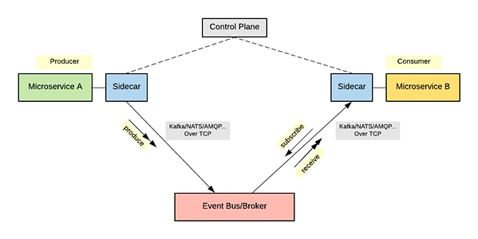
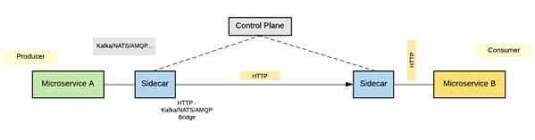

+++
title = "[译] 使用服务网格进行事件驱动消息的潜力"

date = 2019-05-13
lastmod = 2019-05-13
draft = false

tags = ["服务网格"]
summary = "Service Mesh技术不仅仅可以在常规的请求-响应式的服务间同步通信中使用，还可以扩展到消息机制来实现事件驱动。本文介绍了使用服务网格实现事件驱动消息机制的重要性和实现方式。"
abstract = "Service Mesh技术不仅仅可以在常规的请求-响应式的服务间同步通信中使用，还可以扩展到消息机制来实现事件驱动。本文介绍了使用服务网格实现事件驱动消息机制的重要性和实现方式。"

[header]
image = ""
caption = ""
+++

> 备注：英文原文来自InfoQ网站文章 [The Potential for Using a Service Mesh for Event-Driven Messaging](https://www.infoq.com/articles/service-mesh-event-driven-messaging)

## 关键点

- 当前流行的服务网格实现（Istio，Linkerd，Consul Connect等）仅满足微服务之间的请求-响应式同步通信
- 对于服务网格的推进和采用，我们认为支持事件驱动或基于消息传递的通信是至关重要的
- 在服务网格中实现消息支持有两种主要的架构模式; 协议代理Sidecar，用于消费者和生产者的所有入站和出站事件的代理; 以及将事件驱动的通信协议翻译或者转换为HTTP或类似协议的HTTP桥接Sidecar
- 无论使用何种桥接模式，Sidecar都可以促进跨功能特性的实现（和校正抽象），例如可观察性，限流，跟踪等。

## 正文

作为基础技术和基于微服务和云原生架构的架构模式，服务网格越来越受欢迎。服务网格主要是一个网络基础设施组件，允许从基于微服务的应用程序下放网络通信逻辑，以便完全专注于服务的业务逻辑。

服务网格围绕代理的概念构建，代理以Sidecar的方式与服务协作。虽然服务网格通常被宣传为可用于任何云原生应用的平台，但是服务网格的流行实现（Istio / Envoy，Linkerd等）目前仅满足微服务之间同步通信的请求/响应风格。但是，在大多数实用的微服务用例中，服务间通信通过各种模式进行，例如请求/响应（HTTP，gRPC，GraphQL）和事件驱动的消息传递（NATS，Kafka，AMQP）。由于服务网格实现不支持事件驱动的通信，服务网格提供的大多数功能仅可用于同步请求/响应服务 - 事件驱动的微服务必须以服务代码本身的一部分的方式来支持这些功能，这与服务网格架构的目标相矛盾。

服务网格支持事件驱动的通信至关重要。本文着眼于支持服务网格中事件驱动架构的关键问题，以及现有服务网格技术如何尝试解决这些问题。

### 实现事件驱动的消息机制

在典型的请求/响应同步消息场景中，您将找到一个服务（服务器端）和一个调用该服务的使用者（客户端）。服务网格数据平面充当客户端和服务器端之间的中介。在事件驱动的通信中，通信模式是截然不同的。事件生产者异步地将事件发送到事件代理，生产者和消费者之间没有直接的通信通道。通信风格可以是pub-sub（多个消费者）或基于队列的（单个消费者），并且根据样式，生产者可以分别向主题或队列发送消息。

消费者决定订阅驻留在事件代理中的主题或队列，与生产者完全解耦。当有可用于该主题或队列的新消息时，代理会将这些消息推送给消费者。

有几种方法可以将服务网格抽象用于事件驱动的消息机制。

### 协议代理Sidecar

协议代理模式构建的基本概念是：所有事件驱动的通信信道（channel）应该通过服务网格数据平面（即，Sidecar代理）。要支持事件驱动的消息协议（如NATS，Kafka或AMQP），您需要构建特定于通信协议的协议处理程序/过滤器，并将其添加到sidecar代理。图1显示了使用服务网格进行事件驱动的消息机制的典型通信模式。

**图1: 使用服务网格的事件驱动消息机制**

由于大多数事件驱动的通信协议是在TCP之上实现的，因此sidecar代理可以具有构建在TCP之上的协议处理程序/过滤器，以专门处理支持各种消息协议所需的抽象。

生产者微服务（微服务A）必须通过底层消息传递协议（Kafka，NATS，AMQP等）向 Sidecar 发送消息，使用最简单的生产者客户端代码，而 Sidecar 处理与之相关的大多数复杂性。类似地，消费者服务（微服务B）的逻辑也非常简单，而复杂性存在于Sidecar。服务网格提供的抽象可以转换协议。

Envoy 团队目前正致力于根据上述模式实施Envoy代理的Kafka支持。它仍在进行中，但您可以 [在GitHub上](https://github.com/envoyproxy/envoy/issues/2852) 跟踪进度。   

### HTTP桥接Sidecar

我们构建一个HTTP桥接，实现消息和要求的消息传递协议的转换，而不是使用代理来实现事件驱动的消息协议。构建此桥接模式的关键动机之一是大多数事件代理提供 REST API（例如，[Kafka REST API](https://github.com/confluentinc/kafka-rest)）来使用和生成消息。如图2所示，现有的微服务可以简单地通过控制桥接两个协议的 sidecar 来透明地使用底层事件代理的消息系统。sidecar代理主要负责接收 HTTP 请求并将其转换为 Kafka/NATS/AMQP /等。消息，反之亦然。

**图2：HTTP桥接允许服务通过HTTP与事件代理通信**

同样，您可以使用HTTP桥接器允许基于Kafka/NATS/AMQP的微服务直接与HTTP（或其他请求/响应消息协议）微服务进行通信，如图3所示。在这种情况下，sidecar接收Kafka/NATS/AMQP请求，将它们转发为HTTP，并将HTTP响应转换回Kafka/NATS/AMQP。目前正在努力在Envoy和NATS上添加对此模式的支持（例如，用于Envoy的 [AMQP/HTTP Bridge](https://github.com/envoyproxy/envoy/issues/3415)和[NATS/HTTP Bridge](https://github.com/solo-io/envoy-nats-streaming)）。

**图3：HTTP Bridge允许基于事件驱动消息协议的服务使用HTTP服务**

尽管HTTP桥接模式适用于某些用例，但它不足以作为标准方法，在服务网格架构中处理事件驱动的消息传递，因为桥接事件驱动的消息传递协议始终具有请求/响应消息传递协议有限制。它或多或少只是一种可能适用于某些用例的解决方法。 

## 事件驱动的服务网格的关键功能

基于请求/响应式消息传递的传统服务网格的功能，与支持消息范例的服务网格的功能有些不同。以下是支持事件驱动的消息传递的服务网格将提供的一些独特功能：

- **消费者和生产者抽象** - 对于大多数消息系统，例如Kafka，代理本身非常抽象和简单（微服务环境中的哑管（dumb pipe ）），而服务是智能终端（大多数智能存在与生产者或消费者代码中）。这意味着生产者或消费者必须在业务逻辑旁边拥有大量的消息传递协议代码。通过引入服务网格，您可以将与消息传递协议相关的此类功能（例如，Kafka中的分区重新平衡）下放到Sidecar，并完全关注微服务代码中的业务逻辑。
- **消息传递语义** - 有许多消息传递语义，例如“最多一次”，“至少一次”，“恰好一次”等。取决于底层消息传递系统的支持，可以将这些任务下放到服务网格（这类似于在请求/响应范例中支持熔断器，超时等）。
- **订阅语义** - 还可以使用服务网格层来处理订阅语义，例如消费者端逻辑的持久订阅。
- **限流** - 可以根据各种参数如消息数量，消息大小等来控制和管理消息限制（速率限制）。
- **服务发现**（代理，主题和队列发现） - 服务网格Sidecar允许您在消息生成和消费期间发现代理位置，topic或queue名称。这涉及处理不同的topic层次结构和通配符。
- **消息验证** - 验证用于事件驱动消息机制的消息变得越来越重要，因为大多数消息传递协议（如Kafka，NATS等）都是协议无关的。因此，消息验证是消费者或生产者实现的一部分。服务网格可以提供这种抽象，以便消费者或生产者可以下放消息验证。例如，如果您使用Kafka和Avro进行模式验证，则可以使用sidecar进行验证（即，从外部方案注册表（如Confluent）获取模式，并根据该方案验证消息）。还可以使用它来检查消息中的恶意内容。
- **消息压缩** - 某些基于事件的消息传递协议（如[Kafka](https://cwiki.apache.org/confluence/display/KAFKA/Compression)）允许数据由生产者压缩，以压缩格式写入服务器，并由消费者解压缩。您可以在sidecar-proxy级别轻松实现此类功能，并在服务网格控制平面上控制它们。
- **安全性** - 您可以通过在服务网格sidecar级别启用TLS来保护代理与消费者/生产者之间的通信，以便您的生产者和消费者实现不需要担心安全通信并且可以以纯文本方式与Sidecar通信。
- **可观测性** - 由于所有通信都在服务网格数据平面上进行，因此您可以为所有事件驱动的消息系统部署指标，跟踪和日志。
