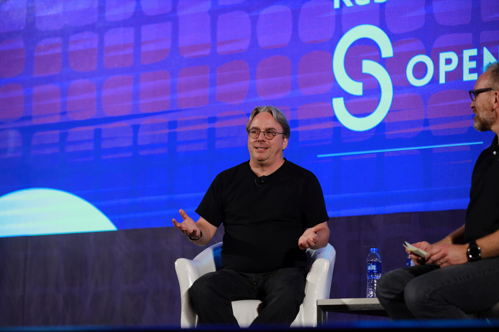
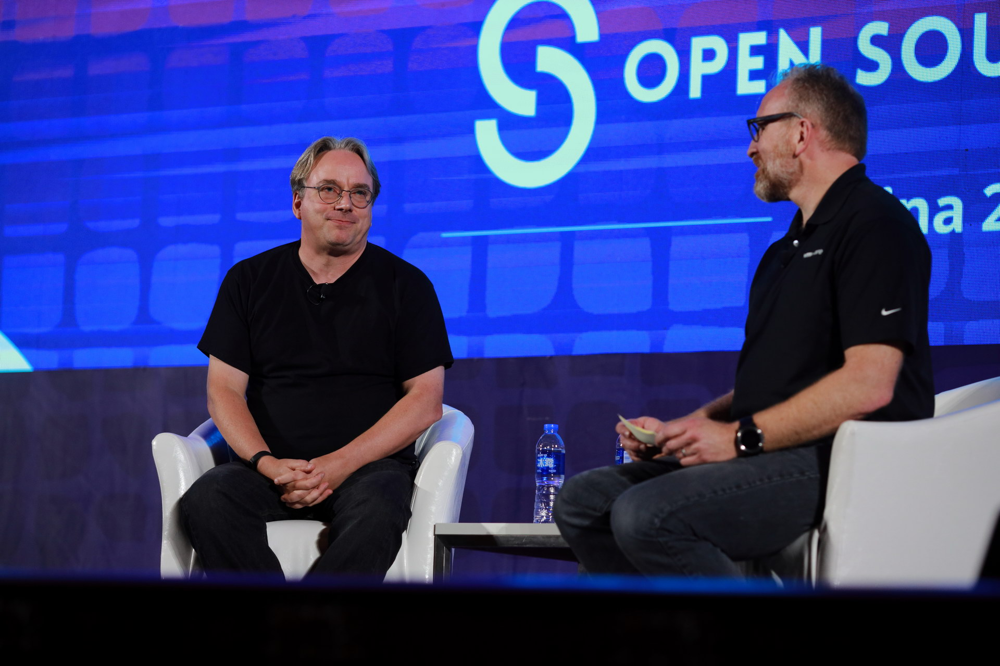
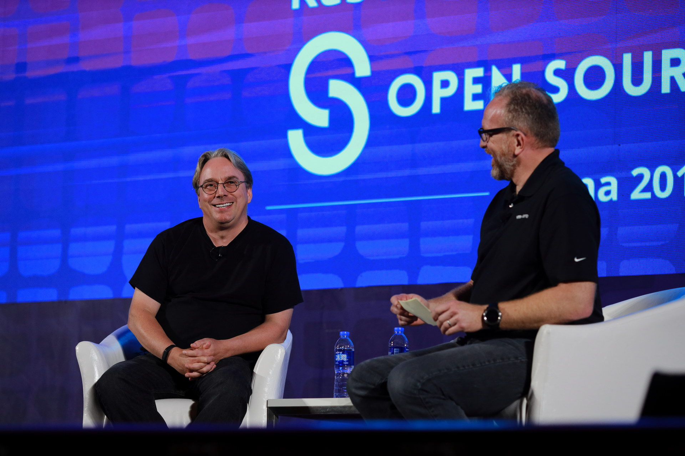
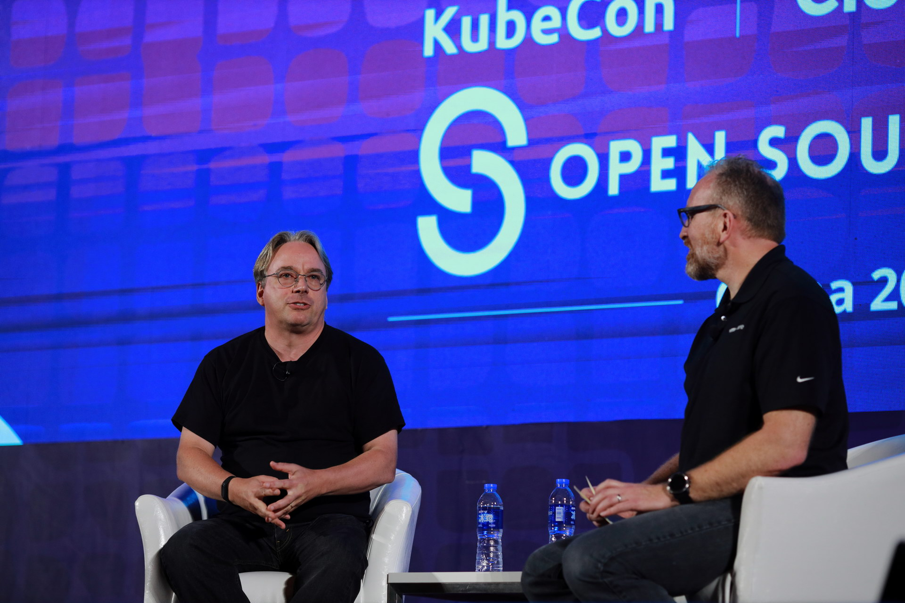
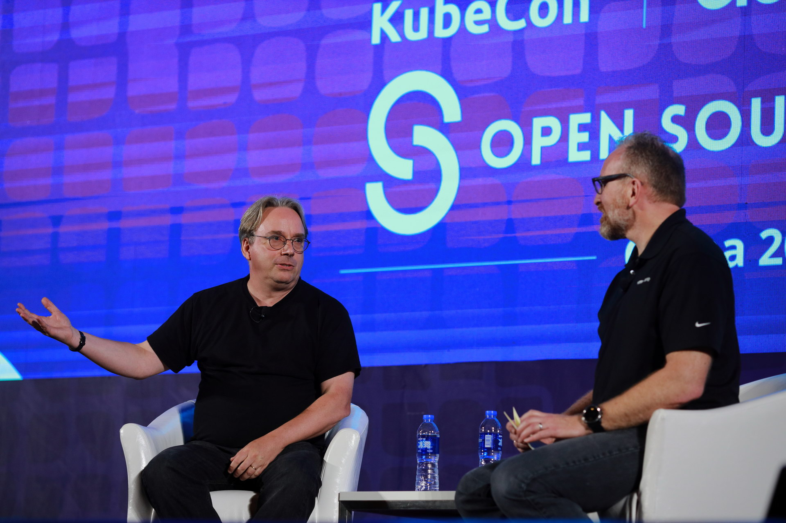

+++
title = "[图] 离大神最近的一次：kubecon大会Linus清晰近照"

date = 2019-06-27
lastmod = 2019-06-27
draft = false

tags = ["kubecon"]
summary = "6月25号，kubecon 上海，世博中心，大会堂（红厅/Red Hall），个人平生第一次近距离瞻仰大神 Linus Torvalds，并有幸拍下下面照片。"
abstract = "6月25号，kubecon 上海，世博中心，大会堂（红厅/Red Hall），个人平生第一次近距离瞻仰大神 Linus Torvalds，并有幸拍下下面照片。"

[header]
image = "headers/post/20190627-kubecon-linus.jpg"
caption = "Linus Torvalds @ kubecon Shanghai 2019"

+++

## 背景

6月25号，kubecon 上海，世博中心，大会堂（红厅/Red Hall），个人平生第一次近距离瞻仰大神 Linus Torvalds，并有幸拍下下面照片。

当时现场通过微信实时分享了出来，后来被很多人/很多群转发，相信很多同学可能已经见过这组照片了。考虑到微信图片压缩的厉害，我现在重新发出来一次，包括3000万像素的原图。

照片说明：当时刚好手上拿着佳能 EOS R 和 EF 135L F2 镜头，开始在后排太远拍摄效果不佳，后来冲动了一下，很小心的冲到第一排位置。现场如果有同学注意到当时第一排靠右边过道的位置有个半蹲着的手举相机的人，没错，就是在下 :) 

## 图片

文字不重要，请看图：

## 原图下载

清晰大图因文件太大，请通过百度盘下载。

链接: https://pan.baidu.com/s/1o2HlHhM13_p622ocJS9YBQ 提取码: i9a3 

也可以使用微信扫一扫即可获取文件：

## 版权申明

上述图片为本人亲手拍摄，大家可以自由使用，但各商业收费图片网站请勿收集和二次发布。