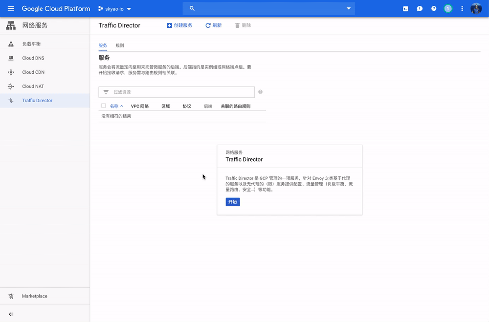
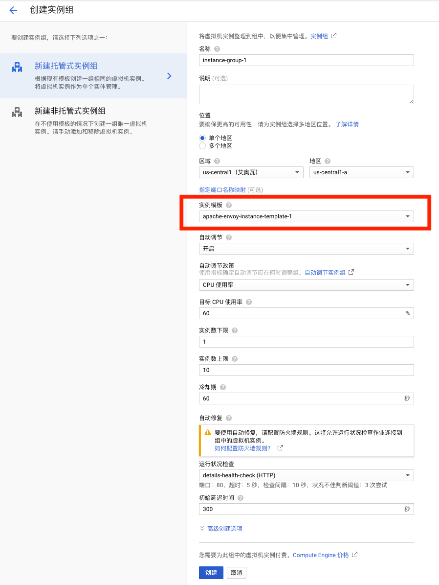
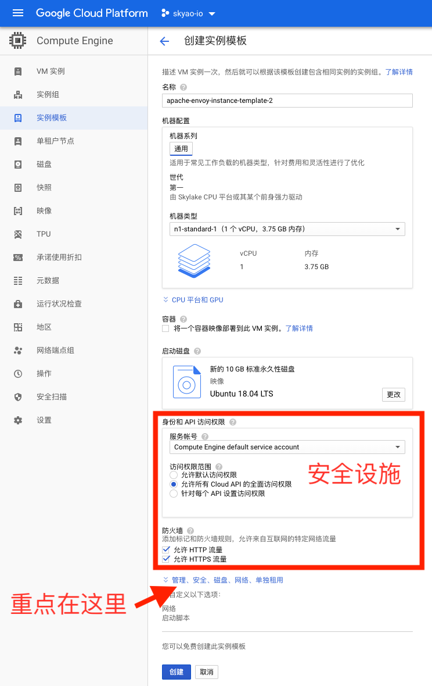
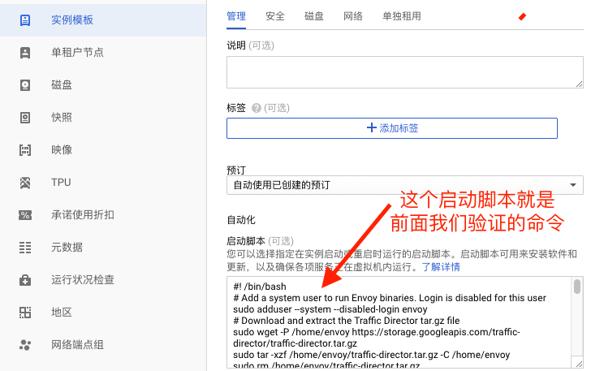
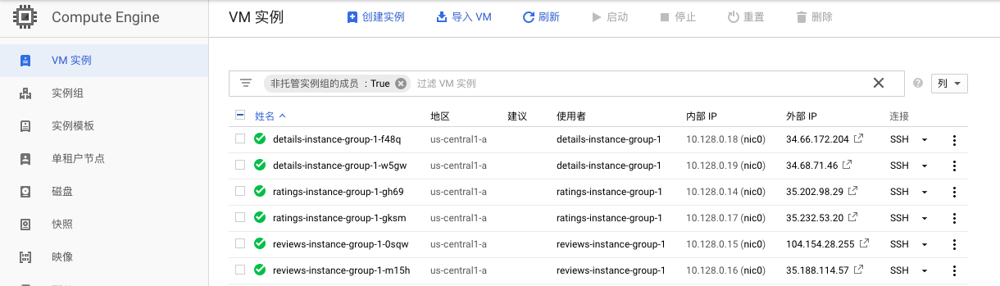

+++
title = "ServiceMesh先行：Google Traffic Director实践分析"

date = 2019-07-07
lastmod = 2019-07-07
draft = false

tags = ["kubecon"]
summary = "深入调研Google Traffic Director的实际操作，对Google Traffic Director的工作模式和产品思路进行分析：在容器和k8s没有大面积铺开的情况下，通过提供和容器体验类似的虚拟机支持，可以让应用的ServiceMesh化先行一步。"
abstract = "深入调研Google Traffic Director的实际操作，对Google Traffic Director的工作模式和产品思路进行分析：在容器和k8s没有大面积铺开的情况下，通过提供和容器体验类似的虚拟机支持，可以让应用的ServiceMesh化先行一步。"

[header]
image = "headers/post/201904-microservice-anti-patten.jpg"
caption = ""

+++

## 前言

Traffic Director 是 Google Cloud 推出的完全托管的服务网格流量控制平面。关于 Google Traffic Director 的介绍，可以先行阅读我之前的文章："[Google Traffic Director详细介绍](../201905-google-traffic-director-detail/)"。本文内容将关注于 Google Traffic Director 的实际操作，可以理解为是上一篇  Google Traffic Director 介绍文章的实践篇。

为此，本文将深入调研Google Traffic Director，内容会涉及到很多具体的操作和设置，
也会对Google Traffic Director的工作模式和产品思路进行分析。

## 前期准备

### 启用 Traffic Director

Traffic Director 是 GCP 管理的一项服务，因此使用 Traffic Director 前需要在控制台页面上启用 Traffic Director：


配置服务的说明：


从说明上看 Traffic Director 可以支持 Kubernetes 服务，也可以支持基于虚拟机的服务。后面我们的实践将包含这两块的内容。

在使用之前，要再做一些设置，具体参考官方文档：https://cloud.google.com/traffic-director/docs/setting-up-traffic-director。主要操作是两个：

1. 启用Traffic Director API

	

2. 启用服务帐号以访问 Traffic Director API

	
	
	完成这两个准备工作后，我们就将开始Traffic Director的实际使用，包括虚拟机模式和容器模式。

### 了解Traffic Director的工作方式

参考官方文档

https://cloud.google.com/traffic-director/docs/set-up-gce-vms#per_host_config

的这个小节，可以在控制台上进入 Computer Engine，然后创建一个虚拟机实例，再SSH（通过浏览器）登录上去，手工验证上述操作。在正式开始实践前， 完成这个步骤的练习非常重要，因为这个过程会让我们充分理解 Traffic Director 下是如何搭建和配置运行环境的。

在这个的过程中，服务器端应用将通过一个简单的apache web服务器来模拟，而客户端应用将通过 curl 命令来模拟。

让我们开始，在SSH登录到刚才新建的虚拟机之后，依次执行下面的命令，请注意注释中详细的说明：

```bash
#! /bin/bash
# 添加一个envoy用户名用于运行envoy。这个用户名不容许用于登录
# 这个 envoy 用户名后面在envoy的启动配置文件 sidecar.env 中会使用到
sudo adduser --system --disabled-login envoy
# 下载并解压缩 Traffic Director tar.gz 文件
# 这个地方的下载地址，中文文档用的是 traffic-director/beta/traffic-director-beta.tar.gz，已经过期，不要用这个版本
# 英文文档中28号之前的地址是错误的，报错404，但是28号之后修订过来了
sudo wget -P /home/envoy https://storage.googleapis.com/traffic-director/traffic-director.tar.gz
sudo tar -xzf /home/envoy/traffic-director.tar.gz -C /home/envoy
sudo rm /home/envoy/traffic-director.tar.gz
## 这里相当于直接配置 sidecar.env 文件，验证时可以不用这个命令，而是直接 vi 打开这个文件，手工配置当个选项，源文件有详细的注释
sudo cat << END > /home/envoy/traffic-director/sidecar.env
## 设置运行envoy的用户，这个用户名是我们在前面创建的
ENVOY_USER=envoy
# Exclude the proxy user from redirection so that traffic doesn't loop back
# to the proxy
EXCLUDE_ENVOY_USER_FROM_INTERCEPT='true'
# SERVICE_CIDR 最好是准确设置，默认*是拦截所有的对外流量
# 我设置的是10.128.0.1/16，请自行修改为你实际的设置
SERVICE_CIDR='10.128.0.1/16'
GCP_PROJECT_NUMBER=''
VPC_NETWORK_NAME=''
ENVOY_PORT='15001'
# ENVOY_ADMIN_PORT在28号前文档中遗漏没有设置，导致envoy无法启动，28号更新修复
ENVOY_ADMIN_PORT='15000'
LOG_DIR='/var/log/envoy/'
LOG_LEVEL='info'
XDS_SERVER_CERT='/etc/ssl/certs/ca-certificates.crt'
END
# 这里更新 apt-get，最终目的是安装docker工具，以便下载 envoy 的镜像文件并从其中提取envoy的二进制文件
sudo apt-get update -y
sudo apt-get install apt-transport-https ca-certificates curl gnupg2 software-properties-common -y
sudo curl -fsSL https://download.docker.com/linux/debian/gpg | sudo apt-key add -
sudo add-apt-repository 'deb [arch=amd64] https://download.docker.com/linux/debian stretch stable' -y
sudo apt-get update -y
sudo apt-get install docker-ce apache2 -y
# 安装并启动 apache，用来简单模拟一个服务端应用
sudo service apache2 restart
# 修改apache下默认的 index.html 文件，功能是简单打印出当前机器的hostname，以便后面访问这个用apache模拟的服务时可以判断访问的是哪个服务和实例
# 当时这个地方有错误，下面这行是英文文档的写法，会无法工作
# echo '<!doctype html><html><body><h1>'\`/bin/hostname\`'</h1></body></html>' 
# 需要修改为下面内容，这样才能正确打印 hostname
echo '<!doctype html><html><body><h1>'`/bin/hostname`'</h1></body></html>' | sudo tee /var/www/html/index.html
# 从网上下载 envoy 的镜像并从中提取 envoy 的二进制文件，这一步一定要先收工验证
sudo /home/envoy/traffic-director/pull_envoy.sh
# 用脚本启动envoy，这个脚本会使用 sidecar.env 的配置信息，设置 iptables 拦截，然后启动 envoy。
# 务必在启动之后，通过 run.sh status 命令检查 envoy 是否启动完成并正常工作
sudo /home/envoy/traffic-director/run.sh start
```

上面的这段命令，在 Traffic Director 的虚拟机模式中会有特殊的用途，后面我们会详细讲述。

这个虚拟机环境实践完上述的操作和脚本之后，建议继续保留，后面用来模拟客户端（curl + envoy）验证搭建的 traffic director 的服务是否可以访问。为了对比没有 envoy 劫持的情况，可以再启动一台虚拟机，不配置上面的内容， 以模拟没有 envoy 劫持的情况。

在使用 Traffic Director 前，需要先理解Traffic Director的服务模型和工作模式。

## 服务模型和工作模式

### Traffic Director的服务

下面是我验证完成之后的 Traffic Director 服务列表：


图中我创建了 details / ratings / reviews 三个服务：

- 每个服务对应有不同的后端实例组，Traffic Director 支持多个实例组，简单期间这里只设置了一个实例组。
- 每个服务有关联的路由规则，也可以在一个路由规则里面配置多个服务，图中我建立了一个名为 http-rule 的路由规则用来管理上面三个服务。

### 实例组/Instance Group

实例组用于管理虚拟机实例，下面是 details 服务关联的实例组：


注意图上实例组有模版的概念，也就是 实例模版（Instance Template），这里有两个地方显示模版：

1. 实例组当前设置的模版
2. 实例组下的各个虚拟机实例实际使用的模版

两个地方的模版通常是一致的，但是如果修改实例组的模版，在旧有的虚拟机实例没有更新之前，会出现不同的模版。

Compute Engine中的实例组有两种：

- 非托管式的实例组：这是传统的虚拟机管理方式，每台虚拟机都是**手动**搭建系统+安装配置应用，然后再手动添加到实例组。重点在于实例组下的实例是**固定的，手工配置**
- 托管式实例组（Managerd Instance Group）：托管的概念是指可以配置实例模版，然后 Compute Engine 就可以根据这个实例模版来**自动**搭建系统+安装配置应用。最关键的改变就在于这个虚拟机实例的自动化搭建，有了这个功能之后，就可以在此基础上实现很多高级特性。

我们以托管式实例组创建的页面为例：



托管式实例组提供的高级特性包括：

- 高可用：可以配置为在多个区域内部署实例，配合负载均衡/健康检查功能，就可以实现全球范围内的区域感知负载均衡/异地容灾/故障转移
- 自动伸缩：托管式实例组支持设置为固定的实例数，也支持自动伸缩，类似于 serverless ，根据指定的策略来实现虚拟机实例数的自动伸缩。
- 健康检查：可以配置健康检查，配置负载均衡实现高可用

而所有这些高级特性都建立在一个最基本的特性上：托管式实例组必须有能力**自动**实现虚拟机的系统搭建和应用的安装配置。对于 Google Traffic Director 应用，还必须做到能自动安装/配置envoy，启用iptables流量劫持。

托管式实例组通过**实例模版**来实现这一关键的自动化过程。 

### 实例模版/Instance Template

实例模版是用来创建虚拟机的模版，除了基本的虚拟机信息如机器硬件配置/操作系统/磁盘/网络等之外，还有特别的安全设置：身份和API访问权限中“服务账号”默认设置为使用“Compute Engine default service account”，“访问权限范围”要设置为“容许所有cloud api的全面访问权限”。



然后重点是需要打开“管理、安全、磁盘、网络……”，在“管理”中，“启动脚本”处填入在这个虚拟机上安装配置应用服务的脚本。



在google traffic director的文档中，给出的案例是安装apache模拟服务器端，然后安装并启动envoy。

这里的启动脚本就是我们前面验证 google traffic director 工作方式时一系列的命令，在 google traffic director的文档

https://cloud.google.com/traffic-director/docs/set-up-gce-vms#creating_the_instance_template

中有详细的脚本内容（注意里面有一个错误的地方，前面我们验证时有修订）。

TODO：页面上还有一“将容器镜像部署到此虚拟机”的功能，推测应该可以实现类似功能，后续再研究。

### 路由规则

Google Traffic Director 中通过路由规则来决定流量的目的地服务，在 Google Traffic Director 的控制台上可以通过设置路由规则，容许设置多个路由规则，每个路由规则可以关联多个服务。

下图是我建立的实例规则，转发规则为 http协议 + 80 端口，内部IP设置为 0.0.0.0，这样 Traffic Director 会根据HTTP请求的 Host/Path 信息来匹配路由规则，如下图我将三个不同的 host 指向不同的三个服务。


有个特别的地方，路由规则中强制要求一定要提供一个缺省的目的地服务，即任何没有和其他匹配规则匹配的请求都将默认去到这个服务，而不是通常的做法报错404。经过确认，在 Traffic Director 下发给 Envoy 的配置中，会有额外的一个名为 “_default” 的路由规则：

```yaml
"dynamic_route_configs": [
       {
        "name": "_default",
        "domains": [
         "*"
        ],
        "routes": [
         {
          "match": {
           "prefix": ""
          },
          "route": {
           "cluster": "cloud-internal-istio:cloud_mp_705219407589_7507573930487991268",
```

暂时没有想明白 Traffic Director 做这个强制的出发点是什么。

### Traffic Director工作模式总结

Google Traffic Director的工作模式，在使用托管式实例组时能提供很多高级特性，有些特性的工作模式和配置我们可以从 容器/k8s/Istio 中找到类似之处，如下面所列：

| 功能                          | 容器/k8s/Istio                                    | Google Traffic Director<br/>虚拟机模式                       |
| ----------------------------- | ------------------------------------------------- | ------------------------------------------------------------ |
| 准备操作系统                  | 镜像文件的基础镜像                                | 实例模版的操作系统配置                                       |
| 准备硬件                      | 容器的硬件配置                                    | 实例模版的硬件配置                                           |
| 准备应用                      | 打包到容器的镜像文件中<br/>（事实上也是一组命令） | 以自动启动脚本的方式<br/>获取/安装/配置应用                  |
| 启动应用程序                  | 启动业务的容器                                    | 按照实例模版启动虚拟机+应用                                  |
| 管理实例副本<br/>（固定）     | k8s replicaset                                    | 通过实例模版设置实例数                                       |
| 管理实例副本<br/>（自动伸缩） | k8s HPA或者serverless                             | 通过实例模版设置自动伸缩                                     |
| 服务定义                      | k8s service                                       | Google Traffic Director 服务                                 |
| 创建服务                      | 通过 k8s                                          | 在 Google Traffic Director <br/>控制台手工创建               |
| 服务注册                      | 通过k8s自动注册                                   | 在 Google Traffic Director 控制台<br/>手工关联服务和托管实例组 |
| 监控检查                      | k8s进行健康检查，支持自动修复                     | 通过托管式实例组配置健康检查，支持自动修复                   |
| 服务发现                      | 通过Istio Pilot 下发，xDS协议                     | 通过 Traffic Director，兼容xDS协议                           |
| 服务调用                      | 流量劫持（iptables） + Sidecar（envoy）           | 流量劫持（iptables） + Sidecar（envoy）                      |
| 数据平面API                   | Envoy xDS v2                                      | Envoy xDS v2                                                 |
| 应用版本升级                  | 更改镜像文件，支持滚动升级                        | 更改实例模版，托管式实例组支持滚动升级                       |
| 高可用                        | k8s联邦 / Istio多集群 / 区域感知负载均衡          | 通过托管式实例组支持多区域部署实例                           |
| 灰度发布                      | 通过Istio支持                                     | 通过托管式实例组支持                                         |
| 指定路由规则                  | 通过Istio CRD，功能非常丰富                       | 通过 Traffic Director 控制台设置路由规则，功能简单           |

## 实践：在VM上使用Traffic Director

在VM上使用Traffic Director的整个过程，可以参考 Google Traffic Director 的官方文档：

https://cloud.google.com/traffic-director/docs/set-up-gce-vms

但是特别强调：要看英文文档，不要参考中文文档，中文文档容易过期（不要问我是怎么知道的^0^）。当然，英文文档也有错误，但是英文文档更新很快。

> 这里有个花絮，我在6月28号操作时，卡在英文文档的错误下，后来一步一步验证才把错误的地方慢慢的一一纠正过来。但是在29号写总结时，发现英文文档中有错误的地方有些已经被修订，文档的最后更新时间显示为6月28号，也就是我刚踩完坑它就更新了。

### 在VM上安装 Traffic Director 应用

为了演示 Traffic Director 的使用，我建立了三个Traffic Director 应用程序，步骤如下（操作细节前面都给出了，这里就直接给结果了）：

1. 先建立实例模版：使用 Traffic Director 官方文档的实例，用一个apache服务器模拟服务器端应用

	

2. 使用实例模版建立三个托管式实例组：简单起见都使用上面的实例模版，真实应用是使用各自的模版

	

	简单起见没有开启自动伸缩，每个实例组我固定为两个实例，下面是三个实例组启动完成之后的6个虚拟机实例：

	

3. 在Traffic Director中新建三个服务，分别使用上面三个托管式实例组，并设置路由规则

	

为了对比，再建立两台虚拟机，一台配置有 envoy 和流量劫持（也就是前面我们验证 traffic director 工作方式的虚拟机），一台没有配置envoy和流量劫持。

### 模拟请求处理流程

首先在没有安装envoy的虚拟机上，用curl命令模拟客户端请求，分别连接上面6台虚拟机，响应如下：

```bash
$ curl 10.128.0.17 -i
HTTP/1.1 200 OK
Date: Sun, 30 Jun 2019 11:06:36 GMT
Server: Apache/2.4.29 (Ubuntu)
Last-Modified: Sat, 29 Jun 2019 03:10:41 GMT
ETag: "50-58c6dbd7abfdd"
Accept-Ranges: bytes
Content-Length: 80
Vary: Accept-Encoding
Content-Type: text/html
<!doctype html><html><body><h1>ratings-instance-group-1-gksm</h1></body></html>
```

其中 Server Header 的信息是 apache，注意body内部中打印的 host 信息表明了服务器端的地址，如 ratings-instance-group-1-gksm。

然后对比，在安装了Envoy和流量劫持的虚拟机上，我们同样通过curl命令模拟客户端请求，这是需要添加 Host header来指明目标服务：

```bash
$ curl 10.128.0.1 -H "Host: ratings" -i
HTTP/1.1 200 OK
date: Sun, 30 Jun 2019 11:11:17 GMT
server: envoy
last-modified: Sat, 29 Jun 2019 03:10:41 GMT
etag: "50-58c6dbd7abfdd"
accept-ranges: bytes
content-length: 80
vary: Accept-Encoding
content-type: text/html
<!doctype html><html><body><h1>ratings-instance-group-1-gksm</h1></body></html>
```

验证中发现:

1. curl命令使用的 ip 地址并不要求正确，只要在 “SERVICE_CIDR” 的范围内即可，如我设置的SERVICE_CIDR为 "10.128.0.1/16”。从文档中看到，如果路由规则中的IP地址设置为 0.0.0.0，则请求的IP地址不会被envoy使用，envoy会通过 Host 和 Path 来进行路由，所以这个IP地址是什么完全不重要。

	备注：这里我没有找到 traffic director 中配置服务 **虚拟IP** 的方式（类似 k8s service 的 cluster ip），如果 traffic director 的服务有虚拟ip并且能够和DNS集成，则可以通过  `curl ratings ` 这样的方式访问，开发体验会更好。

2. 应答中的 server header 已经修改为 envoy，不再是 apache
3. 多次执行，应答中的 rating 服务器的 host 地址会在当前两个虚拟机实例中轮流出现，看来默认的负载均衡算法是轮询
4. 将请求中的 Host header 换成其他服务名，如 detais/reviews，则会访问到其他服务的实例，验证了 envoy 的确是通过 host 来进行路由
5. 将请求中的 Host header 换成一个不存在的服务名，如 aaaaa，则会访问到 路由规则 中强制要求指定的缺省服务

### 检查 envoy 的配置

对于路由规则，最直接的方式就是dump下来 envoy 的配置，看看  traffic director 的控制平面最终给 envoy 下发的配置，因为内容太长，就不都贴出来了，只看最关注的路由配置：

```yaml
  "dynamic_route_configs": [
    {
     "route_config": {
      // 说明配置信息来自 google traffic director 中配置的名为 http-rule 的路由规则
      "name": "URL_MAP/705219407589.http-rule",
      "virtual_hosts": [
       {
        "name": "host_2534861607986333440",
        "domains": [
         "reviews"		  // 对reviews服务的路由
        ],
        "routes": [
         {
          "match": {
           "prefix": ""
          },
          "route": {
           "cluster": "cloud-internal-istio:cloud_mp_705219407589_7507573930487991268",
           }
          }
         }
        ]
       },
       {
        "name": "host_3289472182735543541",
        "domains": [
         "details"  // 对details服务的路由
        ],
        "routes": [
         {
          "match": {
           "prefix": ""
          },
          "route": {
           "cluster": "cloud-internal-istio:cloud_mp_705219407589_9114389520261341891",
           }
          }
         }
        ]
       },
       {
        "name": "host_3170996105491916824",
        "domains": [
         "ratings"  // 对ratings服务的路由
        ],
        "routes": [
         {
          "match": {
           "prefix": ""
          },
          "route": {
           "cluster": "cloud-internal-istio:cloud_mp_705219407589_4125301658927778747",
           }
          }
         }
        ]
       },
       {
        "name": "_default",   // traffic director中强制必须设置的缺省服务，我设置为 reviews 服务
        "domains": [
         "*"
        ],
        "routes": [
         {
          "match": {
           "prefix": ""
          },
          "route": {
          // 因此路由到 reviews 服务的集群去了
           "cluster": "cloud-internal-istio:cloud_mp_705219407589_7507573930487991268",
           }
          }
         }
        ]
       }
      ]
```

参照我在 google traffic director 中配置的名为 http-rule 的路由规则的详细信息，就容易看出两者的对比关系了：


### 验证非托管式实例组

验证了一下非托管式实例组在 google traffic director 中的使用，没有问题，可以新建 google traffic director 的服务，然后选择非托管式实例组，同样的方式设置好这个使用非托管式实例组的服务的路由规则之后，请求可以正常处理。

只是非托管式实例组，会少很多高级特性。

## 后记

对 google traffic director 的调研在6月底完成，这篇操作记录性质的博客文档的草稿编写完成于7月7号。但是由于一直没能完成这篇稿件的总结，因此一直以草稿的方式存在github中未能公开发表。

直到8月份在做 [“Service Mesh发展趋势(续)：棋到中盘路往何方”](../../talk/201908-servicemesh-development-trend2/) 主题演讲时，才将总结部分完成。因此，如果您阅读完这篇实践篇之后，继续对 google traffic director 支持虚拟机的分析和总结有兴趣，请阅读这个主题演讲文字稿的第三个部分：“ServiceMesh灵魂拷问三：要不要支持虚拟机？”。


