+++
title = "[译] 标准化WASI：在Web外运行WebAssembly的系统接口"

date = 2019-08-27
lastmod = 2019-08-27
draft = false

tags = ["Web Assembly"]
summary = "WebAssembly宣布开始新的标准化工作--WASI，WebAssembly系统接口。通过WASI，可以将WebAssembly和Web的优势扩展到更多的用户，更多的地方，更多的设备，带来更多的体验。"
abstract = "WebAssembly宣布开始新的标准化工作--WASI，WebAssembly系统接口。通过WASI，可以将WebAssembly和Web的优势扩展到更多的用户，更多的地方，更多的设备，带来更多的体验。"

[header]
image = ""
caption = ""

+++

英文原文来自 [Standardizing WASI: A system interface to run WebAssembly outside the web
](https://hacks.mozilla.org/2019/03/standardizing-wasi-a-webassembly-system-interface/)，作者 [Lin Clark](https://twitter.com/linclark)。

> 备注：快速翻译（机翻+人工校对，没有精修），质量不高，一般阅读可以，不适合传播，谢绝转载。

------

今天，我们宣布开始新的标准化工作--WASI，WebAssembly系统接口。

**原因：**开发人员开始将WebAssembly向浏览器之外推，因为它提供了一种快速，可扩展，安全的方式，可以在所有机器上运行同样的代码。

但我们尚未打造好坚实的基础。浏览器之外的代码需要一种与系统通信的方式 - 系统接口（system interface）。WebAssembly平台还没有这个。

**内容：** WebAssembly是概念机器的汇编语言，而不是物理机器。这是它可以在各种不同机器架构上运行的原因。

正如WebAssembly是概念机器的汇编语言一样，WebAssembly需要一个概念操作系统的系统接口，而不是单个操作系统。这样，它可以运行在所有不同的操作系统上。

这就是WASI - WebAssembly平台的系统接口。

我们的目标是创建一个系统接口，它将成为WebAssembly的真正伴侣并经受时间的考验。这意味着需要坚持WebAssembly的关键原则 - 可移植性和安全性。

**谁：**我们正在组建一个WebAssembly小组，专注于标准化[WASI](https://wasi.dev/)。我们已经收集了感兴趣的合作伙伴，并且正在寻找更多的人加入。

以下是我们，我们的合作伙伴以及我们的支持者认为这很重要的一些原因：

#### Sez White，Mozilla的首席研发官员

“WebAssembly已经在改变网络使用方式，为人们带来新的引人注目的内容，并赋能开发人员和创作者能够在网络上做最好的工作。到目前为止是通过浏览器，但通过WASI，我们可以将WebAssembly和Web的优势扩展到更多的用户，更多的地方，更多的设备，带来更多的体验。“

#### Tyler McMullen，Fastly的首席技术官

“我们将WebAssembly在浏览器之外使用，作为平台，在我们的边缘云中快速而安全地执行代码。尽管我们的边缘和浏览器之间的环境存在差异，但WASI意味着WebAssembly开发人员不必将代码移植到每个不同的平台。“

#### Myles Borins，Node技术指导委员会主管

“WebAssembly可以解决Node中最大的问题之一 - 如何获得接近原生的速度，并重用其他语言（如C和C ++）编写的代码，就像使用原生模块一样，同时仍保持可移植性和安全性。标准化系统界面是实现这一目标的第一步。“

#### Laurie Voss，npm的联合创始人

“npm非常感兴趣的是，WebAssembly可以扩展npm生态系统的功能，同时极大地简化了在服务器端JavaScript应用程序中运行原生代码的过程。我们期待着这个过程的结果。“

这是个大新闻！🎉

WASI目前有3个实现：

- [wasmtime](https://github.com/CraneStation/wasmtime)，Mozilla的WebAssembly运行时
- [Lucet](https://www.fastly.com/blog/announcing-lucet-fastly-native-webassembly-compiler-runtime)，Fastly的WebAssembly运行时
- [浏览器polyfill](https://wasi.dev/polyfill/)

您可以在此视频中看到WASI的运行情况：

https://www.youtube.com/embed/ggtEJC0Jv8A

关于此系统接口应如何工作的建议，如果您想了解更多信息，请继续阅读。

### 什么是系统界接口？

许多人谈论语言，像C那样可以直接访问系统资源。但是，这不是*很*真实*。*

这些语言在大多数系统上无法直接访问和操作，如打开或创建文件等。为什么不能？

因为这些系统资源（例如文件，内存和网络连接）对于稳定性和安全性来说太重要了。

如果一个程序无意中弄乱了另一个程序的资源，那么它可能会使程序崩溃。更糟糕的是，如果程序（或用户）故意与另一个程序（或用户）的资源混淆，它可能会窃取敏感数据。

因此，我们需要一种方法来控制程序和用户可以访问哪些资源。人们很早就发现了这一点，并提出了一种方法来提供这种控制：保护环安全（protection ring security）。

通过保护环安全，操作系统基本上为系统资源提供了保护屏障。这是内核。内核是唯一可以执行操作的地方，例如创建新文件、打开文件或打开网络连接。

用户的程序在内核之外运行，称为用户模式。如果某个程序想要打开文件，它必须要求内核为它打开文件。

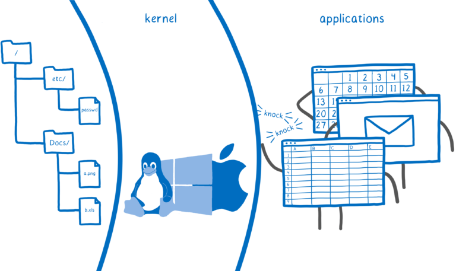

这就是系统调用的概念。当程序需要请求内核执行其中一项操作时，它会要求使用系统调用。这使内核有机会找出是哪个用户在请求。然后它可以在打开之前查看该用户是否可以访问该文件。

在大多数设备上，这是您的代码可以访问系统资源的唯一方法 —— 通过系统调用。

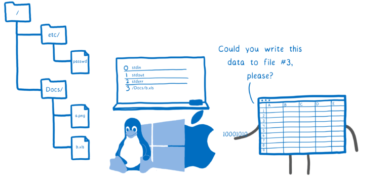

操作系统使系统调用可用。但是，如果每个操作系统都有自己的系统调用，那么您是否需要为每个操作系统使用不同版本的代码？幸运的是，你没有。

这个问题如何解决的？抽象。

大多数语言都提供标准库。在编码时，程序员不需要知道他们所针对的系统。他们只使用接口。

然后，在编译时，工具链会根据针对的系统选择要使用的接口实现。此实现使用操作系统API中的函数，因此它特定于系统。

这是系统接口的用武之地。例如，`printf` 被编译为在Windows机器上使用Windows API与机器进行交互。如果为Mac或Linux编译的，它将使用POSIX。

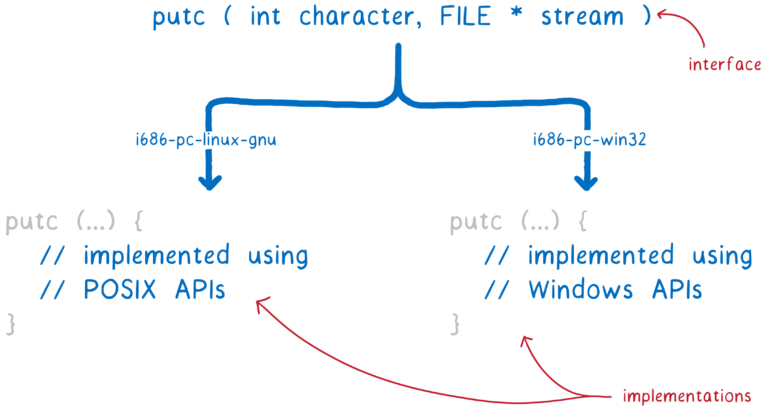

但这对WebAssembly来说是个问题。

使用WebAssembly，即使在编译时，也不知道要定位的操作系统类型。因此，无法在标准库的WebAssembly实现中使用任何单独的OS系统接口。

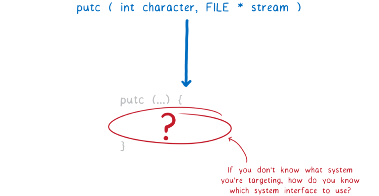

我之前谈过WebAssembly如何是[概念机器的汇编语言](https://hacks.mozilla.org/2017/02/creating-and-working-with-webassembly-modules/)，而不是真正的机器。同样，WebAssembly需要一个概念操作系统的系统接口，而不是真实的操作系统。

但是已经存在有可以在浏览器外运行WebAssembly的运行时，即使没有系统接口也是如此。他们是如何做到的呢？让我们来看看。

### 今天WebAssembly如何在浏览器之外运行的？

生成WebAssembly的第一个工具是Emscripten。它在Web上模拟了特定的OS系统接口，POSIX。这意味着程序员可以使用C标准库（libc）中的函数。

为此，Emscripten创建了自己的libc实现。实现分为两部分 - 一部分编译成WebAssembly模块，另一部分用JS粘合代码实现。然后，这个JS胶水代码会调用浏览器，然后与操作系统进行通信。

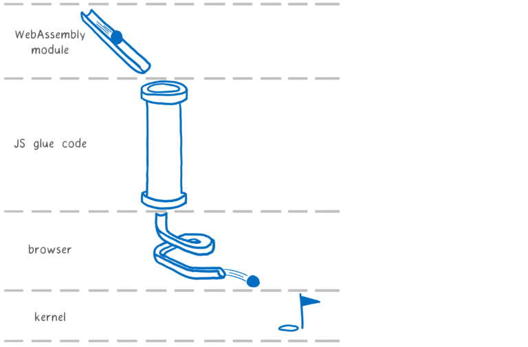

大多数早期的WebAssembly代码都是使用Emscripten编译的。因此，当人们开始想要在没有浏览器的情况下运行WebAssembly时，他们首先要让Emscripten编译的代码运行起来。

因此，这些运行时需要为JS粘合代码中的所有函数创建自己的实现。

但是这里有一个问题。JS胶水代码提供的接口并不是标准的，甚至不是面向公开的接口。这不能解决问题。

例如，对于一个类似  `read` 调用的函数，而 `read` 在被设计为公开接口的API中，JS胶水代码使用`_system3(which, varargs)`。

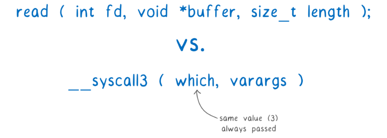

第一个参数`which`是一个整数，它始终与名称中的数字相同（在本例中为3）。

第二个参数`varargs`是要使用的参数。它被称为 `varargs` 时因为可以有可变数量的参数。但是WebAssembly没有提供将可变数量的参数传递给函数的方法。相反，参数通过线性内存传递。这不是类型安全的，并且比使用寄存器传递参数的速度慢。

这对于在浏览器中运行的Emscripten来说没问题。但是现在运行时将它视为事实上的标准，实现了自己的JS胶水代码版本。他们正在模拟POSIX仿真层的内部细节。

这意味着它们正在重新实现选择，基于Emscripten约束（比如在堆值中传递参数）这些选择时有意义的，即使这些约束不适用于它们的环境。

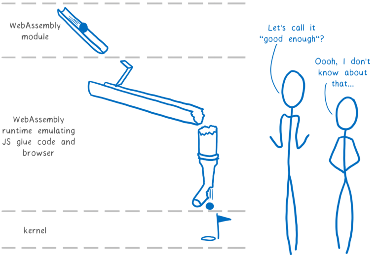

如果我们要构建一个持续数十年的WebAssembly生态系统，我们需要坚实的基础。这意味着我们的事实标准不能是模拟器的模拟器。

但是我们应该采用什么原则？

### WebAssembly系统接口需要遵循什么原则？

WebAssembly中有两个重要的原则：

- 可移植性
- 安全

当我们转向浏览器外用例时，我们需要保持这些关键原则。

实际上，POSIX和Unix的访问控制安全方法并没有让我们打到目的。让我们来看看它们的不足之处。

#### 可移植性

POSIX提供源代码可移植性。可以使用不同版本的libc编译相同的源代码以定位不同的计算机。

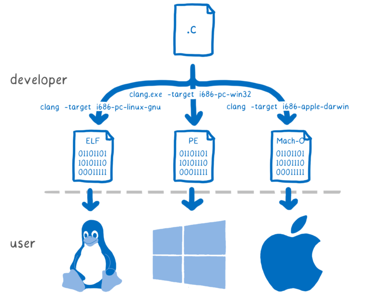

但WebAssembly需要超越这一点。我们需要能够一次编译并运行在一大堆不同的机器。我们需要可移植性二进制文件。

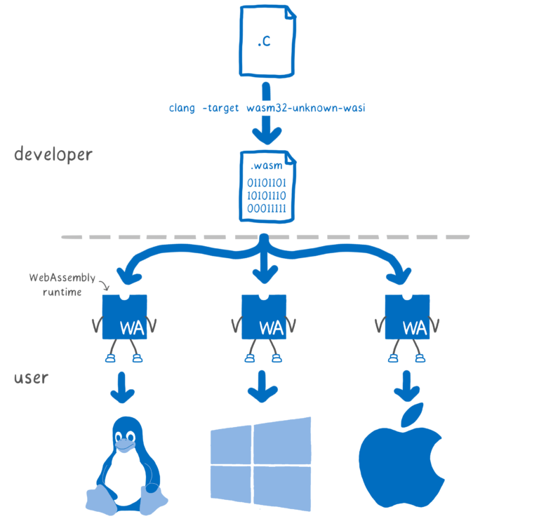

这种可移植性使得向用户分发代码变得更加容易。

例如，如果Node的原生模块是用WebAssembly编写的，那么当用户使用原生模块安装应用程序时，用户就不需要运行node-gyp，开发人员也不需要配置和分发数十个二进制文件。

#### 安全

当一行代码要求操作系统执行某些输入或输出时，操作系统需要确定执行代码所要求的操作是否安全。

操作系统通常使用基于所有权和组的访问控制来处理此问题。

例如，程序可能会要求操作系统打开文件。用户拥有有权访问的特定文件集。

当用户启动程序时，程序代表该用户运行。如果用户有权访问该文件 - 要么是因为他们是所有者，要么是因为他们在具有访问权限的组中 - 那么该程序也具有相同的访问权限。

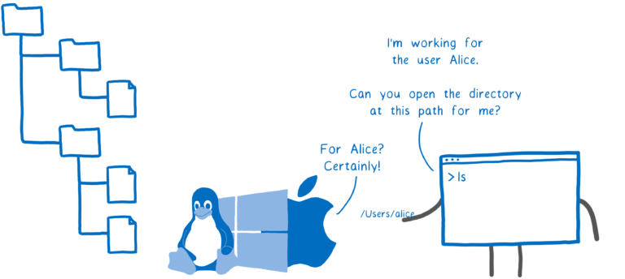

这可以保护用户彼此。在开发早期操作系统时，这很有意义。系统通常是多用户，管理员控制安装的软件。所以最突出的威胁是其他用户浏览你的文件。

那已经改变了。系统现在通常是单用户，但它们运行的代码会引入许多未知可信度的其他第三方代码。现在最大的威胁是你自己运行的代码会针对你。

例如，假设您在应用程序中使用的库有了新的维护者（通常在开源中发生）。那个维护者可能会把你的兴趣放在心上......或者他们可能是坏人之一。如果他们有权在你的系统上做任何事情 - 例如，打开你的文件并通过网络发送它们 - 那么他们的代码就会造成很大的破坏。

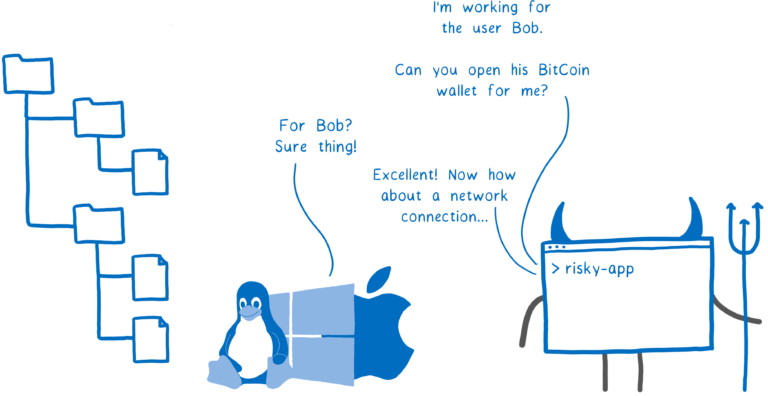

这就是为什么使用可以直接与系统通信的第三方库可能是危险的。

WebAssembly的安全方式有所不同。WebAssembly是沙箱。

这意味着代码无法直接与操作系统通信。但那么它如何操作系统资源呢？主机（可能是浏览器，或者可能是wasm运行时）将函数放在代码可以使用的沙箱中。

这意味着主机可以限制程序可执行的操作，基于编程的基础上。它不是简单让程序代表用户行事，从而使用用户的完全权限来调用任何系统调用。

仅仅拥有沙盒机制并不会使系统本身安全 - 主机仍然可以将所有功能都放入沙箱中，在这种情况下我们也不会更好 - 但它至少让主机可以有机会创建一个更安全的系统。

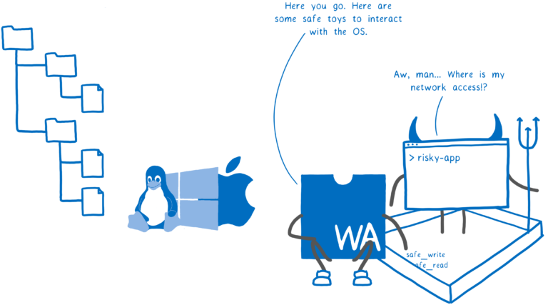

在我们设计的任何系统接口中，我们都需要坚持这两个原则。可移植性使得开发和分发软件变得更加容易，并且为主机提供保护自己或用户的工具是绝对必要的。

### 这个系统界面应该是什么样的？

鉴于这两个关键原则，WebAssembly系统接口的设计应该是什么样子？

这就是我们在标准化过程中将要实现的。不过，我们确实有一个建议作为出发点：

- 创建一组模块化标准接口集合
- 首先标准化最基本的模块，wasi-core

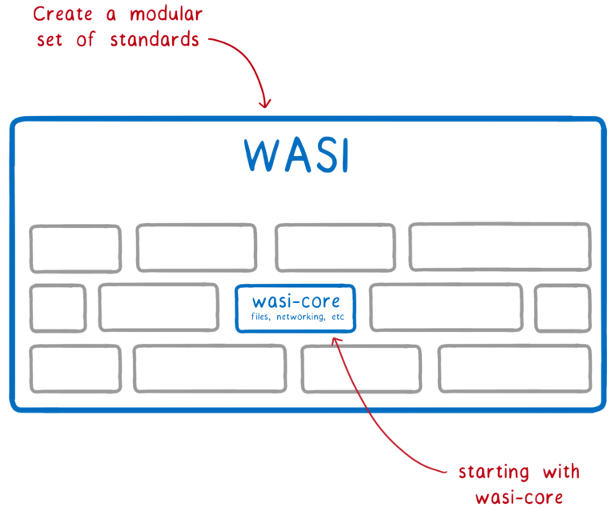

哪些将在wasi-core中？

wasi-core将包含所有程序需要的基础。它将覆盖与POSIX相同的基础内容，包括文件，网络连接，时钟和随机数等内容。

对于这样场景，它将采用与POSIX非常类似的方法。例如，它将使用POSIX的面向文件的方法，在这种方法中，您可以进行系统调用，例如打开，关闭，读取和写入，其他一切基本上都是在顶部提供扩充。

但是，wasi-core不会涵盖POSIX所做的一切。例如，流程概念没有清晰地映射到WebAssembly上。除此之外，每个WebAssembly引擎都需要支持像 `fork` 这样的流程操作是没有意义的。但我们也希望能够实现标准化`fork`。

这就是模块化策略的用武之地。这样，我们可以获得良好的标准化覆盖率，同时仍然允许平台仅使用对它们有意义的部分WASI。

像Rust这样的语言将直接在标准库中使用wasi-core。例如，Rust 的 `open` 在编译为WebAssembly时是通过调用 `__wasi_path_open` 来实现的。

对于C和C ++，我们创建了 [wasi-sysroot](https://github.com/CraneStation/wasi-sysroot)，为wasi-core函数实现libc。

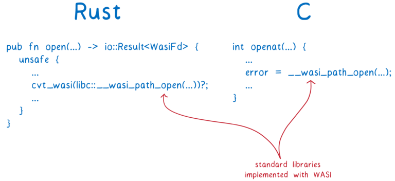

我们希望像Clang这样的编译器能够与WASI API进行交互，并像Rust编译器和Emscripten那样完成工具链，将WASI作为系统实现的一部分来使用。

用户代码如何调用这些WASI函数？

运行代码的运行时将wasi-core函数作为 import 传递进来。

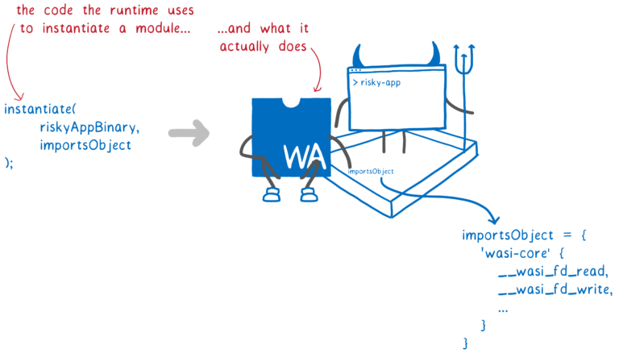

这为我们提供了可移植性，因为每个主机都可以拥有自己的专为其平台编写的wasi-core实现 - 从WebAssembly运行时，如Mozilla的wasmtime和Fastly的Lucet，到Node，甚至是浏览器。

它还为我们提供了沙盒，因为主机可以逐个程序地选择传入哪些 wasi-core 函数 - 这样决定了允许哪些系统调用。这保留了安全性。

WASI为我们提供了进一步扩展安全性的方法。它从基于功能的安全性中引入了更多概念。

传统上，如果代码需要打开文件，它会带路径名字符串调用 `open`。然后操作系统检查代码是否具有权限（基于启动程序的用户）。

使用WASI，如果您正在调用需要访问文件的函数，则必须传入一个附加了权限的文件描述符。这可以是文件本身，也可以是包含该文件的目录。

这样，您就无法拥有随机要求打开的代码`/etc/passwd`。相反，代码只能操作传递给它的目录。

这使得可以安全地为沙盒代码提供对不同系统调用的更多访问 - 因为这些系统调用的功能可能受到限制。

这是在逐个模块的基础上发生的。默认情况下，模块没有对文件描述符的任何访问权限。但是，如果一个模块中的代码具有文件描述符，则可以选择将该文件描述符传递给它在其他模块中调用的函数。或者它可以创建更多有限版本的文件描述符以传递给其他函数。

因此，运行时传递应用程序可以使用的文件描述符到顶级代码，然后文件描述符根据需要传播到系统的其余部分。

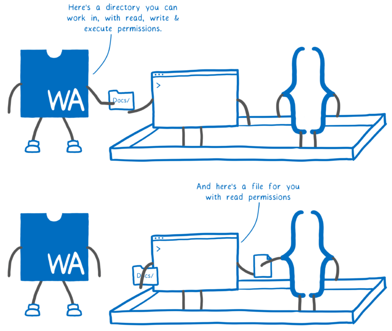

这使WebAssembly更接近最小权限原则，模块只能访问完成其工作所需的确切资源。

这些概念来自面向功能的系统，如CloudABI和Capsicum。面向功能的系统的一个问题是通常很难将代码移植到它们。但我们认为这个问题可以解决。

如果代码已经用相对文件路径来使用 `openat`，那么代码就可以编译了。

如果代码使用`open`，而且迁移到`openat`样式有太多的前期投资，WASI可以提供增量解决方案。使用[libpreopen](https://github.com/musec/libpreopen)，您可以创建应用程序合法需要访问的文件路径列表。然后你可以使用`open`，但只能使用这些路径。

### 下一步

我们认为wasi-core是一个良好的开端。它保留了WebAssembly的可移植性和安全性，为生态系统提供了坚实的基础。

但是，在完全标准化之后，我们还需要解决一些问题。这些问题包括：

- 异步I/O.
- 文件监听
- 文件锁定

这只是一个开始，所以如果您有如何解决这些问题的想法，请[加入我们](https://wasi.dev/)！