+++
title = "[译] WebAssembly接口类型：与所有事物互操作！"

date = 2019-09-08
lastmod = 2019-09-08
draft = false

tags = ["Web Assembly"]
summary = "WebAssembly宣布开始新的标准化工作--WASI，WebAssembly系统接口。通过WASI，可以将WebAssembly和Web的优势扩展到更多的用户，更多的地方，更多的设备，带来更多的体验。"
abstract = "WebAssembly宣布开始新的标准化工作--WASI，WebAssembly系统接口。通过WASI，可以将WebAssembly和Web的优势扩展到更多的用户，更多的地方，更多的设备，带来更多的体验。"

[header]
image = ""
caption = ""

+++

英文原文来自 [WebAssembly Interface Types: Interoperate with All the Things!](https://hacks.mozilla.org/2019/08/webassembly-interface-types/)，作者 [Lin Clark](https://twitter.com/linclark)。

> 备注：快速翻译（机翻+人工校对，没有精修），质量不高，一般阅读可以，不适合传播，谢绝转载。

------

人们兴奋于在浏览器外运行WebAssembly。

这种兴奋不仅仅在于运行在自身独立运行时中的WebAssembly。人们也对使用Python，Ruby和Rust等语言运行WebAssembly感到兴奋。

为什么想这么做？原因如下：

- **使“原生”模块不那么复杂**
	像Node或Python的CPython这样的运行时通常允许你用C++等低级语言编写模块。那是因为这些低级语言通常要快得多。因此，您可以在Node中使用原生模块，或在Python中使用扩展模块。但这些模块通常很难使用，因为它们需要在用户的设备上进行编译。使用WebAssembly“原生”模块，您可以获得差不多的速度而规避复杂化。
- **使沙箱原生代码更容易**
	另一方面，像Rust这样的低级语言不会使用WebAssembly来提高速度。但是他们可以用它来保证安全。正如我们在[WASI公告中](https://hacks.mozilla.org/2019/03/standardizing-wasi-a-webassembly-system-interface/)所讨论的那样，WebAssembly默认为您提供轻量级沙盒。因此像Rust这样的语言可以使用WebAssembly来沙箱化原生代码模块。
- **跨平台共享原生代码**
	如果开发人员可以跨不同平台（例如，在Web和桌面应用程序之间）共享相同的代码库，则可以节省时间并降低维护成本。对于脚本和低级语言都是如此。WebAssembly为您提供了一种方法，可以运行在这些平台上，而不会减慢速度。

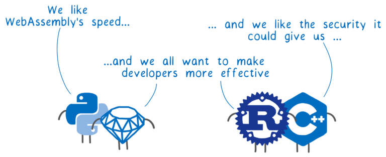

因此，WebAssembly可以真正帮助其他语言解决重要问题。

但是对于今天的WebAssembly，您不希望以这种方式使用它。您可以在所有这些地方*运行* WebAssembly，但这还不够。

现在，WebAssembly只在数值上进行对话。这意味着两种语言可以相互调用对方的函数。

但是如果一个函数接受或返回除数值之外的任何东西，事情变得复杂。你可以：

- 传递一个有非常难用的API的模块，该API仅以数值对话......让模块用户很为难。
- 为希望此模块运行的每个环境添加胶水代码......使模块开发人员很为难。

但事实并非如此。

应该可以传递*单个* WebAssembly模块并让它在任何地方运行......而不会让模块的用户或开发人员为难。


因此，相同的WebAssembly模块可以使用丰富的API对话，使用复杂类型：

- 在自己的原生运行时运行的模块（例如，在Python运行时中运行的Python模块）
- 用不同源代码语言编写的其他WebAssembly模块（例如，在浏览器中一起运行的Rust模块和Go模块）
- 主机系统本身（例如，为操作系统提供系统接口或提供浏览器API的WASI模块）


通过一个新的早期提案，我们将看到如何制作这个Just Work™，正如您在本演示中所看到的那样。

https://www.youtube.com/embed/Qn_4F3foB3Q

那么让我们来看看它是如何工作的。但首先，让我们看看我们今天的处境以及我们试图解决的问题。

## WebAssembly与JS对话

WebAssembly不仅限于Web。但到目前为止，WebAssembly的大部分开发都集中在Web上。

那是因为当你专注于解决具体的用例时，你可以做出更好的设计。该语言肯定必须在Web上运行，因此这是一个很好的可以作为起点的用例。

这给出一个很好的MVP范围。WebAssembly只需要能够与一种语言对话 - JavaScript。

这样做相对容易。在浏览器中，WebAssembly和JS都在同一个引擎中运行，因此引擎可以帮助它们[有效地相互通信](https://hacks.mozilla.org/2018/10/calls-between-javascript-and-webassembly-are-finally-fast)。

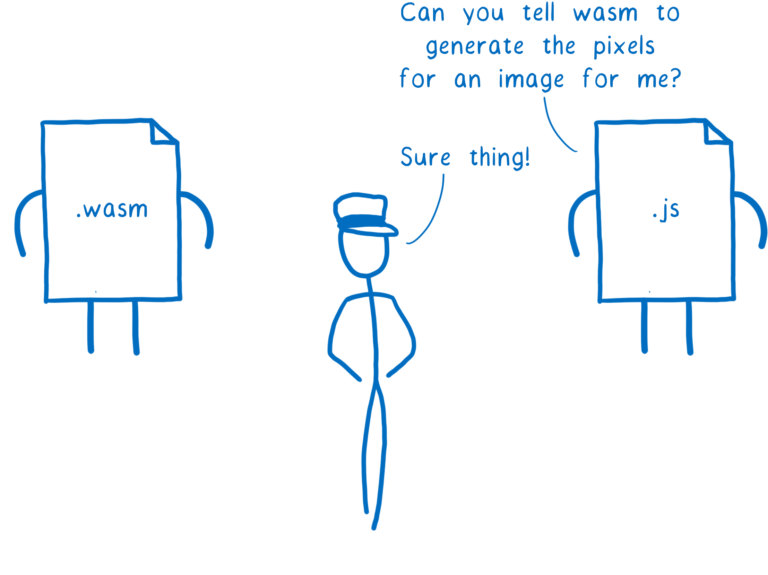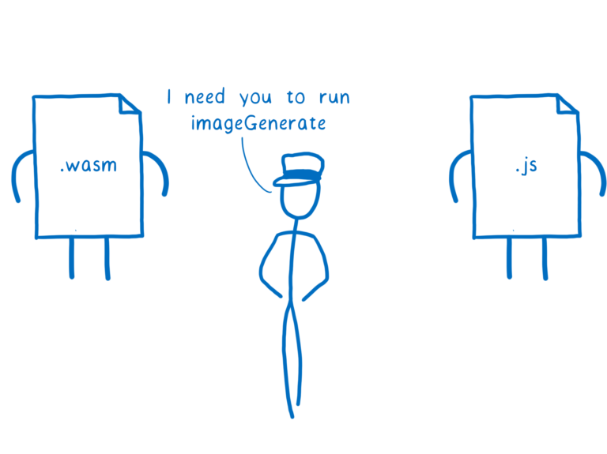

但是当JS和WebAssembly试图互相对话时，有一个问题......他们使用不同的类型。

目前，WebAssembly只能以数值进行对话。JavaScript有数值，但也有很多类型。

甚至数值都不一样。WebAssembly有4种不同的数值：int32，int64，float32和float64。JavaScript目前只有Number（虽然很快会有另一种数字类型，[BigInt](https://github.com/tc39/proposal-bigint)）。

区别不仅在于这些类型的名称。值也是以不同方式存储在内存中。

首先，在JavaScript中，任何值，无论类型，都被放入一个称为盒子（box）的东西（我在另一篇文章中解释了更多的[boxing](https://hacks.mozilla.org/2018/10/calls-between-javascript-and-webassembly-are-finally-fast/#js-to-wasm)）。

相反，WebAssembly的数值具有静态类型。因此，它不需要（或理解）JS盒子。

这种差异使得彼此之间难以沟通。

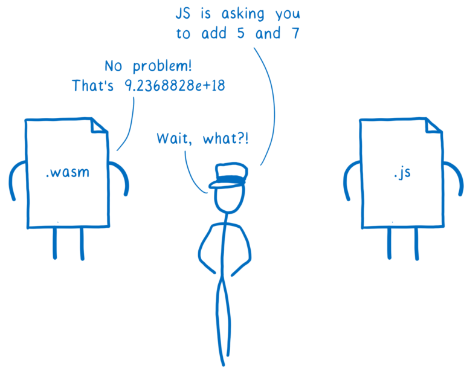

但是，如果要将值从一种数值类型转换为另一种数值类型，则有非常简单的规则。

因为它很简单，所以很容易写下来。你可以在[WebAssembly的JS API规范中](https://www.w3.org/TR/wasm-js-api/#tojsvalue)找到这个。

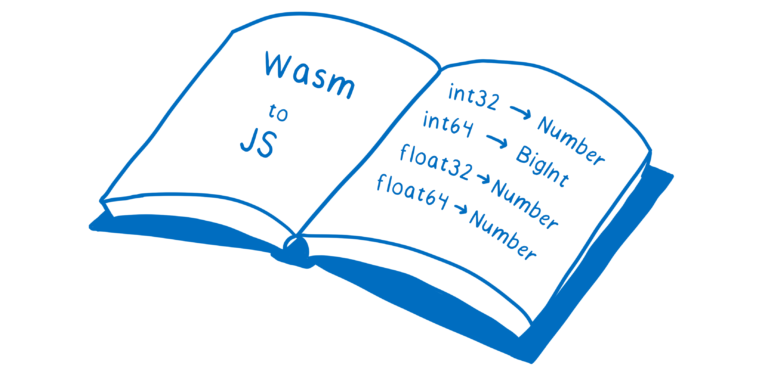

此映射硬编码在引擎中。

这有点像引擎有一本参考书。每当引擎必须在JS和WebAssembly之间传递参数或返回值时，它就会从架子上提取该参考书，以了解如何转换这些值。

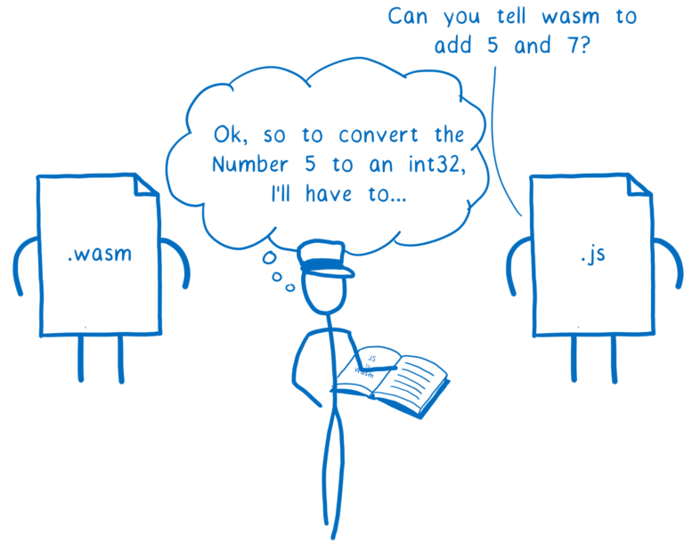

拥有如此有限的一组类型（只是数值）使得这种映射非常容易。这对于MVP来说非常棒。它的限制使得无需作出太多艰难的设计决策。

但它使得开发人员使用WebAssembly变得更加复杂。要在JS和WebAssembly之间传递字符串，您必须找到一种方法将字符串转换为数值数组，然后将数值数组转换回字符串。我在上一篇[文章中](https://hacks.mozilla.org/2018/03/making-webassembly-better-for-rust-for-all-languages/)对此进行了解释。

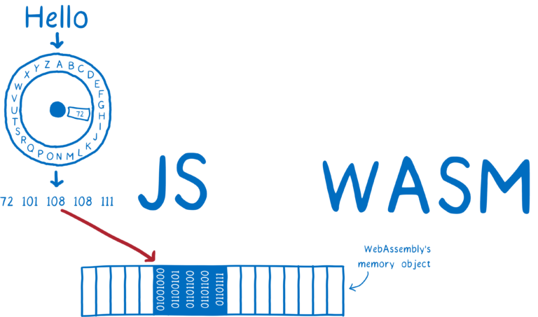

这并困难，但是很乏味。所以构建工具来抽象出来。

例如，像 [Rust的wasm-bindgen](https://rustwasm.github.io/docs/wasm-bindgen/) 和[Emscripten的Embind](https://emscripten.org/docs/porting/connecting_cpp_and_javascript/embind.html#embind) 这样的工具会自动用Web粘合代码包装WebAssembly模块，该代码可以实现从字符串到数值的转换。

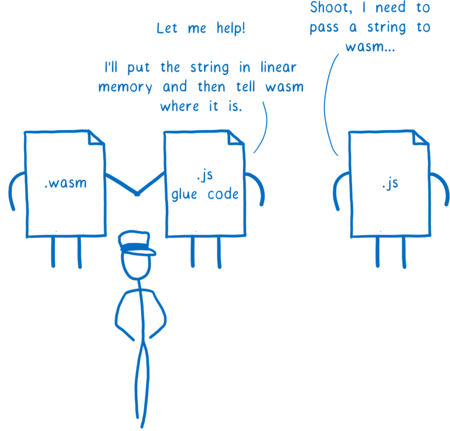

这些工具也可以为其他高级类型执行类型转换，例如带有属性的复杂对象。

这个方式可行，但存在一些非常明显的不能很好地工作的用例。

例如，有时您只想通过 WebAssembly 透传字符串。您希望JavaScript函数将字符串传递给WebAssembly函数，然后让WebAssembly将其传递给另一个JavaScript函数。

为了达到这个目标，需要做以下事情：

1. 第一个JavaScript函数将字符串传递给JS胶水代码
2. JS胶水代码将该字符串对象转换为数值，然后将这些数值放入线性内存中
3. 然后将一个数值（指向字符串开头的指针）传递给WebAssembly
4. WebAssembly函数将该数值传递给另一侧的JS胶水代码
5. 第二个JavaScript函数从线性内存中提取所有这些数值，然后将它们解码回字符串对象
6. 传递给第二个JS函数


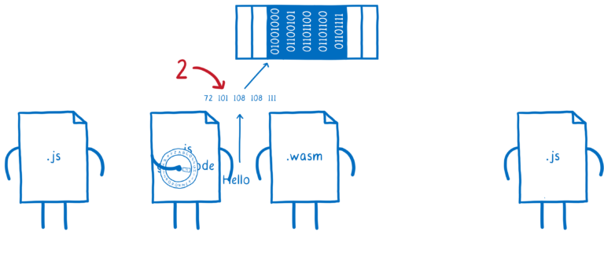

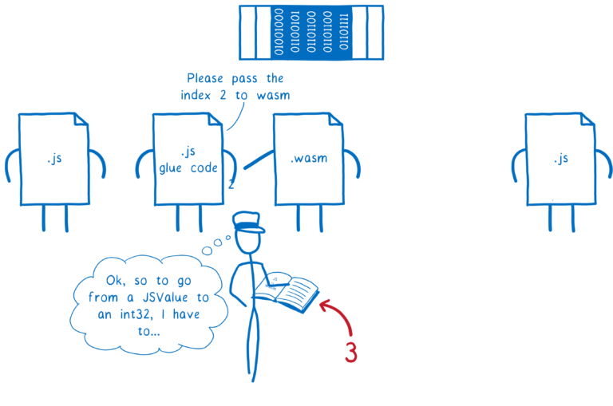

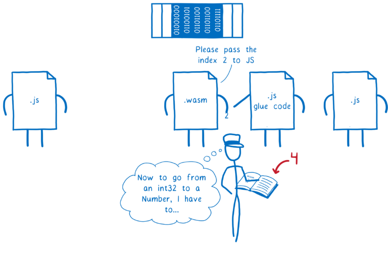

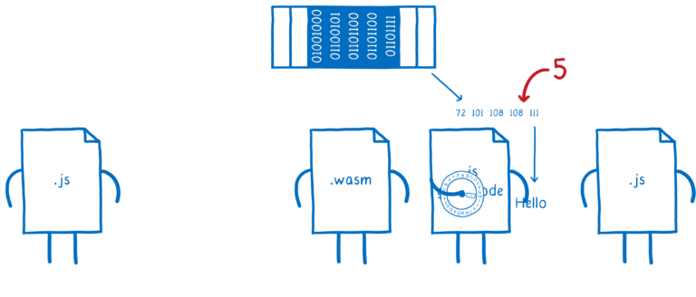


因此，一侧的JS胶水代码只是翻转了它在另一侧所做的工作。很多工作花费在重建基本相同的对象上。

如果字符串只是直接通过WebAssembly透传而没有任何转换，那将更容易。

WebAssembly将无法对此字符串执行任何操作 - 它无法理解该类型。我们不会解决这个问题。

但它可以在两个JS函数之间来回传递字符串对象，因为它们理解类型。

因此，这是[WebAssembly引用类型提议](https://github.com/WebAssembly/reference-types/blob/master/proposals/reference-types/Overview.md#language-extensions)的原因之一。该提议添加了一个名为 `anyref` 的新的基本WebAssembly类型。

使用`anyref`，JavaScript只为WebAssembly提供了一个引用对象（基本上是一个不会泄露内存地址的指针）。此引用指向JS堆上的对象。然后WebAssembly可以将它传递给其他JS函数，这些函数确切地知道如何使用它。

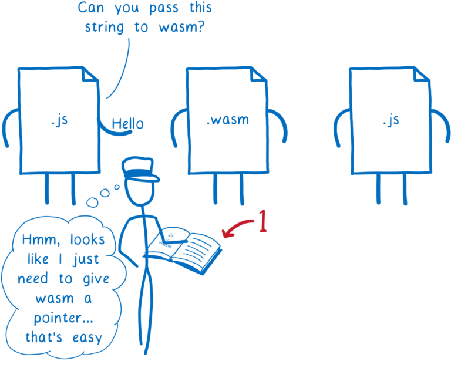

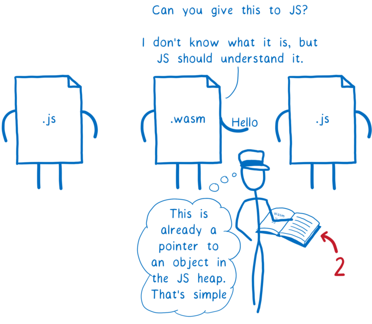

因此，这解决了和JavaScript互操作中最烦人的问题之一。但这不是浏览器中唯一要解决的互操作性问题。

浏览器中还有另一组更大的类型。如果我们要获得良好的性能，WebAssembly需要能够与这些类型进行互操作。

## WebAssembly直接与浏览器通信

JS只是浏览器的一部分。浏览器还有许多其他功能，称为Web API，您可以使用它们。

在幕后，这些Web API函数通常用C++或Rust编写。他们有自己将对象存储在内存中的方式。

Web API的参数和返回值可以是许多不同的类型。很难为这些类型中的每一种手动创建映射。因此，为简化起见，有一种标准的方式来讨论这些类型的结构 - [Web IDL](https://developer.mozilla.org/en-US/docs/Mozilla/WebIDL_bindings)。

当您使用这些功能时，通常是通过使用JavaScript。这意味着您传递的是使用JS类型的值。如何将JS类型转换为Web IDL类型？

就像存在从WebAssembly类型到JavaScript类型的映射一样，也存在从JavaScript类型到Web IDL类型的映射。

所以它就像引擎有另一本参考书，展示了如何从JS到Web IDL。此映射也在引擎中进行了硬编码。

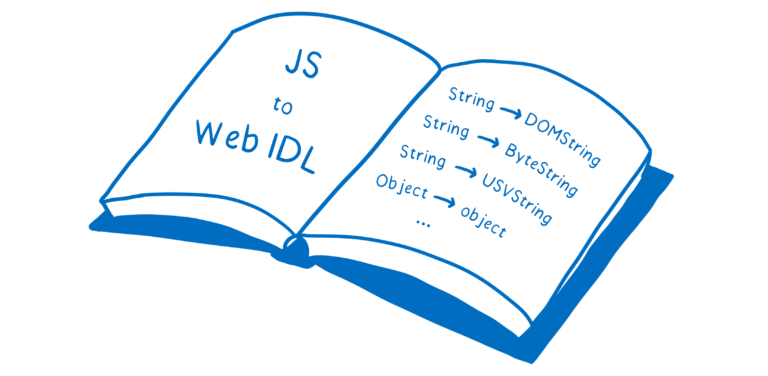

对于许多类型，JavaScript和Web IDL之间的映射是非常直白的。例如，DOMString和JS的String等类型是兼容的，可以直接相互映射。

现在，当您尝试从WebAssembly调用Web API时会发生什么？这是我们遇到问题的地方。

目前，WebAssembly类型和Web IDL类型之间没有映射。这意味着，即使是像数字这样的简单类型，您的调用也必须通过JavaScript。

这是具体工作的方式：

1. WebAssembly将值传递给JS。
2. 在此过程中，引擎将此值转换为JavaScript类型，并将其放入内存中的JS堆中
3. 然后，将该JS值传递给Web API函数。在此过程中，引擎将JS值转换为Web IDL类型，并将其放入内存的不同部分，即渲染器的堆。

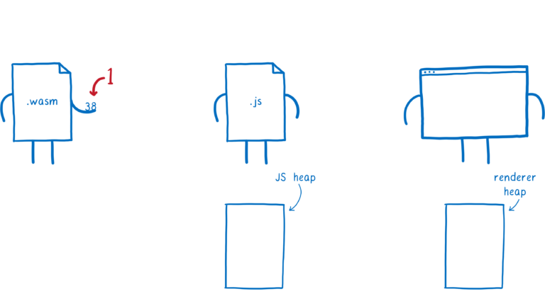

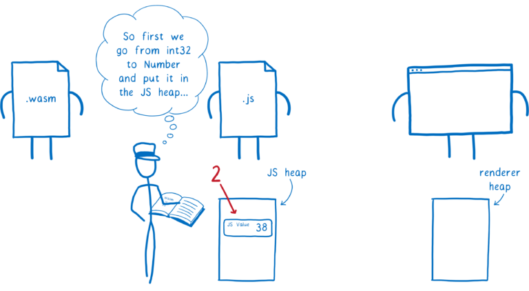

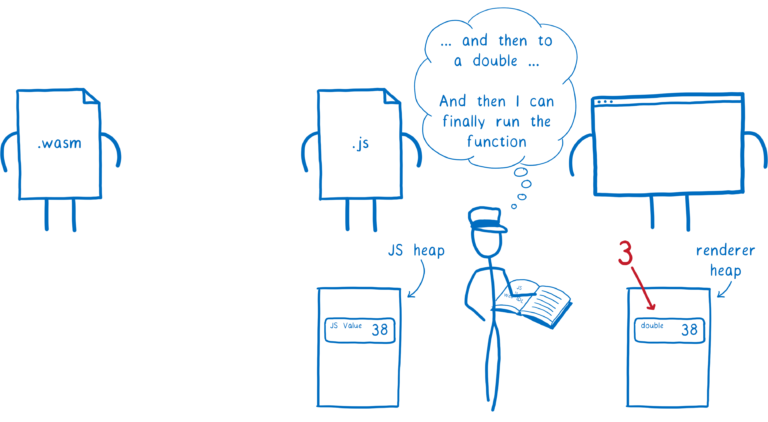

这需要更多的工作，并且还会占用更多内存。

有一个明显的解决方案 -创建从WebAssembly到Web IDL的直接映射。但这并不像看起来那么简单。

对于像`boolean`和`unsigned long`（这是一个数字）的简单Web IDL类型，从WebAssembly到Web IDL有明确的映射。

但在大多数情况下，Web API参数是更复杂的类型。例如，API可能需要一个字典，它基本上是一个具有属性或序列（就像一个数组的）对象。

要在WebAssembly类型和Web IDL类型之间进行直接映射，我们需要添加一些更高级别的类型。我们正在这样做 - [GC提案](https://github.com/WebAssembly/gc)。有了它，WebAssembly模块将能够创建GC对象 - 例如结构和数组 - 可以映射到复杂的Web IDL类型。

但是，如果与Web API进行互操作的唯一方法是通过GC对象，那么对于像C++和Rust这样不会使用GC对象的语言来说，这会更加艰难。只要代码与Web API交互，就必须创建一个新的GC对象，并将值从其线性内存复制到该对象中。

这只比我们今天的JS胶水代码略胜一筹。

我们不希望JS胶水代码必须构建GC对象 - 这是浪费时间和空间。出于同样的原因，我们也不希望WebAssembly模块这样做。

我们希望使用线性内存（如Rust和C ++）的语言能够像使用引擎内置GC的语言一样调用Web API。因此，我们需要一种方法来创建线性内存中的对象和Web IDL类型之间的映射。

但是这里有一个问题。这些语言中的每一种都以不同方式表示线性内存中的东西。我们不能只选择一种语言的表示。这将使所有其他语言效率降低。

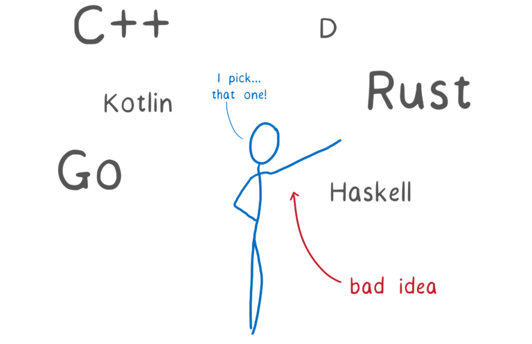

但内存中针对这些东西的确切布局通常是不同的，也有一些已经通用的抽象概念。

例如，对于字符串，语言通常有一个指向内存中字符串开头的指针，以及字符串的长度。即使字符串具有更复杂的内部表示，通常也需要在调用外部API时将字符串转换为此格式。

这意味着我们可以将此字符串缩减为WebAssembly可以理解的类型...两个i32。

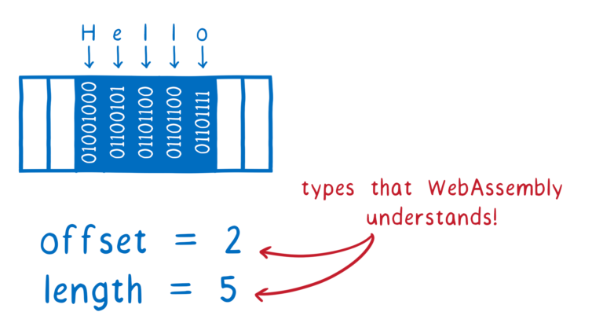

我们可以在引擎中硬编码这样的映射。因此引擎将有另一本参考书，这次是针对WebAssembly的Web IDL映射。

但这里有一个问题。WebAssembly是一种类型检查的语言。为了保证[安全](https://webassembly.org/docs/security/)，引擎必须检查调用代码是否传递了与被调用者要求的类型相匹配的类型。

这是因为攻击者有办法利用类型不匹配从而让引擎做不应该做的事情。

如果你正在使用字符串调用东西，但是你试图将函数传递给整数，引擎会抗议。它也应该抗议。


所以我们需要一种方法让模块明确地告诉引擎，类似这样：“我知道 Document.createElement() 接受一个字符串。但是当我调用它时，我将传递两个整数。使用他们从我的线性内存中的数据创建DOMString。使用第一个整数作为字符串的起始地址，第二个整数作为长度。“

这就是Web IDL提案的作用。它为WebAssembly模块提供了一种在它使用的类型和Web IDL类型之间进行映射的方法。

这些映射在引擎中没有硬编码。相反，一个模块带有自己的映射小册子。


因此，这为引擎提供了一种方式来表述：“对于此函数，进行类型检查，就好像这两个整数是一个字符串一样。”

不过，这本模块附带的小册子事实是有用的，是因为另一个原因。

有时，通常将其字符串存储在线性内存中的模块希望在特定情况下使用 `anyref` 或者GC类型...例如，如果模块只是传递从JS函数获得的对象到Web API，如DOM节点。

因此，模块需要能够逐个函数（甚至逐个参数）地选择，以便获知如何处理不同的类型。由于映射是由模块提供的，因此可以为该模块定制。


你怎么生成这本小册子？

编译器会为您处理这些信息。它为WebAssembly模块添加了一个自定义部分。因此对于许多语言工具链，程序员不需要做太多工作。

例如，让我们看一下Rust工具链如何处理最简单的一种情况：将字符串传递给`alert`函数。

```rust
#[wasm_bindgen]
extern "C" {
    fn alert(s: &str);
}
```

程序员只需告诉编译器使用`#[wasm_bindgen]` 注解将此函数包含在小册子中。默认情况下，编译器会将其视为线性内存字符串，并为我们添加正确的映射。如果我们需要以不同的方式处理它（例如，作为`anyref`），我们必须使用第二个注解告诉编译器。

因此，我们可以在中间剔除JS。这使得在WebAssembly和Web API之间传递值更快。此外，这意味着我们不需要运送太多的JS。

而且我们不必对我们支持的语言做出任何妥协。可以将所有不同类型的语言编译为WebAssembly。这些语言都可以将它们的类型映射到Web IDL类型 - 无论语言是使用线性内存还是GC对象，还是两者都使用。

一旦我们退后一步看看这个解决方案，我们意识到它解决了一个更大的问题。

## WebAssembly与所有事物对话

这是我们回到介绍中的承诺的地方。

有没有一种可行的方法让WebAssembly使用不同类型的系统与不同的东西对话？

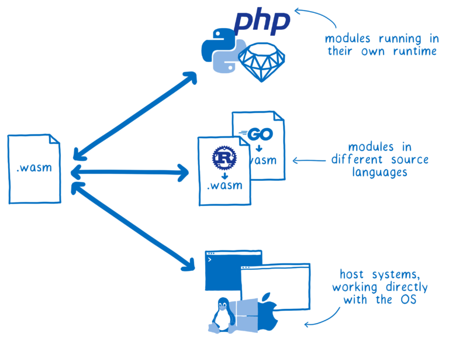

我们来看看有什么可选的方案。

您*可以*尝试创建在引擎中硬编码的映射，例如WebAssembly到JS和JS到Web IDL。

但要做到这一点，对于每种语言，您必须创建一个特定的映射。并且引擎必须明确支持这些映射中的每一个，并在任何一方的语言发生变化时更新它们。这会造成真正的混乱。

这就是早期编译器的设计方式。从每种源语言到每种机器代码语言都有一个管道。我[在WebAssembly上的第一篇文章中](https://hacks.mozilla.org/2017/02/a-cartoon-intro-to-webassembly/)对此进行了更多的讨论。

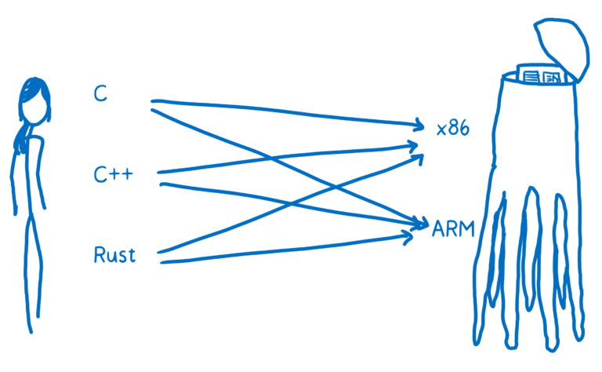

我们不想要这么复杂的东西。我们希望所有这些不同的语言和平台能够相互通信。但我们也需要它可扩展。

所以我们需要一种不同的方式来做到这一点...更像现代编译器架构。它们在前端和后端之间分离。前端从源语言到抽象中间表示（intermediate representation/IR）。后端从IR到目标机器代码。

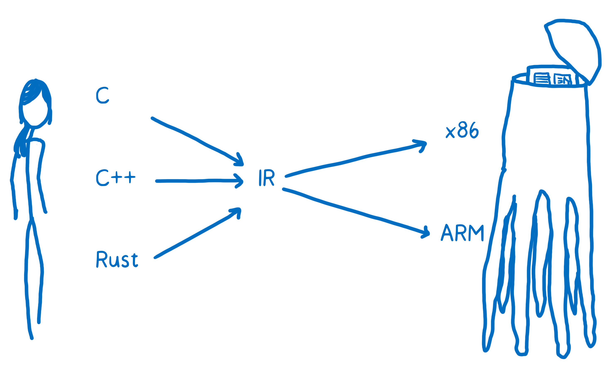

这就是来自Web IDL的洞察力所在。注意看，Web IDL很像一个IR。

现在，Web IDL非常适合Web。而有很多Web外的WebAssembly用例。因此，Web IDL本身并不是一个很好的IR。

但是，如果您只是使用Web IDL作为灵感并创建一组新的抽象类型呢？

这就是我们提出WebAssembly接口类型提议的由来。

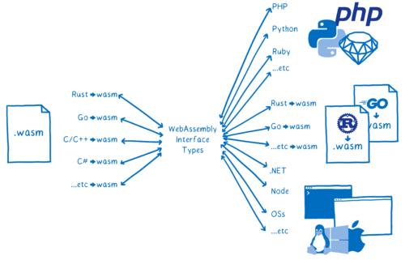

这些类型不是具体类型。他们不像今天WebAssembly中的 `int32` 或 `float64` 类型。WebAssembly中没有对它们进行任何操作。

例如，WebAssembly中不会添加任何字符串连接操作。相反，所有操作都在两端的具体类型上执行。

有一个可以实现这一点的关键点：对于接口类型，双方并不试图共享表示。相反，默认是在一侧和另一侧之间复制值。

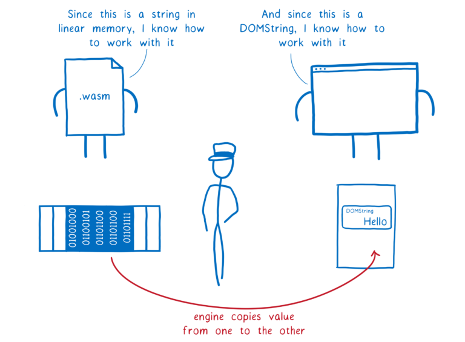

有一种情况似乎是这条规则的例外：我之前提到的新参考值（如`anyref`）。在这种情况下，在两侧之间复制的是指向对象的指针。所以两个指针指向同一个东西。理论上，这可能意味着他们需要共享一个表示。

如果引用只是在WebAssembly模块中透传（就像我上面给出的示例 `anyref`），双方仍然不需要共享表示。无论如何，模块不会理解该类型......只需将其传递给其他函数即可。

但有时双方都希望共享表示。例如，GC提案添加了一种[创建类型定义](https://github.com/WebAssembly/gc/blob/master/proposals/gc/MVP-JS.md#type-definition-objects)的方法，以便双方可以共享表示。在这些情况下，选择共享多少表示取决于设计API的开发人员。

这使得单个模块与许多不同语言对话变得容易得多。

在某些情况下，如浏览器，从接口类型到主机的具体类型的映射将被引入引擎。

因此，一组映射在编译时完成，另一组映射在加载时被传递给引擎。


但在其他情况下，比如当两个WebAssembly模块相互通信时，它们都会发送自己的小册子。它们每个都将它们的函数类型映射到抽象类型。


要使用不同源语言编写的模块能够相互通信，这不是唯一需要的内容（我们将来会对此进行更多详细介绍），但这是朝这个方向迈出的一大步。

所以现在你明白了为什么，让我们来看看如何。

## 这些接口类型实际上是什么样的？

在我们审视细节之前，我要再说一遍：这个提案仍在制定之中。因此，最终提案可能看起来非常不同。


此外，这完全由编译器处理。因此，即使提案最终确定，您也只需要知道工具链希望在代码中添加哪些注解（例如上面的wasm-bindgen示例）。你真的不需要知道这一切是如何运作的。

不过该 [提案的细节](https://github.com/WebAssembly/interface-types/blob/master/proposals/interface-types/Explainer.md) 非常简洁，所以让我们深入了解当前的想法。

### 要解决的问题

我们需要解决的问题是当模块与另一个模块（或直接与主机，如浏览器）通信时，在不同类型之间转换值。

我们可能需要四个地方进行转换：

**用于导出的函数**

- 接受来自调用者的参数
- 将值返回给调用者

**用于导入功能**

- 将参数传递给函数
- 接受函数的返回值

你可以考虑将这些方面分为两个方向：

- 上升，用于离开模块的值。它们从具体类型变为接口类型。
- 下沉，进入模块的值。它们从接口类型变为具体类型。

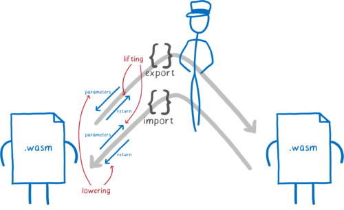

### 告诉引擎如何在具体类型和接口类型之间进行转换

因此，我们需要一种方法来告诉引擎哪些转换可以应用于函数的参数和返回值。我们如何做到这一点？

通过定义接口适配器。

例如，假设我们有一个编译为WebAssembly的Rust模块。它导出一个`greeting_` 函数，这个函数可以在没有任何参数的情况下调用并返回问候语。

就是这个样子（WebAssembly文本格式）。

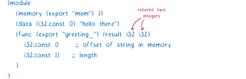

现在这个函数返回两个整数。

但我们希望它返回`string`接口类型。所以我们添加一个称为接口适配器的东西

如果引擎理解接口类型，那么当它看到此接口适配器时，它将使用此接口包装原始模块。

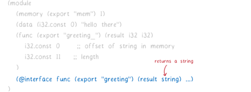

它将不再导出该`greeting_`函数...而是包裹了原始函数的 `greeting`函数。这个新`greeting`函数返回一个字符串，而不是两个数字。

这提供了向后兼容性，因为不理解接口类型的引擎将只导出原始`greeting_`函数（返回两个整数的函数）。

接口适配器如何告诉引擎将两个整数转换为字符串？

它使用一系列适配器指令。

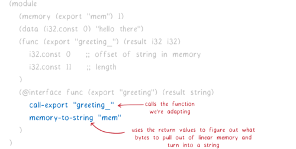

上面的适配器指令是提案指定的一小组新指令中的两个。

以下是对上述代码的说明：

1. 使用`call-export`适配器指令调用原始`greeting_`函数。这是原始模块导出的，返回两个数字。这些数字放在堆栈上。
2. 使用`memory-to-string`适配器指令将数字转换为组成字符串的字节序列。我们必须在这里指定“mem”，因为WebAssembly模块有一天会有多个内存。这告诉引擎要查看哪个内存。然后引擎从堆栈顶部获取两个整数（指针和长度）并使用它们来确定要使用的字节。

这可能看起来像一个成熟的编程语言。但是这里没有控制流 - 没有循环或分支。因此，即使我们提供引擎指令，它仍然是声明性的。

如果我们的函数也将字符串作为参数（例如，要问候的人的姓名），它会是什么样子？

非常相似。我们只需更改适配器函数的接口即可添加参数。然后我们添加两个新的适配器指令。

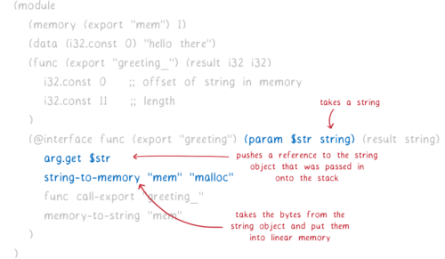

以下是这些新指令的作用：

1. 使用 `arg.get`指令获取对字符串对象的引用并将其放在堆栈中。
2. 使用该`string-to-memory`指令从该对象获取字节并将它们放入线性内存中。再次，我们必须告诉它将字节放入哪个内存。我们还必须告诉它如何分配字节。我们通过给它一个分配器函数（这将是原始模块提供的导出函数）来实现这一点。

使用这样的指令的好处是：我们可以在将来扩展它们......就像我们可以扩展WebAssembly核心中的指令一样。我们认为我们所定义的指令是一个很好的集合，但我们并不承诺这些是有史以来唯一的指导。

如果您有兴趣了解更多关于这一切是如何工作的，[解释器](https://github.com/WebAssembly/interface-types/blob/master/proposals/interface-types/Explainer.md)会更加详细。

### 将这些指令发送到引擎

现在我们如何将它发送到引擎？

这些注解会添加到二进制文件中的自定义部分。

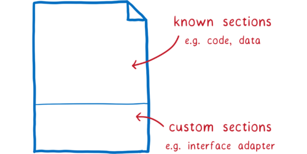

如果引擎知道接口类型，则可以使用自定义部分。如果没有，引擎可以忽略它，你可以使用polyfill读取自定义部分并创建粘合代码。

## 这与CORBA，Protocol Buffers等有什么不同？

还有其他标准，似乎也可以解决相同的问题 - 例如CORBA，Protocol Buffers和Cap'n Proto。

那些有什么不同？他们正在解决一个更难的问题。

它们都经过精心设计，以便您可以与不共享内存的系统进行交互，因为它在不同的进程中运行，或者因为它位于网络上完全不同的计算机上。

这意味着您必须能够在中间发送事物 - 跨越该边界的对象的“中间表示”。

因此，这些标准需要定义可以有效跨越边界的序列化格式。这是他们标准化的重要组成部分。


这看起来像一个类似的问题，它实际上完全不一样。

对于接口类型，这个“IR”从来不需要离开引擎。模块本身甚至都看不到它。

模块只能看到引擎在过程结束时为它们突出的内容 - 将哪些内容复制到线性内存中或作为引用给出。因此，我们不必告诉引擎为这些类型提供哪种布局 - 不需要指定。

需要指定的是，和引擎对话的方式。这是发送到引擎的手册的声明性语言。


这有一个很好的边际效应：因为这是声明性的，引擎可以看到何时不需要转换 - 例如两边的两个模块使用相同的类型 - 并完全跳过转换工作。

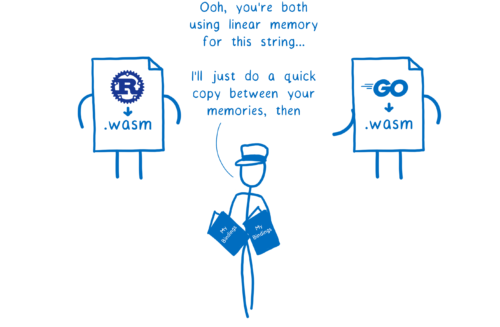

## 今天你怎么尝试这个？

正如我上面提到的，这是一个早期阶段的提案。这意味着事情会发生迅速变化，你不想在生产中依赖于此。

但是如果你想开始尝试它，我们已经在工具链中实现了这一点，从生产到消费：

- Rust工具链
- WASM-BindGen
- Wasmtime WebAssembly运行时

由于我们维护所有这些工具，并且由于我们正在制定标准本身，因此我们可以跟随标准的发展。

尽管所有这些部分都将继续改变，但我们将确保同步我们的更改。因此，只要您使用所有这些的最新版本，就不会有问题。


所以今天有很多方法可以解决这个问题。有关最新版本，请查看此[demo仓库](https://github.com/CraneStation/wasmtime-demos)。

## 谢谢

- 感谢团队，将所有这些语言和运行时间整合在一起：Alex Crichton，Yury Delendik，Nick Fitzgerald，Dan Gohman和Till Schneidereit
- 感谢提案的联合发起人及其工作与这个提案的同事：Luke Wagner，Francis McCabe，Jacob Gravelle，Alex Crichton和Nick Fitzgerald
- 感谢我的精彩合作者Luke Wagner和Till Schneidereit对本文的宝贵意见和反馈

### 译者注

简单总结，WASI 就是在使用WASM进行交互时提供的**抽象中间表示**（intermediate representation/IR）：


然后通过接口适配器来告诉引擎进行转换，以处理函数的参数和返回值，从而实现跨语言使用复杂类型的交互。