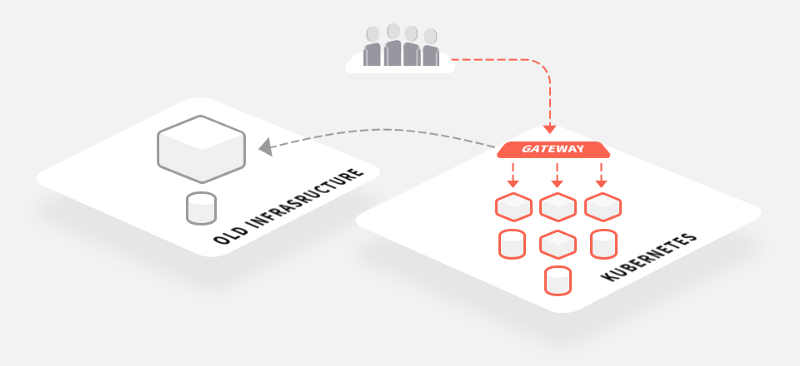
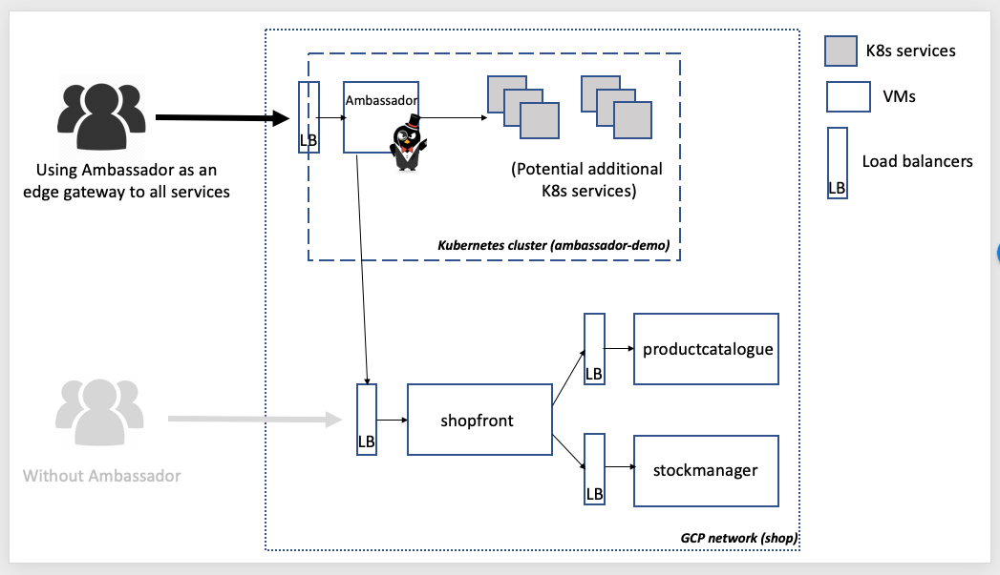
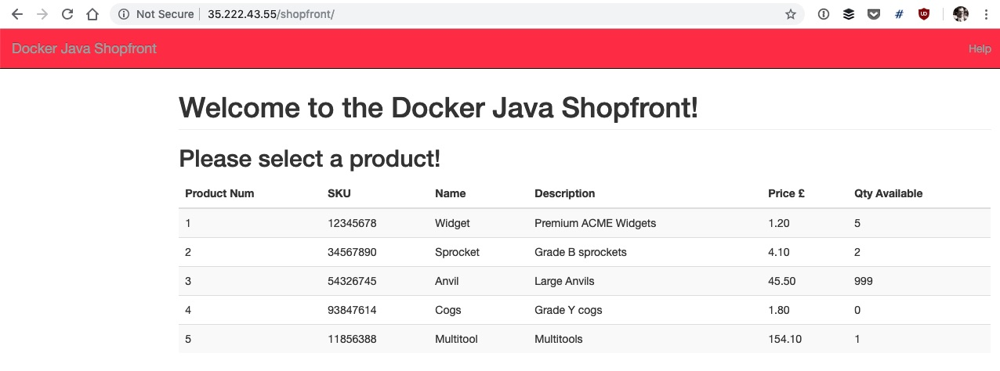

+++
title = "[译] 从VM到Kubernetes的渐进式应用迁移(1) - 跨平台和云路由流量"

date = 2020-01-26
lastmod = 2020-01-26
draft = false

tags = ["Integration"]
summary = "使用Ambassador API Gateway和Consul在多个平台和基础设施之间路由流量。"
abstract = "使用Ambassador API Gateway和Consul在多个平台和基础设施之间路由流量。"

[header]
image = ""
caption = ""

+++

英文原文来自 [Part 1: Incremental App Migration from VMs to Kubernetes — Routing Traffic Across Platforms & Clouds](https://blog.getambassador.io/routing-in-a-multi-platform-data-center-from-vms-to-kubernetes-via-ambassador-47bbe658683c)，作者 [Daniel Bryant](https://blog.getambassador.io/@danielbryantuk)。

> 备注：快速翻译（机翻+人工校对，没有精修），质量不高，一般阅读可以，不适合传播，谢绝转载。

------


在 [Datawire](https://www.datawire.io/) 上，我们看到越来越多的组织正在往基于 Docker 和 Kubernetes 构建的“下一代”云原生平台上迁移。但是，这种迁移不会在一夜之间发生。取而代之的是，我们看到了多平台数据中心和云环境的增长，在这里应用可以跨越虚拟机和容器。在这些数据中心中，[Ambassador API Gateway](https://www.getambassador.io/) 被用作入口（ingress）的中心点，解决 [身份验证](https://www.getambassador.io/concepts/auth-overview)，[速率限制](https://www.getambassador.io/user-guide/rate-limiting)和其他跨域运维问题。

本文是系列文章的第一篇，讲述在将应用逐步迁移到Kubernetes时，如何使用 Ambassador 作为多平台入口解决方案。我们已将示例 Terraform 的代码添加到 [Ambassador Pro参考架构](https://github.com/datawire/pro-ref-arch)  的 GitHub 仓库中，该仓库支持在 Google Cloud Platform上创建多平台“沙盒”基础设施。这将允许您启动 Kubernetes 集群和多个VM，并练习将流量从 Ambassador 路由到现有应用。

## 多平台世界中的边缘路由

我之前写过有关使用 [边缘代理或网关](https://itnext.io/using-api-gateways-to-facilitate-your-transition-from-monolith-to-microservices-c08fe3489237) 的文章，帮助从单体迁移到微服务，或从本地迁移到云。Ambassador 可以充当所有类型平台的 API gateway 或边缘路由器，尽管它的设计和构建是专门在Kubernetes上运行的，但也可以简单的配置从集群到外部网络目标的流量路由，例如使用VPN的端点或虚拟私有云（VPC），云服务，云负载均衡器，或单个VM。只要具备对端点的网络访问权限，则 Ambassador 可以路由到该端点。



我们的 [Ambassador Pro参考架构](https://github.com/datawire/pro-ref-arch) GitHub 仓库包含几个提供文档和示例的文件夹，以帮助您了解如何最好地使用Ambassador 支持的所有功能，例如速率限制和分布式追踪。还有一个“cloud-infrastructure”文件夹，其中包含必要的Terraform代码和脚本，以使用Google Cloud Platform（GCP）启动示例多平台 VM / Kubernetes基础设施。生成的基础设施堆栈如下所示：



## 构建示例VM / Kubernetes平台

Ambassador 参考架构仓库中提供的 Terraformed 基础设施示例将在GCP中创建一个简单的区域网络，其中包含一个[Kubernetes（GKE）](https://cloud.google.com/kubernetes-engine/)集群和一些基于VM的服务，这些服务部署在（可公开寻址的）负载均衡器后面。部署在VM上的应用取自我的**一个非常简单**的电子商务商店的“ [Docker Java Shopping](https://github.com/danielbryantuk/oreilly-docker-java-shopping) ”示例，该应用包括两个使用 Spring Boot 的Java服务和一个使用 Dropwizard 的Java服务。

在Kubernetes集群中部署 Ambassador 可以简化整个网络的入口（ingress），还可以使工程团队集中化和标准化该网关的管理。对网络中的网关和边缘的集中运维提供了许多好处，例如“认证蔓延”的减少和规范横切面关注的能力，例如[TLS终止](https://www.getambassador.io/user-guide/tls-termination/)或穿透，基于上下文的路由（例如，使用[过滤器](https://www.getambassador.io/reference/filter-reference/)，基于HTTP标头的路由）和[速率限制](https://www.getambassador.io/user-guide/advanced-rate-limiting)。

克隆参考架构仓库后，导航至包含GCP Terraform代码的文件夹，您将找到一个[README](https://github.com/datawire/pro-ref-arch/blob/master/cloud-infrastructure/google-cloud-platform/README.md)文件，其中包含复制我们的配置所需的分步说明。请注意，如果您超出了GCP免费试用的信用额度，则拆分此基础设施将需要付费：

```
$ git clone git@github.com：datawire / pro-ref-arch.git 
$ cd pro-ref-arch / cloud-infrastructure / google-cloud-platform
```

一旦完成所有配置并`terraform apply `成功运行（可能需要花费几分钟时间），上图所示的基础设施将在您的GCP帐户中创建。您还将从Terraform的 `outputs` 中看到一些可用于配置本地`kubectl`工具以及设置Ambassador的信息。

```
...
Apply complete! Resources: 15 added, 0 changed, 0 destroyed.

Outputs:

gcloud_get_creds = gcloud container clusters get-credentials ambassador-demo --project nodal-flagstaff-XXXX --zone us-central1-f
shop_loadbalancer_ip_port = 35.192.25.31:80
shopfront_ambassador_config =
---
apiVersion: v1
kind: Service
metadata:
  name: shopfront
  annotations:
    getambassador.io/config: |
      ---
      apiVersion: ambassador/v1
      kind:  Mapping
      name:  shopfront_mapping
      prefix: /shopfront/
      service: 35.192.25.31:80
spec:
  ports:
  - name: shopfront
    port: 80
```

第一个输出，名为 `gcloud_get_creds` ，可以用来运行并配置本地 `kubectl` 来指向新的 Terraformed Kubernetes 集群。例如，从上面的输出中，我将在本地终端上运行：

```bash
$ gcloud container clusters get-credentials ambassador-demo --project nodal-flagstaff-XXXX --zone us-central1-f$ kubectl get svc

NAME         TYPE        CLUSTER-IP    EXTERNAL-IP   PORT(S)   AGE
kubernetes   ClusterIP   10.59.240.1   <none>        443/TCP   28m
```

现在，您可以按照 “ [入门指南”](https://www.getambassador.io/user-guide/getting-started/) 或自述文件中的 [快速入门](https://www.getambassador.io/user-guide/getting-started/) ，将 Ambassador 安装到集群中。网关启动并运行后，您就可以获得 Ambassador Kubernetes 服务的外部GCP负载平衡器IP，现在可以部署 Ambassador Mapping，该映射路由到Kubernetes群集之外的GCP负载平衡器。我故意使用当前的基础设施简化了[网络路由](https://cloud.google.com/vpc/docs/routes)和[防火墙规则](https://cloud.google.com/vpc/docs/firewalls)，但是本教程的后续版本将引入更具挑战性的配置。

名为 `shopfront_ambassador_config` 的 Terraform 输出提供了 Kubernetes 配置，可以将其复制粘贴到YAML文件中并应用于集群。然后，您应该能够通过 Ambassador IP和关联的映射访问运行在VM上的Shopfront服务（并与也在VM上运行的其他上游服务进行通信），例如：`http://{AMBASSADOR_LB_IP}/shopfront/`

如果一切顺利，您应该可以在浏览器中看到以下内容：



这只是未来几个月我们将介绍的一系列教程的开始。我们渴望增加更多的复杂性，例如，创建具有对等VPC和更复杂的防火墙规则的网段，并且我们还将寻求展示如何使用 Kubernetes [ExternalName](https://kubernetes.io/docs/concepts/services-networking/service/#externalname) 服务和 Consul Connect 来实现多集群服务网格，以实现完整端到端TLS。

在完成对 Terraformed 基础设施的试验之后，请不要忘记删除它并进行清理，否则您可能会面临意外的GCP发票！

```
$ terraform destroy -force
```

## 总结

本文和相关的多平台数据中心示例旨在帮助工程师将应用从VM迁移到Kubernetes集群。[Ambassador](https://www.getambassador.io/) 经常被用作整个系统的中心入口，这可以整合[身份验证](https://www.getambassador.io/concepts/auth-overview)，[速率限制](https://www.getambassador.io/user-guide/rate-limiting)和其他跨域运维问题。

我们将继续迭代示例基础结构代码，并计划支持其他云平台，例如 Digital Ocean 和 AWS。如果您对云供应商或复杂的路由方案有任何特殊要求，请与我联系。

像往常一样，您还可以通过Twitter（[@getambassadorio](https://twitter.com/getambassadorio)），[Slack](https://d6e.co/slack)或通过[GitHub](https://github.com/datawire/ambassador)提出任何问题。