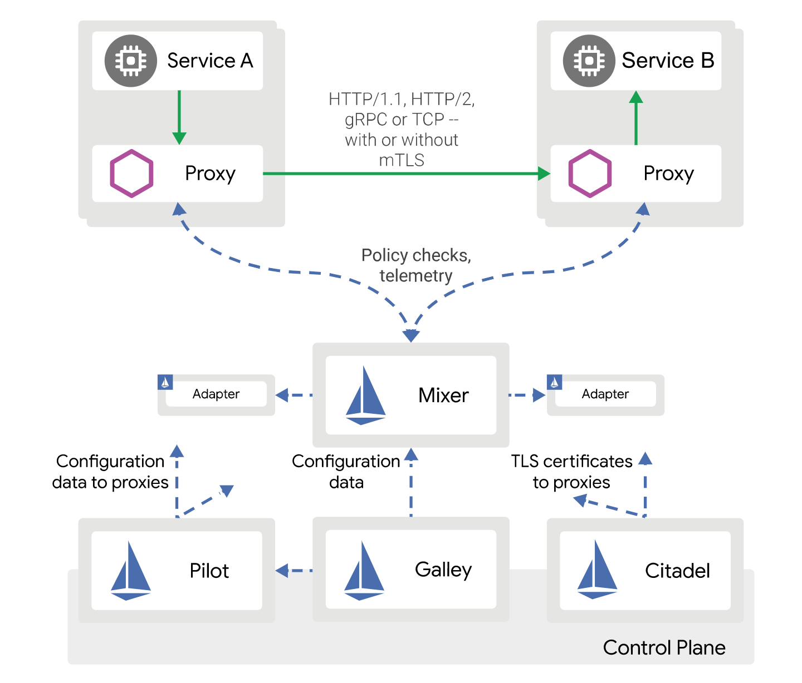

+++
title = "Istio1.5介绍(1)：控制平面合并为Istiod"

date = 2020-02-24
lastmod = 2020-02-24
draft = true

tags = ["Istio"]
summary = "控制平面合并为Istiod"
abstract = "控制平面合并为Istiod"

[header]
image = "headers/post/202001-istio1.5-istiod.jpg"
caption = ""

+++

## 什么是Istiod？

### Isito控制平面组件回顾

在介绍什么是Istiod之前，我们先来回顾一下Istio有哪些控制平面的组件，下图是大家非常熟悉的Istio的架构图：



其中 Pilot/Galley/Citadel/Mixer 组成了Istio的“控制平面”，此外还有一些组件没有在这个架构图上展示，包括WebHook（即Sidecar Injector，部署后的pod名为 istio-sidecar-injector），Node Agent，Pilot Agent。

这些组件打包为不同的二进制文件，部署时分别启动独立的进程，在k8s上部署时体现为各种pod，如 istio-system namespace下列出的：

```
$ kubectl get pods -n istio-system
NAME                                                           READY   STATUS      RESTARTS   AGE
grafana-f8467cc6-rbjlg                                         1/1     Running     0          1m
istio-citadel-78df5b548f-g5cpw                                 1/1     Running     0          1m
istio-egressgateway-78569df5c4-zwtb5                           1/1     Running     0          1m
istio-galley-74d5f764fc-q7nrk                                  1/1     Running     0          1m
istio-ingressgateway-7ddcfd665c-dmtqz                          1/1     Running     0          1m
istio-pilot-f479bbf5c-qwr28                                    1/1     Running     0          1m
istio-policy-6fccc5c868-xhblv                                  1/1     Running     2          1m
istio-sidecar-injector-78499d85b8-x44m6                        1/1     Running     0          1m
istio-telemetry-78b96c6cb6-ldm9q                               1/1     Running     2          1m
istio-tracing-69b5f778b7-s2zvw                                 1/1     Running     0          1m
kiali-99f7467dc-6rvwp                                          1/1     Running     0          1m
prometheus-67cdb66cbb-9w2hm                                    1/1     Running     0          1m
```

这些以“istio”开头的pod就对应到Istio的各种组件。在目前的Istio实现中，这些组件被特意设计成**可单独部署的单元**。

### Istiod出现的动机

但在，实际使用中，Istio的这种“拆分为多个可单独部署的单元”的设计被认为并没有体现出优势，反而增加了复杂度和维护成本。

主要原因是：

1. 在大部分场景下，所有核心组件都需要部署
2. 核心组件之间普遍有依赖关系，例如当citadel未ready时，pilot，galley等组件无法工作，而pilot又依赖galley，它们的启动顺序需要被编排
3. 每个组件都可能发生故障，组件之间的网络通信也可能发生故障，降低了可用性
4. 核心组件单独部署提高了配置的复杂度

Istiod 因此被提出，用来**简化Istio**。在 Istiod 的详细设计文档中，开篇第一句话就是：

> “Premature optimization Complexity is the root of all evil
> 
>“过早的优化，复杂性是万恶之源”

而这个设计文档的名字，叫做"Simplified Istio (istiod)"。

### Istiod的设计思路和优势

Istiod是用来简化Istio安装、部署、配置和认证的集成二进制文件。

简单说，就是将所有Istio控制平面的组件揉合成一个二进制文件 istiod ，来简化Istio的部署和可维护性。这个 istiod 二进制文件集成了原Istio控制平面核心组件的功能，包括 Pilot，Galley，WebHook （Sidecar Injector），Citadel，Node Agent，Pilot Agent等。这样仅需要运行一个 istiod 进程，就能提供原Istio控制平面的所有服务，不再需要像原来那样启动各个组件。

> 备注：注意上面没有Mixer，istiod不包含Mixer组件。这是因为在最新的Mixer v2的设计中，Mixer将合并到Envoy中去，稍后会有单独的文章详细介绍。

控制平面合并为 istiod 之后，进程内部通过代码来编排服务的启动顺序，服务之间在进程内通信。因此配置极度简化，仅剩 mesh.yaml，无需启动参数。

采用 Istiod 这种设计的好处是可以最大限度降低用户的部署成本，并且由于整个控制面仅有一个进程，用户也可以方便的进行控制平面自身的金丝雀发布等操作。

## istiod的设计

### istiod的设计目标

设计目标是简化操作以及提高使用体验，主要包括：

- 简化安装复杂性

	istiod二进制文件已经包含了核心组件的功能，各个组件之间的依赖将被封装，相应的配置项大大减少。

- 简化配置的复杂性

	原本的istio安装模式，各个模块分别负责相关的功能，由于各个模块间的交互，配置繁杂。而istiod使得系统的配置和可操作性简化，包括规范化最佳实践默认值和受支持的拓扑。

- 控制平面的可维护性

	istiod使得运行多个版本的控制平面变得简单，可以通过在workspace注入的label或者pod中的annotations来选择控制平面，这样可以做到版本控制，从而实现控制平面自身的金丝雀发布等特性。

- 问题诊断

	运行更少的模块，更少的模块间调试使得问题更容易发现

- 消除不必要的耦合

	将envoy bootstrap移到控制平面，避免访问代理或者中心配置

- 平滑过渡

	istiod的提出并不严格要求去除目前存在的 istio 部署模式，但是如果不能对其保留提出强烈的论据，则应将其去除。因为为最终用户和开发人员支持多个解决方案选项的成本非常高：
	
	* values.yaml和helm模板中当前支持的选项的复杂性，这些是用于支持控制平面的部署和协调。
	* 现有升级过程的复杂性以及难以交付的金丝雀功能。
	* 在安装和操作设计过程中难以解决配置拓扑选择。

	预计需要进行大量更改，因此无法快速完成向istiod的过渡（在采纳，测试，文档编写方面），但istiod的价值主张足够高，因此该项目应成为Istio路线图上的优先事项。迁移到isidod应该不需要停机，并且应该是渐进的，用户能够将常规istio和istiod一起运行，将工作负载转移到isidod。
	
	尝试最小化istiod支持的配置范围，以使用稳定的功能和最佳实践。 为了加快交付，在istiod的早期阶段不支持实验性或未使用的功能。 随着istiod的成熟，可能会弃用或选择以其他方式支持它们。例如pilot中的consul adapter仍处于实验阶段，这并不会构建到istiod中去，而可能使用一个MCP producer来替代它。另外一个例子，Citadel将secrets保存到其他namespaces的功能已被SDS弃用，istiod也会follow，不会再启用该功能。

- 实例运行

	理想状况下，使用 `./istiod`（不带参数）就可以运行istiod来启动一个完整的控制平面实例。使用 `./istio-agent` 可以为istiod启动一个本地代理，istio-agent可以作为控制平面的缓存，甚至使用本地文件代理控制平面。


### 功能划分

设计上希望只有一个二进制文件(即istiod)，但考虑到部署规模带来的影响，还是为sidecar侧精简出一个名为 istio-agent 的二进制文件。

> 备注：后续也可能根据实际情况精简出其他二进制文件，例如对于vm场景可能提供去除k8s依赖的 istiod


## 附录：提案历史记录

### 首次提出提案

在2019年11月7日的Istio Networking WorkGroup的会议上，第一次对非正式的提案 “使用istiod替代pilot” 进行了讨论。具体见 [Istio Networking WorkGroup的Meeting Notes](https://docs.google.com/document/d/1xHy2jQ8oiwMponMVY2zJr2eUAmHW_Hi9JK42a7cg5Pc/) 中 "November 7th, 2119 (Control Plane, The Far  Future)" 一节：

```
"[John] Discuss informal proposal to [replace Pilot with istiod](https://docs.google.com/document/d/1jO2oM9zdm9h7tUqOpnAG3dh1xavtW1L7zQ5LyraYRAs/)?"
```

计划以增量方式来推进 istiod 整合方案，建议的合并顺序是: Sidecar injector，Galley，Citadel。Istiod计划在1.5版本中提供并作为默认安装方式，现有客户可以逐渐将组件迁移到Istiod。

> 备注：关于这个消息，我们在11月14号的[“云原生生态周报第27期”](https://www.infoq.cn/article/JzpDbpiUEl1IRm3XdEqt)中进行了报道。欢迎关注“云原生生态周报“，获取最新的云原生动态信息。

### 提案正式确认

在2019年12月5号的Istio Networking WorkGroup的会议上，这个提案被作为确认，正式承诺将istiod作为isito 1.5的新特性：

```
"Committed: Replace Pilot with Istiod (aka Portly Pilot)."
```