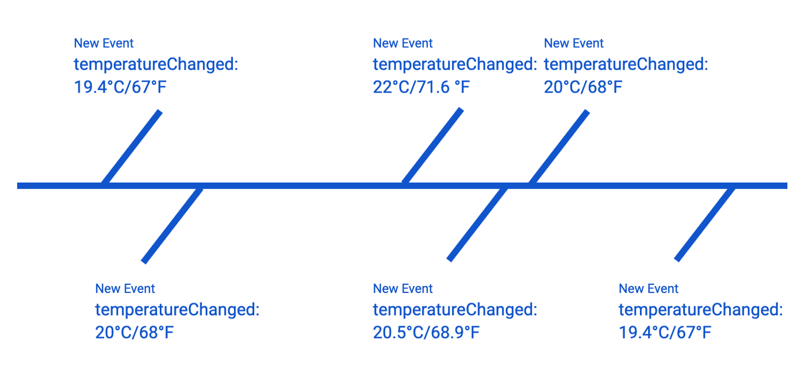
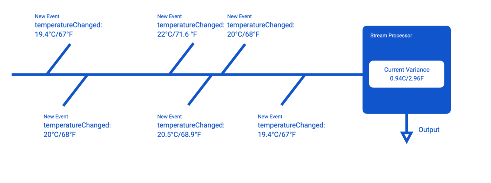
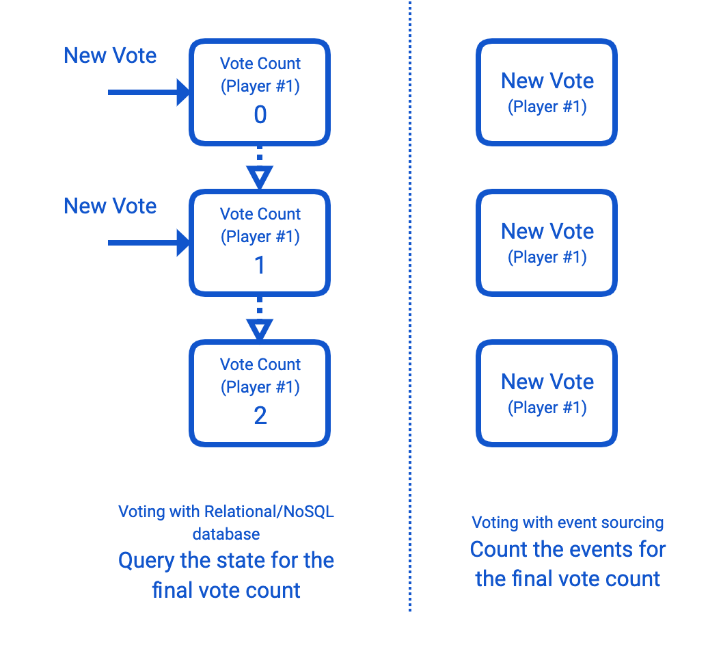

+++
title = "[译] 构建事件驱动的云应用和服务"

date = 2020-04-06
lastmod = 2020-04-06
draft = false

tags = ["Istio"]
summary = "本文讨论构建事件驱动的应用和服务的通用实践和技术，这是 《构建事件驱动的云应用和服务》 系列教程的第一篇。"
abstract = "本文讨论构建事件驱动的应用和服务的通用实践和技术，这是 《构建事件驱动的云应用和服务》 系列教程的第一篇。"

[header]
image = "headers/post/202004-microservices-choreography-vs-orchestration.jpg"
caption = ""

+++

英文原文来自 [Building Event-Driven Cloud Applications and Services](https://medium.com/google-cloud/building-event-driven-cloud-applications-and-services-ad0b5b970036)，作者 [Ratros Y.](https://medium.com/@ratrosy)，文章发表于2019年9月。 

------

本文讨论了构建事件驱动的应用和服务的通用实践和技术。它是 [《构建事件驱动的云应用和服务》](https://medium.com/@ratrosy/building-event-driven-cloud-applications-and-services-ad0b5b970036) 系列教程的开篇。

## 追求建立可重用和可增长的系统

每个开发者在编写代码时都会考虑到一些显式和隐式假设。我们最常见的一个假设是，计算设备总是按顺序执行我们的代码。每一行代码都命令执行其逻辑上的下一个，它可以是本身（递归）、同一包中的另一个函数，也可以是互联网上的一个远程过程（RPC/RESTful API调用）。执行路径本身本质上是一个水晶化的契约：在编译和部署之后，它不能被修改。

相对而言，在小范围内，顺序执行假设有助于写出简单、直接、易懂的代码。然而，随着代码库越来越大，增加了数百甚至上千种功能，执行路径本身就不可避免地会变成一个迷宫。伟大的设计模式、软件工程原则和最佳实践可能会暂时解决这个挑战，但危险仍然潜伏着；随着技术债务的积累，它将会进行反击。

基于HTTP RESTful/RPC的微服务架构解决了这一担忧，它迫使开发人员针对远程服务的接口进行编程，而不是本地实现，其核心是可重用的面向对象设计的第一个原则的自然延伸。

> **Program to an interface, not an implementation.**
>
> Design Patterns: Elements of Reusable Object-Oriented Software (1994)

然而，缺点是引入了服务之间的依赖关系，这是一个可以管理的副作用，开发人员可以也不得不忍受的副作用。执行路径依然存在；相反，这种模式有助于大大减少一个人或团队管理的代码量，并将一些责任以一种高度规范的方式卸载给其他服务。这带来了一系列新的挑战，这些挑战是基于 HTTP RESTful/gRPC 的微服务架构的从业者所独有的；我们在这里不讨论这些挑战，因为它们显然不在本系列教程的范围之内。

另一方面，事件驱动架构试图通过一劳永逸地摆脱执行路径来解决这个问题。在事件驱动的app中，逻辑块的代码在完成时发出事件，这是一个带有上下文数据的消息块，而不是协调另一个块代码的执行。事实上，事件的发布者几乎不关心下一步会发生什么；下面的操作由消息机制来决定，通常是消息队列/流的解决方案。消息机制将事件（几乎）同时从发布者传递给0个或更多的订阅者，在这里，事件被单独处理。

> The key in making great and growable systems is much more to design how its modules communicate rather than what their internal properties and behaviors should be.
> 
> 构建伟大的、可增长的系统的关键在于设计其模块如何通信，而不是设计其内部的属性和行为应该是什么。
>
> Alan Kay

与基于 HTTP RESTful/RPC 的微服务架构不同，事件驱动的系统在各部分之间没有依赖关系，也没有编程接口。诚然，发布者和订阅者仍然必须在一定程度上尊重事件的预设模式；然而，契约是相当灵活的：正如前面所解释的那样，发布者几乎不知道订阅者是否使用发布的事件，也不知道订阅者是如何使用发布的事件。没有了执行路径，应用程序和服务的可扩展性就会成倍增长：你可以随时添加或删除代码块，以订阅者的形式；同一事件流的订阅者在默认情况下同时工作，不会以任何方式相互干扰。

而这并不是事件驱动架构的唯一好处。通过作为中间人的消息队列，你的应用和服务被赋予了前所未有的可扩展性：像Google Cloud Pub/Sub和Apache Kafka这样的解决方案，如果配置得当，可以在短时间内预留并在之后分发海量的数据，延迟可以忽略不计。许多消息队列也能够自适应；它们与订阅者同步工作，并尽最大努力不让订阅者不堪重负。在当今世界上，越来越多的企业都是以实时数据为基础运行的，这种质量是非常重要的：随着数十亿设备的相互通信，应用和服务必须变得超级弹性。

> 注意
>
> 诚然，单体和基于  HTTP RESTful/RPC 的微服务系统在合适的平台（如 Kubernetes/Google Kubernetes Engine）下也可以扩展。然而，在执行路径的作用下，每个函数调用、RPC调用和/或HTTP请求都意味着（立即）执行另一个（可能是远程的）代码块；调用和请求本身也会占用资源，而且不能批量化。一般来说，基于 HTTP RESTful/RPC 的微服务应该只在必要的时候才会互相通信；健谈式服务是这个架构中一个臭名昭著的反模式。

本系列教程将详细讨论事件驱动架构的优点，当然也有其缺点，以及开发人员用来构建自己的事件驱动系统的常用模式和实践。

## 什么是事件驱动？

### 事件

事件无非就是一份数据。更具体地说，它是一个不可变的小段数据，记录了系统在特定时间内的特定行为；常见的例子包括你的恒温器检测到房间的温度变化，或者顾客在购物车中添加了一个新的商品。通过读取系统的事件流（序列），可以轻松地重建系统的运行历史。

一般来说，事件的格式是由开发者自己决定的。云原生计算基金会现在正在创建一个描述事件的标准化规范，即CloudEvents，现在很多云服务提供商都计划支持这种格式。本系列教程自始至终都使用了0.3版本的CloudEvents规范；强烈建议您在事件驱动的应用和服务中也使用此规范。

另外，为了简单起见，本系列教程尽可能使用实验项目 CloudEvents Generator 来生成和消费事件。请注意，你也可以使用你喜欢的编程语言的内存内结构自己构建标准的CloudEvents。

### 事件驱动

事件驱动是一个松散定义的术语，它的用法因开发者而异。可以说，任何使用事件发布者/订阅者范式（有时也称为通知范式）的系统都可以被认为是事件驱动的系统。根据事件集成到系统中的程度，事件驱动系统大致可以分为两类：反应式（reactive）和流处理（stream processing ）式。

### 反应式事件驱动系统

在一个反应式事件驱动的系统中，事件本质上是不带同步性的函数调用（或HTTP RESTful/RPC调用）。发布者发出一个事件，实际上是在发布者无感知的情况下触发了订阅者的动作。例如，航班预订服务可能会在客户预订航班时，设置其API后台发出 `orderCreated` 事件；消息队列将该事件传递给订阅者服务，后者处理该事件，联系航空公司预订机票，并向客户的信用卡收费。

有人可能会认为这是一种表面上采用事件的方式（被动式的函数调用）；但是，反应式的事件驱动系统仍然可以享受到架构的诸多好处：

- 由于订阅者服务承担了订票和支付处理的责任，API后台可以更快地响应，在 orderCreated 事件发出后，立即告诉客户系统正在处理订单，随后通知客户处理结果。
- 团队现在可以分别在API后台、票务预订功能和支付处理功能上进行工作，没有耦合的烦恼。
- 系统现在对节假日期间的流量波峰有了更多的准备。当订阅者服务不堪重负时，消息队列会自动扣留 OrderCreated 事件；有些解决方案甚至可以通过适当的配置自动重试暂时失败的预订和支付。

### 流处理事件驱动应用

具有流处理功能的事件驱动系统以更密集的、面向数据的方式使用事件。在这种模式下，事件的订阅者通常是流处理器，它从事件流中提取状态，并将状态传递给相关方。这类系统通常由数据流解决方案支持，如Apache Flink、Apache Spark和Cloud Dataflow等。如果有帮助的话，可以设想利用物联网设备监控区域内的温度方差的系统：每隔一秒钟，该区域周围的恒温器就会通过消息队列以事件的形式向服务报告他们的读数，每个事件包括一个特定时间的温度数据点；服务在设定的时间窗口中（例如每15秒一次）收集所有的事件，并使用流处理器计算出数据的统计方差（状态）；然后服务将状态传递给另一个系统（例如控制面板），以便进一步检查。

事件驱动的流处理系统是近年来行业内普遍采用的。社交网络使用它来计算喜好、页面浏览量、收听量等，而云服务提供商则将其用于欺诈/滥用检测。这种模式也是许多实时数据分析应用和数据转换管道的基础。

### Event Sourcing和CQRS

事件源是事件驱动系统中常见的另一个名词。这个名词可能会让人有点混淆，它实际上是一种数据持久化模式，而不是事件驱动系统的设计模式。你可能会认为它是关系型（SQL）数据库和NoSQL数据库的替代品。这个模式的设计理念或许可以用一个例子来解释。

设想一下，你正在为世界著名的电视节目《So You Think You Can Code》构建一个电子投票系统。投票系统从本质上来说是一个写密集型的系统：计数只在最后才是重要的，但人们一直在提交他们的投票。因此，如果你使用关系型（SQL）数据库作为数据库的后台，很容易让人应接不暇，因为每一次投票都需要更新一个表，锁住一行，然后再释放。然而，使用Event Sourcing，接受投票只需要在事件日志中做一次插入，因为每个投票（事件）都是不可更改的，所以不需要锁定。当你需要最后的计数时，只需简单地读取记录的事件序列，然后把投票数加起来就可以了。

Event Sourcing 的特性使其成为事件驱动系统中数据持久化的天然选择。然而，Event Sourcing并不是唯一的选择，许多反应式事件驱动系统，例如，仍然使用关系型（SQL）/NOSQL数据库作为存储。

当人们谈论Event Sourcing时，你可能也会听到CQRS（Command Query Responsibility Segregation）这个词。简单的说，在Event Sourcing系统中，CQRS有助于在事件序列上创建一个物化的视图，这样你就可以像使用普通的DBMS一样查询数据，省去了每次需要状态时自己扫描事件和计算数字的麻烦。这种设计并不排斥Event Sourcing，它的核心只是说明，可以使用不同的模型来更新信息，而不是你用来读取信息的模型。

本系列教程不会讨论太多的事件源或CQRS，因为它们不是事件驱动系统的一个组成部分。如果你有兴趣，可以参考Martin Fowler撰写的这些博文（Event Sourcing，CQRS）。

### 事件驱动系统和serverless计算

事件驱动架构是serverless计算平台的天然盟友，尤其是FaaS(Function as a Service)架构。这种架构和解决方案有很多共同的特点：都是以解耦系统和可扩展性为设计理念。许多serverless计算平台也采用了按使用收费的定价模式，这与发布者/用户模式非常吻合。其中一些平台，如Cloud Functions，甚至内置了与消息队列解决方案的集成（本例中，Cloud Pub/Sub）。

本教程在演示中使用了一些serverless计算解决方案。不过，在你的生产型APP和服务中，在选择serverless作为运行用户的平台之前，需要谨慎一些：除了技术上的限制（冷启动时间、运行时间限制、延迟等）之外，构建、测试、部署和管理serverless代码本身就是一个挑战。

作为一个侧面说明，许多serverless计算解决方案是无状态的，这使得在其上运行分组操作（或一般的流处理）相当困难。你可以添加一个数据持久化层来解决这个问题，但它可能会变得相当昂贵，而且难以构建/维护。从经验上说，在反应式事件驱动系统中使用它们比在流处理系统中使用它们更好，也更容易。

### 要不要走事件驱动？

到目前为止，我们已经说了很多关于事件驱动系统的好话。可悲的是，就像计算机科学领域的许多想法和概念一样，事件驱动架构提供的每一个好处都是有代价的。事件流（流）是出了名的难以跟踪；如果没有作为地图的执行路径，开发人员可能要花大力气才能在无穷无尽的事件流中找到一个bug，或者是性能瓶颈。有许多工具和实践可以帮助缓解这个问题（我们将在本系列教程的后面讨论），尽管它们都不是最终的解决方案；这只是我们为隔离发布者和用户而不得不付出的代价。

事件驱动系统的另一个潜在痛点是消息队列/流解决方案。开发者通常会认为中间商会按照他们的承诺来执行，在99.99%-99.99999%的情况下，这是事实；然而，打盹的情况还是会发生。消息队列可能会意外地停止工作，突然间发送大量重复的消息，或者在没有警告的情况下引入无法解释的、不可重现的延迟。要有心理准备。

即使有一些完全拥抱事件驱动架构的原型，很多团队也会将事件驱动系统作为这种服务的一部分，专门用于特定的工作流程，而这种工作流程对事件的效果最好。例如，你可以在你的服务网格中引入一个事件驱动的微服务，专门用于数据分析，同时保持其他一切都基于HTTP RESTful/RPC。

总而言之：三思而后行。事件驱动的架构听起来很花哨，但没有人会责怪你使用单体系统，如果它的效果一样好的话。架构本身可以成为一些问题的神奇解决方案，但它的局限性在特定的场景中同样会让人防不胜防。请根据具体情况，采用事件驱动的系统。

## 后续内容

本系列教程包括以下内容。

- 使用 CloudEvents 和 CloudEvents Generator
- [反应式事件驱动系统及推荐实践](../202004-reactive-event-driven-systems-and-recommended-practices/)
- 带流处理的事件驱动系统介绍

