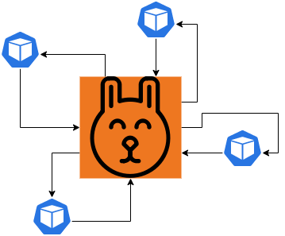
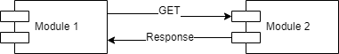
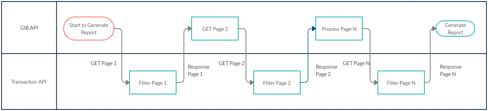
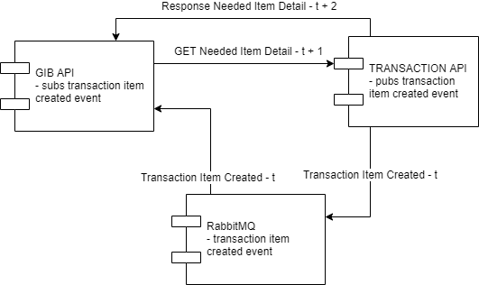
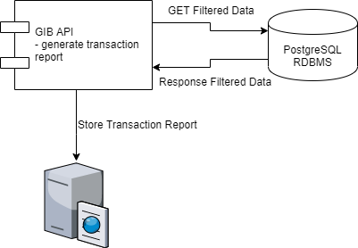
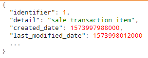
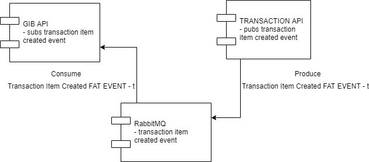
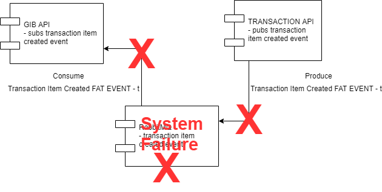

+++
title = "[译] 事件驱动微服务架构"

date = 2020-04-08
lastmod = 2020-04-08
draft = false

tags = ["事件驱动", "微服务"]
summary = "将事件驱动架构和微服务结合在一起会带来巨大的好处，事件/消息才是最能处理分布式计算的特异性，是释放微服务架构潜力的关键。"
abstract = "将事件驱动架构和微服务结合在一起会带来巨大的好处，事件/消息才是最能处理分布式计算的特异性，是释放微服务架构潜力的关键。"

[header]
image = "headers/post/202004-event-driven-microservices.jpg"
caption = ""

+++

英文原文来自: [Event-Driven Microservice Architecture](https://medium.com/trendyol-tech/event-driven-microservice-architecture-91f80ceaa21e) ，作者 [Bahadir Tasdemir](https://medium.com/@bahadirtasdemir)，文章发表时间为 2019年11月。

------

首先，在事件驱动的微服务架构中，服务之间通过事件消息进行通信。当业务事件发生时，生产者用消息发布事件。同时，其他服务通过事件监听器来消费它们。

因此，事件驱动系统的主要优点是异步行为和松耦合结构。例如，在需要的时候，App不是在需要请求数据，而是在需要之前通过事件来消费它们。因此，APP的整体性能提高了。另一方面，保持松散的耦合是微服务环境的关键点之一。

## 作为一种解决方案的事件驱动架构

除了可以用事件驱动的架构来构建系统之外，还可以把它作为一种解决方案来应用到已经构建的高耦合环境中。让我们来讨论一下如何应用事件驱动方法作为解决方案。

### 基本的REST驱动方式

虽然应用可以正常工作，但存在缺点：

1. 模块1等待响应
2. 模块2可以down机
3. 网络延迟降低性能
4. 如果数据很大，就会分页。这意味着更多的REST调用
5. 模块2可能在重载的情况下进行，导致反应很晚。

当系统因为同步连接而变得效率低下时，可以应用事件驱动的解决方案。

### 真实场景：我们的团队是如何应用的

在 Trendyol/Marketplace 团队中，我们有一个报告应用（GIB API）。它将所有的销售报告传输给政府。所以，这个应用必须从另一个API中获取所有的销售数据。刚开始的时候，交易量很低。因此，我们用REST的方式快速构建了这个API。

报告生成时序图

虽然一开始数据量不多，但突然间就增加了起来。因为 Trendyol 是一家快速发展的公司，所以我们经常会遇到这样的问题。另一方面，解决的方法很简单，就是转化成事件消息。

## 解决方案1：转换为事件消息

当我们意识到报表生成效率不高时，我们采用了事件驱动的解决方案。

最重要的是，我们的方案很简单：

1. 当创建了一个交易项目时，发布一个事件
2. 接收到事件时，获取相关数据
3. 转换为一段报告字符串
4. 在 RDBMS (PostgreSQL) 中持久化
5. 生成报告时查询数据
6. 将字符串数据合并并以文件形式保存到磁盘上

因此，所需的事务项被持久化到报表API中。一旦开始创建报表，它就会从RDBMS中查询并聚合报表数据。

### 成功来之不易

当我们将同步过程转换为异步架构时，事务API面临着另一个性能问题。因为报表（GIB）API在每次创建交易项目时都会请求详细的数据，所以交易API的负载很重。原因是，Trendyol中的每一个交易记录都是为每一个交易项目创建的。所以，大量的交易项目详情请求让API感到非常的吃力。

## 解决方案2：富事件

解释一下，富事件意味着消息除了实体标识符之外还包含详情。

在将消息转换为富事件后，我们不需要任何额外的REST调用。因此，我们的架构成为了一个完整的异步事件驱动系统。

## 解决方案3：outbox模式

当我们在谈论销售交易的时候，已经可以看出这些数据是多么的重要。因为它们关系到金融业务。因此，计算的正确率必须是100%。

为了能够获得这种准确性，我们必须确保我们的系统不会丢失任何事件消息。基于此，我们应用了outbox模式。

什么是outbox模式？很简单，当你的API发布事件消息时，它不会直接发送事件消息。相反，这些消息会被持久化地保存在DB表中。有一个作业会按照预定义的时间间隔发送累积消息。

解释图中的内容：

1. 业务模块发布事件
2. 事件服务将消息持久化到RDBMS中
3. 调度器服务触发作业 "发送事件消息"
4. 事件服务查询累计事件消息
5. 事件服务通过 RabbitMQ 发布消息

下面我们就来列举一下outbox模式的利弊吧。

### 优点

1. 事件消息首先在RDBMS中持久化。事务的ACID属性保证了事件消息的持久性。
2. 当事件丢失时，可以从DB中检查该消息。
3. 丢失的事件可以有效地从RDBMS中恢复。

### 缺点

1. 增加了复杂性。
2. 发布事件有延迟。
3. 要发布一个基本事件，至少需要两种技术：存储系统和消息队列协议。

## 事件驱动微服务架构的好处

1. 松散耦合结构
2. 微服务的完全隔离
3. 无同步REST调用
4. 异步事件驱动的功能
5. 性能增益

上述好处中最重要的好处是第一个。因为我们要通过微服务架构来分离组件，所以所有的单元必须足够的分离（松散耦合）。否则，微服务架构就无法发挥作用，你的系统会变成一个分布式单体。

### 坏处

**单点故障**：如果您的RabbitMQ在生产过程中遇到任何问题，整个系统也会出现故障。

要克服故障:

1. 将RabbitMQ构建为集群
2. 建立队列的耐用性
3. 持久化发布的信息

这样就可以快速恢复任何故障。在任何错误发生的时候，集群中的其他实例将接管工作并重新创建持久队列。同时，持久消息也会从磁盘上恢复。

**重复的事件消息**：事件发布者API可能会遇到问题，重新发送相同的消息。要解决系统中的任何重复问题，任何消费端点都必须是幂等的：总是考虑先检查API之前是否获得了该事件。

在微服务架构环境下，我们必须保持低耦合。为了能够保持低耦合，我们必须关注模块之间的连接。做到这一点的一种方法是使用事件驱动的方法。

同时，直接REST调用是昂贵的。目标API可能会不在服务中。此外，源API必须等待直到收到响应。

为了创建事件驱动的微服务结构，我们可以简单地创建一个具有持久化消息的RabbitMQ集群。所有需要的事件都可以通过 `service-in-responsibility` 发布。同时，当事件消息发出后，其他所有的服务都可以绑定其消费者，并对其进行处理。

在构建事件驱动的系统时，我们可以考虑富事件。当事件发生时，富事件提供了所有需要的数据。因此，API不需要任何额外的外部调用。

另一方面，由于系统故障或网络瘫痪，可能会出现丢失事件。为了确保所有的事件都能成功地发布和消费，可以应用 outbox 模式。简单地说，就是将事件存储在存储系统中，而不是直接发布事件。之后，配置好的作业会在确定的时间间隔内发送事件。丢失的消息可以通过存储系统轻松恢复。

## 结论

总结一下，微服务架构是一个相当新的架构，我们这些开发人员每天都在更好的学习它。当我们一不小心，我们的系统就会变成一个分布式单体，这是最糟糕的情况。因为你不能获得任何好处，因为你必须要处理好复杂性的问题。最重要的是，使用事件驱动架构保持松耦合是最重要的事情之一。

