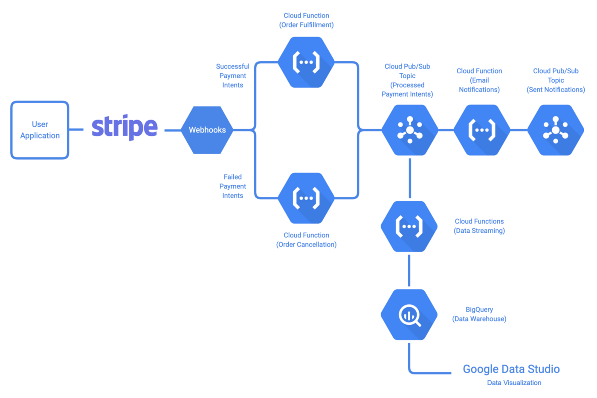

+++
title = "[译] 反应式事件驱动系统及推荐实践"

date = 2020-04-08
lastmod = 2020-04-08
draft = false

tags = ["Istio"]
summary = "本文讨论如何构建反应式事件驱动系统及其推荐实践，这是 《构建事件驱动的云应用和服务》 系列教程的第三篇。"
abstract = "本文讨论如何构建反应式事件驱动系统及其推荐实践，这是 《构建事件驱动的云应用和服务》 系列教程的第三篇。"

[header]
image = ""
caption = ""

+++

英文原文来自 [Reactive Event-Driven Systems and Recommended Practices](https://medium.com/google-cloud/reactive-event-driven-systems-and-recommended-practices-785a1ab7e509)，作者 [Ratros Y.](https://medium.com/@ratrosy)，文章发表于2019年9月。 

------

本文讨论如何构建反应式事件驱动系统及其推荐实践，这是 [《构建事件驱动的云应用和服务》](../202004-building-event-driven-cloud-applications-and-services/) 系列教程的第三篇。

## 介绍

正如开篇讨论的那样，在一个反应式事件驱动的系统中，发布者发出事件来调用（触发）订阅者的操作；这种模式中的事件实际上与内部函数调用、HTTP请求或RPC调用没有什么区别，从技术上讲，你可以将这种模式改造任何工作流，包括单体和基于HTTP RESTful/RPC的微服务系统。常见的用例包括支付处理、预订/保留，以及任何长期运行的操作（如视频转码）。

该模式有以下优点：

- 高度解耦：发布者和订阅者之间几乎没有依赖性，服务现在可以单独演进
- 更好的可扩展性(使用正确配置的消息队列/流方案)：消息队列/流方案可以保留大量的消息，并随着用户处理事件的节奏自我适应
- 更好的可扩展性：开发人员可以随时添加/删除订阅者，如设置多个工作流同时处理同一事件流。

但缺点是追踪事件流程变得越来越难。另外，在没有执行路径的情况下，无法保证发布者收到回复，要想得到反馈，可能还得自己去做查询。

在本教程中，您将使用 Stripe 和 Google Cloud Functions 构建一个简单的支付处理工作流，客户通过 Stripe 使用信用卡支付，您的服务完成订单并发送确认邮件。请注意，这个工作流和许多使用反应式模式构建的工作流一样，都是事务性的；更确切地说，这个工作流中的所有步骤要么全部成功，要么全部失败，而且是在每一种情况下，包括错误、崩溃和平台不可用（如Google Cloud Functions脱机）。

该演示项目使用 Cloud Pub/Sub 来进行消息队列/流。Cloud Pub/Sub 是一个托管的解决方案，发布者和用户通过 Cloud Pub/Sub 主题（topic）处理消息（事件）。

## 架构概述



工作流程如下：

1. 客户通过APP进行消费。
2. Stripe 向客户的信用卡收费，并发送一个 webhook 事件给 Cloud Function `fulfillment`（如果收费成功）或 `cancellation`（如果收费失败）。
3. `fulfillment` 履行完成订单，并向 Cloud Pub/Sub 发布 `orderProcessed` 事件。`cancellation` 拒绝订单，也向 Cloud Pub/Sub 发布 `orderProcessed` 事件。如果 `fulfillment` 或 `cancellation` 无法处理订单，Stripe 发送的 webhook 事件将保存在 DLQs 中，以便进一步检查。
4. `email` 接收到 `orderProcessed` 事件，并发送确认邮件。如果 `email` 无法发送邮件，那么 `orderProcessed`  事件将被保存在DLQ中，以便进一步检查。
5. `stats` 也会接收到这个事件，并将订单的ID写到 BigQuery 中以备参考。

### 搭建

> 译者注：实操细节请参考英文原文。

如果你喜欢在本地运行，请按照下面的步骤进行操作。

- 设置好你的Python开发环境。安装Python 3.
- 安装 Google Cloud SDK。
- 按照 gcp_tutorial.md 继续进行。

### 了解代码

### 事件

这个工作流所涉及的事件在 events.yaml 中定义。该演示项目使用 CloudEvents Generator准备的事件库来写入和读取事件。

**至少有一次交付，和正好是一次交付**

**At least once delivery, and exactly once delivery**

在单体系统中，内部函数调用始终是同步的；如果进行一次函数调用，它将被调用一次，而且是精确的一次。不幸的是，在反应式事件驱动系统中，情况并非如此：大多数消息队列/流式解决方案，如 Cloud Pub/Sub 和 Apache Kafka（0.11之前），都只能保证至少一次交付，也就是说，所有的事件最终都会被交付，尽管订阅者可能会看到少量的事件两次或更多次。

> 注意：
>
> 即使你的消息队列/流解决方案承诺了精确的一次性交付，你也应该非常谨慎。这些承诺通常有一个前提条件：对于Kafka来说，精确的一次性处理是一个端到端的保证，你的应用程序必须设计成不违反该属性；另一方面，Google Cloud Tasks则偏向于在必要时保证执行，而不是精确的一次性执行，这意味着它对99.999%的任务承诺精确的一次性交付，但不是全部。

如果你的订阅者不是幂等的话，至少一次交货会在你期待偏少的时候引起问题。以本教程的演示项目为例，一个订单不应该被执行两次。因此，强烈建议你通过事务将传入的事件（或者至少是它们的ID）通过数据库持久化，并使用这些记录拒绝任何重复的事件。此外，您应该为您的事件设置一个TTL(time to live)值(例如10分钟)，这样您就不需要永远持久化所有的事件；任何不在数据库中但陈旧的事件也应该被拒绝。

这个演示使用Cloud Firestore，一个托管的NoSQL数据库解决方案来保存事件。它首先检查事件的过期日期，然后使用事务以确保该事件之前从未被处理过。通过云函数开始时的事务把关，即使在执行过程中，例如部署时崩溃，每个事件也只会被处理一次。

```javascript
async function fulfill (req, res) {
  ...

  // Rejects stale events.
  utils.checkForExpiredEvents('POSIX', paymentIntent.created, EVENT_MAX_AGE);
  // Checks if the event is duplicated.
  await utils.guaranteeExactlyOnceDelivery(firestoreClient, EVENT_COLLECTION, paymentIntent.id, JSON.stringify(paymentIntent));
  
  ...
}
  
// Checks if an event has expired.
exports.checkForExpiredEvents = function (format, eventTimestamp, maxAge) {
  let age;
  switch (format) {
    case 'RFC3339':
      age = Date.now() - Date.parse(eventTimestamp);
      break;
    case 'POSIX':
      age = Date.now() - eventTimestamp * 1000;
      break;
    default:
      throw Error('INVALID_TIMESTAMP');
  }
  if (age > maxAge) {
    throw Error('EXPIRED_EVENT');
  }
};

// Checks if an event is duplicated.
exports.guaranteeExactlyOnceDelivery = async function (firestoreClient, collection, eventId, context) {
  const ref = firestoreClient.collection(collection).doc(eventId);
  return firestoreClient.runTransaction(async t => {
    const doc = await t.get(ref);
    if (!doc.exists) {
      await t.set(ref, { context: context });
    } else {
      throw Error('DUPLICATE_EVENT');
    }
  });
};
```

此外，一些消息队列/流解决方案也不能保证消息的顺序。在这个用例中，消息的顺序是无关紧要的，但是，如果你的系统要求以正确的顺序接收消息，你就必须以某种方式持久化事件，并自行排序。

### 可观测性

正如前面所解释的，反应式事件驱动系统最突出的一个缺点是，你不能像在单体系统中的try-catch块（或其等价物）那样观察系统中的事件（命令）流。比如说，如果事件流突然停止（可能是由于代码中的bug），你将无法在事件流的上游（事件流的开始）或下游（事件流的结束）捕捉到它；为了排除故障，你必须逐一检查每一个发布者和订阅者。

幸运的是，有一些工具可以提供帮助。**分布式日志**、**集中式监控**和**分布式跟踪**是反应式事件驱动系统（以及几乎所有分布式系统）中可观察性的三大支柱。

- **分布式日志** 有助于将所有逻辑上连接的组件的日志关联起来（例如在同一事件流中）。
- **集中式监控** 有助于收集来自所有逻辑上连接的组件的指标。
- **分布式跟踪** 有助于跟踪每个步骤在流中所花费的时间，从而衡量其性能。

下面的两个例子，分别展示了如何使用 Stackdriver Logging、Stackdriver Monitoring 和OpenCensus 进行分布式日志和跟踪，前者使用订单的ID来分组日志，后者使用唯一的ID来分组同一跟踪下的span。

```javascript
const {Logging} = require('@google-cloud/logging');

const logging = new Logging();

// const logName = 'customLog';
// const resourceType = 'cloud_function';
// const labels = {
//    'source': 'fulfillment',
//    'orderId': 'myOrderId'
// };
async function distributedLog(logName, resourceType, customLabels, text) {
  const log = logging.log(logName);
  const text = text;
  const metadata = {
    labels: customLabels,
    resource: {
      type: resourceType 
    }
  }
  
  const entry = log.entry(metadata, text);
  await log.write(entry);
  console.log(text);
}
```

可以在 Stackdriver 日志查看器中用过滤器 label.orderId=myOrderId 查询，以跟踪处理该特定订单时产生的所有日志。

```javascript
const tracing = require('@opencensus/nodejs');
const { StackdriverTraceExporter } = require('@opencensus/exporter-stackdriver');

const exporter = new StackdriverTraceExporter({projectId: "YOUR-GCP-PROJECT"});

const tracer = tracing.registerExporter(exporter).start({ samplingRate: 1 }).tracer();

function A () {
  let traceId;
  tracer.startRootSpan({ name: 'A' }, rootSpan => {
    doSomeWorkInA();

    traceId = rootSpan.traceId();
    rootSpan.end();
  });
  
  // Pass traceId to another function
}

function B () {
  let traceId = 'The trace ID passed from A';
  tracer.startRootSpan({ name: 'B', traceId: traceId }, rootSpan => {
    doSomeWorkInB();

    rootSpan.end();
  });
  
  // Keep passing the traceId if needed
}
```

当在 Stackdriver Trace Viewer 中查看跟踪时，即使两个span在两个不同的实例中运行，也会被关联到同一个跟踪。您可以用诸如 orderId 来注释跟踪，以备参考。

### DLQs (✨让它崩溃！)

一般来说，在单体或基于HTTP RESTful/RPC的微服务系统中，开发人员必须一丝不苟地检查每一个可能的输入，并尽力从异常中恢复。这部分原因是由于函数调用（或HTTP请求/RPC调用）从核心上说同步的；如果一个异常没有被捕获（和恢复），那么调用本身就会永远消失--没有简单的恢复方法。

而反应式事件驱动系统中的事件则是不可变的，可以很容易恢复，这要归功于作为中介的消息队列/流解决方案。尽管你可能觉得奇怪，但建议在反应式事件驱动系统中采取 "让它崩溃 "的不良态度，专注于订阅者中的幸福路径，简单地拒绝任何你无法处理的事件到DLQ（死信队列）中。

> **重要**
>
> 显然，这种态度并不适用于对业务逻辑至关重要的异常，这些异常仍然需要尽快捕获并处理。比如说在这个演示项目中，当一个订单因为bug而无法执行时，你仍然需要在代码中尽快修复它。或者，你可以拒绝所有的死事件到DLQ，并设置专门的worker来处理特定类型的错误。

死信队列（Dead letter queues），顾名思义，就是死信事件的消息队列。它允许开发人员

- 检查潜在的问题和BUG
- 检测和分析问题的模式
- 配置专职工作人员处理错误

DLQ的好处在于它能准确地捕捉到事件生产者发送的事件，让你有机会获得第二次机会来轻松地修正问题。例如，如果由于某种原因，传递给 fulfillment 的订单ID暂时损坏，而你很快就找到了修复它们的方法，你可以从DLQ中找回所有被拒绝的事件，并要求 fulfillment 再次处理它们。

> 备注
>
> Cloud Pub/Sub，与一些消息队列/流的选项不同，它没有内置DLQ支持。因此，我们在这里设置了一个单独的主题作为DQL；在你的生产系统中，你可能会有拒绝事件的选项，而不需要在代码中进行额外的设置。

```javascript
// A wrapper for rejecting dead-lettered events.
module.exports = functions.https.onRequest(async (req, res) => {
  try {
    return await fulfill(req, res);
  } catch (err) {
    console.log(err.message);
    // Stripe webhook events are delivered via HTTP. Here it is wrapped in
    // a Cloud Event and rejected to DLQ via Cloud Pub/Sub.
    const stripeWebhookEventRejected = utils.createStripeWebhookEventRejectedEvent(SOURCE, req.headers, req.body, err.message);
    await utils.publishEvent(pubSubClient, DLQ, stripeWebhookEventRejected);
    res.status(400).end();
    return Promise.resolve();
  }
});

async function fulfill (req, res) {
  ...
}
```

### 流程控制

你可以在任何时候暂停，然后重新启动一部分事件流。您的消息队列/流解决方案应该能够在这段时间内（在Cloud Pub/Sub的情况下是7天）暂停事件，这样就可以在离开的地方恢复。要在演示项目中做到这一点，请在Cloud Console中删除与您希望暂停的云功能相关联的订阅。您可以在以后准备好后再重新创建一个。

默认情况下，Cloud Pub/Sub 会根据您的 Cloud 函数的事件消费速率自动控制流速。Cloud Functions 会自动伸缩；如果您想限制 Cloud Function 实例的最大数量，从而调节流量速度，请调整 Cloud Functions 的可伸缩性设置。其他消息队列/流解决方案和计算平台可能也有类似的设置。

### 构建、测试、部署

Cloud Pub/Sub 和其他一些消息队列/流解决方案具有快照功能，允许您重放事件序列。当您在为您的反应式事件驱动系统的更新代码时，这将是非常有用的：只需要求 Cloud Pub/Sub 将相同的事件序列在另一个时间段传递给新代码，您就可以有一个可以用于比较的基础。

另外，正如本系列教程的开篇所介绍的那样，在反应式事件驱动系统中，只要有消息队列/流解决方案的存在，你就可以随时添加/删除订阅者。这就实现了镜像模式，在这里你可以设置一个新版本的订阅者与旧版本的订阅者并排工作，以尝试一下新的功能。例如，这个演示项目增加了一个统计云函数，可以与email 并排工作，将订单状态保存到BigQuery。

