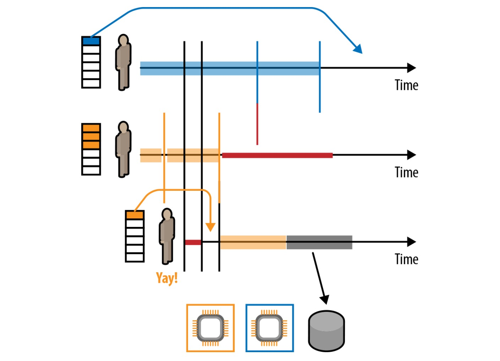
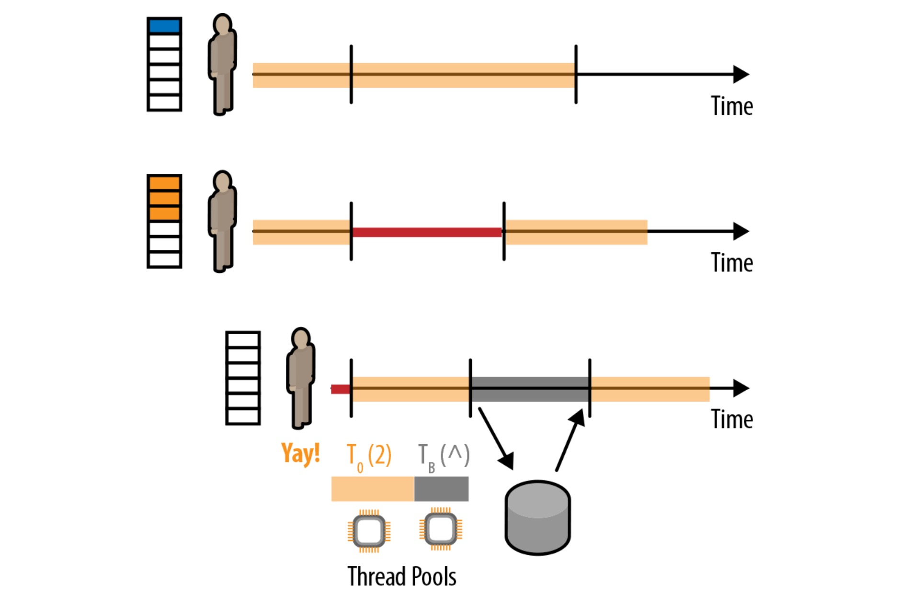
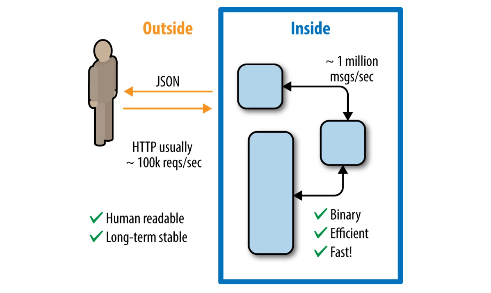
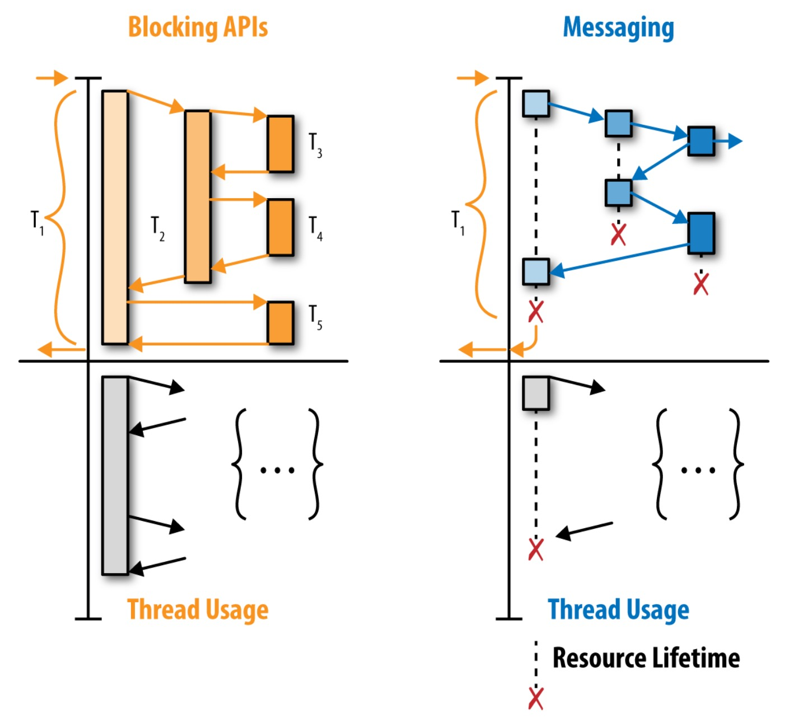

+++
title = "[译] why reactive"

date = 2020-04-15
lastmod = 2020-04-15
draft = true

tags = ["Web Assembly"]
summary = "why reactive"
abstract = "why reactive"

[header]
image = ""
caption = ""

+++

英文原文来自 why reactive，是一个免费的ebook。作者 Konrad Malawski。

> 备注：快速翻译（机翻+人工校对，没有精修），质量不高，一般阅读可以，不适合传播，谢绝转载。

------

## 介绍

> It’s increasingly obvious that the old, linear,
> three-tier architecture model is obsolete.1
>
> 越来越明显的是，旧的、线性的三层架构模式已经过时了。
> 
> —A Gartner Summit track description  

虽然 reactive  这个词汇已经存在了很久，但直到最近才被业界公认为是系统设计中事实上的发展方向，并被主流采用。2014年Gartner写道，曾经风靡一时的三层架构开始显得过时。这份报告的目的是要从炒作中抽身而退，分析什么是真正的反应式，何时采用，以及如何去采用。本报告的目的是为了保持技术的不可知性，专注于反应式应用和系统设计的基本原则。很明显，某些现代的技术，如 Lightbend 或 Netflix 堆栈，比起其他技术，更适合开发反应式系统。

然而，本报告不会给出空白的建议，而是会用必要的背景和理解来武装你，让你自己做出正确的决定。

本报告的对象是有技术背景的CTO、架构师、团队领导或经理，他们希望了解到反应式。其中部分章节将深入探讨技术方面的内容。在第2章，关于应用层面上的reactive，我们需要了解围绕这种编程范式的技术差异及其对资源利用的影响。下一章，关于系统层面上的反应式，我们将退后一步，看看分布式反应式应用的架构以及组织的影响。最后，我们用一些总结性的想法来结束报告，并提出一些构建的建议，以及如何在所有围绕这个主题的营销炒作中发现真正适合于反应式架构的好方法。 

那么，Reactive到底是什么意思？2013年，Jonas Bonér3收集了分布式和高性能计算行业中最聪明的人（按字母顺序排列，即Dave Farley、Roland Kuhn和Martin Thompson）合作，并确定了构建反应式应用和系统的核心原则。我们的目标是澄清一些关于反应式的困惑，并为将来成为一种可行的开发风格打下坚实的基础。虽然我们不会在这份报告中深入探讨该宣言本身，但我们强烈推荐大家阅读一下。现在系统设计中使用的很多词汇（例如错误/errors和故障/failure之间的区别）都在其中得到了很好的定义。

就像《反应式宣言》旨在澄清一些术语的混淆一样，我们在这份报告中的目的是巩固对反应式的含义的共同理解。 

### 为什么要构建反应式系统？

> It’s no use going back to yesterday, because I was a different person then.
> 
> 回溯到昨天是没有用的，因为那时的我已经是另一个人了。
> 
> —Lewis Carroll 

在我们投入到反应式系统和架构的技术层面之前，我们应该先问问自己："为什么要构建反应式系统？ "

为什么我们会有兴趣改变我们多年来一直以来构建应用程序的方式？或者更好的是，我们可以先问："我们想为我们的软件用户提供什么好处？" 在许多可能的答案中，以下是一些通常会导致人们开始研究反应式系统设计的答案。假设我们的系统应该 

- Be responsive to interactions with its users / 响应于与用户的互动
- Handle failure and remain available during outages / 处理故障并在停电期间保持可用
- Strive under varying load conditions / 在不同的负载条件下努力工作
- Be able to send, receive, and route messages in varying network conditions / 能够在不同的网络条件下发送、接收和路由信息 

这些答案实际上传达了宣言中所定义的核心响应性特征。响应性是通过控制我们的应用的硬件利用率来实现的，对此，很多响应性技术都是很好的工具。我们在第二章中，当我们开始研究应用层面上的响应式时，我们会看几个。同时，使系统易于扩展的一个好方法是将系统的各个部分解耦，使其能够独立扩展。如果我们把这些方法与避免系统之间的同步通信结合起来，现在我们也可以使系统的弹性更强。通过尽可能的使用异步通信，我们可以避免将我们的生命周期与请求的目标主机的生命周期严格绑定。比如说，如果生命周期运行缓慢，我们应该不会受到它的影响。我们将在第3章中研究这个问题以及其他问题，当我们在系统层面上放大并关注反应式的时候，比较同步的请求-响应式通信模式和异步消息传递模式，我们将在第3章中研究这个问题。 

最后，在第4章中，我们列出了工具箱中的各种工具，并讨论了如何以及何时使用每一个工具。我们还讨论了如何在现有的代码库中引入reactive，因为我们承认现实世界中充满了我们希望与之集成的现有的、有价值的系统。 

## 为什么是现在？

> The Internet of Things (IoT) is expected to surpass mobile phones as the largest category of connected devices in 2018.
>
> 2018年，物联网（IoT）有望超越手机，成为最大的联网设备类别。
>
> —Ericsson Mobility Report  

当我们把 "为什么 "问题的另一个有趣的方面揭开了，当我们再进一步问："为什么是现在？"

正如你很快就会看到的那样，反应式背后的许多想法并不是那么新鲜，很多都是多年前就已经描述和实现的。例如，Erlang的基于actor的编程模型早在20世纪80年代初就已经出现了，最近又随着Akka被带到了JVM中。那么问题来了，为什么这些存在了这么久的想法现在在主流企业级软件开发中开始起飞了呢？

我们正处在一个有趣的节点上，可扩展性和分布式系统已经成为许多应用中的日常需求，而这些应用在以前只能在一个盒子上存活，或者不需要太多扩展出来或硬件利用率的情况下，就能生存下来。一些运动促进了目前反应式编程的兴起，最显著的是:

- IoT 和移动

  在2015年第一季度到2016年第一季度之间，移动部门的流量增长了60%;而根据爱立信移动报告4，这种增长速度并没有很快放缓的迹象。这些部门的定义也意味着服务器端必须同时处理数以百万计的连接设备，由于其轻量级的能力，如 "设备 "等资源的表示能力，或者说是 "设备 "之类的资源，因此这项任务最好由异步处理来处理。

- 云和容器化

  虽然我们基于云的基础设施已经有好几年了，但轻量级虚拟化和容器的兴起，再加上以容器为中心的调度器和PaaS解决方案，让我们的部署速度更快、范围更细，更自由、更快。 

纵观这两个运动，很明显，我们正处于一个对并发和分布式应用的需求都越来越强烈的时间点。同时，在规模化、不需要太多麻烦的情况下，所需要的工具化手段终于跟上了。我们现在已经不是几年前的情况了，当时部署分布式应用虽然可以实现，但需要专门的团队来管理部署和基础架构自动化解决方案。

同样重要的是要认识到，我们重新审视的许多解决方案，在被称为reactive运动的总括运动下，从20世纪70年代就已经出现了。为什么现在反应式冲击主流，而不是当时的概念，尽管当时的概念已经被人们所熟知，但是为什么现在反应式会冲击主流，这与很多事情有关。首先是对资源利用率和可扩展性更好的需求变得足够强烈，以至于大多数项目都在寻求解决方案。许多这样的解决方案也有了工具化，既有集群调度器，也有基于消息的并发，还有像Akka这样的分发工具包。另一个有趣的方面是，有了像Reactive Streams这样的举措，就不会有被锁定在某个实现中的风险，因为所有的实现都是为了提供良好的互操作性。我们将在下一章中更深入地讨论Reactive Streams标准。 

换句话说，在部署和基础架构中不断走向更多的自动化，这使得我们的应用分布在不同的节点上，分布在不同的专业服务上的应用已经变得毫无摩擦力，以至于采用这些工具不再是小团队的障碍。这一趋势似乎与最近兴起的无服务器或无运维的运动相吻合。这个运动是每一个团队自行实现云自动化的下一个逻辑步骤。在这里，重要的是要认识到，反应型特征不仅为你现在的成功做好了准备，而且也很好地配合了行业的发展方向，走向位置透明、无运维的分布式服务。 

## 应用级别的反应式

> The assignment statement is the von Neumann bottleneck of programming languages and keeps us thinking in word-at-a-time terms in much the same way the computer’s bottleneck does.
>
> 分配语句是编程语言中的冯-诺依曼瓶颈，它让我们的思维方式和计算机的瓶颈一样，都是以字数为单位来思考。
>
> —John Backus  

作为构建反应式系统的第一步，让我们来看看如何在单个应用中应用这些原则。许多原则已经适用于系统的局部（应用）层面，从下至上的反应式积木组成一个系统将使我们可以简单地将相同的思想扩展成一个完整的分布式系统。

首先，我们需要纠正一个共同的误解，在最近两个不同的社区在使用 "反应式 "这个词之前，他们对这个词的用法达成了共识。一方面，长期以来，业界，尤其是运营界，一直以来都把那些能够在面对故障时愈合，或者在面对流量增加/减少时扩展的系统称为 "反应式系统"。这也是 "反应性宣言 "的核心概念。另一方面，在学术界，自 "函数反应式编程"（FRP），或者更确切地说是 "函数反应式激活 " 这个词被创造出来之后，"反应式 "这个词就开始使用了。这个术语是1997年在Haskell以及后来的Elm、.NET（"Reactive Extensions "这个术语在这里被称为 "Reactive Extensions"）和其他语言中引入的。这种技术确实对反应式系统非常有用；然而，如今，它甚至被FRP框架本身也被误解了。 

反应式库和实现中的一个共同主题是，它们经常诉诸于使用某种事件循环，或基于线程池的共享调度器基础设施。由于将昂贵的资源(即线程)分享给了更便宜的构造，无论是简单的任务、行为体，还是在共享调度器上调用的回调序列，这些技术使我们能够跨多核扩展单个应用程序。这种复用技术使这样的库能够在一个盒子上处理数百万个实体。得益于此，我们突然间可以在系统中每个用户只需要一个行为体，这使得使用行为体的域建模也更加自然。如果是直接使用普通线程的应用，我们将无法得到如此干净的分离，只是因为它将很快变得过于沉重。而且，直接在线程上操作也不是一件简单的事情，很快你的程序大部分都会被试图在不同的线程之间同步数据的代码所支配，而不是专注于完成实际的业务逻辑。

这个缺点，也可能成为我们这个时代的新的 "谁破坏了build?"，这句话就是 "谁阻止了事件循环?" 我们所说的阻塞是指需要很长时间（可能是无限制的）才能完成的操作。有问题的阻塞的典型例子包括文件I/O或使用阻塞驱动的数据库访问（目前大多数数据库驱动都是这样）。为了说明阻塞的问题，让我们看一下图2-1上的图。假设你有两个实际的单核处理器（为了简单起见，假设我们没有使用超线程或其他类似的技术），我们有三个队列的工作要处理。所有的队列或多或少都是同等重要的，所以我们希望尽可能公平（和快速）地处理它们。公平性要求是我们在使用阻塞技术编程时往往不会想到的一个要求。然而，一旦你去异步，它开始变得越来越重要。澄清一下，在这样的系统中，公平性是指任何一个队列的服务时间大致相等的属性--没有 "更快的 "队列。图2-1上的每个时间线上的颜色显示了在任何特定时刻哪个处理器在处理该进程。根据我们的假设，我们只能并行处理两个进程。 

图2-1. 阻塞操作，这里用灰色表示，浪费资源往往会影响到整体系统的公平性和某些（运气不好的）用户的感知响应时间 

灰色区域标志着下面的行为体已经发出了一些阻塞操作，比如试图将数据写入文件或使用阻塞API写入网络。你会注意到，现在的第三个执行器并没有真正的对CPU资源做任何事情，它是在等待阻塞调用的返回而被浪费。在 Reactive Systems 中，我们在执行此类操作时，会把线程还给池子，让中间行为体开始处理消息。注意，通过阻塞操作，我们在中间队列上造成了饥饿，我们既牺牲了整个系统的公平性，也牺牲了中间行为者处理请求的响应延迟。

有些人把这个观察和图解误解为 "阻塞是纯粹的邪恶，一切都注定要完蛋了！" 有时，反应式技术的反对者会用这句话来散布恐惧、不确定性和怀疑（又名FUD，一种激进的营销方法），反对更多的现代反应式技术堆栈。实际上，这句话所传递的信息是（而且一直以来都是如此），阻断需要谨慎管理

许多响应式工具包（包括Netty、Akka、Play和RxJava）用来处理阻塞操作的解决方案是将阻塞行为隔离到不同的线程池中，该线程池专门用于此类阻塞操作。我们把这种技术称为沙盒或散布式隔离。在图2-2中，我们看到了一个更新的图，处理器现在表示实际的内核，我们承认我们从一开始就在讨论线程池。我们有两个线程池，默认的线程池是黄色的，而新创建的线程池是灰色的，这是用于阻塞操作。每当我们要发出一个阻塞调用的时候，我们就把它放到那个线程池上代替。当第三个进程等待拦截操作的响应时，其余的应用程序可以继续在默认池上压缩消息。这样做的好处很明显，就是阻塞操作不会使主事件循环或调度器停滞。 

图2-2. 在专用调度器（灰色）上安排阻塞操作。这样，正常的被动操作就可以在默认调度器上不受阻碍地继续进行（黄色）。 

### 寻找最佳的利用水平

在上一节中，我们了解到使用异步API和编程技术有助于提高硬件的利用率。这听起来很好，而且我们确实希望最大限度地利用我们所支付的硬件。然而，硬币的另一面是，将利用率推到一定程度之后，收益会越来越少（如果再推下去，甚至是负的）。这一观点在1993年由Neil J. Gunther正式提出，被称为普遍可扩展性定律（Universal Scalability Law，USL）。USL、Amdahl定律和队列理论之间的关系本身就是值得一整篇论文的材料，所以我在这篇报告中只给出一些简单的直觉。如果读完这部分内容后，你觉得很有兴趣，想了解更多，请查看Baron Schwartz(O'Reilly)的白皮书 "Practical Scalability Analysis with the Universal Scalability Law"。 

USL可以被看作是一个更实用的模型，而不是更广为人知的Amdahl定律，该定律由Gene Amdahl在1967年首次定义，它只谈到理论上的算法速度提升，取决于算法可以并行执行的程度。而USL则更进一步，在引文中引入了通信成本，即保持数据同步-协调性的成本--作为变量，并提出，将系统推到超过其利用率的甜蜜点，不仅不会产生更多的速度提升，反而会对系统的整体吞吐量产生负面影响，因为所有的协调都是在后台进行的。这种协调可能是在硬件层面（例如内存带宽饱和，显然不会随着处理器数量的增加而扩大）或者网络层面（例如带宽饱和或者是入站和转发问题）。

需要注意的是，我们可以对各种资源进行竞争，而且过度使用问题不仅适用于CPU，同样也适用于网络资源。例如，对于一些高吞吐量的消息库，有可能将各种云提供商设置中最常见的 1 Gbps 的网络资源最大化（除非有特定的网络/节点配置，例如 Amazon EC2 上的特定高端实例可以使用 10 Gbps 的网络接口）。因此，虽然USL同时适用于本地和分布式设置，但现在让我们重点讨论一下它在应用层面的影响。

## 利用背压来保持最佳的利用水平

在使用同步API时，系统会 "自动 "回压阻断操作。因为在阻塞操作完成之前，我们不会做其他事情，所以我们在等待中浪费了很多资源。但使用异步API，我们可以更密集地最大限度地执行我们的逻辑，尽管我们有可能会有压倒其他一些（较慢的）下游系统或应用程序的其他部分的风险。这就是背压（或流量控制）机制发挥作用的地方。

与 Reactive Manifesto 相似，Reactive Streams 倡议源于业界领先的公司之间的合作，这些公司希望围绕着绑定内存流处理来规范一个互操作协议。这个最初的合作包括 Lightbend、Netflix 和 Pivotal，但最终发展到包括来自 Red Hat 和 Oracle 的开发人员。作为一年多来对该规范、其 TCK 以及 Reactive Streams 的语义细节进行迭代的结果，它们已经被纳入到 OpenJDK 中，作为 JEP-266 "更多并发更新 "提案的一部分。有了这些接口和一些已经直接在JDK内部成为Java生态系统的一部分的帮助器方法，可以放心的是，实现了Reactive Streams接口的库，就可以向JDK中包含的接口发展，甚至在未来的JDK9发布后，也可以兼容。

需要记住的是，要想使系统具有弹性、可扩展性和响应性，仅靠背压、Reactive Streams或其他任何部分还远远不够。只有将这里描述的这些技术结合起来，才能产生一个完全反应式的系统。通过使用异步和背压式API，我们能够将系统推到极限，但并没有超越极限。回答多少利用率实际上是最优的问题是很棘手的，因为它总是在能够应对突如其来的流量激增和浪费资源之间取得平衡。这也非常依赖于系统所执行的任务。一个简单的经验法则是将系统利用率控制在80%以下（从那里开始，根据你的要求进行优化）。关于为了优化利用率等方面的战斗，可以在Google Maglev的优秀论文中阅读到一个有趣的讨论。

有人可能会问，与同步版本相比，这种 "限制自己 "是否会降低整体性能。这个问题是有道理的，例如在单线程、原始吞吐量基准中，同步实现往往会击败异步实现。然而，现实世界的工作负载并不像这样。在Netflix对RxNetty与Tomcat进行的一项有趣的性能分析中，Brendan Gregg和Ben Christensen发现，即使有了异步开销和流量控制，异步服务器实现在高负载下的响应延迟确实比同步（并且经过高度调优）的Tomcat服务器要好得多。

### 流API和绑定内存流处理的崛起

> Ever-newer waters flow on those who step into the same rivers.
>
> 不断有新的水在那些踏入同一条河流的人身上流淌。
>
> —Heraclitus

Streaming，就像reactive，目前正处于一个阶段，社区正试图真正定义 "stream "这个词的含义。可悲的是，人们对它的困惑或许比对 "reactive "更多。streaming领域之所以变得如此混乱，是因为多个解决非常不同需求的库都来使用这个词。例如，Spark Streaming和Flink解决的是大规模的数据传输侧，但并不适合中小型工作，也不适合嵌入作为数据源的HTTP响应API的数据源，这些响应API通过提供无限的数据流来响应，就像众所周知的Twitter Streaming API一样。

在本章中，我们将重点讨论流的实际含义，为什么它重要，以及未来会发生什么。这里有一个硬币的两面：消费和生产流API。我们在这一章中讨论这个话题是有原因的，因为我们在应用层面上讨论的是反应式的，而不是系统层面上的，尽管API作为各种系统之间的集成层。这与流式 API 和绑定内存进程给我们带来的有趣功能有关。最值得注意的是，使用和/或构建流式库和API可以让我们永远不会将更多的数据加载到内存中，这反过来又让我们可以构建绑定内存管道。这对于容量规划来说是一个非常有趣和有用的属性，因为现在我们可以保证一个给定的连接或流需要多少内存，并可以将这些数字包含在我们的容量规划计算中。

让我们来讨论一下这个功能，因为它与Twitter Firehose API有关，这是一个应用程序可以订阅的API，以收集和分析Twittersphere中所有传入的推文。很显然，消耗这样的高流量信息流也需要在接收端消耗大量的机器功率。而这就是有趣的地方了，如果下游（客户，访问firehose API的客户）无法以其发出的速度消耗呢？

让我们从服务器的角度来看看这个设计挑战。我们有实时的数据流从后端传来，我们需要将这些数据推送到服务的下游客户端。他们中的一些人可能会很慢，或者他们的一端可能会出现问题，导致他们根本无法消费这个数据流。我们应该怎么做呢？通常的答案是缓冲，直到客户端回来。这个答案是正确的，同时也是可怕的。当然，我们希望缓冲一下，让客户端从他们那头的缓慢中恢复过来，继续消耗流。然而，我们不能指望无限期地缓冲这些推文；那将会占用无限制的内存（这很好，但我们还没有到那一步）。解决的办法很简单：我们使用有限制的缓冲器。例如，如果我们看到客户机无法满足我们想要发送事件的速度，我们就会向客户机发出警告（事实上，所有Twitter的流媒体API都有这个选项），"我们正在排队向您发送消息。你的队列现在已经超过60%满了。" 这是一个非常好的策略，因为我们可以根据我们的边界大小队列来估计我们能够服务多少慢的客户，并平衡我们的服务水平和节点利用率。

监控我们的API客户端的队列和缓冲区大小是一个非常有趣的指标，甚至可以触发与客户的一些互动。比如说，我们可以给他们提供额外的处理能力，或者建议他们以某种方式优化他们的客户端。当然，一旦缓冲区满了，我们就需要做一些事情来挽救我们的应用，免得我们的应用遇到任何麻烦。在Twitter的例子中，答案很简单：我们断开客户端的连接（警告消息中总是包含有关这个的细节）。但这不是唯一的选择。人们还可以放弃流中最新的或最新的元素，特别是当最老的元素已经过时时。不用说，这样的决定应该是由业务驱动的，尽管使其变得琐碎的关键因素是流媒体优先库，例如Akka Streams/HTTP，在这里，选择溢出策略就像选择溢出策略一样简单，Akka在其快速启动指南中记录了这一点。

> Reactive Is an Architectural and Design Principle, Not a Single Library
>
> 反应式是架构和设计原则，而不是单一的类库。
> 
> The whole is other than the sum of the parts.
>
> 整体大于部分之和。
>
> —Kurt Koffka

你可能听过这句话，说是整体比部分之和 "大"。但事实证明，这句话的实际含义稍有不同，因为科夫卡的意思是，整体实际上是指与部分之和不同的东西，不一定是更大或更大（例如，像图2-3中的 "看不见的 "三角形）。这句话与我们发现自己所处的情况与 "reactive "一词相吻合。你可以很容易找到许多加了 "reactive "前缀的库，以及一些试图改变reactive的含义，使之成为该库唯一的任务（例如，流处理）。重要的是要认识到这些都是很好的构件，但它们很少能解决整个问题（很可能省略了处理弹性或弹性）。在下一章中，我们将了解到除了我们正在构建的应用程序内部的漂亮的编程模型之外，还有什么是反应式系统。我们将看到应用程序是如何通信的，以及我们如何将其扩展出来并按需回落。

图2-3. 三角形的线段还没有画出来，还可以看到白色三角形的边缘

## 系统级别的反应式

> One Actor is no Actor. 
> 
> Actors come in Systems.
> 
> —Carl Hewitt, 并发计算actor模型的创造者

> More than 95 percent of your organization’s problems derive from your systems, processes, and methods, not from your individual work‐ ers. [...] Your people are doing their best, but their best efforts cannot compensate for your inadequate and dysfunctional systems.
> 
> 你的组织95%以上的问题来自于你的系统、流程和方法，而不是你的个人工作。你的员工已经尽了最大的努力，但他们的最大努力无法弥补你的系统不完善和功能失调。
>
> Changing the system will change what people do. Changing what peo‐ ple do will not change the system.
>
> 改变系统将改变人们的工作。改变人们所做的事情，并不能改变制度。
> 
> —Peter R. Scholtes, 《领导者手册》

在现实中，我们很少谈论单个应用的单一实例。相反，我们谈论的是由多个服务组成的系统，这些服务可能使用不同的技术来实现，而且每个服务都有不同的延迟和正常运行时间要求。正如我们在本章中会发现的那样，我们在上一章中谈到的许多概念和要求都可以直接转化为系统层面。

我们经常会被引导到认为这仅仅是系统的技术层面。我认为，这只是故事的一部分。应用程序需要从技术意义上的扩展，但也需要从组织意义上的扩展。分布式系统（微服务就是一个很好的例子）允许你将责任划分到多个应用中，而这些应用都有自己的专门团队，并有明确的职责。所以，事实证明，分布式系统允许并帮助你扩展你的组织。它们允许你解耦依赖关系，摆脱项目之间的严格依赖关系，让你可以独立地开发和部署。这种独立性允许由不同的团队来构建服务，也许在全球另一端的服务被使用。一旦你是分布式的，那么团队或应用在时间或空间上的距离就不重要了。

同样重要的是要认识到，虽然 Reactive Systems 和 messaging 的思维方式其实很简单，但这并不意味着它很容易。Clojure编程语言的创造者Rich Hickey在RailsConf 2012的主题演讲中解释了这两个概念的区别以及不要把这两个概念混为一谈的重要性。例如，如果你长时间的练习，即使是非常复杂的东西也会变得很容易，比如说你知道一个非常复杂的系统的深层内涵和各个模块之间的隐藏的关系，你在过去10年里一直在研究一个非常复杂的系统。事实上，有些东西对你来说现在很容易，但这并不意味着它真正的简单，它仍然是复杂的。另一方面，有些东西可以是 "简单的"，也就是说，一旦你 "掌握 "了它的核心概念和背后的想法，就会变得非常简单。但这并不意味着学习它就不难。

所以，我们应该把简单与复杂对比，把容易与困难对比。分布式系统，不管是什么形式，都是很难的。当你必须处理不止一台计算机，或者一个组织内不止一个团队的时候，事情就会变得比你只处理单一的计算机更难。事实上，微服务，是不属于系统，因此不应该被轻视。然而，你可以使用的通信手段可以是简单的（例如，messaging），也可以是复杂的（例如，请求/响应与池化、管道连接、断路和超时中止阻塞的死连接）。在下面的章节中，我们将对系统内的通信风格进行研究，回顾一下它们的可扩展性（包括技术和组织性），并通过建议如何在现有的代码库中引入Reactive Services来总结。

## 生命不止于Request-Response- JSON-over-HTTP

> HTTP/2 was meant as a better HTTP/1.1, primarily for document retrieval in browsers for websites. We can do better than HTTP/2 for applications.2
>
> HTTP/2的初衷是作为更好的HTTP/1.1，主要用于浏览器中的网站文档检索。对于应用来说，我们可以做得比HTTP/2更好。
>
> —Ben Christensen, ReactiveSocket

我们经常会看到非常同步的请求-响应默认主宰着我们的应用程序的通信模式。这并不是说REST是一件坏事。事实上，使用 RESTful 的原则来实现异步通信模式是可能的；这里唯一的问题是，在实践中，它们很少能做到。在过去的几年中，许多组织都没有像关注 "request-response JSON over HTTP"的思维方式那样，只关注 REST 的口头禅和意识形态。值得庆幸的是，许多团队正在慢慢意识到，一些用例可以通过较新的协议或消息传递模式得到更好的服务，正如Twitter的Finagle RPC、Google的新的GRPC（Google RPC）库，以及Facebook和Netflix对ReactiveSocket的研究所证明的那样。在过去几年里，"REST "这个词已经恶化成了JSON-over-HTTP的意思，但它不一定是这样的。我画出这种差异的原因是，在最初的出版物中，REST这个词是指在任何地方都可以使用HTTP，但不知怎么的，开发者和架构师们却把REST理解为一种严格的HTTP绑定的架构风格。部分原因是Fielding确实参加了URI、HTTP和HTML IETF工作组，所以很明显他的工作与这些工作组有一定的关系。

在谈论服务之间的通信模式之前，我们先提醒自己，单一的服务不一定是由该服务的一个实例来处理。例如，考虑一个图像大小调整服务。它的入口是一个单一的API端点，该服务的用户会把它称为 "图像缩放服务"（就像 "图像缩放器又降下来了吗？"）。然而，在它的内部，它很可能运行着同一个服务的多个实例，并在其内部集群中平衡传入的图像。重要的是要认识到，我们为服务的外部 API 和交互所做的权衡可能与我们为服务的内部通信所做的权衡有些不同。这直接映射到了DDD术语中的有界上下文。在一个单一的有界上下文中，我们的通信更加自由；然而，一旦我们需要跨越上下文边界，所需的一致性保证就会发生变化，这取决于我们与谁以及如何进行通信。这些差异，更多的将是由服务通常由一个团队所拥有的事实所驱动。换句话说，我们重新发现了封装，但这次是由于组织边界和内部每个团队的运作方式略有不同。与其将公司内部的所有通信强行采用相同的RESTful 通讯风格相比，放松对服务内部通信的约束往往是有益的，因为控制它的单一团队可以更快地移动，并使用其他技术，而不是构成其公共API的技术。

图3-1说明了外部和内部需求在通信风格方面的区别。

在题为 "外部的数据与内部的数据 "的优秀论文中，Pat Helland认为，在系统内部（即微服务所拥有的内部数据存储）和外部（即向该服务的消费者发出数据表示时，数据必须面对的要求有内在的区别。具体来说，他认为内部数据表示是可以变异的，因为，我们可能希望找到更有效的方法来表示相同的数据（例如，通过改变你的SQL模式），但数据的外部表示应该是不可变的。只要用户可以得到他们的联系人列表，那么对他们来说，如果我们必须在内部实现一个JOIN，或者从一个预先计算好的缓存中获取，并不重要，我们每隔一段时间就会刷新一次。我认为，同样的想法也适用于通信模式。对外，我们希望公开一个稳定的、定义良好的 RESTful API，让公司内部（可能还有外部）的其他团队可以使用，或者我们可以直接发布事实供其他人随意使用（结果是一个更基于事件的架构）。然而，在内部，我们需要最适合我们需求的通信协议。例如，在公司内部，我们可能会选择使用二进制消息格式的 "fire-and-forget"的消息传递。

图3-1. 数据在外部和内部有不同的需求---同样的道理，我们如何构建和演化API，也可以说是通信模式的问题。

严格意义上的请求-响应式 APIs-RESTful APIs 只是其中一个例子；SOAP 引诱开发者采用非常类似的方法，问题在于它们限制了开发人员可以做的事情。例如，在HTTP世界中，事件流的订阅有点像黑客，通常是通过返回一个 "无限 "的HTTP响应来实现的，然后我们用逐行的JSON数据来反馈。这类API的一个很好的例子就是Twitter的流媒体API。

在讨论这个话题时，人们可能经常会听到以下反驳。"我完全可以用REST做Async。" 从技术上讲，这种状态是正确的。然而，与原生支持消息传递的解决方案相比，实现它的成本确实是指数级的。

让我们来研究一下异步作业提交API在RESTful风格下实现时的样子。首先，我们将分析一下控制流，然后我们看看在整个生命周期中需要分配多少资源。当今世界中的REST通常是在HTTP之上实现的（尽管它不一定非要这样做，REST的论文从未提及与HTTP有任何联系）。因此，要创建一个作业，我们也许会向 /jobs 服务发送 PUT，它将以 201 Created，或者说 202 Accepted 来回复，以表示运行该作业的请求被接受。它还会包含一个Location头，告诉我们作业完成后，结果会在哪里。一个非反应式客户端将不得不轮询该位置以获取作业的状态。我们还需要保留资源来记住从发出的请求到处理轮询的进程的映射。注意，即使最初的请求/回复周期并没有告诉我们任何我们真正感兴趣的东西（例如，作业的结果或进度），我们仍然必须等待它的响应，因为我们没有办法在之后找到作业的结果。

在基于消息传递的系统中，比如Akka或Erlang，我们可以通过发送一条 fire-and-forget 消息来实现同样的任务。最终，我们可以在该消息中包含一个标志，告诉我们要通知它的进度，这样我们在发送端就完成了。一旦作业完成后，我们会收到一条消息，并将其结果反馈给我们。我们不需要关心它在哪里完成，也不需要关心它什么时候完成。我们来分析一下这个方案中我们需要留存哪些数据或状态的开销。我们只需要一个可寻址的实体来接收消息（在Erlang术语中，它是一个进程；在Akka中，这些被称为actors）。这些实体可以是非常轻量级的--每个约400字节。虽然这在不同的实现中是不同的，但关键是它是非常小的。这就是我们为与其他系统的被动交互所支付的所有开销--没有建立连接，没有来回往返，也没有轮询。

图3-2.非异步HTTP调用式API与纯消息传递协议的比较 非异步HTTP调用式API与纯消息协议的比较。注意到线程的使用量，而反应式版本的线程使用量要低很多

这些年来，HTTP中的替代模式已经被发明出来，以解决这类问题，但它们非常沉重，根本无法在现代互联网中生存，因为在现代互联网中，我们有太多的工作、任务和客户端同时发生。但是，让我们来谈谈这些模式中的一些问题，以显示它们在可扩展性方面的弱点。HTTP的拥护者可能会建议，我们一开始就可以使用一个长期运行的HTTP PUT调用，这样我们就可以保持请求 "开放"，直到任务完成。

同样重要的是要意识到，这不仅仅是可扩展性的问题。在设计这样的API与普通的HTTP时，人们必须做出的决定正在成倍增长。我们要不要在调用上进行阻断？我们应该使用什么方法？我们该如何告诉客户端进行轮询？我们是否应该使用WebSockets来代替？服务器-发送-事件怎么办？对于消息传递来说，这很简单--当你想要什么的时候发送一条消息，当事情完成后你就会收到一条消息。所以从这个角度来说，在设计系统的时候，这也是一个巨大的简化和减少头疼的问题，我们可以专注于实际工作，而不是争论实现细节。

Surviving the Load...and Shaving the Bill!

### 经受住负载的考验...........并减少了账单!

反应式系统最有趣的地方在于它们在面对不断变化的传入流量时弹性扩展的能力。弹性扩展有两个目的：要么我们需要扩展（通过增加更多的机器），要么我们需要缩小规模，减少应用所占用的资源数量。

"弹性 "这个词越来越突出；虽然它的含义和我们熟知和喜爱的 "可扩展性 "这个词非常相似，但这也是一个需要注意的重要转变。尤其是在云计算的早期，你很容易全盘托出，最终导致你实际处理的负载过大。这是因为在云计算中的扩展是相当琐碎的，比如添加新的节点，将它们加入到集群中，或者将它们隐藏在负载平衡器后面。事实证明，没有那么琐碎的事情是要在剥离出来的节点上重新获得一个合理的利用率水平。这就是为什么最近容器和集群协调器（如Mesos）的发展趋势：在过去几年中，我们一直在过度配置我们的应用程序。过度配置本身并不是一件坏事。它给了我们一个 "缓冲"，可以在流量突然激增的情况下生存下来，在我们为集群添加更多节点的同时生存下来（也许那个新的营销活动真的很成功）。然而，过量供应很多是一个巨大的问题，就像我们并没有真正使用的东西开了一张大额发票。

我们发现，在谈到系统的可扩展性时，开发者们都会把注意力固定在scaling out或scaling up上，而scaling down的部分却莫名其妙地失去了。我认为，缩减规模和扩大规模一样重要：毕竟，一旦激烈的流量需求下岗了，就没有必要再去支付那些高额的账单，当然，我们也要节约能源和环保。像Mesos和Kubernetes这样的新工具，加上以容器为中心的应用部署方法，正在为应用的正常运行铺平道路，让应用的正常运行走向更少的未来。

Netflix和Gilt（一个流行的闪卖网站）所流行的一种有趣的缩放模式是预测性缩放，在这种模式下，我们知道什么时候会出现峰值，所以我们可以主动地在这一时期内提供服务器，一旦流量又开始下降，就会逐步减少集群规模。人们可能会在这里陷入一个有趣的文字游戏："主动性扩展 "比 "反应性扩展 "好吗？不，不是的，因为 "反应式服务 "是一种服务扩展的enabeler。而主动式缩放，则是一种技术，我们可以利用它来决定何时进行缩放。例如，像Gilt这样的flash销售网站（它的供应策略非常开放），在一天中的时候，正是flash销售活跃的时候，流量会出现非常高的峰值。这与这些服务是被动的，毕竟，如果你根本无法主动扩展一个应用程序，你就无法主动扩展它。

Without Resilience, Nothing Else Matters

没有复原力，什么都不重要

*Resilience is the ability of a substance or object to spring back into shape.* *The* *capacity to recover quickly from* *difficulties.*

复原力是指物质或物体恢复原状的能力。是指从困难中迅速恢复的能力。

—Merriam Webster

我们围绕着性能、可扩展性、可扩展性、消息传递方式以及其他各方面的反应性讨论了很多。最后，但并非最不重要的是，让我们现在回到最重要的特性：弹性。毕竟，如果有一个超级快速和scala- ble的系统，如果出现任何问题，完全不可用，也是无济于事的。

毕竟，如果你的系统不可用，那么你的系统再快、再闪亮、再好也没有用。反应式系统最典型的处理故障的方式是通过用新的健康节点替换故障节点，或者在流量增加的情况下增加更多的节点来处理故障，否则系统就会超载。从这个意义上说，这些系统可以被认为是抗故障系统，它的特性是不仅能够在压力下生存，而且实际上在压力下还能得到改善。

我们在关于弹性的一章中隐约讨论过的另一个反模式是，遗留系统有时倾向于共享对一个共同的昂贵资源的访问。在应用层面上，这将表现为共享、并发访问一个可变状态。而在系统层面上，则更容易被发现，因为它往往只是共享数据库或类似的资源。这类资源的一个共同主题是，所有的服务都需要访问它的共享状态才能发挥作用。事实上，2016年的Reddit宕机事件，正是因为这类共享服务出现了错误的行为，8换句话说，它是一个潜在的单点故障，把整个网站拿下了。

反应式系统遵循的是 "拥有自己的数据 "的模式，我们在谈到行为者时已经讨论过了。这也是同样的模式，但现在是在系统层面上。如果这些系统在内部保留了更多关于其周围环境的状态，而不是依赖ZooKeeper，也许它们就能在断电的情况下生存下来（例如，如果共享资源出现故障，可以触发 "不确定 "超时，在这些服务器关闭之前，给运营团队更多的时间做出反应）。严格意义上的点对点和无主系统就更好了，因为它们的结构本身就可以避免单一的特殊资源问题。

## 反应式系统的构建块

*We build too many walls and not enough bridges.*

—Joseph Fort Newton

系统从来不是生活在真空中，也不是由相同的部分组成。现实世界要多样化得多，试图忽视这一事实必然会导致失望，在最坏的情况下，也会导致失败。

相反，我们要重新认识到这种多样性，并将其转化为一种优势，系统的各个部分可以在其构建的领域中实现专业化。正如第3章中所解释的那样，这些组件可以一个接一个地添加，以逐步将系统的架构向反应式原则发展。通向反应式系统的旅程可能是漫长的，但它是值得一走的，因为它将以我们在本报告中讨论的方式改善你的体系结构。同样重要的是，不要气馁，并仔细判断你的系统中哪些地方值得去做，哪些地方不值得去做。例如，如果你的任务是构建一个新功能，请考虑是否可以将其作为一个反应式微服务来构建，并将其与现有的系统进行整合，而不是扩展传统的代码库。对于无法构建一个绿地系统的情况，应用前面讨论过的Strangler模式，挑选出系统中特定部分所需要的构件。

那么，还有哪些其他的构件可以用来构建反应式系统呢？我们已经隐约讨论过其中的一些，但我们没有机会触及到所有的各种技术。

例如，和流媒体的情况一样，我们确实讨论了用Akka Streams和Akka HTTP或RxJava来构建和消费流API。但我们并没有讨论过从每夜的批处理作业转向流数据分析的更多反应性管道。这些技术，比如Apache Spark、Flink或Gear Pump，可以让你提高应用的响应速度。与其等待晚间批处理完成后再向客户发送报告，还可以对客户的数据进行临时或流式处理，从而更快地反馈给客户。

其他我们几乎没有篇幅提及的话题是集群调度器和Mesos和Mesosphere DC/OS等平台。一旦我们构建了Reactive Services，现在是时候把它们部署到某个地方了。为了利用Reactive Services给我们带来的可能性，我们需要一个支持这些功能的架构。Mesos就是一个很好的例子，它可以让我们在预设或云中部署，并将我们的应用实例分配给云中的资源的方式标准化。由于我们的反应式应用是以可扩展性和弹性为基础构建的，所以像Mesos这样的调度器可以在系统压力发生变化时，杀死和启动我们的应用实例。

## 在现实系统中引入Reactive

完全异步架构有[可衡量的]好处。然而，我并不期望看到这样的软件系统。相反，我们所处理的是混合代码库。

—Ben Christensen

我们日常工作的现实情况是，我们很少有机会完全从新开始。即使我们确实有绿地项目，但为了使其具有相关性，这些项目必须与现有的系统整合，而这些系统可能并没有达到我们在这个时代所希望的弹性和语义水平。我们不认为轻视遗留系统是一种健康的做法。遗留系统之所以存在，是因为它们在当时的时代里成功地提供了一些东西，一些足够重要的东西，让它们一直活到今天。一旦我们接受了这一简单的事实，就可以寻找一种富有成效的方法来继续前进，并采用新的技术，如反应式架构。在本节中，我们旨在强调一种成功的、经过验证的方法，将新技术引入到现有的生态系统中。

在现有的代码库中引入变化的方法之一，尤其是在转到不同的范式或语言时，就是使用 "常春藤模式"（有时被称为 "Strangler模式 "4），该模式已经在该领域的多个项目中使用过，但并不是经常在有意识的情况下使用。这个概念相当简单，如图4-1所示。

图4-1. 应用 strangler 模式将旧的实现隐藏在新的 Reactive API 后面，并在系统的 Reactive 部分引入新的功能，仅根据需要将旧的功能迁移到新的核心中

这里的想法是避免重写旧的代码，直到你遇到实际的问题时，你可以考虑用新的风格来重写它（但你不会被迫重写）。这里的想法是一样的，新系统围绕着旧系统生长，而不需要在旧系统中重写任何东西；同时，系统的其他部分可以转到更被动的开发风格，在需要的时候（以及需要的时候）重写内部，而不是更早的时候。这有助于避免高风险的 "大爆炸 "重写，而这种重写往往会导致灾难性的失败---主要是由于对之前的代码库理解不足或不理解。

### 反应式是一种适合现在和未来的架构风格

*I know; you* did *send me back to the future. But I’m back. I’m back* from *the future.*

我知道，你确实把我送回了未来。但我回来了 我从未来回来了。

—Marty McFly, *Back to the Future*

很早以前就应该意识到，reactive并不是针对某一项具体的技术或类库。我们没有把这本书花在解释一个具体的库上，而是花了大量的时间和空间来深入了解其中的核心概念。有了这些知识，你应该能够继续你的旅程，并自行决定哪种工具最适合你，能够帮助你向这种新的编程范式迈进。我们从过去的错误中吸取教训也是非常有趣的，当开发者们试图隐藏不支持的系统，好像它们只是本地执行的一种特殊情况，这也是非常有趣的。同步RPC系统（如CORBA和重量级的SOA进程）所犯的错误。我们认为，我们已经从这些实验中吸取了一些很好的教训，现在随着拥抱网络工作比以往任何时候都要更多的拥抱网络工作。而我们不惜一切代价避免失败，而是在我们的系统中拥抱它，让它们扩展和适应它。

当然，有一些很好的工具可以使用；但如果使用不当，即使再好的工具或库也不能单独解决问题。你可能还记得当年敏捷占领IT行业的时候，也有同样的情况，这也是有原因的。但是，当时很多团队在应用 "日积月累 "的时候，并没有过多地思考它应该如何帮助他们的团队。相反，他们生硬地 "照本宣科 "地应用它，当它没有解决他们所拥有的其他破绽的流程时，他们就把责任归咎于整个敏捷。如今，很难想象没有敏捷和精益实践的软装开发，但是，就像任何方法论一样，它仍然有可能被误导。

因此，在采用反应式的时候，重要的是，在前进之前，要对其进行一些思考，并理解其中的原则。我希望这份报告能够证明，在做这些事情的时候，对你和你的团队做出最好的决策是有帮助的，因为你所构建的系统，你的团队也能做出最好的决定。

## 作者介绍

Konrad Malawski是Lightbend公司Akka团队的高级开发人员，Lightbend是一个面向JVM的分布式系统工具包。在加入Lightbend（之前是Typesafe）之前，他曾在伦敦的eBay公司从事内容交付平台的工作。他是当前 Reactive Streams TCK 和其他开源项目的主要贡献者。他曾创立并帮助运营多个用户组，包括波兰的GeeCON会议。当他不进行编码工作时，Konrad通过组织白皮书阅读俱乐部来传播计算机科学的乐趣。他在2015年被评为JavaOne RockStar。

