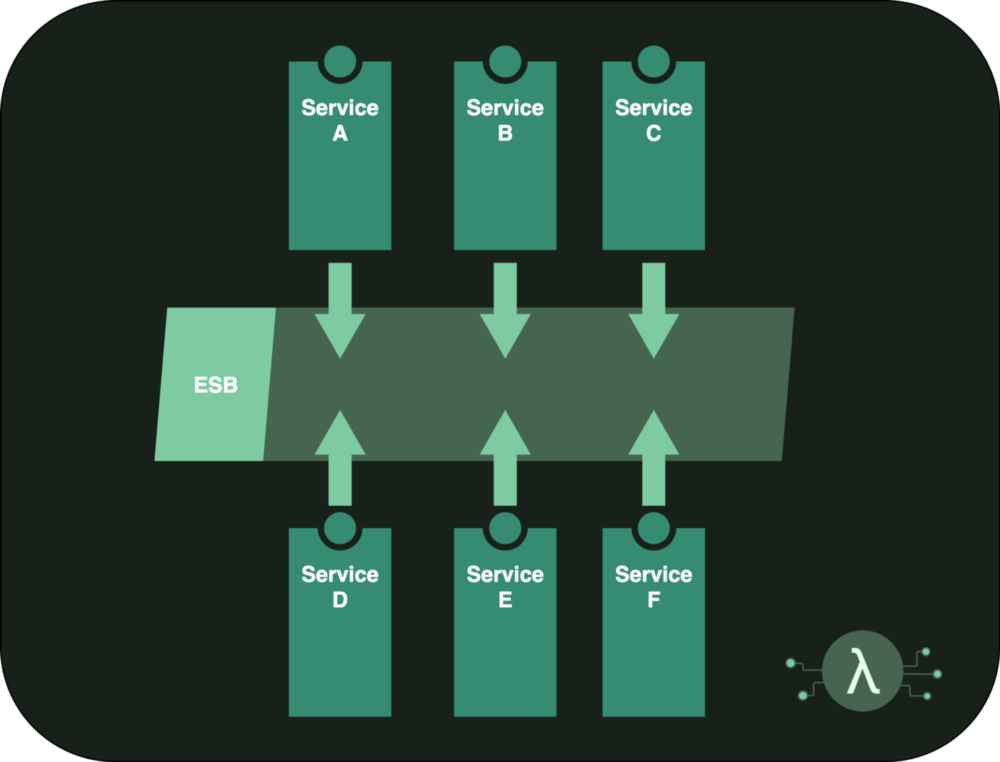

+++
title = "[译] EventBridge Storming - 如何构建最先进的事件驱动Serverless架构"

date = 2020-05-15
lastmod = 2020-05-15
draft = true

tags = ["EDA","Serverless"]
summary = "介绍如何使用 EventBridge Storming 来构建最先进的事件驱动Serverless架构"
abstract = "介绍如何使用 EventBridge Storming 来构建最先进的事件驱动Serverless架构"

[header]
image = ""
caption = ""

+++

英文原文来自 [EventBridge Storming — How to build state-of-the-art Event-Driven Serverless Architectures](https://medium.com/serverless-transformation/eventbridge-storming-how-to-build-state-of-the-art-event-driven-serverless-architectures-e07270d4dee)，[Ben Ellerby](https://medium.com/@bene_37069)。

> 备注：快速翻译（机翻+人工校对，没有精修），质量不高，一般阅读可以，不适合传播，谢绝转载。

微服务架构只有在以下情况下才能发挥作用:

- 拆分为明确的服务
- 可独立部署
- 只进行异步通信
- 掌握自己的数据

面向服务的架构（Service-Oriented Architecture/SOA），是微服务（Microservices）之前的一个术语，其用户（tenant）非常相似。SOA通常与我们所看到的现代微服务的通信机制不同。

SOA方法的一个流行的变体是事件驱动架构（Event-Driven Architecture/EDA）范式，在这个范式中，服务消费和产生事件，允许服务之间交付的松散耦合。这种SOA的方法通常依赖于企业服务总线（Enterprise Service Bus/ESB）来提供这些 "事件 "的传输。

什么是 Enterprise Service Bus (ESB)：

- Enterprise/企业：指的是在大型企业组织中使用，通常用于应对这些领域的复杂度，以及历史上所需的大量基础设施投资。
- Service/服务。因为它为不同的服务（业务流程的逻辑独立表示）提供了一种通讯的方式。
- Bus/总线：指的是计算机的硬件元素。指的是计算机的硬件元素，允许不同组件之间的信号传输。

> Event: “A significant change in state” — K. Mani Chandy

## EventBridge

### “Bridge over Troubled Architecture”

2019年AWS推出了一个新的Serverless服务--Amazon EventBridge，通过Serverless架构将事件流正式化。在这之前，很多人在Event-Driven范式中工作的时候，都是在CloudWatch Events之上 "黑 "了一个Bus来做事件。

关于EventBridge的完整理解，请看上一篇文章 [EventBridge: serverless架构中的关键组件](https://medium.com/serverless-transformation/eventbridge-the-key-component-in-serverless-architectures-e7d4e60fca2d)，并观看James Beswick的精彩介绍视频。

https://youtu.be/TXh5oU_yo9M

简而言之，EventBridge是AWS Lambda发布以来最大的Serverless宣告，是构建最先进的Serverless EDA的关键组件。

> The ESB is dead, long live the ESB

与典型的ESB解决方案相比，EventBridge是完全无服务器的。它不需要管理，并且可以轻松集成到所有现有的AWS服务中。默认情况下，所有来自CloudWatch的AWS云事件都会进入一个 "default"的EventBus，你可以在EventBridge内部为你的自定义应用事件构建自己的Event Bus。

### 避免"Lambda Pinball"

Lambda Pinball是ThoughtWorks所强调的无服务器反模式，在这个模式中，"当请求在越来越复杂的云服务图谱中跳转时，我们会在由ambdas、buckets和队列组成的纠缠不清的网络中忽略了重要的领域逻辑。"

这往往因为缺乏明确的服务边界。转向EDA并采用EventBridge可以带来很大的帮助--但这不是一个独立的银弹。

需要的是**聚焦服务**，确定明确的绑定上下文（从领域驱动设计中借用），并共享Event Schema，而不是代码、API接口或数据。

### "EventBridge Storming"

Event Storming是由Alberto Brandolini创建的一种定义业务领域中的事件、边界和实体的工作坊方法，作为领域驱动设计（DDD）的延伸。

在没有巨大的领域复杂性的情况下，全面的DDD可能需要花费大量的时间和精力，而且会导致系统的过度工程化。

而事件风暴法可以单独使用。

下面的指南将为大家介绍Event-Storm的步骤，以实现基于EventBridge的Event-Driven Serverless架构。
这个Even Storming的变体，我们最后称之为EventBridge Storming。**其重点不在于形式上的DDD，而在于基于EventBridge构建实用性的Serverless架构**。

"EventBridge Storming "可以用于Serverless greenfield 或 brownfield 项目，从极其简单到非常复杂的项目。我在EventBridge Schema Registry中确保用通用的语言，最大限度地理解Event在业务领域中的术语，并在EventBridge Schema Registry中创建独立的服务列表和Schema。

"EventBridge Storming"的好处：

- 减少耦合
- 更快的中长期开发速度。
- 架构适应性更强，减少重建风险
- 所需代码减少
- 团队更好的系统所有权
- 提高可用性

### EventBridge Storming指南

> "EventBridge Storming"：EventStorming的一个特定变体，使用EventBridge，可以为团队构建最先进的无服务器事件驱动架构减少返工和紧耦合。

基于EventBridge Storming的EventBridge Storming，首先由项目的业务和技术成员进行白板研讨会来了解他们的系统。这个过程最好是当面完成，并且要有大量的Post-It笔记在手。典型的Event Storming围绕着Post-It的颜色有特别的准则，虽然我们将专注于Event，这些规则并不那么重要。

在整个团队研讨会（步骤1-5）之后，技术团队将把这个环节的输出，继续编码到架构中（步骤6-8）。整个过程应该在一周内完成，步骤1-5在1天的会议中完成。具体的时间安排取决于领域的复杂性和团队的凝聚力。

> 理想的情况下，这些步骤最好是当面完成，但如果不可能的话，小组视频通话和使用像https://metroretro.io/ 这样的工具，仍然可以提高工作效率。
> 

TODO 1 - 8 steps

## 总结

简而言之，我们需要用事件驱动的方式来构建使用解耦服务。最先进的无服务器EDA利用EventBridge来实现这一目标。

Event Storming是一个非常有用的工具，它提供了关键的第一步。本文介绍的EventBridge Storming变体是使用EventBridge构建最先进的无服务器应用的实用指南。

这不是一个不可更改的计划，它是一个起点，这样的会议可以重复进行。

> "EventBridge Storming"：EventStorming的一个特定应用，使用EventBridge，可以为团队构建最先进的无服务器事件驱动架构减少返工和紧耦合。

