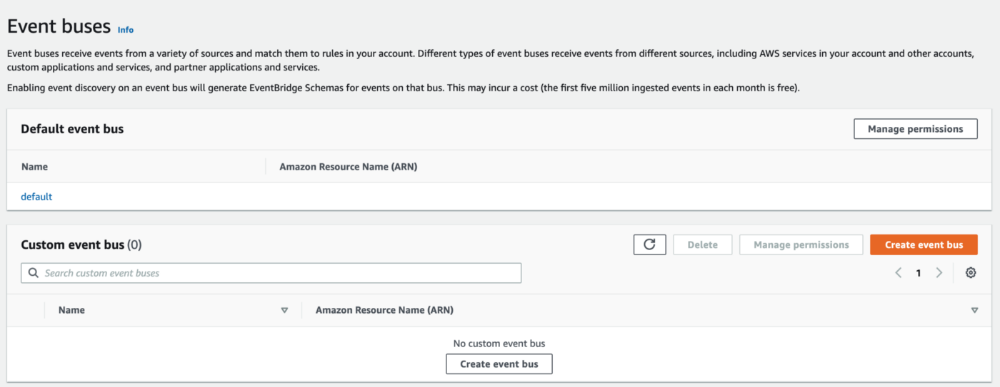
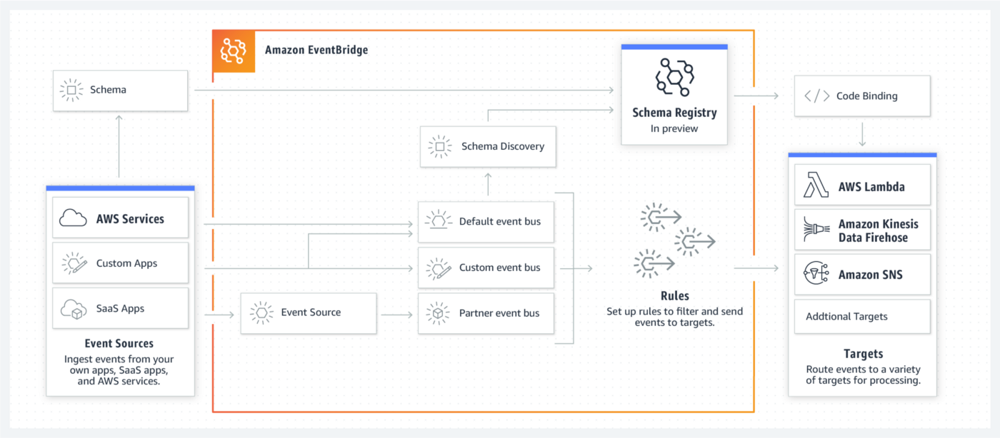

+++
title = "[译] EventBridge：Serverless架构中的关键组件"

date = 2020-05-14
lastmod = 2020-05-14
draft = true

tags = ["EDA","Serverless"]
summary = "EventBridge介绍"
abstract = "EventBridge介绍"

[header]
image = ""
caption = ""

+++

英文原文来自 [EventBridge: The key component in Serverless Architectures](https://medium.com/serverless-transformation/eventbridge-the-key-component-in-serverless-architectures-e7d4e60fca2d)，[Ben Ellerby](https://medium.com/@bene_37069)。

> 备注：快速翻译（机翻+人工校对，没有精修），质量不高，一般阅读可以，不适合传播，谢绝转载。

无服务器架构利用了像AWS Lambda这样的FaaS（Function as a Service）。FaaS让开发人员能够将他们的应用代码发送到云提供商，并让它以独立的方式运行，同时将底层服务器的所有细节抽象出来。这些函数必须通过触发器调用，无论是从AWS SDK直接调用，还是通过API网关的HTTP、DynamoDB流、Kinesis、Cognito、Alexa或S3.....

从这些FaaS触发器的例子中，我们可以看到，采用Serverless更多是向事件驱动的范式移动。

> Serverless-First架构必须将事件作为一级公民来对待---只有这样才能真正拥抱Cloud-Native的力量。

关于Lambda函数应该如何架构，有很多争论，从 "一个Lambda统治所有"的单体方法，到按服务拆分或按Microservice/MicroLambda拆分的方法。

根据我的经验，函数的粒度越细，架构的性能和适应性就越好。

微服务是很难的。管理API的版本、团队之间的沟通、数据重复等诸多方面都被证明具有挑战性。

那么，在 "Micro-Lambda "的方式下，用极其细粒度的Lambda函数：我们到底能如何让我们的生活变得更轻松？

事实上，我们将有更多服务使用CloudNative事件进行交互和响应，而不仅仅是HTTP。

### EventBridge

2019年AWS发布了一个新的无服务器服务--Amazon EventBridge，通过架构将Event的流动正式化。它通过提供Event Bus(es)来实现这一目标，同时还提供了供开发人员与这些Event进行交互的工具。

EventBridge被Serverless社区看作是自AWS Lambda以来最大的宣布。这是因为Serverless社区正在向Event-Driven架构转移，而EventBridge是Event-Driven Serverless拼图中缺失的一块。

> Event: “A significant change in state” — K. Mani Chandy
> 
> 事件：“状态的重大变化” — K. Mani Chandy

EventBridge帮助我们摆脱在纠缠不清的Lambda函数之间投递同步请求，这些请求会在Lambda、S3 Buckets、SQS、SNS等之间弹跳，形成 "Lambda Pinball"反模式。相反的是，我们应该从单向事件的角度来思考。

### 这和CloudWatch Event有什么不同?

其实不然!

它是AWS使用的相同的底层技术来调度你已经使用的AWS服务所产生的事件。引用AWS的说法。

> "CloudWatch Events和EventBridge是相同的底层服务和API，但EventBridge提供了更多的功能。" - AWS

CloudWatch Events使你的架构能够响应你所使用的AWS服务所产生的事件，虽然有生成自己的事件和使用cron和速率触发器的功能，但这并不是CloudWatch Events的主要功能。

话虽如此，在EventBridge正式化之前，一些无服务器架构就开始利用CloudWatch Events来黑客化EventBus的概念。

### 默认与自定义事件总线

每个 AWS 帐户总是至少有一个 EventBus，即 default 的 EventBus，其中包含经典的 CloudWatch 事件，用于 AWS 服务中的变化。EventBridge还允许您的架构创建自己的EventBus，这就是EventBrige的真正威力所在。

通过 AWS Console，或者通过 Serverless Framework 等 IaC 解决方案，你可以为你的架构需求创建 EventBuses，并让进入这些 Buses 的事件触发特定的 Lambda 函数。这对于简化微服务之间的沟通是一个游戏规则的改变，帮助我们走向事件驱动的范式。

### EventBridge Schema注册表

> "Amazon EventBridge schema注册表将事件结构--或schema--存储在一个共享的中心位置，并将这些schema映射到Java、Python和Typescript的代码中，因此在你的代码中很容易将事件作为对象使用。" - AWS

当微服务由不同的团队管理时，这些团队之间的沟通可能会很困难。例如，如果你有一个支付团队处理客户的付款，而一个营销团队在购买后2周后想触发后续调查，那么这两个团队需要协调，以确保调查邮件被触发。

现在，如果营销团队能够准确地知道要监听哪个事件，以及Event的输入结构（名字、姓氏和电子邮件字段..........），而不需要和另一个团队交谈，会怎么样呢？

或者开发人员甚至不需要离开他们的IDE就能知道？

那么，幸运的是，AWS通过Amazon EventBridge Schema Registry扩展了EventBridge的功能。Schema Registry 不仅允许您创建和管理事件的 Schema，还可以通过从 EventBus 实例中推断出事件的模式，自动生成飞过任何 EventBus 的 Schema。这些Schema是以OpenAPI格式，但也可以下载为TypeScript、Java和Python的完全类型的代码绑定。

### 如何开始使用EventBridge？

那么，第一步是转变思维方式，开始从事件角度思考你的架构，转向事件驱动。进行事件风暴研讨会是一个很好的方法，可以生成一个关键事件列表，列出你的系统需要在业务领域中处理的关键事件。然后，这些事件可以帮助你确定系统中的微服务边界。

从这里开始，你就可以创建一个自定义事件总线，并将正确的事件过滤和路由到正确的目的地。

在最新版本的Serverless框架中，创建一个自定义事件总线非常简单:

TODO：

> 侧面说明：通过EventBus触发Lambdas显然与通过HTTP触发不同。开发者在开发过程中不能依靠CURL/Postman来轻松触发功能。因此，这一点在sls-dev-tools项目的积压中，希望能够快速、反复地 "注入事件"。

## 结论

我自己和许多Serverless社区的人都认为EventBridge是自Lambda以来Serverless架构最大的事情。

当无服务器架构以事件驱动的方式结构化时，无服务器架构的工作效果最好，而EventBridge正是缺少的一块拼图。

EventBridge简化了服务&团队之间的沟通，减少了紧耦合，帮助我们避免了分布式单体。

是时候把Event作为一级公民来对待了，而EventBridge就是实现这一目标的工具。

