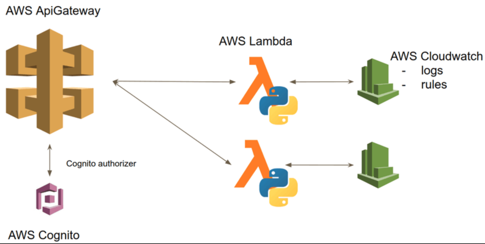
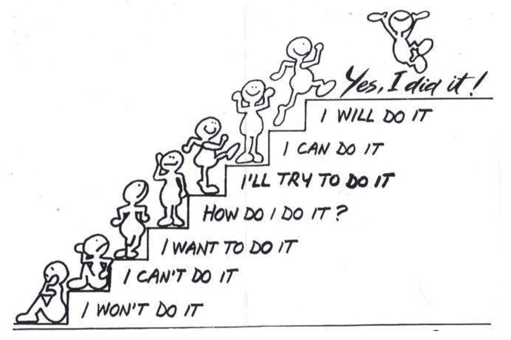
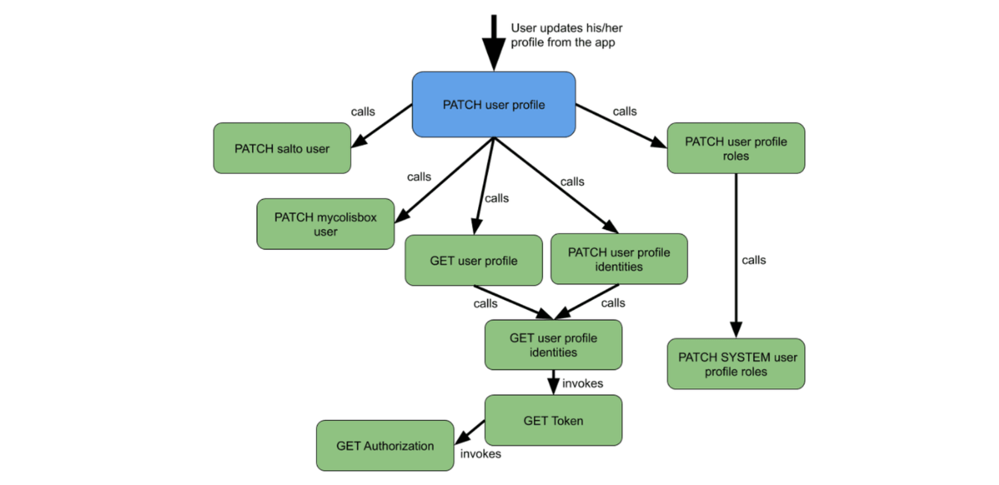
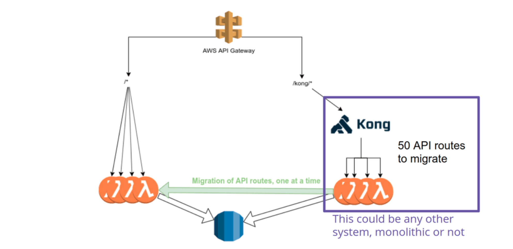

+++
title = "[译] 在AWS上迁移单体应用到serverless架构"

date = 2020-05-16
lastmod = 2020-05-16
draft = true

tags = ["EDA","Serverless"]
summary = "在AWS上迁移单体应用到serverless架构"
abstract = "在AWS上迁移单体应用到serverless架构"

[header]
image = ""
caption = ""

+++

英文原文来自 [Migrating Monolithic Apps to Serverless Architecture on AWS](https://www.sicara.ai/blog/serverless-architecture-migration-aws)，作者 Nicolas。

> 备注：快速翻译（机翻+人工校对，没有精修），质量不高，一般阅读可以，不适合传播，谢绝转载。

许多公司在AWS上使用无服务器架构创建应用。

他们通常从新项目的试点开始。

然后，被该技术所折服，他们开始研究将其战略遗留应用迁移到无服务器架构上。

这些应用可能具有以下特点：

- 构建在传统的基础设施上，如内部服务器

- 为用户提供基本服务，服务中断是不可接受的。

- 不断发展，以满足新的要求

让我们来谈谈将此类应用迁移到AWS云上的无服务器架构的挑战吧!

## 1. 定义目标无服务器架构

这是第一步。根据我自己的经验，这并不是迁移计划中最难的部分。如果你要从传统服务器迁移API，那么目标架构可能看起来像下面这样。

图：我上一个AWS无服务器迁移项目的API部分的目标架构

如果你不熟悉AWS无服务器服务，下面是对AWS无服务器服务的简单介绍：

- Lambda：在云端按需运行代码，按需服务

- API网关：使lambda可通过API调用

- Cognito：无服务器认证服务

- CloudWatch：监控、日志和调度规则

这里我只描述了这些服务的表面。如果你想了解更多关于它们的信息，请查看官方文档。

当然，除了上图中描述的简单架构模式之外，你可能还需要其他的无服务器架构模式。

AWS发布了很好的资源，可以帮助你找到合适的! 你可以阅读AWS Well-Architected Framework [Serverless Application Lens](https://d1.awsstatic.com/whitepapers/architecture/AWS-Serverless-Applications-Lens.pdf)，或者在 [cdk-patterns/serverless](https://github.com/cdk-patterns/serverless) GitHub 仓库中的所有模式都可以快速浏览一下。

有了这些资源在手，你就可以勾画出迁移到无服务器化后的应用架构的第一版图。

## 2. 如何切换到无服务器架构？

主要有两种方法。

### 大爆炸的方法

建立一个独立的、无服务器版本的应用程序。然后你告诉用户，当它准备好后就可以开始使用它。

优点：

- 从头开始构建无服务器的应用程序，所以不必介意传统系统的特殊性。

缺点：

- 需要在项目进行中的时候实现所有的应用程序的演变**两次**（在遗留的和新的应用程序中）。或者你需要将它们推迟到你发布新应用之前。

- 在你发布应用之前，最终，它并没有经过战斗测试。

- 要冒着刚发布后就被用户反馈淹没的风险。这可能会造成大量的必要改进的积压，尽管频繁的用户测试可能会减轻这种风险。

在真正的宇宙 "大爆炸 "之后，所有的事情都是一团糟，需要数百万年的时间才能尘埃落定。如果你走这条路，你的应用也有可能发生同样的风险。

尽管如此，如果你能在一段时间内避免改变应用，你还是可以采取这种方式。你可以让两个版本的应用程序并行运行，直到你有足够的信心关闭旧版本的应用程序。

### 逐步迁移到无服务器的方法

用无服务器版本的应用程序的组件来替换应用程序的组件，每次一个，而用户则使用这个混合版本的应用程序。

优点：

- 随着迁移的进行，你可以保持应用的不断发展。

- 您对您的应用程序的稳健性更有信心。在迁移过程中，您会定期对新组件进行实战测试。

- 在迁移结束时，不会有任何风险释放。您可以在迁移过程中考虑到用户的反馈意见

缺点：

- 这种方法比大爆炸的方法更复杂。你需要有一个明确的策略来创建一个混合型应用，让你在生产中使用的同时，一步步迁移它。

这种方法除了复杂性之外，在其他方面都击败了大爆炸方法。在很多情况下，大爆炸方法还是比较实用的。然而，在有些情况下，你需要逐步迁移的方法。

## 3. 如何在AWS上逐步切换到无服务器架构？

我们为客户做了一个无服务器迁移的项目，选择了分步走的方式。

### 单体API

整个事情包括一个移动应用（iOS和Android）通过API连接到后端。后端是在PostgreSQL数据库中存储数据。当我开始工作的时候，已经完成了向AWS云的提升和转移迁移。

部分迁移到无服务器托管服务也已经完成了。原来的应用程序是用Java编写的，已经被拆分成了几个Lambda函数。一些代码是用Python（和一小部分用JavaScript）重写的。API 调用由 EC2 实例上的一个 Kong API Gateway 处理。

API网关处理HTTP请求，并触发了Lambda。你可能会说，剩下的事情就不多了。

但是，这个现有的系统完全对应了 "分布式单体"的刻板印象，也就是Lambda Pinball！而这个系统的作用是什么呢？看下图，就能体会到这种反模式的感觉。

这个反模式并不是API代码一开始就存在的唯一问题。没有测试、bug、大量的代码重复、没有ORM与数据库的交互、没有Infrastructure as Code框架来部署、3种不同的语言......

但这种反模式中最值得强调的是：它确实和无服务器技术有关系。

而且，在开始使用无服务器技术时，很容易在不知不觉中发生。

下面是移动应用在 user/profile 路径上调用（call） PATCH 方法时的情况。 

这里的 "call" 是指 lambda 通过API网关做一个同步的HTTP调用，"invokers"是指直接用 AWS API call来调用 lambda。

在没有预热的情况下，这个API路由的第一次调用总是超时。

### 需求

这个应用程序几乎已经准备好可以投入生产，但是需要修正和改进一些bug。它必须在短时间内投入生产，所以从头开始重写不是一个选择。

客户也不愿意等待，因为改变架构永远不会有 "完美的时间"。无论如何，功能请求会不断地出现。因此，我们必须在开发的同时，一步一步地迁移应用程序。

### 我们是如何进行迁移的

首先，我们来回顾一下这次迁移的目标：

- 拥有一个完全无服务器的架构：删除运行Kong API网关的EC2实例。

- 清理微服务架构，去除(其中的) Lamba Pinball 问题

下面的图是我们使用的架构模式：

图：迁移到更好的架构，完全无服务器的策略（在EC2实例上没有Kong的情况下）

为了做到这一点，我们使用了AWS API Gateway的代理功能。我们将整个API放在一个 `/kong/*` 代理路由后面。

我们发布了第一个版本的应用程序，并将所有的API调用都完成了对新创建的API Gateway的调用。然后，我们使用下面的流程，一次一个路由迁移应用程序。

### 迁移过程

- 为路由创建一个新的Lambda，实现与现有的函数相同的功能。

* 同时，我们引入了之前缺乏的东西：使用无服务器框架的Infrastructure as Code部署、测试、ORM、从Python 2、Java或Node翻译成Python 3.7等。

- 使用新的 lambda 而不是旧的 lambda 发布一个 staging 应用程序。这就像在API调用相应的路由中删除 `/kong` 前缀一样简单。

- 检查是否所有的东西都能与这个staging应用一起使用

- 一段时间后，彻底验证 staging APP，并将其投入生产。

为了避免 Lambda pinball 反模式，我们选择每个API路线正好有1个Lambda。这使得每个Lambda略显复杂，但消除了架构负担。

另一个可用的选择是使用最近发布的 Event Bridge 服务。它可以让你既保持你的 Lambda 短小，又避免Lambda Pinball。

确保你一定要关注它，因为它真的是一个改变游戏规则的东西!

为了避免返工，我们试图将我们的bug修复和功能积压与迁移同步。我们计划最好是在新代码中实现新功能。

使用这种模式，我们能够在2个月内完全重构API，同时修复bug，将应用投入生产，并定期交付新功能。

## 总结

我们研究了AWS中将单体应用迁移到无服务器架构的不同选择。

如果你希望保持快节奏的开发，又不耽误迁移，可以使用上面介绍的架构模式。

用它真的没有什么特定于Kong的东西。你可以用它和你的API的任何技术栈一起使用!

