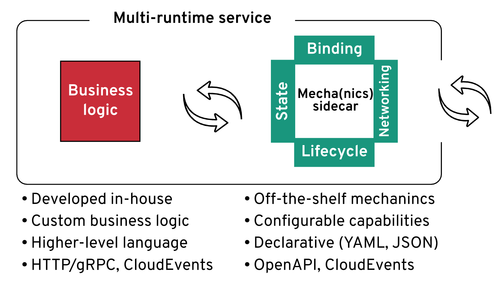

+++
title = "[译] Operator和Sidecar: 软件交付的新模式"

date = 2020-06-22
lastmod = 2020-06-22
draft = false

tags = ["EDA","Serverless"]
summary = "Sidecar 和 operator 将会成为一种主流的软件发布和使用模式，在某些情况下甚至会取代我们习惯的软件类库和框架。"
abstract = "Sidecar 和 operator 将会成为一种主流的软件发布和使用模式，在某些情况下甚至会取代我们习惯的软件类库和框架。"

[header]
image = ""
caption = ""

+++

英文原文来自 [Operators and Sidecars Are the New Model for Software Delivery](https://thenewstack.io/operators-and-sidecars-are-the-new-model-for-software-delivery/)，作者 [Bilgin Ibryam](https://thenewstack.io/author/bilgin-ibryam/)。

-----------------------

> 备注：快速翻译（机翻+人工校对，没有精修），质量不高，一般阅读可以，不适合传播，谢绝转载。

现在的开发者要开发弹性和可扩展的分布式系统。这些系统在面对安全问题时要容易修复，要容易进行低风险的增量升级。系统要从开源模式的软件重用和创新中获益。使用应用框架与嵌入式类库，在不同的语言实现全部这些是不可能的。

最近我在博客上写了一篇关于  [ "多运行时微服务架构" ](https://www.infoq.com/articles/multi-runtime-microservice-architecture/) 的文章，探讨了分布式系统的需求，如生命周期管理、高级网络、资源绑定、状态抽象，以及这些抽象在这些年是如何变化的。我还讲了 ["分布式系统在Kubernetes上的演进"](https://www.youtube.com/watch?v=CZPEIJFJV9k) ，涵盖了Kubernetes Operators和sidecar模型是如何作为主要的创新机制来提供相同的分布式系统原语。

在这两次中，主要的收获是预测Kubernetes上的软件应用架构会向 operator 管理的 sidecar 模式发展。Sidecar和Oprator可能会成为主流软件分发和使用模式，在某些情况下甚至会取代我们惯用的软件类库和框架。

sidecar模型支持用不同语言编写的应用程序组合，以提供组合而成的价值，运行的更快，没有运行时的耦合。让我们来看几个具体的sidecar和oprator的例子，然后我们将探讨这种新的软件组合模式对我们的影响。

## 进程外智慧的崛起

在Kubernetes中，sidecar是核心设计模式之一，实现方式很轻松：将多个容器组织在一个Pod中。Pod结构保证了容器始终放在同一个节点上，并且可以通过网络、文件系统或其他IPC方法进行交互而实现合作。而 oprertor 支持自动化、Sidecar与平台的其他部分的管理和集成。Sidecar代表了一个语言无关、可扩展的数据平面，为自定义应用提供分布式原语。而Operator则代表他们的集中化管理和控制平面。

让我们来看看sidecar模型的几种流行表现形式。

### Envoy

Istio、Consul等服务网格正在使用Envoy等透明服务代理，为分布式系统提供增强的网络功能。Envoy可以提高安全性，可以实现高级流量管理，提高弹性，增加深度监控和追踪功能。不仅如此，它还能理解越来越多的第七层协议，如Redis、MongoDB、MySQL和最近增加的Kafka。它还增加了应答缓存功能，甚至支持WebAssembly，可以实现各种自定义插件。Envoy是一个很好的例子：透明服务代理如何为分布式系统增加高级网络功能，而不将代理纳入到分布式应用组件的运行时中。

### Skupper

除了典型的服务网格外，还有一些项目，比如Skupper，通过外部代理来实现应用网络能力。Skupper通过7层虚拟网络解决多集群Kubernetes通信难题，并提供高级路由和连接能力。但它不是将Skupper嵌入到业务服务运行时，而是在每个Kubernetes命名空间中运行一个实例，作为一个共享的sidecar。

### Cloudstate

Cloudstate是sidecar模型的另一个例子，但这次是为serverless开发模型提供有状态的抽象。它通过GRPC为EventSourcing、CQRS、Pub/Sub、Key/Value存储和其他用例提供有状态的原语。同样，它也是一个sidecar和operator的例子，但这次是为serverless编程模型提供有状态的抽象。

### Dapr

Dapr是由微软发起的一个相对年轻的项目，它也是采用sidecar模型来提供以开发者为中心的分布式系统原语。Dapr提供了状态管理、服务调用和故障处理、资源绑定、pub/sub、分布式跟踪等抽象。尽管Dapr和Service Mesh提供的功能有一些重叠，但两者在本质上有很大不同。Envoy与Istio是从服务中注入并透明运行的，代表的是一种操作工具。而Dapr则必须通过HTTP或gRPC从应用运行时显式调用，它是一个针对开发者的显式sidecar。它可以理解为一个分布式原语的类库，但是是分布式的，并以sidecar的方式使用，这种模式对于使用分布式能力的开发者来说可能非常有吸引力。

### Camel K

Apache Camel 是一个成熟的集成类库，并在Kubernetes上重新发现了自己。它的子项目 Camel K 大量使用operator模型来改善开发者的体验，并与Kubernetes平台深度集成。虽然Camel K并不依赖sidecar，但通过其CLI和operator，它能够重用同一个应用容器，并在远程Kubernetes集群中执行任何本地代码修改，时间不到一秒。这是另一个通过operator模式针对开发者使用软件的例子。

## 更多内容

而这些只是一些通过 sidecar 和 operator 探索各种方法的先锋项目。目前有更多的工作来减少基于容器的分布式架构引入的网络开销，比如数据平面开发工具包（DPDK），这是一个绕过Linux内核网络栈层面而直接访问网络硬件的用户空间应用。在Kubernetes项目中，还有创建具有更细化的生命周期保证的sidecar容器。还有一些新的基于GraalVM实现的Java项目，如Quarkus，可以减少资源消耗和应用启动时间，这使得更多的工作负载适用于sidecars。所有这些创新都使的sidecar模式更具吸引力，并得以诞生更多这样的项目。

图：提供分布式系统原语的 Sidecar

我预期会看到更多围绕具体用例的项目出现，比如在Sidecar中出现长期运行流程的状态化编排，如 Business Process Model and Notation （BPMN）引擎。Sidecar中的作业调度器。无状态集成引擎，即sidecar中的企业集成模式的实现。Sidecar中的数据抽象和数据联合引擎。Sidecar中的 OAuth2/OpenID 代理。sidecars中用于serverless工作负载的可扩展的数据库连接池。作为sidecars的应用网络等等。但是，为什么软件厂商和开发者会改用这种模式呢？让我们来看看它提供的一些好处。

## 带有控制平面的运行时而非类库

如果你是一个如今的软件供应商，可能你已经考虑过将你的软件以API或基于SaaS的解决方案的形式提供给潜在用户。这可能是最快的软件消费模式，而且不费力就能提供。根据软件的性质，你可能也会将你的软件作为类库或运行时框架来发布。是时候考虑是否把它也作为带有operator的容器来提供。这种分发软件的机制和由此产生的架构有一些非常独特的好处，这是类库机制无法提供的。

### 支持多语言的使用者

通过开放协议和标准提供可使用的类库，就可以为所有的编程语言开放它们。可在HTTP协议上作为sidecar和可使用的类库运行，使用JSON等文本格式，不需要任何特定的客户端运行库。即使在低延迟和高性能的交互时使用gRPC和Protobuf，生成这样的客户端仍然比在应用运行时包含第三方自定义类库并实现某些接口更容易。

### 应用架构无感

显式sidecar架构（相对于透明架构）是一种软件能力使用方式，作为一个独立的运行时，藏在以开发者为中心的API后面。它是一个正交的功能，可以添加到任何应用程序中，无论是单体、微服务、基于函数、基于actor或任何介于两者之间的应用程序。它可以服务于动态性较差的环境中的单体，也可以服务于基于云的动态环境中的每个微服务。在Kubernetes上创建sidecars是非常简单的，在许多其他软件编排平台上也可以做到。

### 对发布周期不匹配的容忍度

业务逻辑始终是定制的，并在内部开发。分布式系统原语是众所周知的商品特性，作为平台特性或运行时库直接使用。你可能会使用第三方开源项目或公司的状态抽象、消息客户端、网络弹性和监控类库等软件。而这些第三方实体有其发布周期、关键修复、CVE补丁，也会影响软件发布周期。当第三方类库作为一个独立的运行时（sidecar）来使用时，升级过程会比较简单，因为它是在一个API后面，不与应用运行时耦合。更容易管理团队和使用的第三方库供应商之间的发布周期的不匹配。

### 控制平面包含心态

当特性作为类库被使用时，它就被包含在应用程序运行时中，了解它的工作原理，如何配置、监控、调整和升级成为你的责任。这是因为语言运行时（如JVM）和运行时框架（如Spring Boot或应用服务器）决定了如何包含、配置、监控和升级第三方类库。

当软件能力作为一个独立的运行时（如sidecar或独立的容器）被使用时，它以Kubernetes operator的形式自带控制平面。

这有很多好处，因为控制平面了解它所管理的软件（操作者），并附带所有必要的管理智能，否则将作为文档和最佳实践分发。更重要的是，operator还与Kubernetes深度集成，并提供了开箱即用的独特平台集成和操作管理智能。operator是由创建operator的开发人员创建的，他们了解容器化功能的内部结构，知道如何操作最合适。operator是容器中的可执行SRE，operator的数量和功能正在稳步增加，更多的operator和市场即将出现。

## 未来的软件发行和使用

### 软件以带控制平面的Sidecar方式发行

假设你是一个Java框架的软件提供商。你可能会把它作为一个包或Maven工件发布。也许更进一步，发布的是容器镜像。无论哪种情况，在今天的云原生世界中，这都不够好。用户仍然必须知道如何在不停机的情况下对运行中的应用程序进行补丁和升级。他们必须知道如何备份和恢复其状态。他们必须知道如何配置他们的监控和警报阈值。他们必须知道如何检测并从复杂的故障中恢复。他们必须知道如何根据当前的负载情况来调整应用程序。

在所有这些类似场景中，答案是Kubernetes operators形式的智能控制平面。operator将应用程序的平台和领域知识封装在声明式配置的组件中，以管理工作负载。

**Sidecar 和 operator 将会成为一种主流的软件发布和使用模式，在某些情况下甚至会取代我们习惯的软件类库和框架。**

假设提供的是软件类库，并作为依赖被包含在使用者的应用程序中。也许它是上面描述的后端框架的客户端类库。例如，在Java中，你可能已经对它进行了认证，以便在JEE服务器上运行，提供了Spring Boot Starters、Builders、Factories和其他实现，这些实现都隐藏在一个干净的Java接口后面。你甚至可能已经把它也带回到了.Net。

有了Kubernetes的 operator 和 sidecars，所有这些都对使用者隐藏。工厂类被operator取代，唯一的配置接口是自定义资源的YAML文件。然后，operator负责配置软件和平台，以便用户可以以显式的sidecar，或者透明代理的形式来使用它。在所有情况下，应用程序都可以通过远程API进行使用，并与平台功能完全集成，甚至和其他依赖的operators集成。让我们看看是如何实现的。

### 通过远程API而不是侵入式类库来使用软件

可以将 sidecar 理解为类似于OOP中的 **组合优于继承**（composition over inheritance）原则，但是是在多语言的上下文中。Sidecar 是一种迥异的组织方式，通过将不同进程中的能力组合从而组织为应用责任，而不是将它们作为依赖包含到一个单一的应用运行时中。当作为一个类库使用软件时，需要实例化一个类，通过传递一些值对象来调用它的方法。当把它作为一个进程外能力使用时，需要访问一个本地进程。在这个模型中，方法被API取代，进程内方法调用被HTTP或gRPC调用取代，值对象被类似 CloudEvents 的东西取代。这是一个从应用服务器到Kubernetes（作为分布式运行时）的变化。从特定语言的接口到远程API的变化。从内存调用到HTTP，从值对象到CloudEvents等。

这就需要软件提供商分发容器和控制器来操作。要创建能够在本地构建和调试多个运行时服务的IDE。用于快速将代码变更部署到Kubernetes并配置控制平面的CLI。编译器能够决定编译什么内容到自定义应用运行时，使用 sidecar 和 编排平台的哪些能力。

图：软件使用者和供应商生态系统

从长远来看，这将导致标准化 API 的整合，这些 API 用于使用 sidecar 中的通用原语。我们将拥有多语言API，而不是特定语言的标准和API。例如，我们将拥有通过HTTP协议使用类似CloudEvents的多语言API，而不是Java数据库连接(JDBC)API、Java的缓存API(JCache)、Java持久性API(JPA)。以Sidecar为中心的API，用于消息传递、缓存、可靠的网络、cron作业和定时器调度、资源绑定（与其他API、协议的连接器）、幂等性、SAGA等。而所有这些能力都将以 operator 的形式包含在管理层中来交付，甚至用自助服务的用户界面来包装。Operator 在这里是关键赋能者，因为它们将使这个更加分布式化的架构在Kubernetes上易于管理和自操作。Operator 的管理接口由 CustomResourceDefinition 定义，代表了另一个面向公众的API，但仍然是应用特有的。

这是以不同的方式分发和消费软件的心态打转变，由交付速度和可操作性驱动。这是从单运行时到多运行时应用架构的转变。这是一种类似于摩尔定律结束时硬件行业从单核到多核平台所必须经历的转变。这是一个通过构建所有拼图元素而慢慢发生的转变：我们已经统一采用并标准化了容器，我们已经有了通过Kubernetes进行编排的事实标准，可能很快就会有改进的Sidecar，operator的快速采用，CloudEvents作为广泛认同的标准，Quarkus等轻运行时，等等。有了基础，应用、生产力工具、实践、标准化的API和生态系统也会到来。

