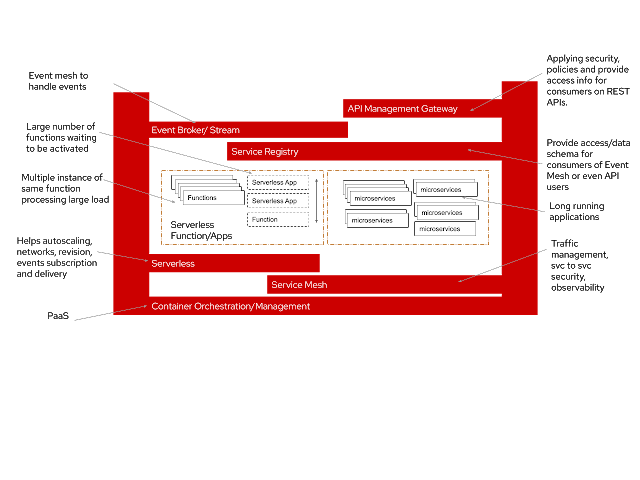
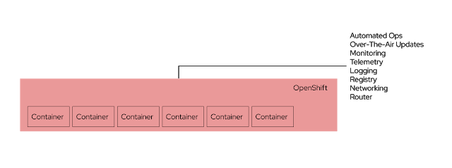
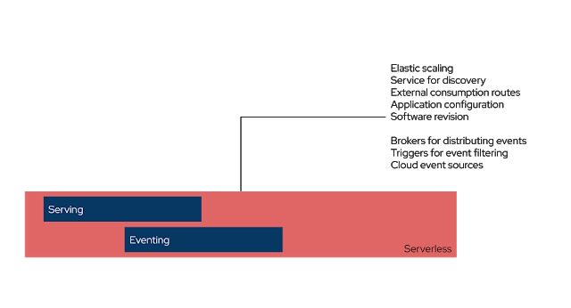
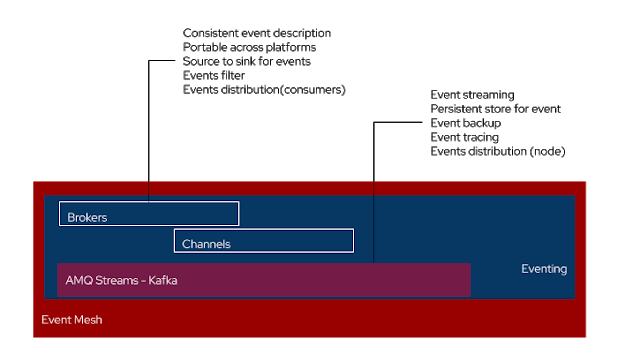
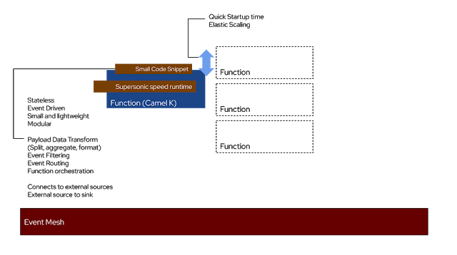
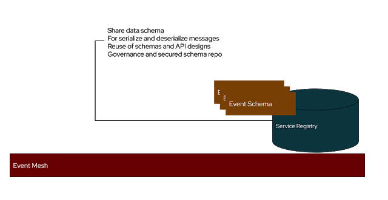
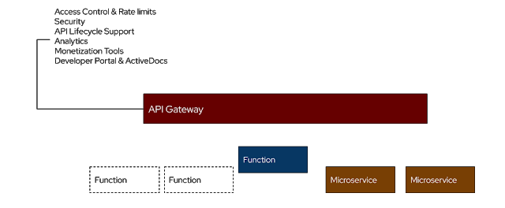

+++
title = "[译] Serverless集成组件"

date = 2020-07-10
lastmod = 2020-07-10
draft = false

tags = ["Serverless"]
summary = "Serverless让开发人员专注于代码，而不用操心基础设施的搭建。为了提供这种环境，同时提供适当的监控和可靠的骨干网来处理大吞吐量的事件：这就是Serverless集成应有的形态。"
abstract = "Serverless让开发人员专注于代码，而不用操心基础设施的搭建。为了提供这种环境，同时提供适当的监控和可靠的骨干网来处理大吞吐量的事件：这就是Serverless集成应有的形态。"

[header]
image = ""
caption = ""

+++

英文原文来自 [Serverless Integration Components](http://wei-meilin.blogspot.com/2020/07/serverless-integration-components.html)，作者 [CHRISTINA](http://wei-meilin.blogspot.com/)。

-----------------------

> 备注：快速翻译（机翻+人工校对，没有精修），质量不高，一般阅读可以，不适合传播，谢绝转载。

Serverless不是一个可选项，而应该在所有的云原生环境中提供。当然，并不是所有的应用都应该采用serverless。但如果你仔细观察，应用的大部分模块都是无状态的，往往闲置，偶尔使用。有些应用则需要处理高度波动的负载。这些应用都是以Serverless方式运行的最佳候选。

Serverless让开发人员专注于代码，而不用操心基础设施的搭建。为了提供这种环境，同时提供适当的监控和可靠的骨干网来处理大吞吐量的事件：

**这就是Serverless集成（基于Kubernetes）应有的形态**。

一切都是基于容器的。为什么要关心serverless的底层技术呢？难道这一切不应该都是透明的吗？如果你的目标是在混合云/多云上进行托管或构建，而这个混合云/多云是供应商不锁定的，这意味着参与其中的将不仅仅是开发人员。你最终会需要团队之间的合作，并与传统服务和微服务等各种应用一起工作。有了统一和标准化的技术，将使团队采用新型应用的学习曲线变得平坦，使维护变得不那么复杂。

从开发到平台，所有的东西都应该无缝地协同工作，并且能够轻松地实现自动化和管理。

我们来分析一下所有的要素。

Plantform/平台：提供完整的基础设施和平台管理的平台，具有自助服务能力，服务发现和应用容器政策和合规性。

Serverless平台： 处理函数/应用的自动伸缩。对底层基础设施进行抽象。 搭建Deplayment的修订版本，便于回滚。并为发布者和消费者统一事件。

Event Mesh：事件被发布到mesh，以及分布式的消费者。事件的基本结构是一致的，在不同的平台之间应该是可移植的。所有的事件都是灵活的，受控的，并可快速推送。 由可靠的stream network提供支持，有助于存储事件流，用于大数据处理/AI/ML数据集的追踪、审计或后期重播。

集成函数:  serverless集成的典型特征包括：小、轻、无状态和事件驱动。这些特性使得应用具有弹性，以应对我们今天所面临的供应不足/过剩的问题。从运维层面来看，这些都是在被事件触发后停止并(spin up)起来的应用。为了更好的优化资源。而对于开发者来说，这是一个简单的模块化代码片段，他们写好后会自动运转起来。所以他们可以专注于代码而不是部署相关的问题。而集成函数是指通常处理事件中的路由、数据有效载荷的转换，以及其他组成和编排问题的应用。 也常用于连接外部服务，以及作为系统之间的桥梁。

微服务或长时间运行的应用：这些都是长时间运行的应用，有状态，比较重，总是被调用。它们中的一些会向mesh发送事件，以触发serverless函数的初始化和启动，或者仅仅是事件的另一个消费者。

Service Registry：用于在API和事件驱动的架构中共享标准的事件模式和API设计，无论是无服务器函数还是常规应用的事件监听。 在运行时解耦数据结构和管理数据类型。

API管理：网关安全和管理透出API端点。具备对消费者的访问控制和限制，管理控制台和访问端点的数据分析。

重申，这是我对提供一个完整的serverless应用环境所需要的组件的两点看法。 