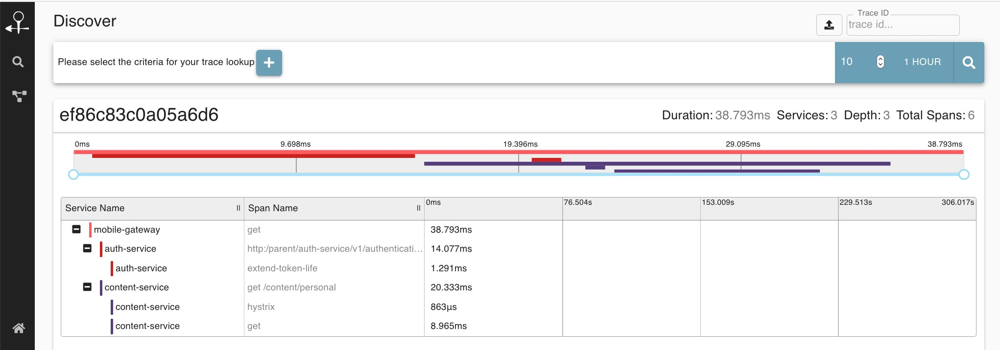

+++
title = "[译] 深层系统的弹性"

date = 2020-08-17
lastmod = 2020-08-17
draft = false

tags = ["微服务"]
summary = "对于想要维持弹性、容错性和性能的研发团队来说，深层系统是一个严峻的挑战。如何在不影响弹性的情况下，构建复杂的、带有深度链接微服务的系统？本文介绍有助于在深层系统中维持弹性的3种方式。"
abstract = "对于想要维持弹性、容错性和性能的研发团队来说，深层系统是一个严峻的挑战。如何在不影响弹性的情况下，构建复杂的、带有深度链接微服务的系统？本文介绍有助于在深层系统中维持弹性的3种方式。"

[header]
image = ""
caption = ""

+++

英文原文来自 [Resilience in Deep Systems](https://www.infoq.com/articles/resilience-deep-systems/)，作者  Amir Souchami 。

-----------------------

### 主要心得

- 当系统深度增长时，会使公司快速诊断和响应错误或性能瓶颈的能力变得复杂。
- 寻求封装服务并让服务聚焦在业务需求上，需要平衡服务的粒度和系统的深度。
- 寻求定义一组有凝聚力且松散耦合的服务，尽可能地异步通信，以提高深度系统的容错性。
- 使用正确的工具来克服深层系统带来的可观察性挑战，这样当问题发生时，就很容易理解问题发生的地点和原因。
- 通过将平衡的服务粒度、异步通信和正确的工具结合起来，提高系统的可观察性，从而最大限度地提高系统的弹性。

--------

当使用微服务架构来构建一个成功的产品，尤其是一个需要快速成长的产品时，你迟早会意识到你的系统变得有"深度"了。

系统的深度可以认为是应用栈中微服务层的数量。

当今最前沿的云技术，如Service Mesh、Container和Serverless计算，使团队能够轻松地在系统中添加许多微服务层。

在这样的系统中，一个微服务其实并不能真正的独立--它依赖于其他微服务，反之亦然。

当微服务的通信越来越深时，会使公司快速诊断错误或性能瓶颈的能力变得复杂。

因此，对于想要维持弹性、容错性和性能的研发团队来说，深层系统是一个严峻的挑战。

如果没有正确的思维方式和正确的工具，产品和它的客户将受到危害。

可以在不影响弹性的情况下，构建复杂的、带有深度链接微服务的系统。

以下是有助于在深层系统中维持弹性的3种方式。

### 1. 服务粒度

**不要跟风炒作；要与真实的业务能力相对应。**

在使用微服务架构设计复杂的应用时，我们希望定义一组内聚的、松散耦合的服务。这方面最大的一个问题是，我们 **如何将应用拆分成微服务**？

因为微服务架构本质上遵循了 "做一件事，做好一件事" （"Do one thing and do it well"）的Unix哲学，可以简单地说，每个原子函数都应该是一个微服务（这是炒作）。虽然理论上听起来很完美，但如果简单遵循这种理念，就会产生大量的微服务。**你是否能成功有效地维护这么多服务呢？**

> 我准备在 us-west-1 中提供 "整数/integer"服务。
>
> 一个被炒作的开发者曾经如是说。

在现实中，我们发现，定义与真实业务能力相对应的微服务，会产生大量自成一体的业务功能碎片。这些碎片仍然可以非常凝聚，松散耦合，具备良好的扩展性，可测试，可构建，并可以归属于一个足够小的团队。所有这些都是微服务的支柱。

此外，通过创建共享库，即DRY（Don't Repeat Yourself）来避免多个微服务中的代码重复是一种常见的做法。DRY是一个重要的概念。然而，有时候过于炒作。在现实中，我们发现，有时候共享类库会把我们的微服务相互耦合起来，降低了微服务之间隔离性和独立性的效果。同时也会拖慢团队进行改变的速度，因为他们并不总是能完全了解其他团队的使用模式。事实上，平衡微服务的粒度与平衡适量的共享类库是相辅相成的。在超粒度的微服务架构中，共享类库和代码重复都是一种负担。但当保持微服务粒度平衡时，代码重复的代价可以通过独立性的提高得到补偿。

### 2. 共享数据 - 安全和一致性

**请注意：最糟糕的单体是分布式单体**

微服务可以用各种同步和异步的方式进行通信。随着系统的发展，微服务之间的连接变得更加复杂。以容错的方式进行通信，并让在服务之间移动的数据保持一致性和新鲜成为一个巨大的挑战。

有时，微服务必须以同步的方式进行通信。然而，在整个深层系统中使用同步通信，如REST，使得链中的各个组件之间的耦合非常紧密。它对网络的可靠性产生了更大的依赖。同时，链中的每一个微服务都需要完全可用，以避免数据不一致，或者更糟糕的是，如果微服务链中的一个环节出现故障，系统就会中断。在现实中，我们发现这样的深度系统表现得更像一个单体，或者更准确地说是一个分布式单体，这使得微服务的优势无法充分体现。

使用异步的、事件驱动的架构，可以让微服务向其他微服务发布新鲜的数据更新。与同步通信不同，添加更多的数据订阅者是很容易的，而且不会导致发布者服务使用更多的流量。

异步系统是"最终一致"的。这意味着，如果微服务在消费数据更新时滞后，它的数据副本可能不是最新的。在读密集型、高吞吐量的服务中，使用同步通信需要复杂的缓存管理和清理机制、服务发现和重试技术。然而，通过使用 "推" 而不是 "拉"，系统可以几乎实时地处理数据更新，并处理掉所有的开销。

事实上，事件驱动的架构具有挑战性，采用起来也并非易事。你将不得不在你的技术栈中引入新的工具--事件总线/event bus（如Kafka）。并且要学会如何处理事件流，而不是只响应同步的REST请求。即使这很有挑战性，需要额外的努力才能采用，但许多公司还是转向了这样的架构，因为它有助于降低数据的不一致性问题，提高深度系统的弹性。

### 分布式故事讲述

**不要丢失事件流转的视角；提高可观察性。**

可观察性不仅仅是知道问题发生了，而是知道问题发生的原因。

越来越多的微服务层以及它们的日志数据对研发团队和业务分析师来说都是一个挑战。排除问题有时需要跨多个代码库、团队和仪表盘进行推理。不幸的是，它通常会与 "on-call shifts from hell/地狱代班" 和团队之间的 "blaming games/指责游戏" 一起出现。

假设你已经将各种微服务的日志和指标收集到一个集中的分析工具中，（比如ElasticSearch和/或数据湖），并假设你有一套定义明确的警报，当你试图弄清楚一个深层系统中的问题时，你可能还是会发现自己迷失并说 "我们没有足够的可见性，让我们创建一个仪表盘 " 或者 "天哪！我们有太多的仪表盘了"。

这时，请问自己：**仪表盘或日志跟踪如何才能讲述一个故事？**

这里有一些关于可视化 "what and why" 的想法：

**Correlation ID/Trace ID**

深层系统是由微服务链组成的，每个微服务都会记录有意义的操作数据。通过在一个工作流的开始分配一个关联ID，（无论是http请求还是触发的作业），然后通过日志消息传播它，这些日志消息是基于调用链的顺序请求和响应，你将获得通过所有通信渠道跟踪一个完整流程的机会。观察你的日志，无论是在特定的关联ID上，还是通过关联ID对数据进行分组，实际上都可以讲述一个很好的故事，这将帮助你从整个深层系统中快速找到并确定问题。

**Distributed tracing**

分布式跟踪系统，如 Zipkin 和 Jaeger，使你能够在不同的系统和服务中跟踪调用栈。这也是通过自动创建唯一的 trace ID来实现的，然而，与普通的 "Correlation ID"不同，这些系统带有强大的UI工具，可以深入到你的系统中去，精确地指出问题。另外，与 "CorrelationID" 不同的是，traces通常只在你的一小部分流量上运行，所以虽然它非常详细，但你并没有一个完整的视图。此外，分布式追踪有时会丢失业务视角，因为对于非工程人员（如业务分析师、支持人员）来说，追踪结果可能很难理解。

**监测工作流程自动化**

你是否有这样的业务SLA：在这个SLA中，事件需要在一定的时间内处理，同时要经过微服务链？像Zeebe（用于微服务协调的工作流引擎）这样的工具将使您能够监控超时或其他工作流错误，并能够配置错误处理策略，如自动重试或升级到可以手动解决问题的团队。Zeebe可以100%记录您的业务事件，并提供公司端到端工作流状态的可视性，包括在途工作流的数量、平均工作流持续时间、工作流内的错误等。这样的工具通常更适合各种非工程人员的利益相关者。如果你曾经尝试过在深层系统中收集这些遥测数据，你就会知道这不是一件小事。

这些可观察性技术的结合，可以让你更快地聚焦和定位问题。许多科技公司发现，它可以消除对团队造成的不必要的干扰，这些团队对于事故处理并不需要但可能已经牵涉其中。

### 总而言之

**正确的思维方式和正确的工具正在到来。**

弹性的第一个关键是要从平衡粒度开始。如果你选择以一种极度精细的方式来构建你的微服务，那么维护、数据一致性和整体可观察性简直会成为一场噩梦。抵制诱惑，不要全身心地投入到粒度和共享库中去。更倾向于定义回答真实业务能力的微服务，并检查你的共享代码是在加速你还是在阻碍你。

微服务必须进行通信，共享数据，并保持其新鲜感。因此，弹性的第二个关键是尽可能将你的思维方式转向异步、事件驱动的架构。一开始会很难，也很耗时。REST等同步方法论比较容易实现，而事件驱动则是小菜一碟（译者注：less trivial，感觉语义不对，作者少写了一个 not？）。然而，越早越好。在你的流量增长，并导致你的微服务为了保持其数据副本的新鲜性和一致性而互相伤害之前就这样做。尽量避免发现自己在一个非常容易出错的环境中浪费了宝贵的资源。

考虑到这一点，弹性的第三个关键是使用正确的工具来增加可观察性。这将使你在需要的时候，能够引入更多的业务能力（即微服务）和更多的业务能力之间的沟通渠道，而不至于丢失视角。请记住，你的产品和技术栈的增长正在扩大你需要监控和分析的遥测量。而能够轻松地推理问题意味着更健康的业务和更快乐的团队。

### 关于作者

Amir Souchami 是 ironSource Aura 的首席架构师。他对技术有着极大的热情，他不断地学习最新的技术，以保持敏锐的洞察力，并创建具有积极商业投资回报率的高扩展性解决方案。Amir喜欢与团队和个人合作，共同设想并实现他们的目标。跟随他一起聊一聊。同理心、瑜伽、徒步旅行、创业公司、广告技术、机器学习、流处理、持续交付和微服务。

