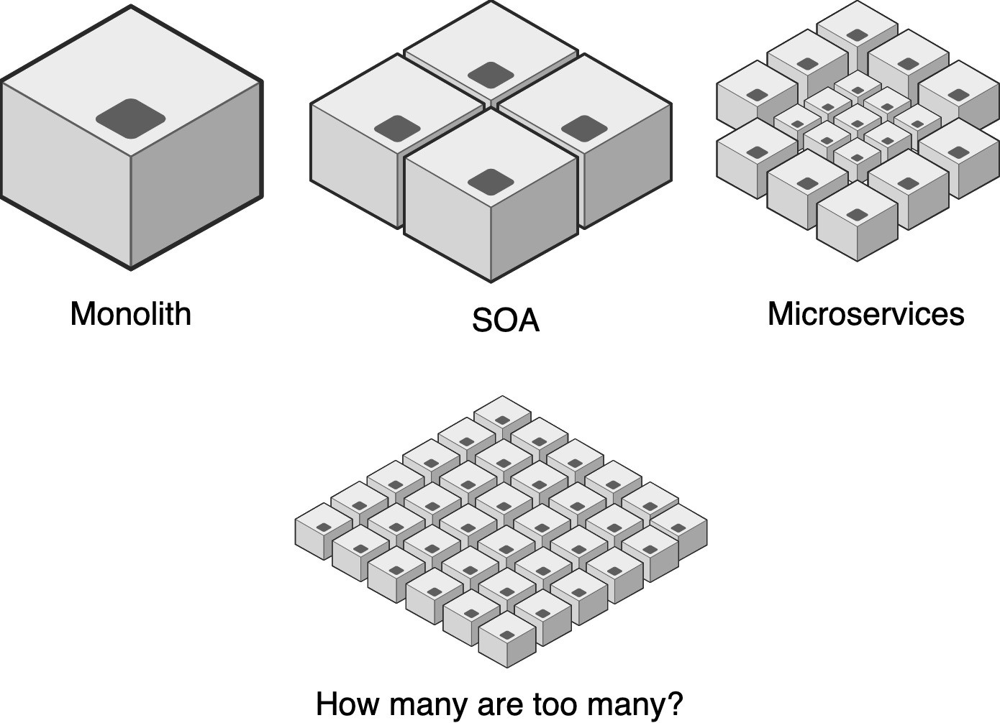
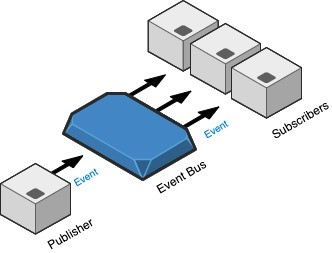

+++
title = "[译] 深度系统的弹性"

date = 2020-08-17
lastmod = 2020-08-17
draft = false

tags = ["Serverless"]
summary = "Serverless让开发人员专注于代码，而不用操心基础设施的搭建。为了提供这种环境，同时提供适当的监控和可靠的骨干网来处理大吞吐量的事件：这就是Serverless集成应有的形态。"
abstract = "Serverless让开发人员专注于代码，而不用操心基础设施的搭建。为了提供这种环境，同时提供适当的监控和可靠的骨干网来处理大吞吐量的事件：这就是Serverless集成应有的形态。"

[header]
image = ""
caption = ""

+++

英文原文来自 [Resilience in Deep Systems](https://www.infoq.com/articles/resilience-deep-systems/)，作者  Amir Souchami 。

-----------------------

### 主要心得

- 当系统深度增长时，会使公司快速诊断和响应错误或性能瓶颈的能力变得复杂。
- 寻找封装服务并让服务聚焦在业务需求上，需要平衡服务的粒度和系统的深度。
- 寻求定义一组有凝聚力且松散耦合的服务，尽可能地异步通信，以提高深度系统的容错性。
- 使用正确的工具来克服深度系统带来的可观察性挑战，这样当问题发生时，就很容易理解问题发生的地点和原因。
- 通过将平衡的服务粒度、异步通信和正确的工具结合起来，提高系统的可观察性，从而最大限度地提高系统的弹性。

--------

当使用微服务架构来构建一个成功的产品，尤其是一个需要快速成长的产品时，你迟早会意识到你的系统变得有"深度"了。

系统的深度可以认为是应用栈中微服务层的数量。

当今最前沿的云技术，如Service Mesh、Container和Serverless计算，使团队能够轻松地在系统中添加许多微服务层。

在这样的系统中，一个微服务其实并不能真正的独立--它依赖于其他微服务，反之亦然。

当微服务的通信越来越深时，会使公司快速诊断错误或性能瓶颈的能力变得复杂。

因此，对于想要维持弹性、容错性和性能的研发团队来说，深度系统是一个严峻的挑战。

如果没有正确的思维方式和正确的工具，产品和它的客户将受到危害。

可以在不影响弹性的情况下，构建复杂的、带有深度链接微服务的系统。

以下是有助于在深度系统中维持弹性的3种方式。

### 1. 服务粒度

**不要跟风炒作；要与真实的业务能力相对应。**

在使用微服务架构设计复杂的应用时，我们希望定义一组内聚的、松散耦合的服务。这方面最大的一个问题是，我们 **如何将应用拆分成微服务**？

因为微服务架构本质上遵循了 "做一件事，做好一件事" （"Do one thing and do it well"）的Unix哲学，可以简单地说，每个原子函数都应该是一个微服务（这是炒作）。虽然理论上听起来很完美，但如果简单遵循这种理念，就会产生大量的微服务。**你是否能成功有效地维护这么多服务呢？**

> 我准备在 us-west-1 中提供 "整数/integer"服务。
>
> 一个被炒作的开发者曾经如是说。

在现实中，我们发现，定义与真实业务能力相对应的微服务，会产生大量自成一体的业务功能碎片。这些碎片仍然可以非常凝聚，松散耦合，具备良好的扩展性，可测试，可构建，并可以归属于一个足够小的团队。所有这些都是微服务的支柱。

此外，通过创建共享库，即DRY（Don't Repeat Yourself）来避免多个微服务中的代码重复是一种常见的做法。DRY是一个重要的概念。然而，有时候过于炒作。在现实中，我们发现，有时候共享类库会把我们的微服务相互耦合起来，降低了微服务之间隔离性和独立性的效果。同时也会拖慢团队进行改变的速度，因为他们并不总是能完全了解其他团队的使用模式。事实上，平衡微服务的粒度与平衡适量的共享类库是相辅相成的。在超粒度的微服务架构中，共享类库和代码重复都是一种负担。但当保持微服务粒度平衡时，代码重复的代价可以偿付于独立性的提高。

### 2. 共享数据 - 安全和一致性

**请注意：最糟糕的单体是分布式单体**

微服务可以用各种同步和异步的方式进行通信。随着系统的发展，微服务之间的连接变得更加复杂。以容错的方式进行通信，并让在服务之间移动的数据保持一致性和新鲜成为一个巨大的挑战。

有时，微服务必须以同步的方式进行通信。然而，在整个深层系统中使用同步通信，如REST，使得链中的各个组件之间的耦合非常紧密。它对网络的可靠性产生了更大的依赖。同时，链中的每一个微服务都需要完全可用，以避免数据不一致，或者更糟糕的是，如果微服务链中的一个环节出现故障，系统就会中断。在现实中，我们发现这样的深度系统表现得更像一个单体，或者更准确地说是一个分布式单体，这使得微服务的优势无法充分体现。

使用异步的、事件驱动的架构，可以让微服务向其他微服务发布新鲜的数据更新。与同步通信不同，添加更多的数据订阅者是很容易的，而且不会导致发布者服务使用更多的流量。

异步系统是"最终一致"的。这意味着，如果微服务在消费数据更新时滞后，它的数据副本可能不是最新的。在读密集型、高吞吐量的服务中，使用同步通信需要复杂的缓存管理和清理机制、服务发现和重试技术。然而，通过使用 "推" 而不是 "拉"，系统可以几乎实时地处理数据更新，并处理掉所有的开销。

事实上，事件驱动的架构具有挑战性，采用起来也并非易事。你将不得不在你的技术栈中引入新的工具--事件总线/event bus（如Kafka）。并且要学会如何处理事件流，而不是只响应同步的REST请求。即使这很有挑战性，需要额外的努力才能采用，但许多公司还是转向了这样的架构，因为它有助于降低数据的不一致性问题，提高深度系统的弹性。

### 分布式故事讲述

**不要丢失事件流转的视角；提高可观察性。**

可观察性不仅仅是知道问题发生了，而是知道问题发生的原因。

越来越多的微服务层及其它们的日志数据对研发团队和业务分析师来说都是一个挑战。排除问题有时需要跨多个代码库、团队和仪表盘进行推理。不幸的是，它有时会与 "地狱里的待命班 "和团队之间的 "指责游戏 "一起出现。

假设你已经将各种微服务的日志和指标收集到一个集中的分析工具中，（比如ElasticSearch和/或数据湖），假设你有一套定义明确的警报，当你试图弄清楚一个深层系统中的问题时，你可能还是会发现自己失去了视线，说 "我们没有足够的可见性，让我们创建一个仪表盘 "或者 "天哪！我们有太多的仪表盘了"。

这时，请问自己：仪表盘或日志跟踪如何才能讲述一个故事？
这里有一些关于可视化 "发生了什么和为什么 "的想法。

