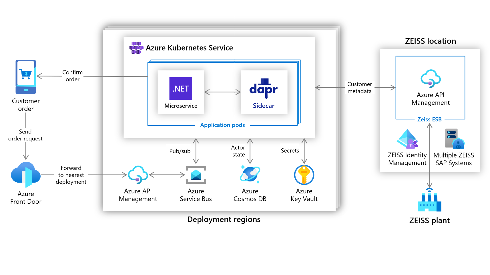
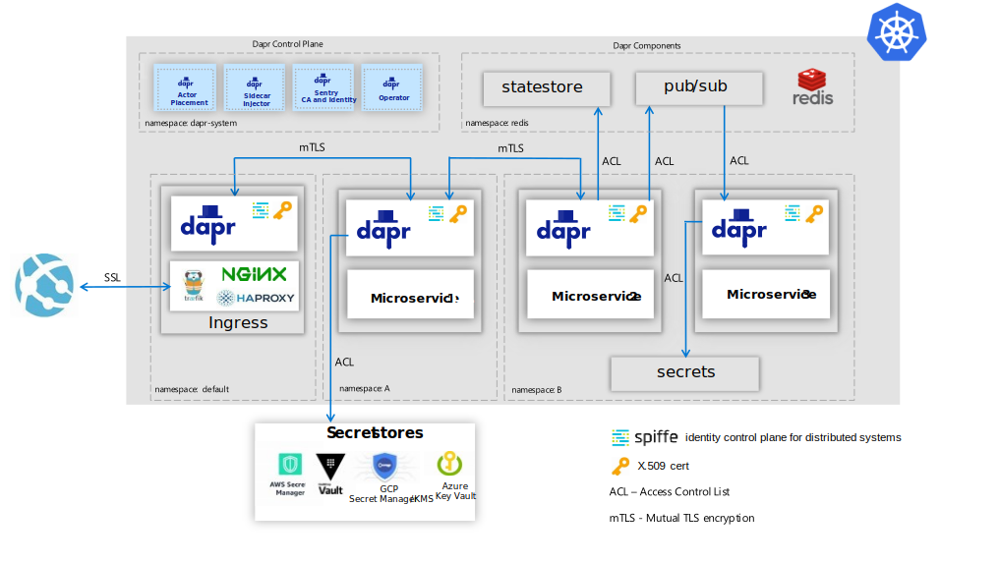
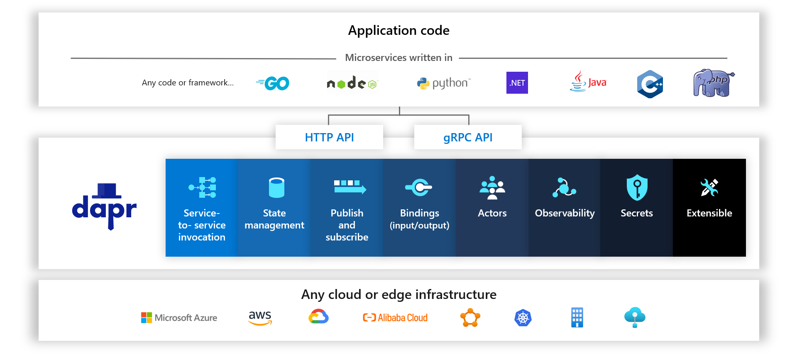

+++
title = "[译] Dapr v1.0发布"
date = 2021-02-18
lastmod = 2021-02-18
draft = false

tags = ["Dapr"]
summary = "Dapr是一个开源、可移植、事件驱动的运行时，它使开发人员能够轻松地构建运行在云平台和边缘的弹性而微服务化的无状态和有状态的应用程序，从而降低基于微服务架构构建现代云原生应用的准入门槛。"
abstract = "Dapr是一个开源、可移植、事件驱动的运行时，它使开发人员能够轻松地构建运行在云平台和边缘的弹性而微服务化的无状态和有状态的应用程序，从而降低基于微服务架构构建现代云原生应用的准入门槛。"

[header]
image = ""
caption = ""

+++

英文原文来自 Dapr 官方网站博客文章 [Announcing Dapr v1.0
](https://blog.dapr.io/posts/2021/02/17/announcing-dapr-v1.0/)。

-----------------------

**分布式应用程序运行时现在已经生产就绪啦！**

今天，我们很高兴地发布分布式应用运行时（[Distributed APplication Runtime / Dapr](https://dapr.io/)）的 [v1.0版本](https://github.com/dapr/dapr/releases/tag/v1.0.0)，它已经达到了生产就绪所需的稳定性和企业准备。Dapr是一个开源、可移植、事件驱动的运行时，它使开发人员能够轻松地构建运行在云平台和边缘的弹性而微服务化的应用程序，无论是无状态还是有状态。Dapr 让开发人员能够专注于编写业务逻辑，而不是解决分布式系统的挑战，从而显著提高生产力并减少开发时间。Dapr 降低了基于微服务架构构建现代云原生应用的准入门槛，而通过此次发布的v1.0版本，Dapr 应用可以部署到生产场景中的自托管基础设施或 Kubernetes 集群。

自 [2019年10月首次发布](https://cloudblogs.microsoft.com/opensource/2019/10/16/announcing-dapr-open-source-project-build-microservice-applications/) 以来，Dapr已有 [14个版本](https://github.com/dapr/dapr/tags)，每个版本都建立在大量的社区和用户反馈基础上，以推动改进、稳定性和性能。这些版本立足于构建真实的应用，反映了当今开发者在开发云原生应用时的实际情况；无论是在云平台、边缘还是私有基础设施上，社区都在加紧贡献与Azure、AWS、阿里巴巴和 Google cloud 集成的 Dapr 组件。

## 解决现实世界场景中的分布式应用挑战 

从成立之初开始，Dapr 开源项目就面向那些正在构建新的现实世界绿色地带（greenfield）应用的开发者，以及那些在云原生架构中迁移和利用现有应用和组件的开发者。Dapr 方法的关键是满足开发者和企业的现状，帮助他们实现应用的现代化，并利用他们在云原生和微服务架构中的现有技能。在v1.0版本中，我们专注于将 Kubernetes 作为运行生产应用的主要托管环境，随着Dapr的进一步成熟，我们希望在无服务器（serverless）环境中看到 Dapr。在过去的一年半时间中，我们与早期采用者和合作伙伴紧密合作，因此 Dapr 现在已经成为多个基于 Kubernetes 的生产和预生产应用的核心。在这个用户驱动的过程中，Dapr 社区改进了Java、.NET和Python SDK的原生语言体验，用真实的工作负载测试了规模和性能，增加了安全特性，并证明了 Dapr 的 Actor 编程模型是工作流和物联网（IoT）场景的最佳选择。以下是一些早期采用者的故事，以凸显 Dapr 如今的使用情况。

### 蔡司：光学和光电子领域的国际技术领导者

ZEISS 面临的挑战是维护和更新一个具有20年历史的带有硬编码业务规则的后端系统。原来的订单验证和路由解决方案是基于一个具有固定容量的单体架构，开发人员在不直接在系统中重新配置表格的情况下，无法轻松的更新、重新路由或跟踪订单。此外，业务部门无法直接控制其订单处理流程。由于存在大量的系统依赖，变更总是需要代价高昂而耗时的开发人员干预。为了解决这个问题，ZEISS 使用 Azure 和 Dapr 开发了一个新的应用程序，可以更快地完成客户订单，同时还加快了开发速度，并改善了公司的业务连续性。你可以在 [这里](https://customers.microsoft.com/en-us/story/1336089737047375040-zeiss-accelerates-cloud-first-development-on-azure-and-streamlines-order-processing) 阅读更多关于他们的故事。

### Ignition Group：一家位于南非的技术企业，专注于客户承诺和销售支持工具

Ignition Group 打造的订单处理软件可以跟踪产品、管理订阅和处理来自各种来源的支付。订单处理涉及许多依赖，有一个采购跟踪机制，这个机制会调用客户订阅，触发会计和计费流程，并确定适当的支付渠道。Ignition Group 希望微服务能给其工作流逻辑带来好处——高可用性、弹性、可扩展性和性能。使用 Dapr 和 .NET Core，Ignition Group 构建了一个新的、可扩展性更好的、可维护的订单处理和支付系统，该系统目前已在生产中运行。Ignition Group 今天已经运行在生产中，你可以在 [这里](https://customers.microsoft.com/en-us/story/1335733425802443016-ignition-group-speeds-development-and-payment-processing-using-dapr-and-azure) 阅读更多关于他们的故事。

### Roadwork：采集数据洞若观火

Roadwork 是一家为自主系统提供端到端平台的初创公司，让用户产生可执行的洞察力并据此行动。目前，他们专注于数据提取技术，并以全面集成自主系统为路径。通过对 Dapr 与 [KEDA](https://keda.sh/) 的梳理，他们在 Kubernetes 上创建了一个生产服务，根据传入的客户负载请求，自动扩展应用和集群。Dapr 提供了使用 RabbitMQ 的 pub/sub 的抽象和集成，其能够轻松拥有 [竞争消费者模式](https://docs.dapr.io/developing-applications/building-blocks/pubsub/pubsub-overview/#consumer-groups-and-competing-consumers-pattern)。今天，Roadwork的第一个产品 Scraper.ai 已经在生产中运行。在 [这里](https://blog.dapr.io/posts/2021/02/09/running-dapr-in-production-at-roadwork/) 了解更多信息。

## 社区和生态系统

是社区的努力让 Dapr 成长到 v1.0。自 Dapr 首次公布以来，开源社区团结在 Dapr 周围并不断成长，令人惊叹——从2019年10月的114个贡献者增长到今天的700个。在短短的16个月内，增长了6倍多!

社区对项目的贡献涉及到 Dapr 的每一个仓库，范围包括提交问题、参与功能提案讨论、提供样本，当然也包括贡献代码。社区成员对项目贡献最大的部分包括 Dapr 运行时、文档、CLI 和 SDK。另外一个关键的贡献领域是创建了一个丰富的组件生态系统。可供开发人员使用的组件超过70个，使 Dapr 成为一个可以适用于广泛场景的解决方案，包括开源技术和云提供商的特定集成。当开发人员希望创建具有高可移植性的云平台无关的应用程序时，这些使得 Dapr 成为一个有吸引力的选择。

贡献并不局限于个人，还包括阿里云、HashiCorp、微软等组织，以及上文提到的 ZEISS 和 Ignition Group 等早期采用者。Dapr 生态系统还包括合作伙伴的技术栈，这些技术栈为使用 Dapr 的开发者提供了附加值。例如，New Relic 提供了关于他们的监控工具如何与 Dapr 无缝工作的指导，这要归功于 Dapr 使用的标准跟踪协议，这些协议可以在不改变任何代码的情况下轻松地检测您的应用程序。

培养一个开放和包容的社区是 Dapr 项目的首要目标。作为该承诺的一部分，我们分享了 [向开放治理模式的过渡](https://blog.dapr.io/posts/2020/09/30/transitioning-the-dapr-project-to-open-governance/)，这也是我们保持 Dapr 开放、供应商中立和包容性的方式。我们的愿景是继续这一旅程，并打算在不久的将来让 Dapr 加入一个开放软件基金会。同时，我们邀请您通过 [GitHub](https://github.com/dapr)、Dapr [社区定期会议](https://github.com/dapr/community#community-meetings) 和最近推出的 [Discord 服务器](https://aka.ms/dapr-discord)  与 Dapr  社区互动。

> "在阿里云，我们相信 Dapr 将引领微服务的发展。通过采用Dapr，我们的客户现在可以以更快的速度来构建可移植和健壮的分布式系统。" —— 阿里云资深技术专家 李响

## 发布亮点

在最近的几个月中，我们已经发布了三个 v1.0 版本的候选版本，专注于从社区获得反馈，并为v1.0版本做准备。在性能、安全、高可用性（HA）和一致性等方面更深入地关注于生产就绪。完整的发布说明可以在 [这里](https://github.com/dapr/dapr/releases/tag/v1.0.0) 获得，以下是一些亮点：

### 作为生产环境的Kubernetes 

对于v1.0版本，Kubernetes 是首选的托管环境，它与 [Dapr控制平面和 Dapr sidecar架构深度集成](https://docs.dapr.io/operations/hosting/kubernetes/kubernetes-overview/)。例如，在运维上，通过Dapr CLI "init" 和 "upgrade" 命令简化了 Dapr 在 Kubernetes 上的安装和升级，这些命令可以拉取正确的 Dapr 运行时版本，并确保这些版本以受控的方式推出，包括迁移正在使用中的证书。您可以在 HA 模式下安装 Dapr 控制平面，确保多个实例同时运行，而且 Dapr sidecar 有一个健康端点，可以实现 Kubernetes 就绪（readiness）和活泼度（liveness）探针以确定其健康状态。在整个发布候选版本的过程中，我们与早期采用者密切合作，以确保他们能够以可运维的方式迁移到每个 Dapr 运行时版本，而不是构建新的集群。请参阅 [生产部署指南](https://docs.dapr.io/operations/hosting/kubernetes/kubernetes-production/) 以了解更多信息。

### 性能、一致性和支持 

在云原生应用中，性能是至关重要的，而 Dapr 对高性能非常重视。一个经常被提起的话题是，由 sidecar 模型为应用程序完成所有繁重工作所带来的影响，以及数据平面性能的权衡取舍。其中一个特别关注的领域是服务调用构建块，在这里，当通过两个 Dapr sidecar 在两个应用之间调用并收到响应时，[Dapr 在p90时增加了约1.2ms的端到端延迟，在p99时增加了约2ms](https://docs.dapr.io/operations/performance-and-scalability/perf-service-invocation/)。由此可见，Dapr具有极低的服务间延迟，并针对高吞吐量场景进行了优化。Dapr 有超过70个由社区开发的组件，为了确保对这些组件的使用信心，它们要经过一系列的一致性测试。组件首先从 alpha 状态开始，最终达到 GA 状态，并需要用户在生产中使用它们。对于v1.0版本，只有部分已经在生产中广泛使用的组件被批准为 GA，其他组件在满足标准后也将加入其中。与众多开源云原生技术一样，变更、修复和改进的引入速度很快，这意味着受支持版本存在滚动窗口。重要的是，Dapr v1.0版本宣称 API 层面是稳定的，如果未来需要修改，将通过 [版本机制](https://docs.dapr.io/operations/support/support-versioning/) 来保证 API 的完全向后兼容，如果需要破坏性的修改，则会提前几个版本注明。最后，从支持的角度来看，[当前和之前的版本都将支持](https://docs.dapr.io/operations/support/support-release-policy/) 在出现关键问题或安全问题时进行补丁更新。

### 安全

安全一直是 Dapr 的核心主题，因为我们已经认识到基于微服务架构构建安全的现代分布式应用的复杂性，而 Dapr 已经通过了多项独立的[安全审计](https://docs.dapr.io/concepts/security-concept/#security-audit)。为了抵御应用程序之间的中间人攻击，您需要进行加密，而 Dapr 通过其控制平面服务发出的x.509证书提供加密，这些证书会自动更新和滚动。为了提供对资源的访问控制，如状态存储、密钥、服务间调用，或发布/订阅特定主题的能力，您需要细粒度的访问控制策略（ACL）。当使用 [spiffe](https://spiffe.io/) 作为身份标准访问资源时，Dapr提供了广泛的ACL。当运行应用程序时，您可以将这些应用程序隔离在不同的命名空间中，以便进行运维部署和隔离。这些广泛的安全能力在下图中显示，这里有三个利用 Dapr 安全特性的微服务：

### 编程语言和SDK

Dapr 以其编程语言、框架和工具拥抱所有的开发者社区。Dapr 被设计为可以通过 HTTP 和 gRPC 协议从任何编程语言中使用，这意味着您不需要在编译时包含任何依赖关系。当然，为了改善开发者的原生语言体验，[Java、.NET、Python和Go的SDK](https://docs.dapr.io/developing-applications/sdks/) 也以v1.0 生产就绪的形式发布，这反映了它们在社区和组织中的成熟应用。这些SDK可以让您作为开发者，使用您最喜欢的开发环境，如 VS Code 或 IntelliJ。JavaScript/Node.js、C++、Rust 和 PHP 的 SDK目前处于预览阶段，随后将发布v1.0版本。PHP SDK包括对 Actor 的支持，这是社区为 Dapr 广泛且不断增长的编程语言列表做出贡献的一个极佳的例子。

## 展望未来

通过这个 v1.0 版本，我们为构建现代云原生应用所需的基本构建块奠定基础的旅程才刚刚起步。社区驱动意味着社区将在未来的版本中设定项目的优先级，其中许多优先级已经被投票通过。例如，增强现有构建块的亮点，包括在状态管理中使用 OData 查询和过滤多个值的能力。在 pub/sub 中，[支持 CloudEvents v1.0 过滤功能](https://github.com/dapr/dapr/issues/2582)，以根据消息内容过滤出用户感兴趣的事件。在可观测性方面，提供一个API 用于 [从应用中追踪事件](https://github.com/dapr/dapr/issues/100)，防止您不得不绑定到特定的监控类库，并使 actor 能够直接[订阅 pub/sub](https://github.com/dapr/dapr/issues/501) 事件，从而开启了丰富的事件驱动场景。

新的构建块提案包括用于读写应用程序配置数据的配置 API，例如来自 Azure Configuration Manager  或 GCP Configuration Management。领导者选举构建块，提供创建单例实例、同步或锁定语义能力。用于网络级服务调用的透明代理构建块，使您能够根据 URL 或 DNS 地址来路由消息，以及用于熔断器、隔离舱和超时等模式的更多弹性构建块。

最后，在v1.0版本中，Dapr 集成了多个开发者框架，包括 ASP.NET Core、Java Spring Boot、Azure Functions 和 Logic Apps，而我们认为这还将继续，更多的开源框架如 Django、Nodejs 和 Kyma 都是潜在的例子。此外，考虑到 Dapr 的托管平台独立性，在虚拟机、边缘平台（如Azure Stack Hub或AWS Outpost）和其他分布式系统平台上提供对 Dapr 控制平面一流的支持，可以实现应用的可移植性。

## 开始和贡献

我们希望您能试用 Dapr v1.0。您可以使用文档中的 [入门指南](https://docs.dapr.io/getting-started/) 进行学习，然后通过 [快速入门](https://docs.dapr.io/getting-started/quickstarts/) 来深入了解。如果你需要更多信息，[样本库](https://github.com/dapr/samples) 是 Dapr 社区捐赠的不同的应用程序的展示。Dapr 文档 [docs.dapr.io](https://docs.dapr.io/) 是全面的指南，还有几本书，包括[《 Learning Dapr》](https://learning.oreilly.com/library/view/learning-dapr/9781492072416/)、[《使用Dapr和.NET实践微服务》](https://www.packtpub.com/product/practical-microservices-with-dapr-and-net/9781800568372)以及最新发布的免费电子书[《Dapr for .NET开发者》](https://aka.ms/dapr-ebook)。如果您有任何疑问，遇到问题或想与社区的其他成员交流，Dapr社区随时在 [Discord](https://aka.ms/dapr-discord) 上欢迎您的到来。

对于 Dapr 来说，v1.0版本的发布只是一个开始，在这个过程中，我们感谢并鼓励您的持续帮助、反馈和贡献。无论是编写新的组件，提出建议，贡献新的构建块，还是增强您最喜欢的语言的SDK，我们都希望听到您的意见并与您一起参与。在这个微服务开发的时代，作为一名开发者，这是一个令人兴奋的时刻，Dapr 将释放您的生产力和创造力，轻松构建现代化的分布式应用。我们非常高兴的看到您继续使用这个项目，看到您使用它进行构建，并对 Dapr 的发展保持关注。

## 译者注

1. 英文原文来自 Dapr 官方网站博客文章 [Announcing Dapr v1.0](https://blog.dapr.io/posts/2021/02/17/announcing-dapr-v1.0/)。

2. 译者所在的阿里云云原生团队深度参与了 Dapr 1.0 的开发，同时也正在内部小规模的试点 Dapr ，稍后将分享阿里云在 Dapr 上的实践。

3. 文中提到的  [《 Learning Dapr》](https://learning.oreilly.com/library/view/learning-dapr/9781492072416/) 一书，我们团队正在翻译中，预计很快就将出版发行，欢迎关注。

4. [Dapr中文社区](https://github.com/dapr-cn) 目前正在组织翻译 Dapr 的官方文档，预计不久将完成部分章节并在官方上线，同样欢迎关注，更欢迎一起参与。

