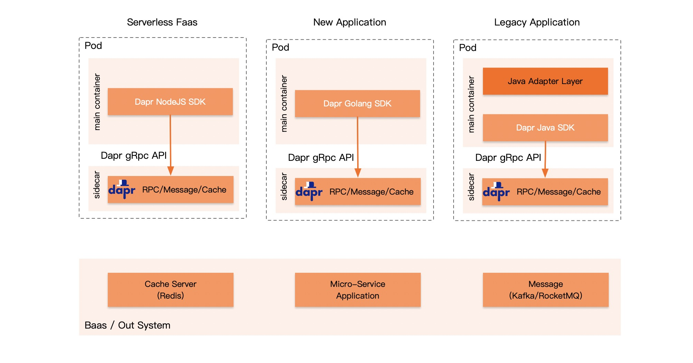
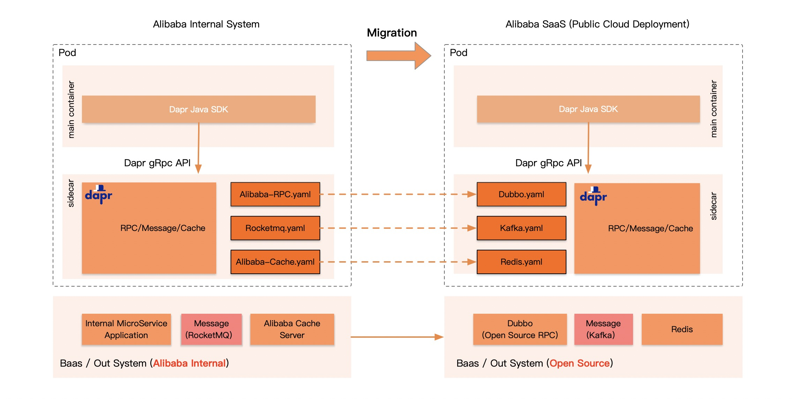

+++
title = "云原生分布式应用运行时 Dapr 在阿里的实践"
date = 2021-03-30
lastmod = 2021-03-30
draft = false

tags = ["Dapr"]
summary = "作为 Multiple Runtime 架构在业界最早的探索者，阿里巴巴很早就在生产落地中尝试使用 Dapr ，是 Dapr 的早期采用者之一，这篇文章分享了 Dapr 在阿里的实践。"
abstract = "作为 Multiple Runtime 架构在业界最早的探索者，阿里巴巴很早就在生产落地中尝试使用 Dapr ，是 Dapr 的早期采用者之一，这篇文章分享了 Dapr 在阿里的实践。"

[header]
image = ""
caption = ""

+++

## Dapr 是什么？

Dapr是一个开源、可移植、事件驱动的云原生分布式应用运行时，它使开发人员能够轻松地构建运行在云平台和边缘的弹性而微服务化的无状态和有状态的应用程序，从而降低基于微服务架构构建现代云原生应用的准入门槛。

Dapr 的名字来源于分布式应用运行时（ **D**istributed **Ap**plication **R**untime）的缩写。

> 备注：关于Dapr 的介绍，请参考我刚发表的文章 [Dapr v1.0展望：从servicemesh到云原生](/talk/202103-dapr-from-servicemesh-to-cloudnative/) 

## 为什么我们选择Dapr？

在阿里巴巴，Java 使用非常广泛，不仅仅业务应用大量使用 Java，大量中间件和基础能力的服务器端也是使用 Java 开发。在过去十几年间，我们围绕 Java 建立了非常完备的生态体系，经历过各种严酷的考验。

而随着业务形态的日渐丰富，**多语言** 的需求在不断的增加，如 nodejs / golang / c / c++ / rust 等。特别是在微服务流行之后，根据实际情况而选择使用不同的编程语言开发微服务成为趋势。但效仿 Java ，为每一种编程语言都打造一套功能完备的生态体系在成本上是不现实的。因此，需要一个成本可控的方案来解决多语言问题，让微服务开发能真正的实现“语言自由”。

随着云的采用，业务应用的形态也开始朝云原生方向发展，越来越多的业务应用（尤其是前台业务）开始拥抱 FaaS 和 Serverless  作为应用托管和资源调度的解决方案。而在 FaaS 和 Serverless 场景下，需要更轻量化的解决方案以满足快速启动和伸缩的需求 —— 传统类库模式下由于需要集成大量的SDK，业务应用变得非常的臃肿。而在 Function 形态下更加的不协调，以nodejs为例：几百行的 nodejs Function 代码依然需要依赖多达几十兆的node module。同时 FaaS 和 Serverless 也对多语言的支持提供了更高的要求。因此，在 FaaS 和 Serverless 这种新型形态下有必要提供有别于传统类库方式的、更轻量化的、支持多语言的解决方案。

显然，Servicemesh 倡导的 Sidecar 模式是解决上述问题的绝佳方案。在过去几年间，随着 Servicemesh 的发展和采用， Sidecar 模式已经得到充分验证：Sidecar 模式非常符合云原生的理念，特别是在多语言支持和应用轻量化方面具备天然优势。

我们非常认可 Bilgin Ibryam 在 ["Multi-Runtime Microservices Architecture"](https://www.infoq.com/articles/multi-runtime-microservice-architecture/)  一文中提出的 Multiple Runtime / Mecha Runtime 的理念，尤其是他对分布式应用需求的分析，很符合我们的实际情况。

而 Dapr 是第一个实践 Multiple Runtime 理念的开源项目，我们从这个项目发布开始就密切关注它，因为 Dapr 可以很好的解决我们面临的问题：Sidecar 模式天然提供了对多语言的支持，各种客户端SDK被 Dapr Runtime 替代之后应用也得以轻量化。

此外，从长期战略的角度考虑，我们在2020年提出了"三位一体"的理念，即将"自研技术"、"开源项目"、"商业产品"形成统一的技术体系，最大化技术的价值。而当前的实际情况是三者有完全不同的产品和技术方案，导致当我们需要将某个产品在阿里内部、公有云、客户私有云等不同的平台上进行迁移时，或者是跨多个平台部署时，就会遇到非常大的挑战。Dapr 面向能力编程的理念，强调可移植性和可扩展性的标准API，平台中立、无供应商锁定的设计，深深的吸引了我们。

> "在阿里云，我们相信 Dapr 将引领微服务的发展。通过采用Dapr，我们的客户现在可以以更快的速度来构建可移植和健壮的分布式系统。" —— 阿里云资深技术专家 李响

在2020年年中，我们开始基于 Dapr 项目进行了内部小规模的试点，在实际的落地过程中探索和验证 Dapr 的理念。我们也积极参与到 Dapr 开源项目的建设中，提交了大量的改进建议和代码。

下面我们将以 Dapr 在阿里的实际落地场景来具体说明 Dapr 是如何帮助我们解决上述问题的。

## Dapr在阿里的实践

### 概况

**目前 Dapr 在阿里巴巴内部还处于实验阶段**。

我们的首要工作是为内部的中间件开发 Dapr 组件，使业务应用程序可以与这些中间件和实现它们的 Java 语言/ Java Client SDK 解耦。然后通过小规模的业务应用落地，在各种场景下的对 Dapr 进行验证，在验证完成之后计划继续部署较大规模的业务应用。

截止到2021年3月，Dapr 在阿里内部落地的场景主要集中在2个方面：多语言支持和云间迁移。

### 多语言支持

#### Faas / Serverless 场景

> 背景：在阿里的电商系统中，存在大量活动和导购需求。

这些需求的特点是"短平快"：需要快速开发、快速迭代、生命周期相对比较短。因此这类需求非常适合通过采用 FaaS 的方式来落地。

Faas 对多语言支持有强烈的诉求，肯定不会局限于 Java。而阿里内部大部分应用都是Java 体系，对多语言的支持比较弱，尤其是新兴语言（如Dart）或者小众语言（如Rust）。

而从需求上说，采用 FaaS 的应用也同样需要和内部运行的服务以及各种中间件/基础设施进行通讯，因此 FaaS 平台迫切的需要解决多语言支持问题。

通过 Dapr ，我们很好的解决了 FaaS 的多语言问题，从而使得客户通过 FaaS 实现了开发效率的大幅提升。

#### 多语言应用的接入

> 背景：阿里收购有大量的公司

这些收购的公司有大量的应用，而这些应用中很多不是Java体系，在接入阿里的技术体系时，对多语言支持有明确的需求。

另外，由于业务创新的需要，有些应用对 nodejs 和 golang 有强烈诉求，还有一些应用则需要使用到 Dart 和 C++。

但目前这些语言的生态系统并没有像 Java 那么完善，尤其部分中间件和基础设施已经发展的非常成熟，进入维护状态，不太可能在现在重新开发所有语言的客户端：成本上代价很高，时间上也来不及。

通过 Dapr ，我们可以为这些应用的提供多语言解决方案。

#### 复杂的Java遗留系统

> 背景：基于 Java ClassLoader 机制而设计的复杂系统

为了解决类冲突问题，隔绝不同的业务模块，阿里针对  Java 系统设计了基于 ClassLoader 机制的复杂系统，这些系统的设计往往非常复杂，应用也非常臃肿。

此外，部分业务团队为了能和现有的中间件进行互通，自行维护了一套多语言的中间件SDK，而这些SDK本来应该由中间件团队维护并保持同步更新。这也带来了稳定性方面的隐患和风险。

我们期望将这些遗留的系统迁移到 Dapr 中，统一实现中间件SDK的维护和更新。比较特殊的是这里存在一个需求：最好能让业务开发团队尽量不做代码层面的调整，以减少迁移时对业务应用的冲击。

所以针对 Java 遗留系统，在迁往 Dapr 时，我们额外设计了一个Java适配层：将原来的 Java 调用适配到 Dapr 的客户端API上。

以上三种多语言的落地实践场景，如下图所示：

### 云间迁移

> 背景：业务应用对外输出时有跨平台需求

阿里的部分业务，如钉钉文档，原本是提供给阿里内部和外部用户直接使用的，此时钉钉文档只需要部署在阿里内部的业务集群里，直接访问阿里内部的生态体系。

但是随着 SaaS 业务的发展，以及部分信息安全敏感的用户对于数据安全的强烈诉求， 需要将钉钉文档部署到用户VPC下或者公有云下。

 为此，我们需要将钉钉文档的系统从阿里内部迁移到公有云上进行部署，而钉钉文档使用的底层技术需要从阿里内部的技术体系迁移到使用开源技术或阿里云的商业化产品上。

借助 Dapr 的标准API和可扩展的组建模型，我们采取的策略是让用户不需要修改任何代码，直接通过 Dapr Runtime 屏蔽底层使用的中间件：部署在不同平台时，通过激活 Dapr 中的不同的 Component 来提供一致的能力。

以消息通讯威力，当应用需要访问消息系统时：

- 在阿里内部：通过 Rocketmq.yaml 激活 Rocketmq 组件
- 在公有云上：通过 Kafka.yaml 激活 kafka 组件

通过 Dapr 的可移植性，上层的钉钉文档应用现在可以和底层的基础设施（如消息系统）解耦，从而实现在不同的云平台之间平滑迁移：

最终帮助我们的业务团队实现了他们的**业务目标**：使 Dingtalk 在任何地方部署成为可能。

## 阿里的Dapr未来规划

未来我们将继续通过应用试点的方式对 Dapr 进行验证，包括：

- 适用场景
- 性能
- 稳定性
- 可移植性

同时我们将继续开发 Dapr 的组件，以集成更多的中间件和基础设施，包括内部产品和阿里云上支持的商业产品。其中对阿里云商业产品的集成代码，我们将在验证通过之后贡献给 Dapr 项目，从而为 Dapr 提供阿里云支持。这些项目预计将包括：

- Apache Dubbo的RPC支持
- Apache RocketMQ的消息传递支持
- Nacos的动态配置支持
- 阿里云RDS的MySQL支持
- 阿里云缓存服务的Redis支持

作为 Multiple Runtime 架构的先驱者和 Dapr 项目的早期采用者，我们将继续和 Dapr 社区合作，在落地的过程中努力完善 Dapr 的功能、性能、稳定性等关键指标，和社区一起联手打造云原生时代的 **D**istributed **AP**plication **R**untime！

### 后记

关于这片文章的一点花絮，这是一篇应微软dapr团队请求撰写的文章，简单总结在过去一年间阿里巴巴在 Dapr 落地实践方面的各种实践，作为 Dapr 生产落地的参考。

文章最早发布于 Dapr 官方博客，英文版本：

- [How Alibaba is using Dapr](https://blog.dapr.io/posts/2021/03/19/how-alibaba-is-using-dapr/)

发表的时间非常的巧合，3月19日，刚好是我生日。那天由于要参加20号在上海的云原生meetup，我在生日当晚乘坐动车从深圳去往上海，未能和家人一起度过，没有生日蛋糕和生日歌。

后来这片文章被 InfoQ 转载：

- [Alibaba Cloud Uses Dapr to Support Its Business Growth](https://www.infoq.com/news/2021/03/alibaba-dapr/)

由于考虑到国内 Dapr 的现状，这篇 Dapr 实践文章押后了一周发布，在20号演讲的 Dapr 介绍文章，也就是 [Dapr v1.0展望：从servicemesh到云原生](https://skyao.io/talk/202103-dapr-from-servicemesh-to-cloudnative/) 一文发布之后，才对外发布这片 Dapr 的落地实践篇。

但比较有意思的是国内 Dapr 社区的 **Edison** 同学，非常积极的直接翻译并补充了部分内容：

- [[译] 云原生：阿里巴巴的 Dapr 实践与探索](https://toutiao.io/posts/6eipm5d/preview)

这篇文章的可读性会比我的中文原文要好，毕竟原文是一篇比较官方的稿件，没有展开细节，而且行文也不是我平时的风格。上面的翻译加料版本其实写的挺好的。

