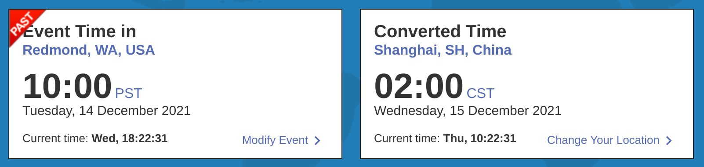
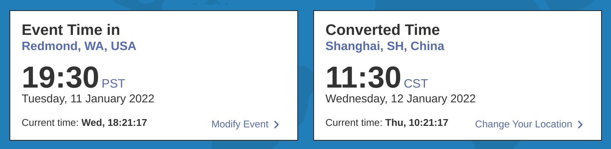

+++
title = "Dapr中国社区会议筹备事宜"
date = 2021-12-23
lastmod = 2021-12-23
draft = false

tags = ["Dapr"]
summary = "筹备Dapr中国社区会议"
abstract = "筹备Dapr中国社区会议"

[header]
image = ""
caption = ""

+++

和微软的 Artur Souza 沟通了一次，关于Dapr社区会议的事情和大家同步一下。由于信息比较多，因此一些细节我先以文字的方式和大家同步好，方便后续讨论。

## 参加现有Dapr社区会议的建议

Dapr社区会议的现有时间安排：

https://github.com/dapr/community#community-meetings

- ~~Tuesday November 16th 10:00am Pacific Time (PST)~~

- ~~Tuesday November 30th 7:30pm Pacific Time (PST)~~ 

- ~~Tuesday December 14th 10:00am Pacific Time (PST)~~

    换算到中国北京时间是2021年12月15号，凌晨两点，这个时间对中国区用户很不友好。

    

- Tuesday January 11th 7:30pm Pacific Time (PST) 

    换算到中国北京时间是2022年1月12号，上午11：30，这个时间比较适合中国区用户。

    

- Tuesday February 8th 10:00am Pacific Time (PST)

- Tuesday February 22th 7:30pm Pacific Time (PST) 

- Tuesday March 8th 10:00am Pacific Time (PST) 

- Tuesday March 22th 7:30pm Pacific Time (PST) 

总结：Dapr社区会议是每两周一次，每月有一次的时间是PST 19：30，对应到北京时间上午11：30。

建议：和dapr沟通的结果是，他们建议我们重点参加每月一次的 PST 19：30（北京时间上午11：30）的社区会议。当然有同学愿意参加PST 10：00（北京时间凌晨2点）的社区会议也没有问题，只是希望优先保证参加前者。

另外, Artur Souza 给了一个建议，可以用中文来介绍，但我感觉执行起来不太容易，想听一下大家的意见：

>  it would be great if we have representation from your Dapr community by presenting some topics in the call. They are usually in English. I would also suggest that having presentation in Chinese is OK but I would like to confirm from other maintainers here first.
>
>  如果你们Dapr社区的代表能在电话会议上提出一些议题，那将是非常好的。他们通常是用英语。我也建议用中文来介绍，但我想先从其他维护者那里得到确认。

## 举办新的Dapr中国社区会议的建议

上次dapr中文周会上，我总结了希望dapr中国社区会议可以做到的几个点（如有遗漏请大家帮忙补充）：

- 加强dapr中国社区内部的沟通和信息同步
    1. 推动目前正在做和准备做的几个事情：dapr中文文档翻译的维护和更新；dapr源码解读；dapr落地实践分享
    2. 加强dapr中国区开发者之间的了解和互动，并希望发展出更多的贡献者（contributor、maintainer、core maintainer）
    3. 扩大dapr在中国技术社区的影响力，布道、宣传、分享以找到更多的同路人
    4. 分享dapr落地的业务场景，挖掘和整理需求，向dapr社区传递这些场景和需求信息
- 加强dapr社区和dapr中国社区彼此之间的双向沟通和信息同步
    1. 将dapr社区的信息带回来国内：包括短期的发布计划（release plan），长期的路线图（roadmap），一些重大的future/proposal或者改动
    2. 将dapr中国社区的信息带给国外：包括我们的场景和需求，我们的落地实践，我们提出的issue和PR, 我们关注的大的proposal

目前我们已有一个dapr双周会，后面希望将这个会议组织的更好一些，然后成为dapr社区的一个正式会议（预计会冠以 Dapr China Community Meeting 的名字），并覆盖更多的dapr中国用户和开发者。

关于Dapr中国社区会议的筹备，还有几个细节待讨论：

1. Dapr中国社区会议的时间：目前是双周会，而且刚好和dapr社区的会议周数是错开的，这样也适合我们Dapr中国社区会议的工作方式——把上一周dapr社区的信息同步到国内，然后将国内的信息在下一次的dapr社区会议上同步给国外。（下一次会议时间是本周六晚20：00-20：30）
2. Dapr中国社区会议的工具：dapr官方是用zoom，但zoom在国内被墙（外加zoom限制中国IP接入），国内同学接入不便。目前我们已有的双周会使用的是腾讯会议。考虑到参会的基本都是国内同学，因此我建议不使用zoom而是采用我们国内方便接入的方式。关于这一点我也和 Artur Souza 同步过。

## Dapr中国社区会议和国内各个dapr社区的关系

目前我们国内的dapr社区，主要有几个：

1. 云原生社区Dapr SIG
2. dapr 中文社区
3. Dapr .Net

> 备注：可能还存在其他零散的dapr群或者兴趣小组，如果有我没有列出来的请告知我，我去联系。

由于大家的来源、关注点、技术背景、公司背景都不太相同，我觉得短时间内统一dapr社区不太现实，也看不到实际的意义。因此，我个人觉得 Dapr中国社区会议的定位是跨各个dapr社区、QQ群/微信群、兴趣小组建立一个dapr国内沟通和交流的渠道。现有的这些社区继续按照自己的方式运作。

## 行动小组和后续推荐

Dapr社区会议只是加强沟通的一个方式，更重要的还是要务实的推动各个事情。因此我个人建议在社区内成立若干个行动小组，有明确的目标、牵头人、分工，然后每次的周会上各个行动小组可以做一下更新。

我暂时想到的几个行动小组有：

- dapr文档翻译
- dapr源码解读
- dapr落地实践分享
- dapr布道和宣传：组织或参加技术会议
- dapr动态跟进：release plan，roadmap，新的future，大的proposal等

大家可以帮忙补充。具体方式我们一起讨论。

