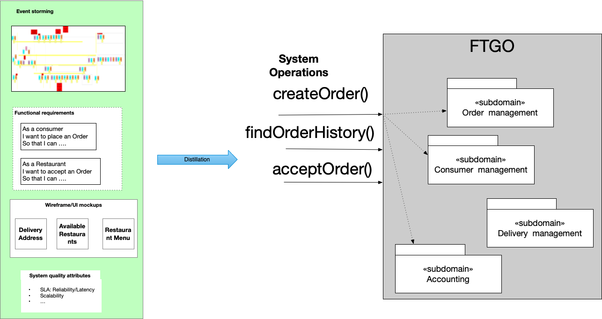
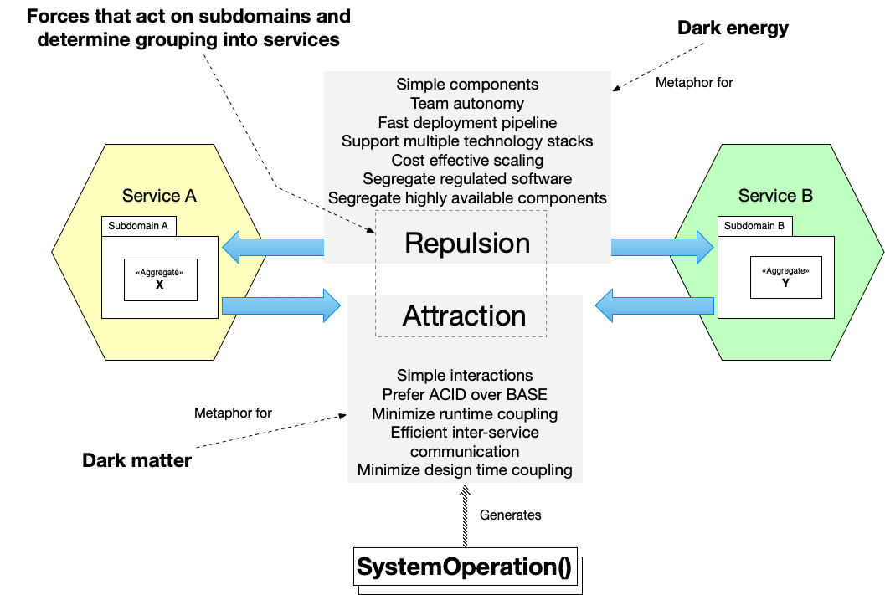

+++
title = "[译]使用暗物质和暗能量设计架构"
date = 2021-12-06
lastmod = 2021-12-06
draft = false

tags = ["Linkerd2", "Istio"]
summary = "设计架构=平衡暗物质和暗能量的力量,架构师的工作是设计一个架构，使组件内部的排斥力最小化，并使组件之间的吸引力最小化。"
abstract = "设计架构=平衡暗物质和暗能量的力量,架构师的工作是设计一个架构，使组件内部的排斥力最小化，并使组件之间的吸引力最小化。"

[header]
image = ""
caption = ""

+++

原文出处：[Designing an architecture using dark matter and dark energy](http://chrisrichardson.net/post/microservices/2021/11/30/dark-matter-dark-energy.html)

作者: **Chris Richardson**

---------

在设计应用程序的架构时，有许多决定是必须做出的。比如说。

1. 应用程序应该使用单体还是微服务架构？
2. 如果使用微服务架构，最好的服务边界是什么？
3. 如何设计跨多个服务的操作？

在与客户合作时，我经常被问到 "做X的最好方法是什么？"。几乎总是，我的回答是 "这取决于！"。具体来说，最佳解决方案取决于试图解决问题的具体环境。悲哀的是，**没有银弹**。

相反，我建议使用基于暗物质和暗能量的标准来评估一个潜在的解决方案或比较多个候选解决方案。暗物质和暗能量是天体物理学家发明的神秘概念，以解释某些天文观测。暗能量是一种反重力，它迫使物质分离并加速了宇宙的膨胀。暗物质是一种看不见的物质，对恒星和星系有引力作用。正如我在 [iSAQB](https://chrisrichardson.net/post/microservices/2021/10/31/isaqb-keynote.html) 和 [Mucon](https://chrisrichardson.net/post/microservices/2021/04/15/mucon-2021-dark-energy-dark-matter.html) 的演讲中所描述的，我把它们作为设计架构时必须解决的斥力和引力的隐喻。

在谈论如何应用暗物质和暗能量的隐喻之前，我想先谈谈两个相互关联的概念：系统操作（System operation）和子域（subdomain）。

### 关于系统操作和子域

系统操作是对应用程序的功能需求（如故事）的提炼。每一个都是应用程序必须处理的请求的抽象表示。例如，FTGO应用程序实现了系统操作，如`createOrder()`, `cancelOrder()`, and `findOrderHistory()`。系统操作还模拟了由时间流逝触发的动作。

系统操作所描述的应用程序的功能是由子域的集合来实现的。子域是一个可实现的，（通常）面向对象的业务能力模型。它由一个小团队拥有，负责其开发。例如，FTGO应用程序有许多子域，包括订单管理、送货管理、餐厅管理、厨房管理等。而且，由于它是一个Java应用程序，每个子域都是一个包含类的Java包的集合。

每个系统操作都跨越了一个或多个子域。例如，`createOrder()`系统操作跨越了许多域，包括订单管理、餐厅管理、厨房管理和会计。

应用程序的子域构成了其架构的逻辑（也就是开发）视图。我们还需要考虑实现视图，它定义了这些子域如何被打包成组件，即可执行/可部署单元。

### 什么是架构的实现视图

实现视图定义了应用程序的模块（module）和组件（component）。模块是一个经过编译和打包的子域。组件是一个可执行的或可部署的，由一个或多个模块组成。在Java应用程序中，模块是一个JAR文件，所以每个子域都会被打包成一个或多个JAR文件。Java组件是一个WAR文件或一个可执行的胖JAR文件，它包含JAR文件的集合。

如果应用程序由一个单一的组件组成，那么它就是单体架构。或者，如果它由两个或更多的组件组成，那么它是微服务架构。

### 定义应用程序的实现视图

鉴于上述对子域和组件的定义，定义架构的（实现视图）的问题变成了：

1. 如何将应用程序的子域划分为一个或多个组件，也就是服务？
2. 鉴于这种划分，如何设计跨越服务的系统操作？

这就是暗能量和暗物质的比喻可以帮助的地方。

### 关于暗能量和暗物质

天体物理学家发明了暗能量的概念，以解释为什么以前放缓的宇宙膨胀在70亿年前开始加速。该理论认为，随着宇宙的膨胀，引力减弱，最终暗能量（一种反引力的排斥力）成为主导，加速了膨胀。暗能量是一个有用的比喻，可以解释鼓励子域划分为多个服务的排斥力。

当天体物理学家观察遥远星系中恒星的轨道时，他们发现这些恒星的移动速度比根据可见物质的数量所预期的要快。为了解释这一差异，他们发明了暗物质的概念，这是一种不可见的物质形式，会产生引力。对于微服务架构中抵制分解为服务的吸引力，这是一个有用的比喻。这些作用于子域的吸引力是由跨越这些子域的系统操作产生的。

我们先来看看暗能量。

### 利用暗能量

有几种力量作用于子域，鼓励将子域划分为多个服务:

- 简单组件--简单组件比复杂组件更容易理解和维护
- 团队自主性--团队需要能够独立开发、测试和部署他们的软件
- 快速部署管道--快速反馈和高部署频率是必不可少的，并由快速部署管道实现。
- 支持多种技术栈--子域有时是用各种语言编写的，开发人员需要不断地发展技术栈。
- 成本有效的扩展--按资源要求分离子域
- 隔离受管制的软件--某些领域的软件开发，如作为医疗设备的软件（SaMD），是受管制的，但分区使一些应用程序的子域避免受管制。
- 隔离高可用性的组件--关键业务组件应与不太关键的组件隔离，以最大限度地提高可用性。

这些排斥性力量作用于子域，鼓励它们被打包成独立的服务。然而，它们并不是你必须考虑的唯一力量。你还必须考虑有引力的力量。

### 利用暗物质

有以下抵制拆分的引力：

- 简单相互作用--组件之间简单的相互作用比复杂的相互作用更容易理解
- 倾向于ACID而不是BASE--将一个操作实现为ACID事务，而不是例如最终一致的sagas，这更容易。
- 尽量减少运行时的耦合性--为了最大限度地提高可用性和减少延时
- 高效的服务间通信--大量的网络往返和大量的数据传输会使效率过低
- 尽量减少设计时的耦合--减少同步改变服务的可能性，这将降低生产力

特定的系统操作所产生的吸引力的强度取决于两个因素:

1. 它所引用的子域是如何被划分为服务的
2. 用来实现该操作的模式

有时，可以通过重新设计操作来减少这些力量的强度。或者，可能需要重新划分子域。

### 设计架构=平衡暗物质和暗能量的力量

单体架构如此吸引人的原因之一是它满足了所有的吸引力。然而，可悲的是，它忽略了所有的排斥力，特别是当应用程序很大时。在另一端，细粒度的微服务架构满足了所有的排斥力，但可能忽略了吸引力。它可能是一个脆弱的分布式单体，由于过度的设计时和运行时耦合，它结合了两种架构风格的缺点。架构师的工作是设计一个架构，使组件内部的排斥力最小化，并使组件之间的吸引力最小化。未来的博文将对暗能量和暗物质力量进行更深入的探讨。

### 要了解更多

- 请看最近的一些演讲：[iSAQB主题演讲--模块化单体和微服务：快速、可靠、频繁和可持续发展的架构模式](https://chrisrichardson.net/post/microservices/2021/10/31/isaqb-keynote.html) 和 [Mucon 2021--暗能量、暗物质：设计微服务的不完美隐喻](https://chrisrichardson.net/post/microservices/2021/04/15/mucon-2021-dark-energy-dark-matter.html)
- 我提供咨询和培训，帮助你有效地使用微服务架构。

