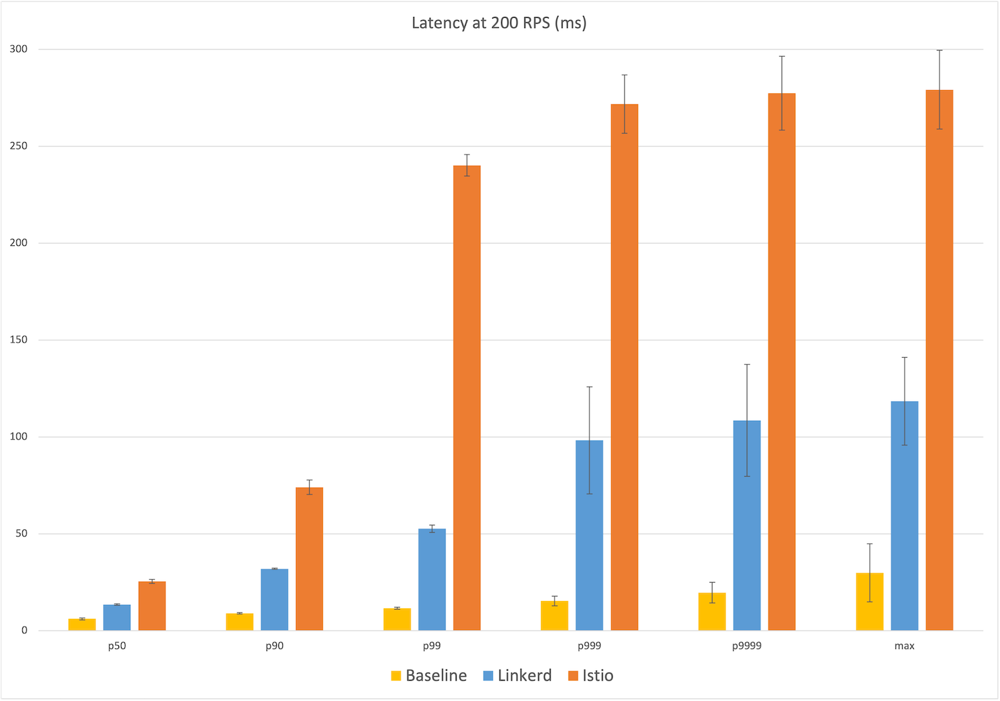
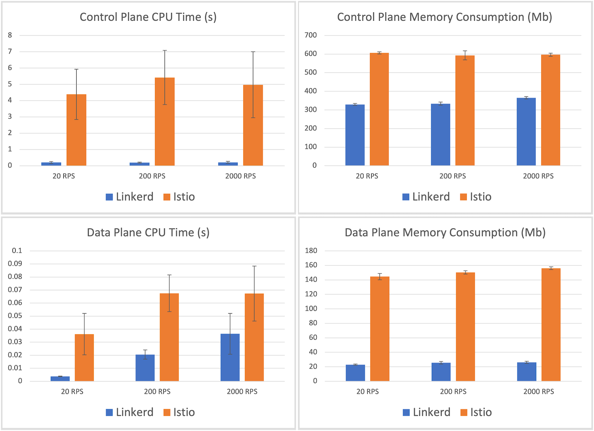

+++
title = "[译]Linkerd和Istio基准测试：2021年重复"
date = 2021-12-05
lastmod = 2021-12-05
draft = false

tags = ["Linkerd2", "Istio"]
summary = "在我们测试的最高负载水平下，Linkerd引入的额外尾延迟几乎比Istio少一个数量级"
abstract = "在我们测试的最高负载水平下，Linkerd引入的额外尾延迟几乎比Istio少一个数量级"

[header]
image = ""
caption = ""

+++

原文出处：[Benchmarking Linkerd and Istio: 2021 Redux](https://linkerd.io/2021/11/29/linkerd-vs-istio-benchmarks-2021/)

作者: **William Morgan**

---------

今年早些时候，我们发布了 [Linkerd与Istio的基准测试](https://linkerd.io/2021/05/27/linkerd-vs-istio-benchmarks/)，在简单的微服务应用上比较了两个服务网格在不同负载水平下的性能和资源消耗。通过使用开源的基准测试工具，我们发现Linkerd的速度明显快于Istio，同时消耗的数据平面内存和CPU少一个数量级。

随着最近 [Linkerd 2.11中授权策略](https://linkerd.io/2021/09/30/announcing-linkerd-2.11/) 的发布，我们想重新评估Linkerd的性能。毕竟，这是该项目一个重要的新功能，对性能有潜在影响。最新版本的Linkerd的性能如何？

为了弄清楚，我们用两个项目的最新版本重新进行了基准测试。我们的结果显示，**即使增加了策略，Linkerd仍然比Istio快得多，而消耗的系统资源只是一小部分**。在我们测试的最高负载水平下，Linkerd引入的额外尾延迟几乎比Istio少一个数量级。

继续阅读，了解更多!

## 背景介绍

2019年，Kinvolk发布了 [Linkerd与Istio的公开基准数据](https://linkerd.io/2019/05/18/linkerd-benchmarks/)。这项工作不仅表明Linkerd比Istio明显更快、更轻，而且还产生了一个 [开源的服务网格基准测试工具](https://github.com/kinvolk/service-mesh-benchmark)，以便任何人都可以复制结果。这个工具模拟了"现实生活"场景：它通过一个简单的微服务应用发送了持续的流量，使用了gRPC和HTTP调用，并从内存和CPU消耗以及增加的延迟方面测量了使用服务网格的成本。最关键的是，延迟是从客户的角度测量的，产生面向用户的数字，而不是内部代理时间。

今年早些时候，我们 [重新审视了Linkerd 2.10和Istio 1.10.0的这些比较](https://linkerd.io/2021/05/27/linkerd-vs-istio-benchmarks/)，显示Linkerd仍然比Istio快得多，而且在这样做的时候，消耗的数据平面内存和CPU少一个数量级。

从那时起，这两个项目都发布了新的版本，最引人注目的是 [Linkerd 2.11引入了授权策略](https://linkerd.io/2021/09/30/announcing-linkerd-2.11/)，这是该项目具有潜在性能影响的一个重要新功能。

## 实验设置

在这些实验中，我们将相同的Kinvolk基准套件应用于两个项目的最新稳定版本。Linkerd 2.11.1（使用默认安装）和Istio 1.12.0（其 "最小"配置）。我们在Kubernetes v1.21.4集群上运行基准工具，使用基准工具使用的[Lokomotive Kubernetes发行版](https://kinvolk.io/lokomotive-kubernetes/)，在 [Equinix Metal](https://www.equinix.com/) 为CNCF项目慷慨提供的裸机硬件上运行。

从我们以前的工作中，我们知道最重要的第一步是找到一个能提供一致延迟结果的环境。云环境可以在不同的时刻提供截然不同的性能特征，特别是在网络方面。然而，做好这一点对于像这样的比较实验至关重要：基线延迟的差异会降低结果的质量。

我们的设置模仿了我们先前的实验：我们在Equinix Metal dfw2数据中心运行所有代码，这再次产生了我们发现的最低变异行为。我们的集群包括6个s3.xlarge.x86配置的工作节点（英特尔至强4214，24个物理核心@2.2GHz，192GB内存），基准应用程序在上面运行，加上一个相同配置的负载发生器节点，以及一个c2.medium.x86配置的K8s主节点。

和以前一样，我们在20 RPS、200 RPS和2000 RPS下评估了这两个服务网格。在每个级别，我们对Linkerd、Istio和没有服务网格的基本情况进行了多次独立运行，每次持续负载10分钟。在两次运行之间，所有的基准和网格资源都被重新安装。对于20和200RPS的运行，我们运行了8次，并根据最大基线延迟丢弃了前3次。对于2,000 RPS的运行，由于最后期限的限制，我们运行了7次，并手动放弃了Istio和Linkerd各自的最大延迟的单一运行。(我们的原始数据可供查阅）。

需要注意的是，Kinvolk框架以一种非常特殊的方式测量服务网格的行为，我们没有对这个框架进行任何修改。还要注意的是，这个基准所报告的数字是服务网格和工具及其环境的一个函数。换句话说，这些不是绝对分数，而是相对分数，只能与在相同环境和相同方式下测量的其他替代方案进行评估（附注1）。

## 测试的服务网格功能

虽然每个服务网提供了大量的功能，但在这些实验中，只有其中的一个子集是实际发挥作用的：

- 两个网格都启用了双向TLS，并在所有应用pod之间加密流量和验证身份。
- 两个网格都在报告指标，包括L7指标，尽管这些指标在本实验中没有被使用。
- 两个网格都默认在INFO级别上记录了各种信息。我们并没有配置日志记录。
- 没有明确启用重试、超时、分布式跟踪、多集群通信或其他功能。

## 实验结果

我们的实验结果显示在下面的图表中。这些图表中的每一点都是五次运行的平均值，误差条代表平均值的标准差。条形图本身代表Linkerd（蓝色）、Istio（橙色）和无服务网格的基线（黄色）。

### 20RPS时的延时

从相对平静的20RPS级别开始，我们已经看到了面向用户的延迟的巨大差异。Linkerd的中位延迟是14ms，比基线的6ms多8ms。相比之下，Istio的中位延迟是26ms，是Linkerd额外延迟的两倍多。在最大值上，Linkerd比基线的18ms延迟增加了39ms，而Istio的最大延迟增加了232ms，几乎是Linkerd额外延迟的六倍。

看一下百分位数，我们看到Istio的延迟分布在p99时急剧上升到~240ms，而Linkerd在更高的百分位数时显示出更平缓的增长，达到57ms。

获胜者：Linkerd（8ms对26ms的中位数；39ms对232ms的最大值）

### 200RPS下的延时

200RPS的数字讲述了一个非常相似的故事，中位延迟的数字几乎是相同的。Linkerd的中位延迟为14ms，比基线的中位延迟6ms高出8ms，而Istio的中位延迟为26ms，高出20ms。在最大值上，Istio的280ms延迟比基线的30ms高出250ms，而Linkerd的最大延迟119ms高出约90ms，不到Istio的额外延迟的一半。我们看到Istio的延迟在p99个时发生了同样的跳跃，面向用户的延迟几乎达到250ms，而Linkerd从p999开始逐渐增加。

获胜者：Linkerd（8ms对26ms的中位数；90ms对250ms的最大值）

### 2000RPS时的延迟

最后，在2000RPS时，我们看到了网格之间最显著的差异：在中位数时，Linkerd在6ms的基线上引入了额外的6ms延迟，而Istio的额外延迟为17ms；在最大值时，Linkerd在84ms的基线上引入了额外的42ms，而Istio增加了8倍的额外延迟，约350ms。一般来说，在报告的每个百分点上，Istio比Linkerd多引入了130%到850%的额外延迟。

获胜者:Linkerd（6ms对17ms的中位数；42ms对350ms的最大值）

### 资源消耗

现在转向资源使用，每个服务网格的CPU和内存消耗显示在下面的图表中。这些数字在所有的吞吐量水平上是相当一致的，所以我们将重点关注最高负载的2000 RPS场景。

从控制平面开始，我们看到Istio的控制平面使用量平均为597mb，比Linkerd的控制平面内存消耗量365mb高出约50%。Linkerd的CPU使用量要小一个数量级--控制平面CPU时间为212ms，而Istio为5秒。

然而，比控制平面更重要的是数据平面。毕竟，这是网格的一部分，必须随着应用程序的扩展而扩展。在这里，我们看到另一个戏剧性的差异：Linkerd代理所消耗的最大内存平均为26.3mb，而Istio的Envoy代理所消耗的最大内存为156.2mb--6倍。同样，Linkerd的最大代理CPU时间记录为36ms，而Istio为67ms--大约多出85%。

获胜者：Linkerd（26mb对156mb内存；36ms对67ms CPU）

### 总结和讨论

在这些旨在模仿现实世界场景行为的基准测试中，我们再次看到最新版本的Linkerd极大地超越了最新版本的Istio，同时保持了明显较小的资源成本。在评估的最高吞吐量下，我们看到Linkerd在数据面消耗了1/6的内存和55%的CPU，同时提供了Istio的1/3的额外中位延迟和1/8的额外最大延迟。

值得注意的是，Linkerd在200RPS时的最差延迟比2000RPS时更差。这可能是由于实验过程中的网络干扰造成的。在未来，我们可能要改变异常值检测的标准；现在，为了透明起见，我们要按原样报告这些结果。

将这些结果与近6个月前的早期实验结果相比较，有几个亮点非常突出：

- 自2.10.1以来，Linkerd的中位延迟实际上有所改善，即使增加了策略。Linkerd的额外中位延迟在每个评估的流量水平上都持续降低了3ms。(最大延迟在一些运行中增加，在其他运行中减少）。

- Istio的数据平面CPU使用率从2000RPS时的88ms下降了67ms；然而，Istio的最大延迟似乎变得非常糟糕，在20、200和2000 RPS时分别增加了44ms、59ms和97ms。

- Linkerd的数据平面比2.10更重，报告的最大CPU使用率为36ms（以前为11ms），最大内存使用率为26mb（以前为18mb）。特别是内存占用，在Linkerd 2.11.0和2.11.1之间发生了很大的变化，可能是由于在代理中使用了jemalloc分配器。事实上，用2.11.0（早一个发布点）重复这些基准测试显示，数据平面的平均内存占用为17mb，相差9mb！ （附注2）一种假设是，选择jemalloc分配器是为了在非常高的连接数下减少内存消耗，并允许代理在尖锐的负载中更容易释放内存；这可能是在这些基准测试中衡量的最大内存消耗的情况下的一种折衷。我们正在继续调查这一变化。

## 为什么Linkerd会这么快、这么轻？

和以前一样，Linkerd和Istio在性能和资源成本上的巨大差异主要归结于一件事：[Linkerd基于Rust的"微代理"，Linkerd2-proxy](https://linkerd.io/2020/12/03/why-linkerd-doesnt-use-envoy/)。这个微代理为Linkerd的整个数据平面提供动力，而这个基准在很大程度上反映了它的性能和资源消耗。

[我们已经写了很多关于Linkerd2-proxy的文章](https://linkerd.io/2020/07/23/under-the-hood-of-linkerds-state-of-the-art-rust-proxy-linkerd2-proxy/)，以及我们[在2018年的黑暗时代采用Rust的动机](https://www.infoq.com/articles/linkerd-v2-production-adoption/)。有趣的是，构建Linkerd2-proxy的主要原因不是为了性能，而是为了运维上的原因：运维像Istio这样基于Envoy的服务网格，往往需要你成为运维Envoy的专家，这是我们不愿意强加给Linkerd用户的挑战（附注3）。

令人高兴的是，选择建立Linkerd2-proxy也带来了显著的性能和效率提升。通过解决仅作为"服务网格代理"这一非常具体的问题，我们可以在数据平面层面上非常高效。通过在Rust中构建Linkerd2-proxy，我们可以借助这个生态系统中令人难以置信的技术投资浪潮：像Tokio、Hyper和Tower这样的库是一些世界上最好的系统思维和设计的焦点。

Linkerd2-proxy不仅仅是令人难以置信的快速、轻便和安全，它还代表了整个CNCF领域中最前沿的技术。

## 如何重现这些结果

如果你想自己重现这些实验，请按照[基准测试](https://github.com/linkerd/linkerd2/wiki/Linkerd-Benchmark-Setup)的说明进行。

如果你尝试这样做，请看我们[上面关于实验方法的评论](https://linkerd.io/2021/11/29/linkerd-vs-istio-benchmarks-2021/?utm_source=pocket_mylist#experimental-setup)。关键是你要找到一个能够提供一致结果的环境，特别是对于像最大延迟这样对网络流量、资源争夺等非常敏感的东西。另外，请记住，你产生的数字将是相对的，而不是绝对的测量。

并让我们知道你的发现!

## 鸣谢

特别感谢Equinix的好心人提供了Kubernetes环境，使这一切成为可能；感谢CNCF，它使Linkerd项目能够运行这些实验；感谢Kinvolk，尤其是Thilo Fromm，提供了优秀的基准工具。

## Linkerd为所有人服务

Linkerd是云原生计算基金会的一个毕业项目。Linkerd致力于开放管理。如果您有功能需求、问题或意见，我们很希望您能加入我们快速增长的社区。 Linkerd托管在GitHub上，我们在Slack、Twitter和邮件列表上有一个繁荣的社区。来吧，加入我们！

## 附注

1. 例如，本报告中诸如"Linkerd在中位数上增加了Xms的延迟"的陈述，并不意味着Linkerd会给您的应用增加Xms的中位数延迟。它们也不意味着单个Linkerd代理会增加Xms的延迟（事实上，对于大多数类型的流量，单个Linkerd代理的中位延迟小于1毫秒）。

2. 报告这些数字是非常诱人的! 但是，"最新版本"意味着最新版本，而在这种情况下，这意味着Linkerd 2.11.1。

3. 从技术角度来看，代理可能是服务网格中最有趣的部分，但从用户的角度来看，它是最不有趣的部分。我们的信念是，服务网格的代理应该是一个实现细节，我们努力确保--除了博客文章--大多数Linkerd用户只需了解很少的Linkerd2-proxy。

