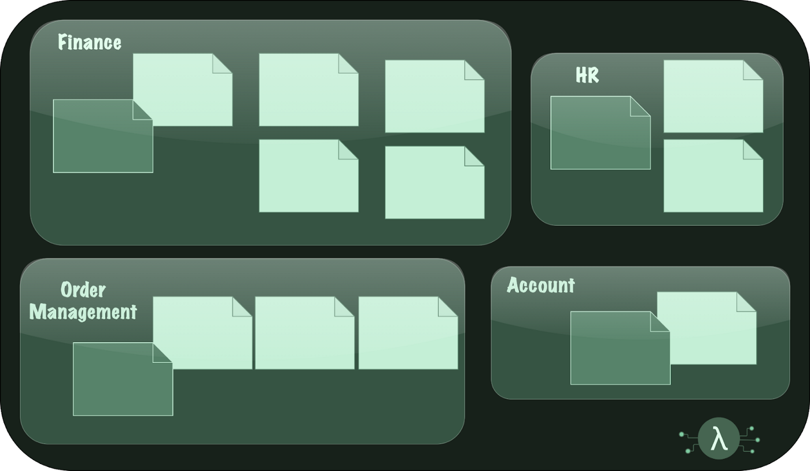
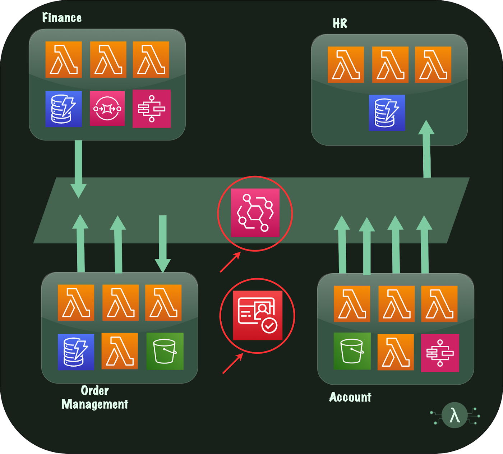

+++
title = "[译]服务端口：用事件驱动的serverless找到松散耦合的乌托邦"
date = 2022-01-20
lastmod = 2022-01-20
draft = false

tags = ["Linkerd2", "Istio"]
summary = "在我们测试的最高负载水平下，Linkerd引入的额外尾延迟几乎比Istio少一个数量级"
abstract = "在我们测试的最高负载水平下，Linkerd引入的额外尾延迟几乎比Istio少一个数量级"

[header]
image = ""
caption = ""

+++

原文出处：[Service Ports: Finding a Loosely Coupled Utopia with Event-Driven Serverless](https://medium.com/serverless-transformation/service-ports-finding-a-loosely-coupled-utopia-with-event-driven-serverless-6964aacd1487)

作者: **[Ben Ellerby](https://medium.com/@bene_37069)**

-----------

当我们使用领域驱动设计（Domain-Driven Design）构建事件驱动的serverless架构时，我们最终会得到一组按业务功能明确划分的服务，并通过事件通道（如Amazon EventBridge）进行异步通信。这些架构带来了许多优势：松散耦合、独立部署、可测试性和降低复杂度。然而，无论我们对领域的建模有多么优雅，总有一些交叉的基础设施依赖（如事件通道本身）是不能消除的。

我们如何处理它们，决定了我们是得到一个松散耦合的乌托邦，还是一个半独立服务的无序纠缠。当你已经投入了90%的努力，不要让这成为最后的绊脚石。

在这篇文章中，我们将看到明确定义的服务端口(Service Port)如何解决最后10%的基础设施依赖性，并带来松散耦合、独立部署/测试和提升开发速度。

## 问题是如何产生的

我们之前讨论过Amazon EventBridge如何与强大的领域驱动设计相结合来创建这样的架构（见[EventBridge Storming](https://medium.com/serverless-transformation/eventbridge-storming-how-to-build-state-of-the-art-event-driven-serverless-architectures-e07270d4dee)）。当我们以这种方式构建服务（或 "微服务"）的集合时，仍然存在一些跨领域的全局依赖性。这些依赖关系妨碍了独立开发服务，使集成测试变得困难，并会在我们的基础设施定义中产生复杂的代码。此外，当这种依赖关系没有被明确化时，服务的部署顺序在最好的情况下会成为一个谜，在最坏的情况下则会成为一系列的竞争条件。

为了使这个问题更加具体化，让我们想象一下，我们进行了一个[EventBridge Storming会话](https://medium.com/serverless-transformation/eventbridge-storming-how-to-build-state-of-the-art-event-driven-serverless-architectures-e07270d4dee)，通过将系统的所有业务事件收集到Bounded Contexts中来理解一个电子商务网站的示例问题域。从这个会话中，我们将了解业务领域，属于它的事件，以及它们如何被分组。

从这样的会议中，我们可以推导出以下服务，将领域内的事件组合在一起，并通过松散耦合创建服务边界。

架构的高层视图将如下所示:

注意到两个典型的共享基础设施的依赖关系是EventBus本身，以及Cognito用户池。基础设施中对这些的引用很简单，就是一个ARN。但是，要求这些依赖关系被部署（与它们所属的堆栈中的其他一切一起）使得独立开发和测试变得复杂。此外，这些引用也可以作为代码文件隐藏在基础设施中。
这种跨领域的基础设施的依赖性需要有意为之，并为之设计，向开发者明示。如果没有，这将导致几个问题。

"存在的来源问题"。我们可以在财务服务中保留这个依赖关系的定义，并在人力资源服务中引用它。当它是2个服务时，这很好，但如果10个服务都需要这个资源，那该怎么办。

此外，我们还产生了一些连带问题。财务服务现在需要在人力资源服务之前部署。在生产中，这似乎是可控的，它将在第一时间发生；但在开发、分期和UAT中呢？此外，无服务器的一个惊人的好处是短暂的堆栈（见无服务器流程）--这将如何实现？

