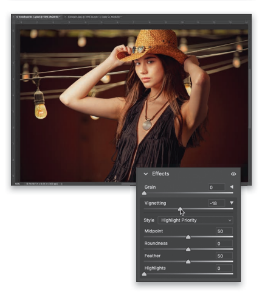

+++
title = "Marker学习笔记（1）: 用人工智能实现从 PDF 到 Markdown"
date =  2024-08-24
lastmod = 2024-08-24
draft = false

tags = ["PDF", "markdown", "AI", "marker"]
summary = "Marker 是一个快速、高精度地将 PDF 转换为 Markdown 的工具。本文介绍 Marker 在 linux 上的安装和使用。"
abstract = "Marker 是一个快速、高精度地将 PDF 转换为 Markdown 的工具。本文介绍 Marker 在 linux 上的安装和使用。"

[header]
image = ""
caption = ""

+++

## Marker介绍

Marker 是一个快速、高精度地将 PDF 转换为 Markdown 的工具。

这是摘录自 Marker 官方网站的介绍：

> Marker is a PDF to Markdown converter that recognizes tables, OCRs equations, and re-OCRs bad pdf text. Marker has 8000+ stars on Github, benchmarks well against other similar tools, and is used by hundreds of organizations.
>
> Marker 是一款 PDF 到 Markdown 的转换器，它能识别表格、OCR 方程并重新 OCR 不良 PDF 文本。Marker 在 Github 上拥有 8000 多颗星，与其他同类工具相比具有很好的基准，并被数百家机构使用。

Marker 的一些资料：

- 项目代码仓库在： https://github.com/VikParuchuri/marker

- 官方网站： https://www.datalab.to/

本篇文档介绍 Marker 的安装和使用，内容参考官方文档： https://github.com/VikParuchuri/marker/blob/master/README.md 

硬件说明： 我所使用的电脑安装有 linux mint 21.3 版本，基于 ubuntu 22.04，因此 ubuntu / debian 系列操作系统上的操作应该都是类似的。配置有 nvidia rtx 4080 显卡，可以提供 cuda 的支持。

## 克隆 marker 仓库

首先克隆 marker 的 github 代码仓库，后面使用时会用到：

```bash
mkdir -p ~/work/code/marker
cd ~/work/code/marker
git clone git@github.com:VikParuchuri/marker.git
cd marker
```

## 安装 marker 及其依赖

### 安装 python

要求 python 3.9+ ，我机器上默认已经有了 Python 3.10.12：

```bash
$ python3 --version
Python 3.10.12
```

但是没有 pip：

```bash
$ pip                 
zsh: command not found: pip
```

继续安装:

```bash
sudo apt install python3-pip python3.10-venv
```

完成后检查 pip：

```bash
$ pip --version                               
pip 22.0.2 from /usr/lib/python3/dist-packages/pip (python 3.10)
```

### 安装 PyTorch

```bash
pip3 install torch torchvision torchaudio
```

### 安装 marker

```bash
pip install marker-pdf
```

我机器上装有 nvidia rtx4080 显卡，安装中被识别到，安装过程中有下载 nvidia-cuda-runtime-cu12 / nvidia-cuda-cupti-cu12 / nvidia-curand-cu12 等 cuda 相关的包。

## marker 配置

按照官方说明:

- Inspect the settings in `marker/settings.py`. You can override any settings with environment variables.
  
  检查`marker/settings.py`中的设置。您可以使用环境变量覆盖任何设置。

- Your torch device will be automatically detected, but you can override this. For example, `TORCH_DEVICE=cuda`.

  你的 torch 设备会被自动检测到，但你可以忽略它。例如，`TORCH_DEVICE=cuda`。

- By default, marker will use `surya` for OCR. Surya is slower on CPU, but more accurate than tesseract. It also doesn't require you to specify the languages in the document. If you want faster OCR, set `OCR_ENGINE` to `ocrmypdf`. This also requires external dependencies (see above). If you don't want OCR at all, set `OCR_ENGINE` to `None`.

  默认情况下，marker 将使用`surya`进行OCR。Surya在CPU上速度较慢，但比 tesseract 更准确。它也不要求您指定文档中的语言。如果你想要更快的OCR，请将`OCR_ENGINE`设置为`ocrmypdf`。这也需要外部依赖性（见上文）。如果您根本不需要OCR，请将`OCR_ENGINE`设置为`None`。


我开始先使用默认配置测试，后续发现还是有些配置最好是改动一下，主要是：

- IMAGE_DPI： 从 pdf 中提取图像时渲染的 DPI，默认96,有点低，会造成提取出来的图片清晰度明显低于 pdf 原图片的问题，尤其是图片上的细小文字会因此变得模糊而不可读。因此考虑设置的大一些，比如设置 DPI 为 192.

  实测，这是默认 96 DPI 时从 pdf 中提取的图片，文字已经模糊到难于识别：

  

  这是修改为 192 DPI 的图片，和 96 DPI 相比清晰很多，尤其图片上的文字终于可以正常阅读了：

  

- PAGINATE_OUTPUT： 分页输出标记符，默认false，尝试设置为 true，会在每一页结束时增加分页符 `----------------` 。但因为 pdf 的内容未必每页都独立，有些跨越多页的内容就会被这些分页符分割，反而不美。因此最后我还是放弃了，改回false。

特别提醒：要修改这些配置，不能直接修改 settings.py 文件，而是要用同名的环境变量覆盖他们。例如：

```bash
IMAGE_DPI=192 marker_single ......
```

## 使用 marker

### ~~GUI界面~~

marker 自带了一个基于 streamlit 的图形界面，可以交互式地尝试 marker 一些基本的选项。首先安装：

```bash
pip install streamlit
```

然后执行

```bash
marker_gui
```

会自动打开浏览器，可以简单的设置少数参数，然后执行转换。但问题是我没有找到获取转换后的 markdown 文件的方式，不知道保存到哪里了。惭愧，放弃GUI，改用命令行吧。

### 命令行

先尝试转换单个文件，我以从网络上下载的 `adobe-photoshop-book-photographers-2nd.pdf` 这个680页的英文 pdf 为例。参数 `--max_pages 10` 限制只转换10页，适合用来做快速测试：

```bash
IMAGE_DPI=192 marker_single /media/sky/data/study/sky/ebook/photograph/photoshop/2024-adobe-photoshop-book-photographers-2nd/adobe-photoshop-book-photographers-2nd.pdf /media/sky/data/study/sky/ebook/photograph/photoshop/2024-adobe-photoshop-book-photographers-2nd/markdown --batch_multiplier 4 --max_pages 10
```

surya OCR 支持的语言可以在这里找到：

https://github.com/VikParuchuri/surya/blob/master/surya/languages.py

当然，我们通常只需要 English 和 Chinese 两种。

命令执行的输出如下：

```bash
$ IMAGE_DPI=192 marker_single /media/sky/data/study/sky/ebook/photograph/photoshop/2024-adobe-photoshop-book-photographers-2nd/adobe-photoshop-book-photographers-2nd.pdf /media/sky/data/study/sky/ebook/photograph/photoshop/2024-adobe-photoshop-book-photographers-2nd/markdown --batch_multiplier 4 --max_pages 10

Loaded detection model vikp/surya_det3 on device cuda with dtype torch.float16
Loaded detection model vikp/surya_layout3 on device cuda with dtype torch.float16
Loaded reading order model vikp/surya_order on device cuda with dtype torch.float16
Loaded recognition model vikp/surya_rec2 on device cuda with dtype torch.float16
Loaded texify model to cuda with torch.float16 dtype
Detecting bboxes: 100%|██████████████████████████████████████████████████████████████████████| 1/1 [00:00<00:00,  1.61it/s]
Recognizing Text: 100%|██████████████████████████████████████████████████████████████████████| 1/1 [00:03<00:00,  3.01s/it]
Detecting bboxes: 100%|██████████████████████████████████████████████████████████████████████| 1/1 [00:00<00:00,  1.38it/s]
Finding reading order: 100%|█████████████████████████████████████████████████████████████████| 1/1 [00:00<00:00,  2.07it/s]
Saved markdown to the /media/sky/data/study/sky/ebook/photograph/photoshop/2024-adobe-photoshop-book-photographers-2nd/markdown/adobe-photoshop-book-photographers-2nd folder
```

在目标目录中，会生成以下文件：

- adobe-photoshop-book-photographers-2nd.md
- adobe-photoshop-book-photographers-2nd_meta.json
- xxxx.png 图形文件

继续尝试转换整个 pdf 文件，约680页：

```bash
IMAGE_DPI=192 marker_single /media/sky/data/study/sky/ebook/photograph/photoshop/2024-adobe-photoshop-book-photographers-2nd/adobe-photoshop-book-photographers-2nd.pdf /media/sky/data/study/sky/ebook/photograph/photoshop/2024-adobe-photoshop-book-photographers-2nd/markdown --batch_multiplier 4
```

等待几分钟之后，转换完成：

```bash
$ IMAGE_DPI=192 marker_single /media/sky/data/study/sky/ebook/photograph/photoshop/2024-adobe-photoshop-book-photographers-2nd/adobe-photoshop-book-photographers-2nd.pdf /media/sky/data/study/sky/ebook/photograph/photoshop/2024-adobe-photoshop-book-photographers-2nd/markdown --batch_multiplier 4

Loaded detection model vikp/surya_det3 on device cuda with dtype torch.float16
Loaded detection model vikp/surya_layout3 on device cuda with dtype torch.float16
Loaded reading order model vikp/surya_order on device cuda with dtype torch.float16
Loaded recognition model vikp/surya_rec2 on device cuda with dtype torch.float16
Loaded texify model to cuda with torch.float16 dtype
Detecting bboxes: 100%|█████████████████████████████████████████████████████████████████████████████████████████| 25/25 [00:20<00:00,  1.23it/s]
Recognizing Text: 100%|██████████████████████████████████████████████████████████████████████████████████████████████████████████████| 1/1 [00:00<00:00,  1.43it/s]
Detecting bboxes: 100%|████████████████████████████████████████████████████████████████████████████████████████████████████████████| 17/17 [00:29<00:00,  1.75s/it]
Finding reading order: 100%|███████████████████████████████████████████████████████████████████████████████████████████████████████| 17/17 [00:16<00:00,  1.03it/s]
Saved markdown to the /media/sky/data/study/sky/ebook/photograph/photoshop/2024-adobe-photoshop-book-photographers-2nd/markdown/adobe-photoshop-book-photographers-2nd folder
```

### 转换后的内容整理

转换之后的 markdown 文件包含整个 pdf 文件的内容，非常巨大。而所有的图片都简单的堆放在一起，比较乱。

可以稍微整理一下：

1. 将图片放入 images 目录

   这样的好处是图片文件和 markdown 文件不至于混在一起不好查看。

   步骤：

   - 新建 images 目录，将所有的 png 文件都移动进去
   - 用文本编辑器打开 markdown 文件，将所有的 `.png](` 替换为 `.png](./images/`，修复图片路径

2. 清理 markdown 文件中不需要的内容

   主要是一些排版错乱而意义不大的部分：

   - 封面页
   - 书籍和版权说明等
   - 内容导航页面：转成 markdown 之后页数已经没有意义
   - 以及书籍最后的 index 部分：这部分倒是适合用 pdf 查看，因为可以导航到相关的页面 

3. 按照章节拆分 markdown 文件

   开始是手工编辑的，后来发现比较累，查找/复制/粘贴重复工作，后面就写了一个简单的 bash 脚本来帮我完成。

## 结论

从我的实际使用上看，marker 转换后的 markdown 内容已经很不错了，和 pdf 相比还原度很高。虽然还有一些小的瑕疵需要手工修复，但整体效果是非常不错的，非常推荐使用。
