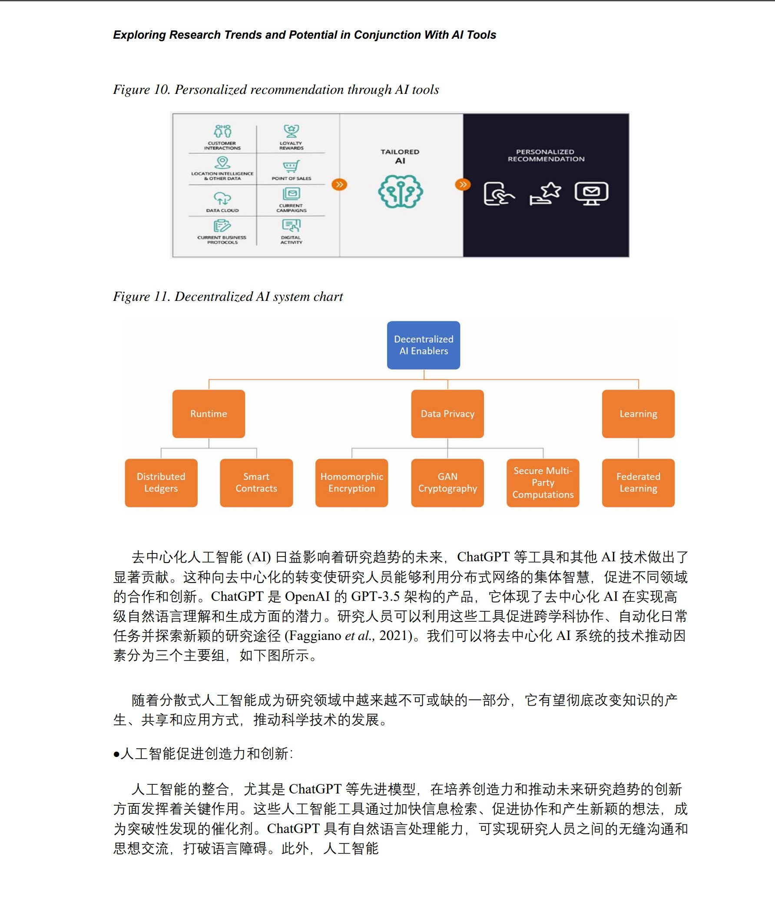

+++
title = "初试PDFMathTranslate"
date =  2025-01-08
lastmod = 2025-01-08
draft = false

tags = ["PDF", "翻译"]
summary = "PDFMathTranslate是一个 pdf 翻译工具，可以将英文版本的 pdf 翻译为中文并保留原有的格式。"
abstract = "PDFMathTranslate是一个 pdf 翻译工具，可以将英文版本的 pdf 翻译为中文并保留原有的格式。"

[header]
image = ""
caption = ""

+++

> 备注：最后更新于 2025-03-15。这个项目进展很快，变化非常大。

## 背景

项目地址：

https://github.com/Byaidu/PDFMathTranslate

## windows 安装（家用电脑）

用自己家里的普通台式机，windows 11 ltsc 2024 版本。

### 手动安装

安装：

```bash
pip install pdf2zh
```

启动 GUI 界面：

```bash
pdf2zh -i
```

或者直接命令行：

```bash
pdf2zh ./applications-challenges-future-chatgpt.pdf -p 1-100
```

一切顺利，除了需要做好全局科学上网的准备。

### 下载二进制包

最新的版本为了方便使用，提供了打包好的二进制包，可以下载之后直接使用，非常省事。

https://github.com/Byaidu/PDFMathTranslate/releases

选择 pdf2zh-v1.9.6-with-assets-win64.zip ，下载之后解压，运行 pdf2zh.exe 即可。

### 字体设置

如果需要设置字体，可以参考：

https://github.com/Byaidu/PDFMathTranslate/issues/540

翻译过程中，能看到有这样的日志：

```bash
[03/16/25 13:03:04] INFO     INFO:pdf2zh.high_level:use font:                                                               high_level.py:423
                             C:/Users/sky/.cache/babeldoc/fonts/SourceHanSerifCN-Regular.ttf
```

可以看到，默认使用的是 SourceHanSerifCN-Regular.ttf 字体，这是思源宋体。windows 系统默认没有安装这个字体，需要手动安装。

可以自行安装思源黑体，也可以用 babeldoc 提供的字体，直接打开 "C:/Users/sky/.cache/babeldoc/fonts/" 目录，用字体查看器打开并安装以下字体：

- SourceHanSerifCN-Regular.ttf
- SourceHanSerifCN-Bold.ttf

但我其实不太喜欢宋体，尤其是在屏幕上，不管是电脑/手机/平板/电纸书，宋体的显示都不如黑体舒服，因此考虑要换成黑体。

字体的设置在 high_level.py 文件中，对于用二进制文件安装的，路径如下：

- `pdf2zh\build\site-packages\pdf2zh\high_level.py`
- `pdf2zh\build\site-packages\babeldoc\high_level.py`

对于用 pip 命令手工安装的，需要找到 pdf2zh 的安装路径，然后修改其中的 high_level.py 文件，如：

- `C:\Users\sky\.pyenv\pyenv-win\versions\3.11.9\Lib\site-packages\pdf2zh\high_level.py`

修改其中的 download_remote_fonts 函数，将思源宋体替换为思源黑体。

```python
def download_remote_fonts(lang: str):
    lang = lang.lower()
    LANG_NAME_MAP = {
        **{la: "GoNotoKurrent-Regular.ttf" for la in noto_list},
        **{
            la: f"SourceHanSerif{region}-Regular.ttf"
            for region, langs in {
                "CN": ["zh-cn", "zh-hans", "zh"],
                "TW": ["zh-tw", "zh-hant"],
                "JP": ["ja"],
                "KR": ["ko"],
            }.items()
            for la in langs
        },
    }
    font_name = LANG_NAME_MAP.get(lang, "GoNotoKurrent-Regular.ttf")
```

将 `SourceHanSerif{region}-Regular.ttf"` 替换为 `SourceHanSans{region}-Regular.ttf"` 即可。

## 使用

### GUI 界面

通过执行 `pdf2zh -i` 命令或者直接运行二进制包中的 pdf2zh.exe 可以打开基于 web 的 GUI 界面：

```bash
 pdf2zh -i
* Running on local URL:  http://0.0.0.0:7860
Error launching GUI using 0.0.0.0.
This may be caused by global mode of proxy software.
Rerunning server... use `close()` to stop if you need to change `launch()` parameters.
---
Error launching GUI using 127.0.0.1.
This may be caused by global mode of proxy software.
Rerunning server... use `close()` to stop if you need to change `launch()` parameters.
----
* Running on public URL: https://0ed022102288ab69fb.gradio.live

This share link expires in 72 hours. For free permanent hosting and GPU upgrades, run `gradio deploy` from the terminal in the working directory to deploy to Hugging Face Spaces (https://huggingface.co/spaces)

```

### 命令行

通过命令行也可以调用 pdf2zh 来进行 pdf 文件的翻译，如：

```bash
pdf2zh ./applications-challenges-future-chatgpt.pdf -p 1-100
```

顺利完成，此时在当前目录下，除了原英文版本的 pdf 文件外，还有出现两个新生成的 pdf 文件：

```bash
$ ls *.pdf
applications-challenges-future-chatgpt-dual.pdf
applications-challenges-future-chatgpt-mono.pdf
applications-challenges-future-chatgpt.pdf
```

- applications-challenges-future-chatgpt-mono.pdf： 中文翻译版本
- applications-challenges-future-chatgpt-dual.pdf：中英文对照版本，即一页中文，一页英文，方便对照。

翻译的效果，只能说还行，借助于最新的人工智能翻译引擎，翻译后的内容可读性还算可以。如果要求不高，只是作为一个快速阅读通览全文的手段，不苛求细节，还是很不错的。至少我个人还是比较满意的。

缺点自然也是有的，毕竟不能和专业人员手工翻译和多次校对，出版社精细排版的翻译成书相比。内容多少有些机翻的味道（其实已经很好了，和过去相比），排版方面也有各种瑕疵。但怎么说呢，瑕不掩瑜吧。



关键是这个翻译是真很方便，真的很快。尤其是网上经常有大量的英文技术书籍出版，这些书籍引入到国内翻译完成到出版上市，和英文原版相比最少要晚1-2年，在技术日新月异的今天，两年时间会造成技术书籍的时效性大减。

另外，网上通常很快就会有这些新出版书籍的 pdf 格式文件可供下载，拿到这些英文原版 pdf 之后，通过 pdf2zh 工具进行快速翻译，可以立即得到一个不完美但是基本可读的中文翻译版本，还是很不错的。毕竟中文是母语，可以一目十行的快速浏览。

### 可选参数

无论是 GUI 还是命令行， 都有不少参数可供选择。

这是 pdf2zh 的命令行帮助的输出：

```bash
$ pdf2zh --help

usage: pdf2zh [-h] [--version] [--debug] [--pages PAGES] [--vfont VFONT] [--vchar VCHAR] [--lang-in LANG_IN] [--lang-out LANG_OUT]
              [--service SERVICE] [--output OUTPUT] [--thread THREAD] [--interactive] [--share] [--flask] [--celery]
              [--authorized AUTHORIZED [AUTHORIZED ...]] [--prompt PROMPT] [--compatible] [--onnx ONNX] [--serverport SERVERPORT] [--dir]
              [--config CONFIG] [--babeldoc] [--skip-subset-fonts] [--ignore-cache]
              [files ...]

A command line tool for extracting text and images from PDF and output it to plain text, html, xml or tags.

positional arguments:
  files                 One or more paths to PDF files.

options:
  -h, --help            show this help message and exit
  --version, -v         show program's version number and exit
  --debug, -d           Use debug logging level.

Parser:
  Used during PDF parsing

  --pages PAGES, -p PAGES
                        The list of page numbers to parse.
  --vfont VFONT, -f VFONT
                        The regex to math font name of formula.
  --vchar VCHAR, -c VCHAR
                        The regex to math character of formula.
  --lang-in LANG_IN, -li LANG_IN
                        The code of source language.
  --lang-out LANG_OUT, -lo LANG_OUT
                        The code of target language.
  --service SERVICE, -s SERVICE
                        The service to use for translation.
  --output OUTPUT, -o OUTPUT
                        Output directory for files.
  --thread THREAD, -t THREAD
                        The number of threads to execute translation.
  --interactive, -i     Interact with GUI.
  --share               Enable Gradio Share
  --flask               flask
  --celery              celery
  --authorized AUTHORIZED [AUTHORIZED ...]
                        user name and password.
  --prompt PROMPT       user custom prompt.
  --compatible, -cp     Convert the PDF file into PDF/A format to improve compatibility.
  --onnx ONNX           custom onnx model path.
  --serverport SERVERPORT
                        custom WebUI port.
  --dir                 translate directory.
  --config CONFIG       config file.
  --babeldoc            Use experimental backend babeldoc.
  --skip-subset-fonts   Skip font subsetting. This option can improve compatibility but will increase the size of the output file.
  --ignore-cache        Ignore cache and force retranslation.

```

其中最重要的是选择用于翻译的服务，可选项有：

- Google
- Bing
- DeepL
- DeepLX
- Ollama
- AzureOpenAI
- OpenAI
- Zhipu
- Silicom
- Gemini
- Azure
- Tencent

注意在命令行中需要用小写，如：

```bash
$ pdf2zh ./applications-challenges-future-chatgpt.pdf -p 1-10 -s google
# 耗时4秒

$ pdf2zh ./applications-challenges-future-chatgpt.pdf -p 1-10 -s bing
# 耗时32秒
```

对于 auth_key 等额外参数的，需要通过环境变量来传递，如 deepl: 

```bash
$ DEEPL_SERVER_URL=https://api-free.deepl.com DEEPL_AUTH_KEY=84416fef-xxxx-xxxx-xxxx-xxxxxxxf3:fx pdf2zh ./applications-challenges-future-chatgpt.pdf -p 1-10 -s deepl
# 耗时16秒
```

具体有哪些环境变量要设置，没有看到文档，估计只能翻代码了。我是在 issue 中偶尔看到的：

- https://github.com/Byaidu/PDFMathTranslate/issues/175

## 总结

首先说优点：

- 能用：虽然多少有机翻的味道和排版不够理想，但起码是能入目的，从务实的角度看足以满足快速翻译/快速阅读的基本目标
- 便捷：理论上一个命令就能完成全部翻译工作，对比我之前用 marker 将 pdf 转 markdown，再人工纠正排版，然后机翻+人工校对，速度快了几十倍。

然后说缺点：

- 安装和运行有些莫名其妙的问题，很看人品；遇到问题时，需要有自己解决问题的能力
- 机翻难免有些机翻的味道，在所难免，这应该算是翻译引擎的问题
- 排版有瑕疵，有些甚至有些无厘头，希望可以改进
- 翻译引擎的选择难题，免费的有限制，收费的很贵。唯一欣喜的是 bing 即免费又没限制，简直良心。
- 最重要的：文档极其匮乏，遇到问题只能自己去 issue 中碰运气和 google。

## 参考资料

- [1.7K Star 科研党必备！PDFMathTranslate：精准翻译PDF，完美保留排版的开源神器。](https://mp.weixin.qq.com/s/cw1M0GVxfCE8095MyNWcdg?utm_source=pocket_shared)