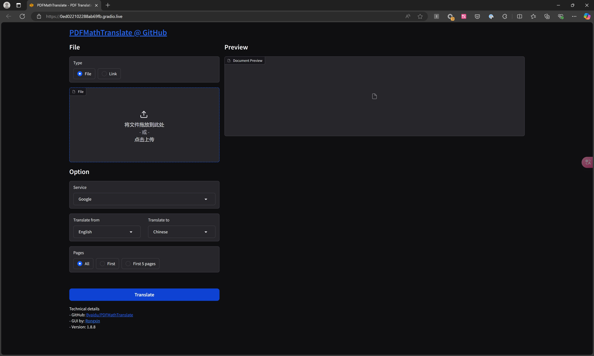

+++
title = "初试PDFMathTranslate"
date =  2025-01-08
lastmod = 2025-01-08
draft = false

tags = ["PDF", "翻译"]
summary = "PDFMathTranslate是一个 pdf 翻译工具，可以将英文版本的 pdf 翻译为中文并保留原有的格式。"
abstract = "PDFMathTranslate是一个 pdf 翻译工具，可以将英文版本的 pdf 翻译为中文并保留原有的格式。"

[header]
image = ""
caption = ""

+++

## 背景

项目地址：

https://github.com/Byaidu/PDFMathTranslate

## windows 安装（家用电脑）

用自己家里的普通台式机，windows 11 ltsc 2024 版本。

安装：

```bash
pip install pdf2zh
```

启动 GUI 界面：

```bash
pdf2zh -i
```

一切顺利，除了需要做好全局科学上网的准备。

## windows 安装（公司笔记本）

备注：公司笔记本，可能有一些特别的限制，导致中间遇到很多问题，记录下来仅供参考。

操作系统是 windows 11 23h2。

### 安装python

https://skyao.io/post/202408-marker-setup-on-windows/

参考 marker 安装 python，为了统一python 版本，我开始选择了和 marker 一样使用 python 3.10 版本。

### 安装 PDFMathTranslate

安装很简单：

```bash
pip install pdf2zh
```

顺利安装好 pdf2zh，但随后在使用中遇到一堆的问题，暂时纪录如下。

### typing_extensions报错

首先是 typing_extensions报错：

```bash
ImportError: cannot import name 'TypeIs' from 'typing_extensions'
```

后来unisntall typing_extensions，再重新install，又莫名其妙的好了。

```bash
pip unintall typing_extensions
pip install typing_extensions
```

参考：

- https://github.com/AbdBarho/stable-diffusion-webui-docker/issues/719
- https://github.com/AbdBarho/stable-diffusion-webui-docker/issues/722

### onnx报错

```bash
Traceback (most recent call last):
  File "<frozen runpy>", line 198, in _run_module_as_main
  File "<frozen runpy>", line 88, in _run_code
  File "C:\Users\sky\AppData\Local\Programs\Python\Python311\Scripts\pdf2zh.exe\__main__.py", line 4, in <module>
  File "C:\Users\sky\AppData\Local\Programs\Python\Python311\Lib\site-packages\pdf2zh\__init__.py", line 2, in <module>
    from pdf2zh.high_level import translate, translate_stream
  File "C:\Users\sky\AppData\Local\Programs\Python\Python311\Lib\site-packages\pdf2zh\high_level.py", line 15, in <module>
    from pdf2zh.doclayout import DocLayoutModel
  File "C:\Users\sky\AppData\Local\Programs\Python\Python311\Lib\site-packages\pdf2zh\doclayout.py", line 5, in <module>
    import onnx
  File "C:\Users\sky\AppData\Local\Programs\Python\Python311\Lib\site-packages\onnx\__init__.py", line 77, in <module>
    from onnx.onnx_cpp2py_export import ONNX_ML
ImportError: DLL load failed while importing onnx_cpp2py_export: 动态链接库(DLL)初始化例程失败。
```

google到说需要降级版本：

- https://blog.csdn.net/qq_38702496/article/details/141052666

onnx 的版本从这里看： https://github.com/onnx/onnx/releases

默认安装的是最新的版本 v1.17.0，尝试降级为 v1.16.2继续报错，降级到 v1.16.1 不再报错。

```bash
pip uninstall onnx
pip install onnx==1.16.1
```

我后来提交了一个issue，确认的确是在某些情况下会出现这个问题，降级到 v1.16.1 也的确是目前最方便的处理方式。

参见： https://github.com/Byaidu/PDFMathTranslate/issues/423

### huggingface_hub报错

huggingface_hub 报错：

```bash
......
  File 
  "C:\Users\xxxx\AppData\Local\Programs\Python\Python310\lib\site-packages\huggingface_hub\file_download.py", line 301, in _request_wrapper
    response = get_session().request(method=method, url=url, **params)
  File "C:\Users\xxxx\AppData\Local\Programs\Python\Python310\lib\site-packages\requests\sessions.py", line 589, in request
    resp = self.send(prep, **send_kwargs)
  File "C:\Users\xxxx\AppData\Local\Programs\Python\Python310\lib\site-packages\requests\sessions.py", line 703, in send
    r = adapter.send(request, **kwargs)
  File "C:\Users\xxxx\AppData\Local\Programs\Python\Python310\lib\site-packages\huggingface_hub\utils\_http.py", line 93, in send
    return super().send(request, *args, **kwargs)
  File "C:\Users\xxxx\AppData\Local\Programs\Python\Python310\lib\site-packages\requests\adapters.py", line 698, in send
    raise SSLError(e, request=request)
requests.exceptions.SSLError: (MaxRetryError("HTTPSConnectionPool(host='cdn-lfs-us-1.hf.co', port=443): Max retries exceeded with url: /repos/f5/94/f594dea68dc4fa80d9460b7731310af7a671baf0a48e1186d37a2fab95e2db7e/fece9af02f618b603ff7921ccec6861d13e7e1f9830e091dfb7e8ad9311e5b21?response-content-disposition=inline%3B+filename*%3DUTF-8%27%27doclayout_yolo_docstructbench_imgsz1024.onnx%3B+filename%3D%22doclayout_yolo_docstructbench_imgsz1024.onnx%22%3B&Expires=1736472113&Policy=eyJTdGF0ZW1lbnQiOlt7IkNvbmRpdGlvbiI6eyJEYXRlTGVzc1RoYW4iOnsiQVdTOkVwb2NoVGltZSI6MTczNjQ3MjExM319LCJSZXNvdXJjZSI6Imh0dHBzOi8vY2RuLWxmcy11cy0xLmhmLmNvL3JlcG9zL2Y1Lzk0L2Y1OTRkZWE2OGRjNGZhODBkOTQ2MGI3NzMxMzEwYWY3YTY3MWJhZjBhNDhlMTE4NmQzN2EyZmFiOTVlMmRiN2UvZmVjZTlhZjAyZjYxOGI2MDNmZjc5MjFjY2VjNjg2MWQxM2U3ZTFmOTgzMGUwOTFkZmI3ZThhZDkzMTFlNWIyMT9yZXNwb25zZS1jb250ZW50LWRpc3Bvc2l0aW9uPSoifV19&Signature=DTrQPAuPIXVMZ-etTicFBQdSs18wXA-Y2k6QLO5fvZTwcjq7B1skYBY0uF3ejbrHuAzhcDzcQ0VeSKu4uFUgnzt7UjQUgIN6ulWa74UA7ld2WC6N2lFvs0yw73oe0Tc14jL-NocPZBhY~f6LCmSlNPepJrx9zxDYHGlfNUDXL3Tgzzmb9rZBaAjcuGodQmYtzmI73RKEu77HaIWPgQn2kQjZyC2f3emApmgnCAYo4NHjcoDE-geW2zLb3evpdPgOvGf4PJg6F-P8ri4vidoTcsQuKkYXd3~Z5EO-M3RFPyncdIhXuX1LPD4MS3mLkoJWCVcJCZ51drmJIj9HzQZsPA__&Key-Pair-Id=K24J24Z295AEI9 (Caused by SSLError(SSLCertVerificationError(1, '[SSL: CERTIFICATE_VERIFY_FAILED] certificate verify failed: self signed certificate in certificate chain (_ssl.c:1007)')))"), '(Request ID: a96506d9-ed3a-4ea1-be78-a4ce48fea0ff)')
```

`CERTIFICATE_VERIFY_FAILED] certificate verify failed: self signed certificate in certificate chain` 这是自签名证书没有通过验证。

按说最简单的方式就是强制不要做验证，尝试设置环境变量：

```bash
export REQUESTS_CA_BUNDLE=""
export CURL_CA_BUNDLE=""
```

没能禁止验证，依然报错。

参考：

- https://stackoverflow.com/questions/77667824/hugging-face-certificate-verification-failed

用最笨最粗暴的办法，临时修改 requests 的代码来绕开这个报错。打开文件 `C:\Users\xxxx\AppData\Local\Programs\Python\Python310\lib\site-packages\requests\adapters.py`，找到 698 行附近：

```python
def send(
        self, request, stream=False, timeout=None, verify=True, cert=None, proxies=None
    ):
        """Sends PreparedRequest object. Returns Response object.

        :param request: The :class:`PreparedRequest <PreparedRequest>` being sent.
        :param stream: (optional) Whether to stream the request content.
        :param timeout: (optional) How long to wait for the server to send
            data before giving up, as a float, or a :ref:`(connect timeout,
            read timeout) <timeouts>` tuple.
        :type timeout: float or tuple or urllib3 Timeout object
        :param verify: (optional) Either a boolean, in which case it controls whether
            we verify the server's TLS certificate, or a string, in which case it
            must be a path to a CA bundle to use
        :param cert: (optional) Any user-provided SSL certificate to be trusted.
        :param proxies: (optional) The proxies dictionary to apply to the request.
        :rtype: requests.Response
        """
        
        """
        增加这一行，强制将verify设置为false
        """
        verify = False
        ......
```

通过这么一个粗暴的方式终于临时绕开自签名，顺利打开基于 web 的 GUI 界面。

后来对比了一下，发现问题是出现在代理服务器上，如果通过 all_proxy / http_proxy 等方式指定了代理，则就会如上报错。

但没有代理又无法访问huggingface_hub，因此解决的方式是本机不要设置代理，在路由器上采用自动代理，或者在本地开启代理软件设置为全局代理模式。均可规避上述错误。

### OpenCV报错

尝试提交一个 pdf 文件进行转换，结果继续报错，这回是 OpenCV：

```bash
Files before translation: ['agents-long-game-ai-computational.pdf']
{'files': ['pdf2zh_files\\agents-long-game-ai-computational.pdf'], 'pages': [0, 1, 2, 3, 4], 'lang_in': 'en', 'lang_out': 'zh', 'service': 'bing', 'output': WindowsPath('pdf2zh_files'), 'thread': 4, 'callback': <function translate_file.<locals>.progress_bar at 0x000001FA6FE9AF80>}
 20%|█████████████████████████▏                                                                                                    | 1/5 [00:00<00:00, 28.67it/s]
Traceback (most recent call last):
  File "C:\Users\sky\AppData\Local\Programs\Python\Python310\lib\site-packages\gradio\queueing.py", line 625, in process_events
    response = await route_utils.call_process_api(
  File "C:\Users\sky\AppData\Local\Programs\Python\Python310\lib\site-packages\gradio\route_utils.py", line 322, in call_process_api
    output = await app.get_blocks().process_api(
  File "C:\Users\sky\AppData\Local\Programs\Python\Python310\lib\site-packages\gradio\blocks.py", line 2045, in process_api
    result = await self.call_function(
  File "C:\Users\sky\AppData\Local\Programs\Python\Python310\lib\site-packages\gradio\blocks.py", line 1592, in call_function
    prediction = await anyio.to_thread.run_sync(  # type: ignore
  File "C:\Users\sky\AppData\Local\Programs\Python\Python310\lib\site-packages\anyio\to_thread.py", line 56, in run_sync
    return await get_async_backend().run_sync_in_worker_thread(
  File "C:\Users\sky\AppData\Local\Programs\Python\Python310\lib\site-packages\anyio\_backends\_asyncio.py", line 2461, in run_sync_in_worker_thread
    return await future
  File "C:\Users\sky\AppData\Local\Programs\Python\Python310\lib\site-packages\pdf2zh\gui.py", line 165, in translate_file
    translate(**param)
  File "C:\Users\sky\AppData\Local\Programs\Python\Python310\lib\site-packages\pdf2zh\high_level.py", line 278, in translate
    s_mono, s_dual = translate_stream(s_raw, **locals())
  File "C:\Users\sky\AppData\Local\Programs\Python\Python310\lib\site-packages\pdf2zh\high_level.py", line 213, in translate_stream
    obj_patch: dict = translate_patch(fp, **locals())
  File "C:\Users\sky\AppData\Local\Programs\Python\Python310\lib\site-packages\pdf2zh\high_level.py", line 117, in translate_patch
    page_layout = model.predict(image, imgsz=int(pix.height / 32) * 32)[0]
  File "C:\Users\sky\AppData\Local\Programs\Python\Python310\lib\site-packages\pdf2zh\doclayout.py", line 149, in predict
    pix = self.resize_and_pad_image(image, new_shape=imgsz)
  File "C:\Users\sky\AppData\Local\Programs\Python\Python310\lib\site-packages\pdf2zh\doclayout.py", line 103, in resize_and_pad_image
    image = cv2.resize(
cv2.error: OpenCV(4.10.0) :-1: error: (-5:Bad argument) in function 'resize'
> Overload resolution failed:
>  - src is not a numpy array, neither a scalar
>  - Expected Ptr<cv::UMat> for argument 'src'
```

简直无语。考虑到在我家里的台式机电脑上没有遇到这个问题，所以怀疑可能又是某种不兼容，尝试卸载 python 3.10，然后删除 `C:\Users\sky\AppData\Local\Programs\Python\Python310\` 下的所有内容。重新安装 python 3.11.9 版本，再次重新安装 pdf2zh。

这个问题又莫名其妙的消失了。

## 使用

### GUI 界面

通过执行 `pdf2zh -i` 命令可以打开基于 web 的 GUI 界面：

```bash
 pdf2zh -i
* Running on local URL:  http://0.0.0.0:7860
Error launching GUI using 0.0.0.0.
This may be caused by global mode of proxy software.
Rerunning server... use `close()` to stop if you need to change `launch()` parameters.
---
Error launching GUI using 127.0.0.1.
This may be caused by global mode of proxy software.
Rerunning server... use `close()` to stop if you need to change `launch()` parameters.
----
* Running on public URL: https://0ed022102288ab69fb.gradio.live

This share link expires in 72 hours. For free permanent hosting and GPU upgrades, run `gradio deploy` from the terminal in the working directory to deploy to Hugging Face Spaces (https://huggingface.co/spaces)

```

我这里因为是在本地通过代理软件开启了全局代理模式，因此无法使用 0.0.0.0 和 127.0.0.1 打开界面。最后通过 https://0ed022102288ab69fb.gradio.live 地址打开了浏览器，界面如下：



这个界面可以在没有科学上网的情况下打开，但是提交pdf文件开始翻译之后，preview界面那边是需要科学上网的，否则会报错 connection timeout。

比较遗憾的是，我即使开启了科学上网，也没有成功。

TODO：稍后到网络条件更好的地方再试一下。

### 命令行

通过命令行也可以调用 pdf2zh 来进行 pdf 文件的翻译，如：

```bash
pdf2zh ./applications-challenges-future-chatgpt.pdf -p 1-100
```

顺利完成，此时在当前目录下，除了原英文版本的 pdf 文件外，还有出现两个新生成的 pdf 文件：

```bash
$ ls *.pdf
applications-challenges-future-chatgpt-dual.pdf
applications-challenges-future-chatgpt-mono.pdf
applications-challenges-future-chatgpt.pdf
```

- applications-challenges-future-chatgpt-mono.pdf： 中文翻译版本
- applications-challenges-future-chatgpt-dual.pdf：中英文对照版本，即一页中文，一页英文，方便对照。

翻译的效果，只能说还行，借助于最新的人工智能翻译引擎，翻译后的内容可读性还算可以。如果要求不高，只是作为一个快速阅读通览全文的手段，不苛求细节，还是很不错的。至少我个人还是比较满意的。

缺点自然也是有的，毕竟不能和专业人员手工翻译和多次校对，出版社精细排版的翻译成书相比。内容多少有些机翻的味道（其实已经很好了，和过去相比），排版方面也有各种瑕疵。但怎么说呢，瑕不掩瑜吧。


关键是这个翻译是真很方便，真的很快。尤其是网上经常有大量的英文技术书籍出版，这些书籍引入到国内翻译完成到出版上市，和英文原版相比最少要晚1-2年，在技术日新月异的今天，两年时间会造成技术书籍的时效性大减。

另外，网上通常很快就会有这些新出版书籍的 pdf 格式文件可供下载，拿到这些英文原版 pdf 之后，通过 pdf2zh 工具进行快速翻译，可以立即得到一个不完美但是基本可读的中文翻译版本，还是很不错的。毕竟中文是母语，可以一目十行的快速浏览。

#### 限速问题

但要注意，如果 pdf 文件比较长，页数比较多，则可能会中途报错，如：

```bash
ERROR:pdf2zh.converter:HTTPConnectionPool(host='translate.google.com', port=80): 
Max retries exceeded with url: /m?tl=zh-CN&sl=en&q=The+emergence+of+powerful+conversational+AI+systems+such+as+ChatGPT+demonstrates+the+fast+growth++of+technology+and+its+capacity+to+change+the+way+we+operate.+While+it+is+true+that+such+technology+may++eliminate+certain+employment%2C+it+has+the+ability+to+generate+new+possibilities+and+increase+efficiency+in++a+variety+of+industries.+However%2C+it+is+crucial+to+acknowledge+the+necessity+for+effective+implementa-+tion+and+regulation+to+guarantee+that+these+technologies+are+utilized+ethically+and+responsibly+%28Rasul%2C%2C++et+al%2C2023%2C+pp.1-6%29. 
(Caused by ConnectTimeoutError(<urllib3.connection.HTTPConnection object at 0x00000240B7CEEDD0>, 
'Connection to translate.google.com timed out. (connect timeout=None)'))
```

应该是默认使用的 google 翻译有限速，连续太多次调用被限制使用了。

参见：https://github.com/Byaidu/PDFMathTranslate/issues/424

换用 bing 试了一下 ，速度比 google 慢很多，中途还报告了几次错误，但好在有惊无险的最终完成了全部333页 pdf 的翻译：

```bash
 pdf2zh ./applications-challenges-future-chatgpt.pdf -s bing
  6%|█████                                                                               | 20/333 [00:27<14:25,  2.76s/it]ERROR:pdf2zh.converter:'translations'
  9%|███████▎                                                                            | 29/333 [00:46<08:25,  1.66s/it]ERROR:pdf2zh.converter:'translations'
 36%|██████████████████████████████▏                                                    | 121/333 [04:33<09:04,  2.57s/it]ERROR:pdf2zh.converter:'translations'
 63%|████████████████████████████████████████████████████▌                              | 211/333 [08:56<05:15,  2.58s/it]ERROR:pdf2zh.converter:'translations'
 93%|█████████████████████████████████████████████████████████████████████████████      | 309/333 [13:00<01:13,  3.07s/it]ERROR:pdf2zh.converter:'translations'
100%|███████████████████████████████████████████████████████████████████████████████████| 333/333 [14:38<00:00,  2.64s/it]
```

继续对比deepl，翻译前看了一下我的 deepl free 账户上还剩余 46万个免费字符。很遗憾，46万字符的容量连翻译一个333页的 pdf 文件都不够，在配额耗尽之后报错：

```bash
......
ERROR:pdf2zh.converter:Quota for this billing period has been exceeded, message: Quota Exceeded
ERROR:pdf2zh.converter:Quota for this billing period has been exceeded, message: Quota Exceeded
ERROR:pdf2zh.converter:Quota for this billing period has been exceeded, message: Quota Exceeded
ERROR:pdf2zh.converter:Quota for this billing period has been exceeded, message: Quota Exceeded
ERROR:pdf2zh.converter:Quota for this billing period has been exceeded, message: Quota Exceeded
```

deepl的配额问题可以通过升级到 pro 订阅来解决，看描述是可以按需付费，10万字符25美元大概180多人民币。感觉这个费用偶尔翻译一些不大的 pdf 内容可以接受，但用来整本整本的翻译 pdf 格式的技术书籍完全无法承受。

还是继续挖掘可以免费使用的 bing 吧。

### 可选参数

无论是 GUI 还是命令行， 都有不少参数可供选择。

这是 pdf2zh 的命令行帮助的输出：

```bash
$ pdf2zh --help
usage: pdf2zh [-h] [--version] [--debug] [--pages PAGES] [--vfont VFONT]
              [--vchar VCHAR] [--lang-in LANG_IN] [--lang-out LANG_OUT]
              [--service SERVICE] [--output OUTPUT] [--thread THREAD]
              [--interactive] [--share] [--flask] [--celery]
Parser:
  Used during PDF parsing

  --pages PAGES, -p PAGES
                        The list of page numbers to parse.
  --vfont VFONT, -f VFONT
                        The regex to math font name of formula.
  --vchar VCHAR, -c VCHAR
                        The regex to math character of formula.
  --lang-in LANG_IN, -li LANG_IN
                        The code of source language.
  --lang-out LANG_OUT, -lo LANG_OUT
                        The code of target language.
  --service SERVICE, -s SERVICE
                        The service to use for translation.
  --output OUTPUT, -o OUTPUT
                        Output directory for files.
  --thread THREAD, -t THREAD
                        The number of threads to execute translation.
  --interactive, -i     Interact with GUI.
  --share               Enable Gradio Share
  --flask               flask
  --celery              celery
```

其中最重要的是选择用于翻译的服务，可选项有：

- Google
- Bing
- DeepL
- DeepLX
- Ollama
- AzureOpenAI
- OpenAI
- Zhipu
- Silicom
- Gemini
- Azure
- Tencent

注意在命令行中需要用小写，如：

```bash
$ pdf2zh ./applications-challenges-future-chatgpt.pdf -p 1-10 -s google
# 耗时4秒

$ pdf2zh ./applications-challenges-future-chatgpt.pdf -p 1-10 -s bing
# 耗时32秒
```

对于 auth_key 等额外参数的，需要通过环境变量来传递，如 deepl: 

```bash
$ DEEPL_SERVER_URL=https://api-free.deepl.com DEEPL_AUTH_KEY=84416fef-xxxx-xxxx-xxxx-xxxxxxxf3:fx pdf2zh ./applications-challenges-future-chatgpt.pdf -p 1-10 -s deepl
# 耗时16秒
```

具体有哪些环境变量要设置，没有看到文档，估计只能翻代码了。我是在 issue 中偶尔看到的：

- https://github.com/Byaidu/PDFMathTranslate/issues/175

## 总结

首先说优点：

- 能用：虽然多少有机翻的味道和排版不够理想，但起码是能入目的，从务实的角度看足以满足快速翻译/快速阅读的基本目标
- 便捷：理论上一个命令就能完成全部翻译工作，对比我之前用 marker 将 pdf 转 markdown，再人工纠正排版，然后机翻+人工校对，速度快了几十倍。

然后说缺点：

- 安装和运行有些莫名其妙的问题，很看人品；遇到问题时，需要有自己解决问题的能力
- 机翻难免有些机翻的味道，在所难免，这应该算是翻译引擎的问题
- 排版有瑕疵，有些甚至有些无厘头，希望可以改进
- 翻译引擎的选择难题，免费的有限制，收费的很贵。唯一欣喜的是 bing 即免费又没限制，简直良心。
- 最重要的：文档极其匮乏，遇到问题只能自己去 issue 中碰运气和 google。

## 参考资料

- [1.7K Star 科研党必备！PDFMathTranslate：精准翻译PDF，完美保留排版的开源神器。](https://mp.weixin.qq.com/s/cw1M0GVxfCE8095MyNWcdg?utm_source=pocket_shared)