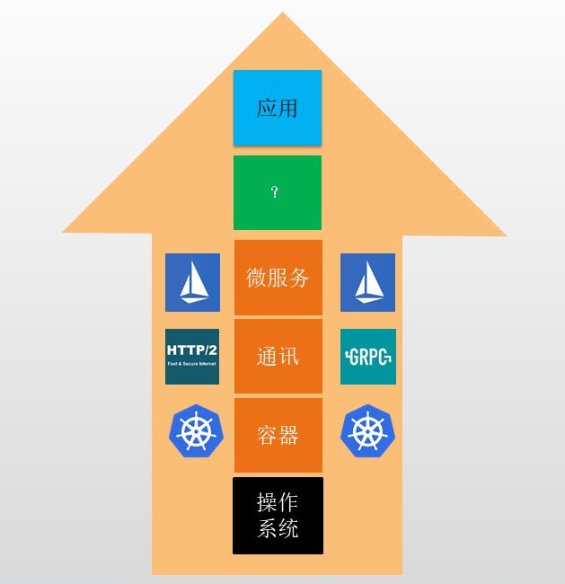
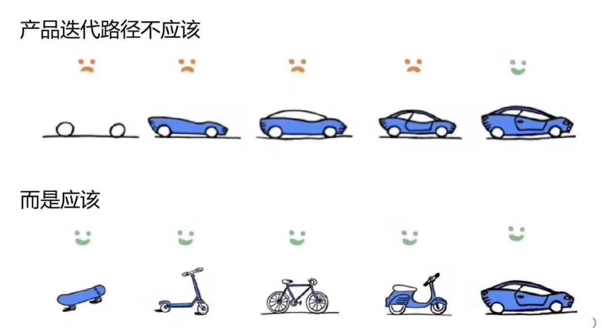
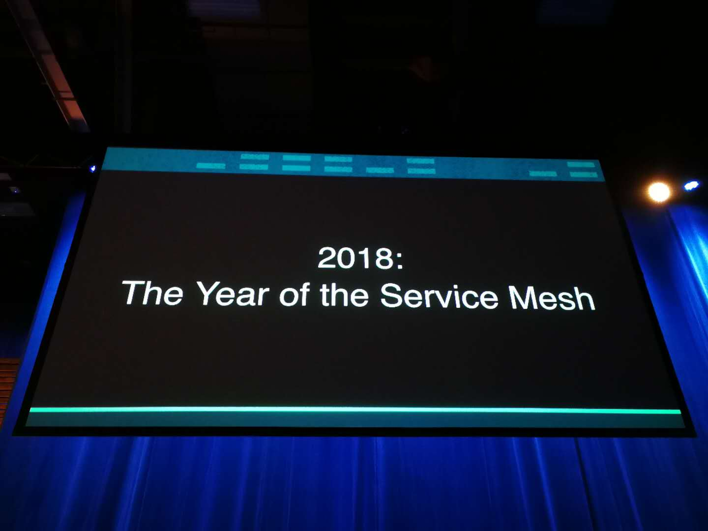

在过去的2016年和2017年，微服务技术得以迅猛普及，和容器技术一起成为这两年中最吸引眼球的技术热点。而以Spring Cloud为代表的传统侵入式开发框架，占据着微服务市场的主流地位，它甚至一度成为微服务的代名词。

直到2017年底，当非侵入式的Service Mesh技术终于从萌芽到走向了成熟，当Istio/Conduit横空出世，人们才惊觉：微服务并非只有侵入式一种玩法，更不是Spring Cloud的独角戏！

这一次的新生力量，完全不按照常理出牌，出场就霸道地掀翻桌子，直接摆出新的玩法：Service Mesh，下一代微服务！这一场大战，在 2017 年的最后一个月，终于上演到白热化，被摆上了台面，受到越来越多人关注。往日霸主 Spring Cloud，此时只能沦为看客。

2017年的Service Mesh历程，在平淡中开始，如戏剧般结束，留给我们一个充满想象和憧憬的2018。让我们一起来回顾这堪称精彩的一年。

## Service Mesh的萌芽期

在我们正式开始2017年回顾之前，我们将时间稍微放前一点，回到2016年：有些故事背景需要预交交代一下。

虽然直到2017年底，Service Mesh才开始较大规模被世人了解，这场微服务市场之争也才显现，但是其实Service Mesh这股微服务的新势力，早在 2016年初就开始萌芽：

- 2016年1月15日，离开twitter的基础设施工程师William Morgan和Oliver Gould，在github上发布了linkerd 0.0.7版本，他们同时组建了一个创业小公司Buoyant，业界第一个Service Mesh项目诞生。
- 2016年，Matt Klein在Lyft默默的进行Envoy的开发。Envoy诞生的时间其实要比Linkerd更早一些，只是在Lyft内部不为人所知。

在2016年初，service mesh还只是Buoyant公司的内部词汇，而之后，它开始逐步走向社区：

- 2016年9月29日在SF Microservices上，“Service Mesh”这个词汇第一次在公开场合被使用。这标志着“Service Mesh”这个词，从Buoyant公司走向社区。
- 2016年10月，Alex Leong开始在buoyant公司的官方Blog中开始"A Service Mesh for Kubernetes"系列博客的连载。随着"The services must mesh"口号的喊出，buoyant和Linkerd开始service mesh概念的布道。

在这一年中，第一代的Service Mesh产品在稳步推进：

- 2016年9月13日，Matt Klein宣布Envoy在github开源，直接发布1.0.0版本
- 2016年下半年，Linkerd陆续发布了0.8和0.9版本，开始支持HTTP/2 和gRPC，1.0发布在即；同时，借助Service Mesh在社区的认可度，Linkerd在年底开始申请加入CNCF。

而在这个世界的另外一个角落，Google和IBM两位巨人，握手开始合作，他们联合Lyft，启动了Istio项目。这样，在第一代Service Mesh还未走向市场主流时，以Istio为代表的第二代Service Mesh就迫不及待地上路。

现在我们可以进入主题，开始2017年Service Mesh发展历程的回顾。

## 急转而下的Linkerd

2017年，Linkerd迎来了一个梦幻般的开局，喜讯连连：

- 2017年1月23日，Linkerd加入CNCF
- 2017年3月7日，Linkerd宣布完成千亿次产品请求
- 2017年4月25日，Linkerd 1.0版本发布

可谓各条战线都进展顺利：产品完成1.0 release，达成最重要的里程碑；被客户接受并在生产线上成功大规模应用，这代表着市场的认可；进入CNCF更是意义重大，是对Linkerd的极大认可，也使得Linkerd声名大噪。一时风光无量，可谓"春风得意马蹄疾，一日看尽长安花"。

需要特别指出的是，Linkerd加入CNCF，对于Service Mesh技术是一个非常重要的历史事件：这代表着社区对Service Mesh理念的认同和赞赏，Service Mesh也因此得到社区更大范围的关注。

趁热打铁，就在Linkerd 1.0版本发布的同一天，创作者继续Service Mesh的布道：

- 2017年4月25日，William Morgan发布博文"What’s a service mesh? And why do I need one?"。正式给Service Mesh做了一个权威定义。

然而现实总是那么残酷，这个美好的开局，未能延续多久就被击碎：

- 2017年5月24日，Istio 0.1 release版本发布，google和IBM高调宣讲，社区反响热烈，很多公司在这时就纷纷站队表示支持Istio。

Linkerd的风光瞬间被盖过，从意气风发的少年一夜之间变成过气网红。当然，从产品成熟度上来说，linkerd作为业界仅有的两个生产级Service Mesh实现之一，暂时还可以在Istio成熟前继续保持市场。但是，随着Istio的稳步推进和日益成熟，外加第二代Service Mesh的天然优势，Istio取代第一代的Linkerd只是个时间问题。

面对google和IBM加持的Istio，linkerd实在难有胜算：

- Istio作为第二代Service Mesh，通过控制平面带来了前所未有的控制力，远超linkerd。
- Istio通过收编和linkerd同为第一代Service Mesh的envoy，直接拥有了一个功能和稳定性与linkerd在一个水准的数据平面（也就是作为 sidecar 模式部署的 proxy）。
- 基于c++的envoy在性能和资源消耗上本来就强过基于Scala/Jvm的Linkerd
- Google和IBM组合在人力，资源和社区影响力方面远非Buoyant公司这样的小公司可以比拟

Linkerd的发展态势顿时急转而下，未来陷入一片黑暗。出路在哪里？

在一个多月后，Linkerd给出一个答案：和Istio集成，成为Istio的数据面板。

- 2017年7月11日，Linkerd发布版本1.1.1，宣布和Istio项目集成。Buoyant发表博文"Linkerd and Istio: like peanut butter and jelly"。

这个方案在意料之中，毕竟面对Google和IBM的联手威胁，选择低头和妥协是可以理解的。只是存在两个疑问：

1. 和Envoy相比，Linkerd并没有特别优势。考虑编程语言的天生劣势，Linkerd想替代Envoy难度非常之大。
2. 即使替代成功，在Istio的架构下，只是作为一个数据平面存在的Linkerd，可以发挥的空间有限。这种境地的Linkerd，是远远无法承载起Buoyant的未来的。

Linkerd的这个谜团，直到2017年即将结束的12月，在Conduit发布之后才被解开。

## 波澜不惊的Envoy

自从在2016年决定委身于Istio之后，envoy就开始了一条波澜不惊的平稳发展之路，和Linkerd的跌宕起伏完全不同。

在功能方面，由于定位在数据平面，因此Envoy无需考虑太多，很多工作在Istio的控制平面完成就好，Envoy从此专心于将数据平面做好，完善各种细节。在市场方面，Envoy和Linkerd性质不同，不存在生存和发展的战略选择，也没有正面对抗生死大敌的巨大压力。Envoy在2017年有条不紊地陆续发布了1.2、1.3、1.4和1.5版本，稳步地完善自身，表现非常稳健。

稳打稳扎的Envoy在2017年一方面继续收获独立客户，一方面伴随Istio一起成长。作为业界仅有的两个生产级Service Mesh实现之一，Envoy随后收获了属于它的殊荣：

- 2017年9月14日，Envoy加入CNCF，成为CNCF的第二个Service Mesh项目

可谓名至实归，水到渠成。作为一个无需承载一家公司未来的开源项目，Envoy在2017年的表现，无可挑剔。

## 背负使命的Istio

从Google和IBM联手决定推出Istio开始，Istio就注定永远处于风头浪尖，无论成败。

Istio背负了太多的使命：

- 建立Google和IBM在微服务市场的统治地位
- 为Google和IBM的公有云打造杀手锏级特性
- 在k8s的基础上，延续Google的战略布局

Google在企业市场的战略布局，是从底层开始，一步一步向上，一步一步靠近应用。刚刚大获全胜的K8s为Istio准备了一个非常好的基石，而Istio的历史使命，就是继k8s拿下容器之后，更进一步，**拿下微服务**！

2017年，Istio稳步向前，先后发布四个版本：

- 2017年5月24日，Istio 0.1 release版本发布
- 2017年10月4日，Istio 0.2 release版本发布
- 2017年11月30日，Istio 0.3 release版本发布
- 2017年12月15日，Istio 0.4 release版本发布

在社区方面，Istio借助Google和IBM的大旗，外加自身过硬的实力、先进的理念，很快获得了社区的积极响应和广泛支持。包括Oracle和Red Hat在内的业界大佬都明确表示对支持Istio。

在平台支持方面，Istio的初期版本只支持k8s平台，从0.3版本开始提供对非k8s平台的支持。从策略上说，Istio借助了k8s，但是没有强行绑定在k8s上。

Istio面世之后，赞誉不断，尤其是Service Mesh技术的爱好者，可以说是为之一振：以新一代Service Mesh之名横空出世的Istio，对比Linkerd，优势明显。同时产品路线图上有一大堆令人眼花缭乱的功能。假以时日，如果Istio能顺利地完成开发，稳定可靠，那么这会是一个非常美好、值得憧憬的大事件，它的意义重大：

- 重新定义微服务开发方式，让Service Mesh成为主流技术
- 大幅降低微服务开发的入门门槛，让更多的企业和开发人员可以落地微服务
- 统一微服务的开发流程，标准化开发/运维方式

奈何，事情的发展总是不会这么简单地如人所愿。Istio发布之后，试用中就被发现问题较多，0.1版本时还比较容易被接受，但是接下来的0.2、0.3和0.4，Istio在可用性上并没有明显的改观，导致迄今在全球范围内都几乎没有听到Istio上生产的案例，各家公司都将其停留在简单试用阶段。

此时再看Istio琳琅满目的各种功能，不禁让人疑惑Istio的产品策略：为什么一开场就将摊子铺的如此之大？以至于开发时间长达一年 (注意，虽然开源才半年多，但是开源前已经在开发)，却无法得到一个稳定可用的版本。

这有悖于互联网产品的开发理念。下边这个经典图片相信大家并不陌生：

从目前情景看，Istio已经在图上“不应该”的产品迭代路径上走了一年。从5月份0.1版本发布开始，我们就满心期待，却陷入“过尽千帆皆不是”的尴尬境地：每一次新版本试用后的结果，都不理想。

身处局外，无法了解Istio项目开发的背景和真实情况，也自然无法得知为何会如此，我们只能由衷地希望，Istio能在2018年尽快完成计划中的产品开发，实现生产可用。个人意见：哪怕推迟某些特性的实现，也希望能做到主体部分尽快完善。

2018年Service Mesh的整体走势，很大程度取决于Istio：如果Istio能在2018年上半年实现生产可用，哪怕是牺牲部分高级特性，也足以推动整个Service Mesh向前大步迈进。反之如果进展不顺，市场会呈现观望和等待的态势，也会给竞争对手机会，比如说，下面将要出场的Conduit。

## 背水一战的Conduit

2017年底的KubeConf，在Service Mesh成为大会热点、Istio备受瞩目时，Buoyant公司出人意料地给了踌躇满志又稍显拖沓的Istio重重一击：

- 2017年12月5日，Conduit 0.1.0版本发布，Istio的强力竞争对手亮相KubeConf。

Conduit的整体架构和Istio一致，借鉴了Istio数据平面+控制平面的设计，同时别出心裁地选择了Rust编程语言来实现数据平面，以达成Conduit 宣称的更轻、更快和超低资源占用。

继Isito之后，业界第二款第二代Service Mesh产品就此诞生。话说得有些拗口，但是一场大战就此浮出水面。Buoyant在Linkerd不敌Istio的恶劣情况下，绝地反击，祭出全新设计的Conduit作为对抗Istio的武器。

需要额外指出的是，作为一家初创型企业，在第一款主力产品Linkerd被Istio强力阻击之后，Buoyant已经身陷绝境，到了生死存亡之秋，作为背负公司期望，担负和Istio正面抗衡职责的Conduit，可谓压力巨大。

从目前得到的信息分析，Conduit明显是有备而来，针对Istio当前状况，针锋相对的：

- **编程语言**：为了达成更轻、更快和更低资源消耗的目标，考虑到Istio的数据面板用的是基于C++语言的Envoy，Conduit跳过了Golang，直接选择了Rust，颇有些剑走偏锋的意味。不过，单纯以编程语言而言，在能够完全掌握的前提下，Rust的确是做proxy的最佳选择。考虑到Envoy在性能方面的良好表现，Conduit要想更进一步，选择Rust也是可以理解。
- **架构设计**：在借鉴Istio整体架构的同时，Conduit做了一些改进。首先Conduit控制平面的各个组件是以服务的方式提供功能的，极富弹性。另外，控制平面特意为定制化需求进行了可扩展设计，可以通过编写gPRC插件来扩展Conduit的功能而无需直接修改Conduit，这对于有定制化需求的客户是非常便利的。
- **产品演进**：这是最重要的一点！Conduit完全吸取了Istio的教训，因此它的产品迭代路径会是我们最期待的方式。在本文撰写期间，笔者特意和 Conduit的CEO William深入探讨过这个话题，得到了一个非常令人欣慰的答复：++Minimal feature set，prod ready as quickly as possible++。

然而，要抗衡Istio和其身后的Google与IBM，谈何容易。Conduit2018年的发展道路，注定是充满挑战的，艰难险阻可想而知。但是，不得不佩服Buoyant公司，以及以CEO William为首的那支充满挑战精神的团队，有理想、有追求、有魄力、有勇气！期待他们在2018年的表现。

让我们回到Istio和Conduit的竞争格局。从目前局面看，Istio先天优势明显，但是产品策略上的选择给了Conduit一个难得的机会。接下来的2018年，在Conduit的威胁和刺激下，希望Istio能打起精神，给出一份令大家满意的答卷。期待Istio和Conduit能在2018年形成良性竞争，共同引领Service Mesh的大潮。

就在本文撰写之时，在2017年的最后几天，大名鼎鼎的F5 Networks公司突然放出了他们的Service Mesh类产品“Aspen Mesh”，基于Istio构建，目标“企业服务网格”。需要特别强调的是，F5在Service Mesh上的坚定决心：砍掉原有传统产品思路的项目，以内部孵化项目的方式组建独立自治团队，并在新方向上重新开始。而且在Istio才0.1版本的时候F5就做好战略决策，之后默默耕耘，其决策者的胆识令人敬佩。F5在Service Mesh这个新兴技术领域表现出积极进取的姿态，立足Istio完善企业级特性，这也是一条值得探索的路线，期待2018年Aspen Mesh的进展。

## 低调的参与者

2017年的Service Mesh，除了业界先驱Linkerd/Envoy，和后起之秀Istio/Conduit，还有一些其它的竞争者进入这个市场，只是它们都非常低调。

首先是nginmesh，来自大名鼎鼎的Nginx：

- 2017年9月，在美国波特兰举行的nginx.conf大会上，nginx宣布了nginmesh。随即在github上发布了0.1.6版本。
- 2017年12月6日，nginmesh 0.2.12版本发布
- 2017年12月25日，nginmesh 0.3.0版本发布

nginmesh的定位是作为Istio的服务代理，也就是替代Envoy，思路和Linkerd之前和Istio集成很相似。Nginmesh在发布后的两个多月，github上提交非常少，直到最近突然发力，先后发布了0.2和0.3版本。不过Nginmesh极度低调，github上的star也只有不到100。

然后是Kong，但是这个比默默无闻的nginmesh还要更加低调，只是曾经有传闻kong有意service mesh，但是后来又没有下文。不过kong的github项目介绍里面，悄悄的加上了Service Mesh的字样："Kong is a ××× Microservice Abstraction Layer (also known as an API Gateway, API Middleware or in some cases Service Mesh)."

在2017年，这些低调的参与者，几乎没有引起外界任何的注意，也无法预期他们在2018年会如何表现。从社区的角度，还是希望有更多的参与者进Service Mesh市场，以推动整个市场的健康发展。

## 快速升温的国内

2017年，随着Servic Mesh的发展，国内技术社区也开始通过新闻报道/技术文章等开始接触Service Mesh，但是传播范围和影响力都非常有限。直到年底才剧烈升温，开始被国内技术社区关注：

- 2017年10月16日，在2017 QCon上海大会上，我做了一个"Service Mesh：下一代微服务"的演讲，成为Service Mesh技术在国内大型技术峰会上的第一次亮相。
- 2017年11月，国内第一个Service Mesh的技术社区["Service Mesh中文网"](http://servicemesh.cn) 成立。
- 2017年12月，在全球架构师峰会（ArchSummit）2017北京站上，来自华为的田晓亮做了名为"Service Mesh在华为云的实践"的分享。
- 2017年12月16日，来自新浪微博的周晶做了名为"微博Service Mesh实践"的演讲，分享了Service Mesh在微博的落地情况。

此外，作为Servic Mesh国内最早的开发和实践者的华为和新浪微博，都积极参与开源。其中新浪微博Service Mesh的核心实现，跨语言通信和服务治理已经在Motan系列项目中提供，而华为也将稍后开源他们基于Golang的Service Mesh代码实现。

特别要指出的是，华为目前已经在公有云上将Service Mesh作为公共服务提供，这在国内公有云中是第一家。预计随着Service Mesh的落地和普及，公有云提供生产级别的Service Mesh服务将成为标配。在国外Google/IBM/Amazon等公有云都有提供Service Mesh的计划，相信国内公有云也会陆续跟进。

## 展望2018

2017年的Service Mesh市场，从Linkerd的风光无限开始，到Istio的横空出世，最后止于Conduit的绝地反击，可谓一波三折；产品也经历从第一代的Linkerd/Envoy，跨越性的演化出第二代的Istio/Conduit；同时，技术社区的态度也从年初的逐步接受发展到年底的热烈追捧，下面这张KubeConf上的图片非常有代表性地展示了社区的热切期望：

然而Service Mesh终究是一个新兴的技术，尤其作为未来主流的Istio/Conduit迄今还没有实现产品级别可用，因此2018年对Service Mesh而言，必然不是一帆风顺，必然是充满荆棘和坎坷的。如何实现从技术理念到产品落地，如何实实在在地解决实践中遇到的各种问题，将会是这一年中至关重要的事情。

衷心祝愿Istio和Conduit（也许还有其他的产品）可以在2018年快速成长，实现社区期待的功能和可用性，可以真正地实现降低微服务门槛的目标，让Service Mesh成为名副其实的下一代微服务。

2018年的Service Mesh，值得期望！

