备注： 广州地区难得的一次技术分享会议。

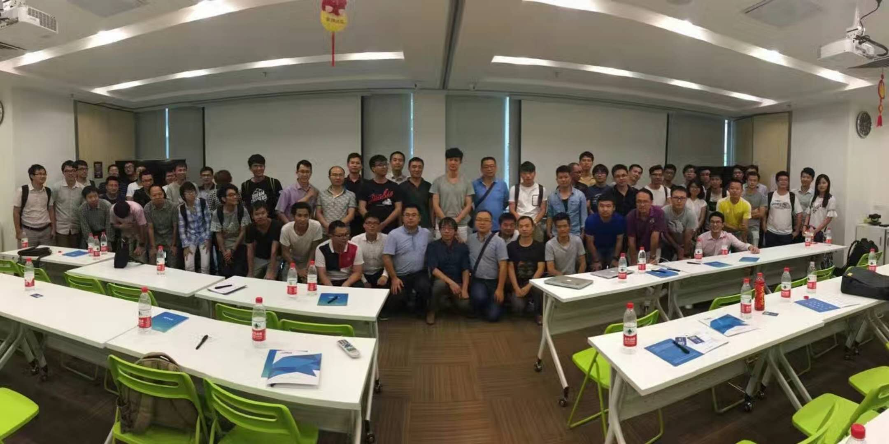

_ _ _
# 利用开源社区打造微服务生态体系

## 前言

大家好，我是敖小剑，今天给大家分享的主题是"利用开源设计打造微服务生态体系"。

主要内容如下：

内容分为三个大的部分：

1. 微服务的核心技术
2. 目前可选的开源微服务框架
3. 为微服务提供支撑的基础设施

需要说明的是，由于时间有限，而分享的内容数量太多，因此：

1. 内容都只是罗列，不展开具体介绍
2. 个人知识面有限，列举过程中范围覆盖不足有所遗漏是必然的
3. 部分场景我会给出一些个人建议，但是请注意这些都是我的一家之言，仅供参考

下面列出的是今天将会介绍的内容，数量非常多，可谓繁星璀璨。

## 第一部分：核心技术

现在开始第一个部分：核心技术。

内容主要是第一排的四个技术：

- 进程间通讯
- 服务注册与发现
- 负载均衡
- 熔断

第二排的三个内容基本都会在类库或者框架中包含，通常不会单独放出来，因此我们不详细展开。

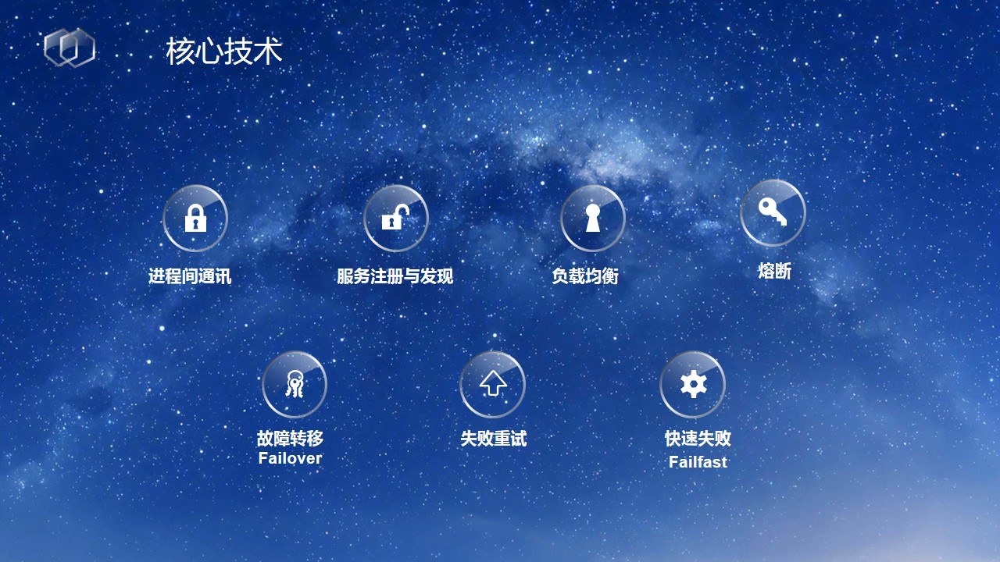

在展开讲述进程间通讯之前，额外指出一个对微服务而言及其重要的概念：

在微服务架构中，为了彻底隔绝不同服务，采用了最坚决的方案，强制要求服务之间：通过 **远程访问** 方式进行通讯

在这点上，微服务和以OSGi、jigsaw为代表的Java模块化方案形成鲜明对比。

进程间通讯的方式比较多，其多样性体现在两个方面：

- 有三种风格的解决方案：REST，RPC 和 定制
- 交互方式有两个维度：按照交互对象的数量分为一对一和一对多，按照应答返回的方式分为同步和异步。

两个维度组合之后的可能性如图：

目前业界常见的网络类库：

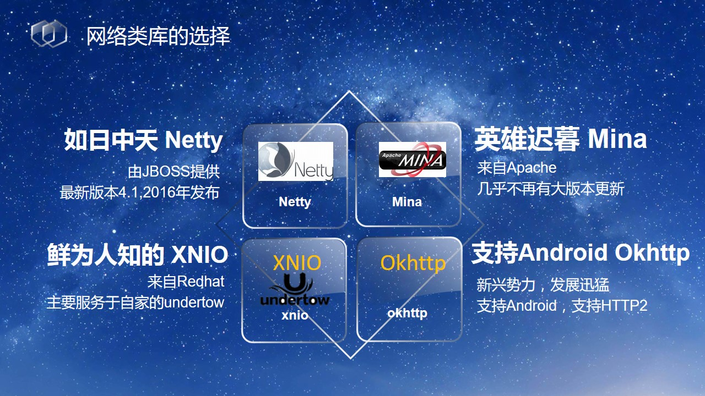

考虑到 netty 通常会是大多数人的选择，这里再展开谈一下 netty 的版本选择问题：

需要特别强调的是： netty 5.* 版本因为 ForkJoinPool 引入了太多复杂度而又未能带来明确的性能提升，已经被　netty　官方放弃，不再继续。使用 netty 5.* alpha 版本的同学请回退到 4.0 或者 4.1 版本。

Rest 研究不多，只能给出一点简单的建议。

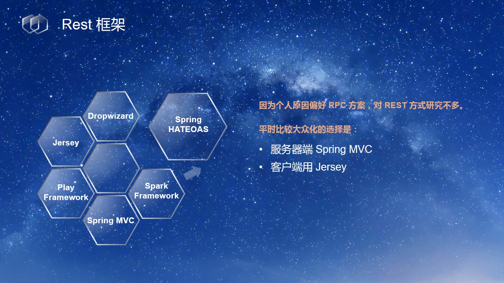

RPC框架，业界数得上数的大概有十几种，这里只详细介绍三种，分别代表老中新三代RPC框架。

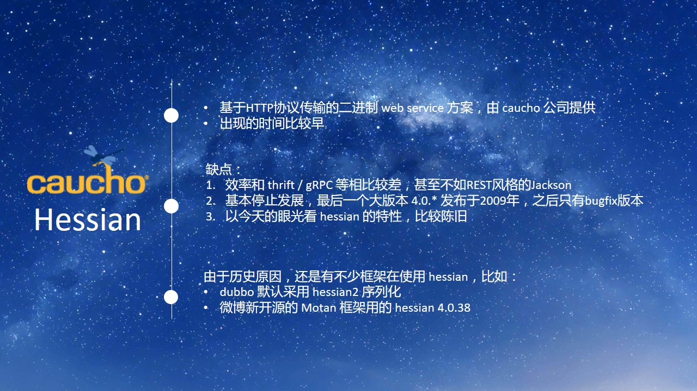

以下是个人给出的建议：

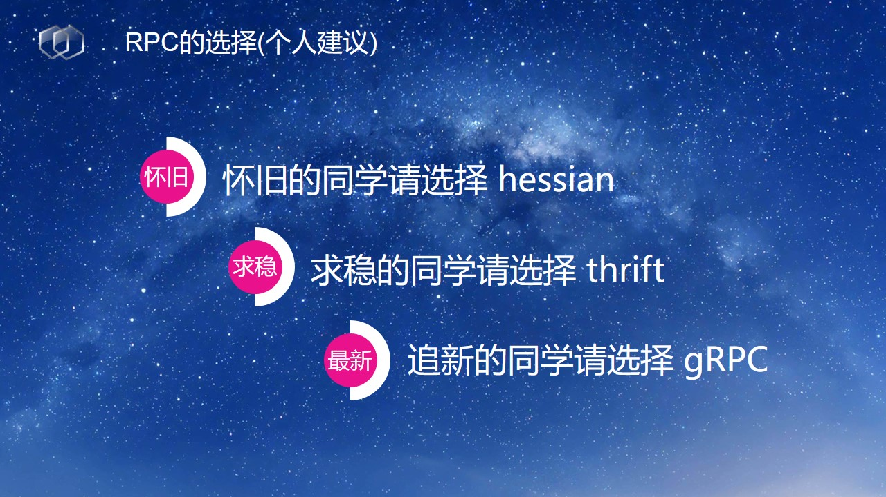

提醒一点的是：如果需要支持移动设备，如果想要用HTTTP 2 的新特性，那么就只能选择gRPC了。

谈谈第三条路线：定制。选择这种方案的同学也不少。

消息队列的选择，同样很多，这里列出三种常见的加一个特例 NSQ。

首先看服务注册和服务发现，在实现时根据对一致性要求的不同，分成两个流派：

1. 强一致性

	比较常见的分布式一致性协议是 PAXOS 协议和 Raft 协议。相比 PAXOS 而言，Raft 协议易于理解和实现，因此最新的分布式一致性方案大都选择 Raft 协议。

    zookeeper 采用的是 PAXOS 协议(实际为改进版本ZAP)，而 Raft 协议那边主要是 consul 和 etcd。

2. 弱一致性

	如果对一致性要求不高，可以选择以 DNS 为基础的方案，也可以像新浪微博的 Vintage 一样基于 Redis 。

常见的强一致性方案如下：

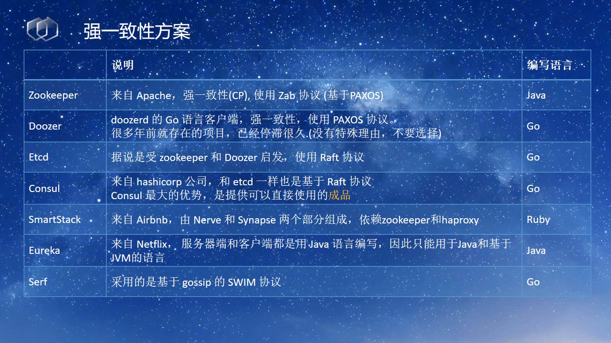

弱一致性方案比较少，一般多用于 REST 或者 HTTP + json / web service 等简单场合：

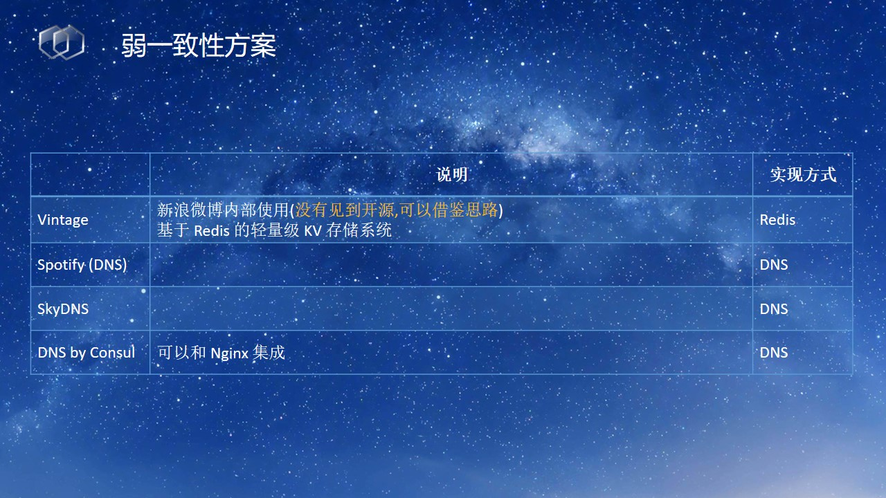

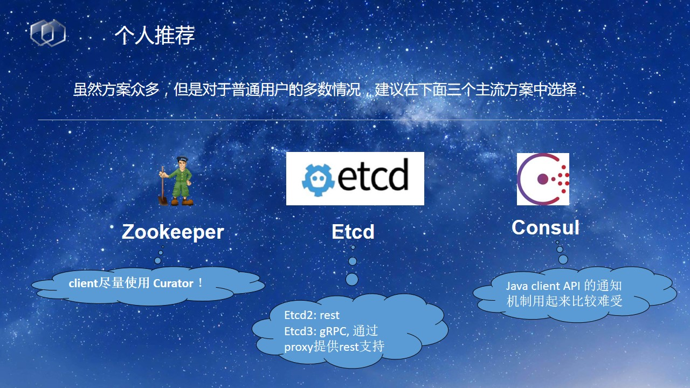

负载均衡的方案选择，注意区分服务器端负载均衡和客户端负载均衡。

熔断器目前只有一个可选的开源方案，之前有同学吐糟说 Hystrix 的设计和实现不好，但是在2016年又改进了很多。

## 第二部分：微服务框架

在国内讨论SOA、服务化、微服务时，dubbo 总是一个绕不开的名字。个人对 dubbo 的评价是"国内SOA框架集大成之作"，基本上一个SOA框架应有的功能都有了。

回顾一下 dubbo 曾经辉煌的历史：

再对比一下现状，实在令人感叹：

从时间线上来看 dubbo 的崛起和兴盛，犹如流星划过夜空.

对 dubbo 的总结，有比较多的个人情绪在，仅供参考。

Motan，能否接过 dubbo 的大旗？

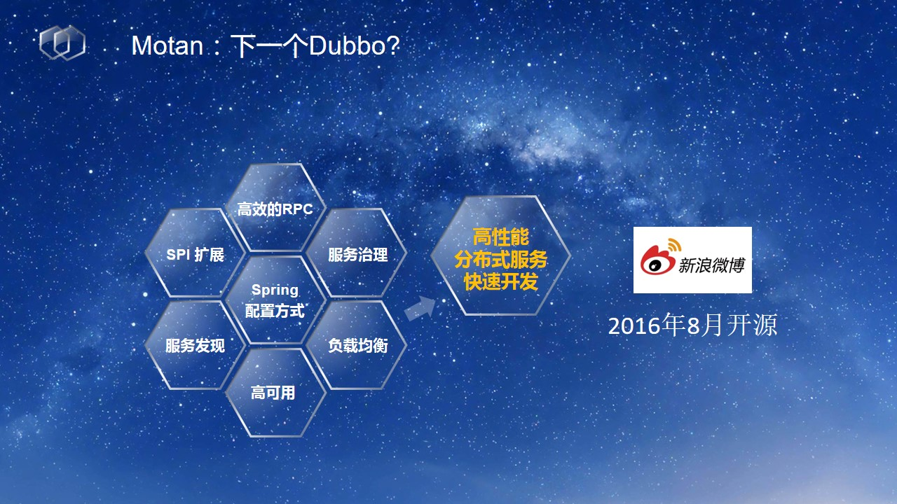

发现每个服务化框架出来，都要被问一个问题：为啥你们不直接用 dubbo 呢？ Motan也未能免俗 :)

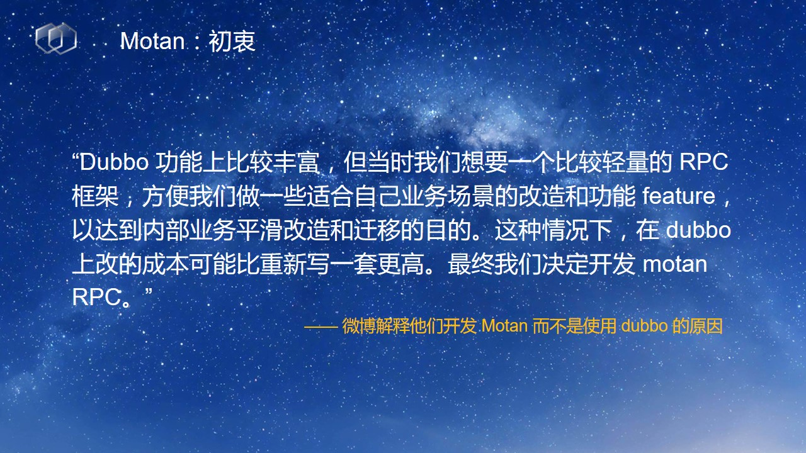

补充：这也是我自己不选择 dubbo，而是新设计 dolphin 微服务框架的重要理由之一。改造成本远不是一句轻巧的"稍微改改"那么简单。

Motan的技术栈：

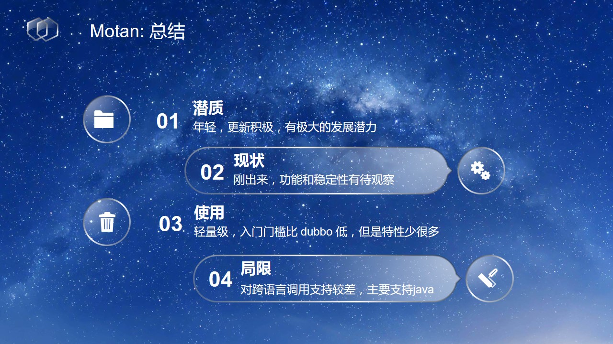

下面介绍业界大佬 Netflix 出品的重量级开源产品 OSS 套件。

Netflix 比较有意思的一个做法是他的组建拆分的比较细致，每个独立功能都拆分为单独的组件，方便按需选择，赞一个。

个人对 OSS 的一些看法，属于鸡蛋里面挑骨头性质，仅供参考。

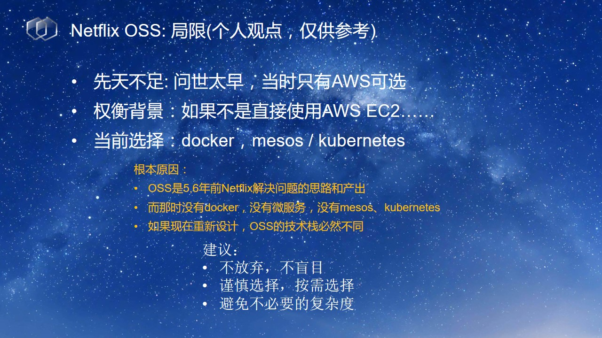

下面开始介绍另外一位业界超重量级大佬的一系列作品，所有Java同学都最熟悉不过的 spring。

在介绍spring为微服务提供的支持之前，我们先回顾一下过去这十四年spring一路的历程：

开始大叔式的怀旧环节，想当年我们看这几本书的时候，我们还那么年轻 :)

唠叨几句：Rod Johnson 大叔(现在可能要称为大爷了) 是我最敬仰最崇拜的业界大神之一。做技术能做到他这水准，此生无憾。

在spring从2002年出道开始，这十几年间出了很多里程碑式版本，增加了很多重量级的功能。但是，个人评价，2014年spring boot的问世，才是最近三五年间spring最大的变革和重新思考。

springboot的出现，代表着spring已经不再沉迷于贪吃蛇游戏，而是开始反省自身和自我改造，对于一个发展了十多年的老框架来说，认识到这点，远比加一两个新功能重要的多。

springboot的功能介绍。

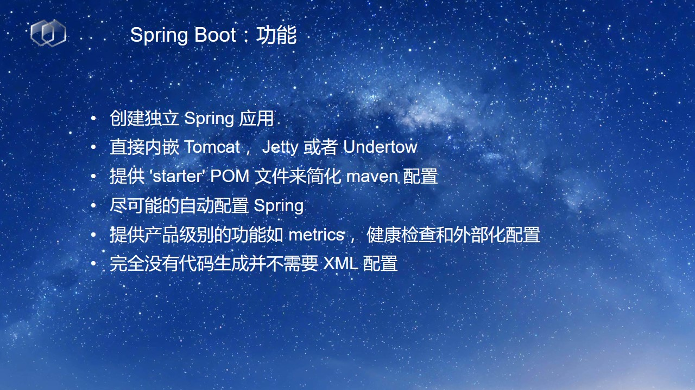

对 spring boot 总结，这也是我选择 spring boot 作为新的 dolphin 微服务框架的基石的重要理由。

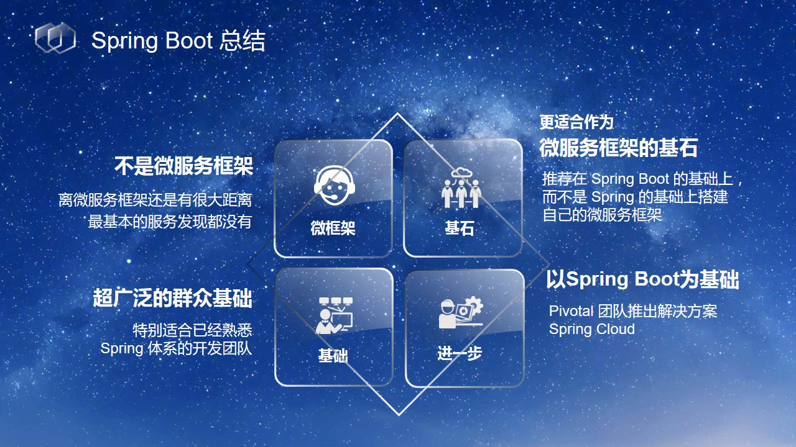

spring cloud 出场，2015年才出来的新面孔。

承载着spring对微服务架构领域的众望和抱负。

一出场，就是大量的子项目，这里只列出平时比较常用的一些：

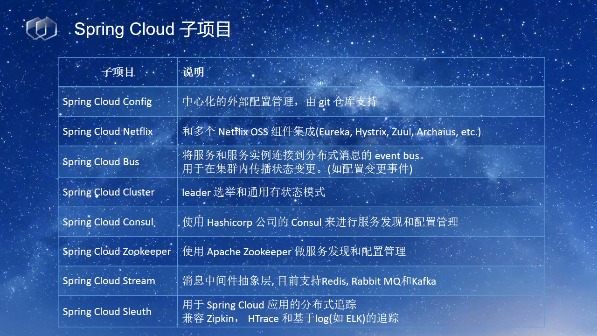

Spring Cloud Netflix 子项目的出现，更像是spring之前的做事风格，做他最擅长的领域：集成。

> 以下内容是后面补充，没有在会场直接说，纯属个人吐糟：
>
> 对spring cloud的个人评价：想法很好，出发点正确，市场空缺而切入的时机很合适。但是，spring cloud的实际表现，总给人一种束手束脚，瞻前顾后，小富即安的感觉。对比十几年前 Rod Johnson 大叔意气风发，气壮山河，谈笑间掀翻EJB的王座的表现，如今的spring cloud，能力不足，信心不够，格局太小，难成大器。期待后面能有转变。

下面是对目前微服务框架的个人看法：

## 第三部分：基础设施

由于演讲时间只有一个小时，因此基础设施的很多内容无法罗列，这次只是介绍了其中小部分的内容。

分布式配置管理的目前主流底层存储的方案，如果自己动手打造那么可选的无非就是下面这些：

也可以选择现有成型的开源产品：

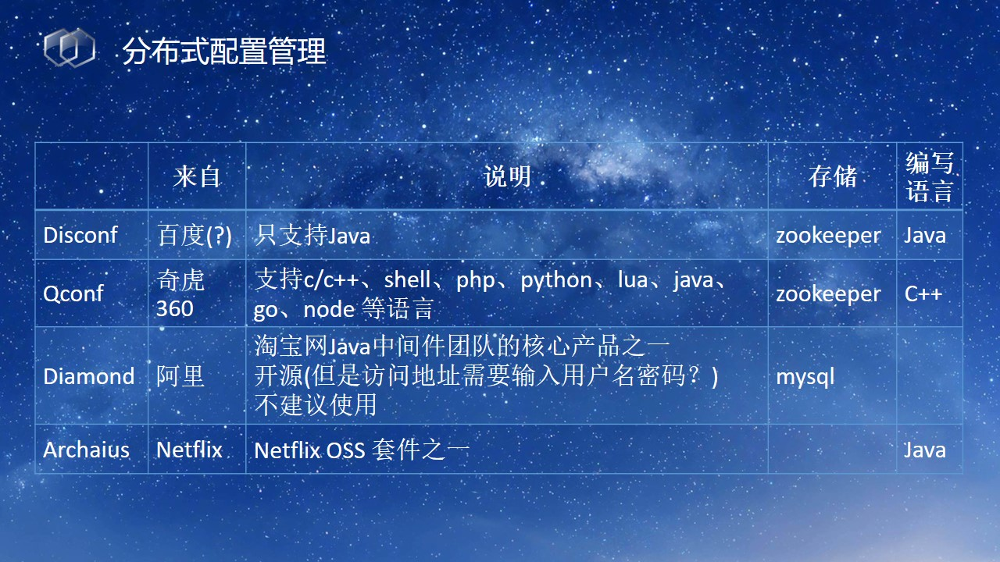

APM领域的选择，商业产品很多，但是开源的选择实在不多：

在日志分析领域，ELK是王者，但是也有新秀出场：

## 结束语

洋洋洒洒的列举了几十个名字，但并不是让大家每个名字都去探索一遍，日常中如果需要做技术抉择，我有两句话：

1. 仰望星空，看弱水三千：眼界要开阔，知识面要广，哪怕只是精通各种名字，至少，知道在某个地方有个好东西，知道某个领域有其他的选择
2. 立足当下，吾只取一瓢：最终还是要落地的，能玩的转的东西才是好东西。另外，好东西虽多，找到一个能适合自己，能解决问题的就好了，别贪心，别贪多

