# 山雨欲来风满楼

大家好，我是敖小剑，来自数人云。今天给大家带来的专题，相对来说会比较轻松一点。大家前面听到的两位的演讲都是非常有真材实料的，以及在我的下一场，周晶同学会带来一个非常有干货的Service Mesh实战的专题。我的内容会比较轻松一点，也比较好玩，主要是今天的主题比较特殊一点，因为我们选择的是“选边与站队”。OK，我们开始今天的主题。

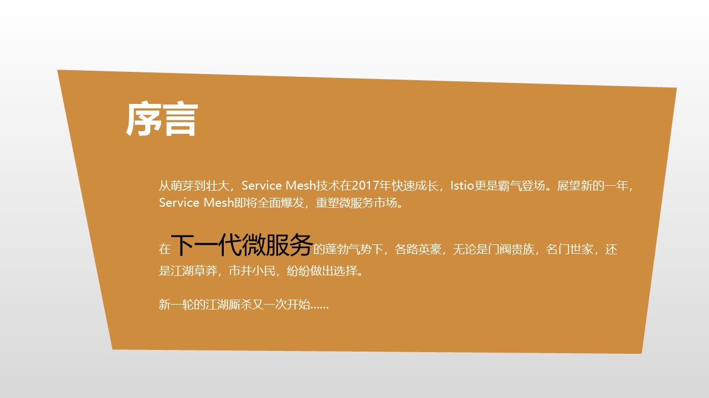

在2017年，Servicemesh技术在快速成长。我们看到在年中的时候，Istio非常霸气的登场。如果大家有关注Service Mesh这个技术，就会知道大概10天前，Conduit这个产品突然发布了。实际上在这过去的一年当中，Servicemesh历经了非常多的事情。在经过2017年的酝酿过程后，Service Mesh技术接近一个爆发的状态。而2018年很有可能就是Service Mesh全面爆发的一年，它的目标其实就是一个：**重新塑造整个微服务市场**。

在今年十月份的时候，我在QCon做了一个演讲，叫“Servicemesh——下一代微服务”。这个口号十月份喊出来的时候，还是有蛮多反对的声音。有个挺有意思的事情，我一直当成玩笑来说。当时QCon在转我的演讲实录文章的时候，在我的标题后面，在”Servicemesh:下一代微服务”后面打了一个问号，那个问号是Infoq的编辑加的。我的理解是，小编觉得如果这个标题由他们发出来，可能有Infoq的印号。所以为了避嫌，在后面打了一个问号。

大概是在一个星期前，KubeConf刚刚召开，Servicemesh非常的火，而这个时候Infoq做了一个事情，把之前QCon的视频处理好了发出来。视频的标题是”Servicemesh:下一代微服务”，后面再也没有问号了。这是很小的插曲，非常深刻的表明过去的几个月当中，ServiceMesh技术快速的变化，以及大家对它认知的变化。

我们开始今天的主题，站队和选边。上面有一句话叫”新一轮的江湖厮杀又一次开始了”，有个小问题，为什么要说又字？大家觉得上一轮江湖厮杀是什么内容？我们来问一个问题，在大家的认知当中，IT领域的上一轮厮杀是谁对谁。

（备注： 现场互动，有同学指出，容器，k8s，mesos，swarm）

这场厮杀的结果如何？K8S笑到了最后。那现在开始，我们来看看新一轮的厮杀是什么样的结果。

让我们从 Buoyant 这家小公司开始。

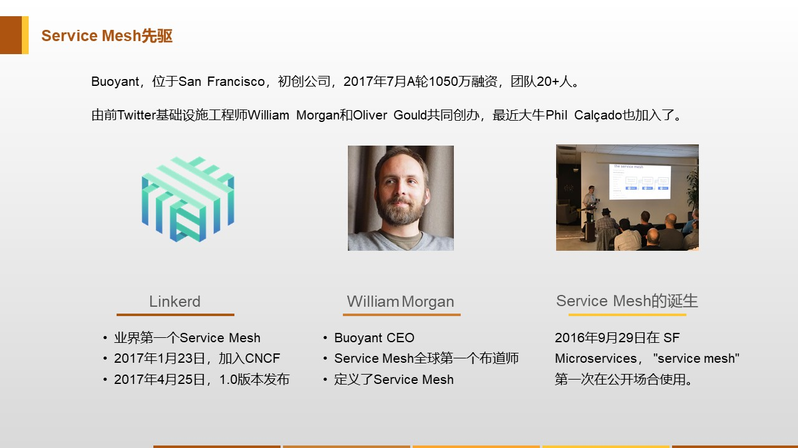

Buoyant是一家名不见经传的小公司，但这家公司是Servicemesh的先驱，是Linkerd的公司，而Linkerd是业界第一个Servicemesh。这家是初创型的小公司，今年七月份刚拿到A轮的一千万美元融资，开发团队不到20人，我在他网站主页数了一下也就17、18个左右的样子。

创始人是两个前Twitter的基础设施工程师，CEO是William Morgan。因为融资的关系，A轮融了1000万美元，最近也在招兵买马，招了一些高手进来。这里我们单独列了一位大牛，如果大家有印象的话，他曾写了一篇文章叫《模式：Servicemesh》，那篇文章基本上是目前介绍Servicemesh最好的最经典的文章之一。大家可以看到，中间这位同学，William，这个人是它的CEO，Servicemesh全球第一个布道师： 他定义了Service Mesh，开始在全球讲Service Mesh。右图这张图是在2016年九月份第一次使用这个词汇。

但是，先驱有个问题：先驱和先烈只差一个字。一个常见的说法是：领先一步是先驱，领先两步，可能就变成先烈了。

就在linkerd和William还在布道的时候，让业界慢慢开始接受Servicemesh这个概念，发现后来，有一堆新人出来了。

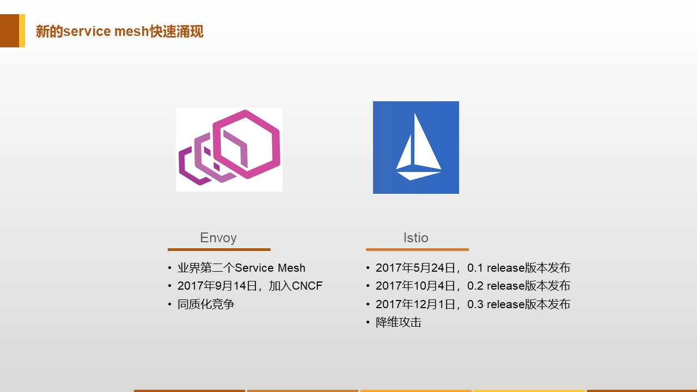

新的Service mesh，在2017年，蹭蹭蹭的文莱了。第一个，Envoy，这是业界第二个Servicemesh，在今年九月份的时候，同样加入了CNCF。

Envoy还好，基本上属于同质竞争，就是大家都在一个层次上，至少还有的打。

但很不幸，istio杀出来了——大家可以看到Istio发布的时间点还是很快的，5月，10月，12月，就0.3了。Isito从架构，从功能上，比linkerd和Envoy是上了一个层次。这个就头疼了，属于下一代打这一代。按照《三体》的说法，这属于降维攻击：只要对手完成，基本上就是等死。

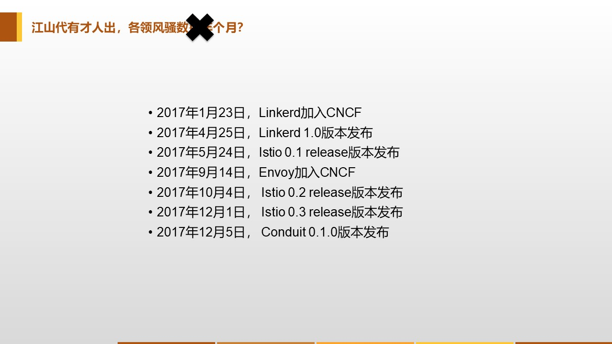

我们来看一下整个的时间表：Linkerd加入CNCF是一月，这是一个很关键点的，当时CNCF在类别上写了一个Servicemesh。当时看到这个词时还不知道Service Mesh是什么概念。但它对Linkerd特别重要，因为业界已经接受了Servicemesh的概念，且又被CNCF认可了。

而后Linkerd1.0发布不到一个月，Istio就出来了，紧接着Envoy在九月份杀入CNCF。时间点上可以看到非常近，可谓是“江山代有才人出，各领风骚几个月”。整个2017年，Servicemesh的风头就是以一个月一个月的方式在做变化。现在我们可以看到事情有多残酷：前脚还很悠闲的做先驱，做布道，眼看就要变成先烈了。

Istio缘何这么强？主要是三位创造Istio的大佬，Google、IBM、另外一位Lyft在前面两位这里算是小的。所以对于Linkerd来说会有种一时瑜亮的感叹：Linkerd刚出来很强，跨了一个时代的感觉，但脚还没站稳，就让人给揍了回来。

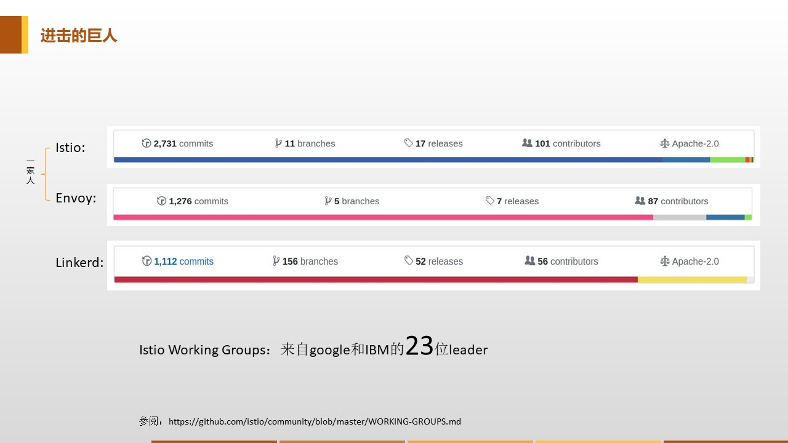

而Istio这个产品不仅后台过硬，社区支持够强，人也够多，能力也足，最重要的是它还特别努力。Isito在今年2700多个Commits，数量远远超过了Linkerd，可以说在产品上，Istio做的非常努力。而在人手上，整个Linkerd公司才不到20人，Istio的Working Groups的leader就已经23位了，怎么玩？这就有一个很要命的问题：对方不仅强，还很努力。

刚才提到的问题，上一场战斗刚刚打完，硝烟还未散去，尸骨都还没有寒呢。Mesos这里我们写着山河破碎，为啥呢？Mesos之前曾经占据领先的优势，最早的时候大部分江山是mesos的，而且现在都残留着很大的地盘。Swarm大家也看到了，基本上是宣布俯首称臣了。Kuberentes笑而不语，笑到最后。

在这场战争结束之后，这场离得非常近，打的非常激烈，可谓殷鉴不远。

接下来有一个关键的问题：到底怎么办？

现在Google带着Istio出来了，还叫上了一堆IBM，Lyft这样的助手，以及社区。对于Linkerd以及它的Servicemesh类的产品，就要面对一个问题：到底是想跪着生？还是站着死？

如果你有勇气和它对抗，那你站着，但若面对的是这样的竞争对手，胜算在哪里？如果没有勇气直面，接下来该怎么办？出路在哪里？这个问题困扰了我一段时间，因为我也在考虑要不要做一个Servicemesh的产品.这个问题细想起来，真的会很纠结。

我们来看看istio身后的Google。

Google是我个人是最崇拜的公司，没有之一，它做了很多让我感觉是真的在推动人类文明往前走的事情，比如它前段时间发表的论文。

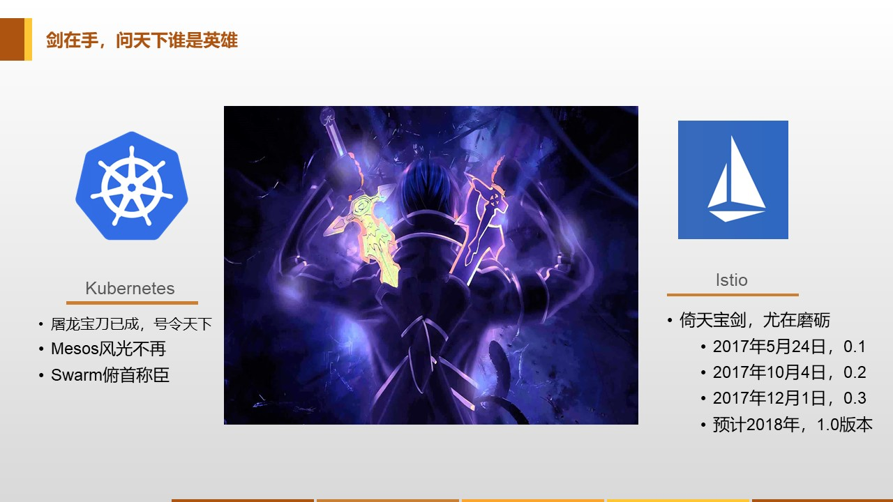

我们回到容器、云的领域，Google非常的强，可以说是“剑在手问天下谁是英雄”。

左边，Kuberentes，屠龙宝刀已成，现在是“号令天下莫敢不从”，整个领域都没人敢说不。

右边，Istio，现在还在磨砺，虽然还未成功，但有勇气跟它竞争的人已经不多了。

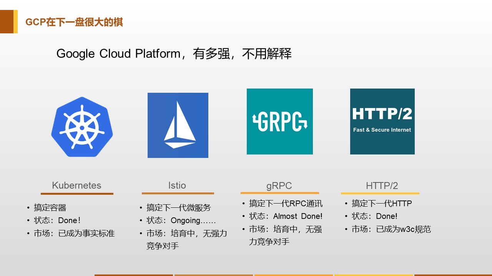

这是目前我个人的判断，因为个人原因我比较关注这几个点。

GCP是Google云平台的缩写，下面是四个旗下的产品：

- 其中Kuberentes很熟悉了，它已经搞定整个容器，而且是Done的状态，基本上已经是事实标准了。
- Isito按照我的理解是准备出来搞定下一代微服务的，仍在路上，但等成熟稳定后，基本上很难有强劲的竞争对手。
- 后面两个可能相对偏门一点，但对我比较特殊，我可能是国内第一批对gRPC进行研究的。如果大家对gRPC这个技术有所了解，可能会知道我的名字。这个东西基本上是搞定下一代的RPC通讯了，大家没有知觉的情况下，下一代的RPC基本上在它那里了。目前这个市场用的不是特别多，仍在培育当中，但也没有强劲的竞争对手。
- 而HTTP/2现在已经是W3C的标准，搞定了下一代HTTP：大家还停留在HTTP1.1上争夺的时候，google已经偷偷摸摸的直接把HTTP/2搞定了。

这四个产品加在一起的有什么感觉？我的想法是GCP在下一盘很大的棋，若将它们串联在一起，接下来在容器、微服务、通信这个领域，都在Google的范围之内——它已经把路完全铺好了。

底层操作系统，中间的容器，可能有一部分的PaaS系统，类似GCP这种，都是从Kuberentes这边走，已经搞定。服务间各种通讯，通讯机制如HTTP/2以及gRPC，这两个已经是事实标准了，搞定。现在全力以赴做微服务，Istio，准备继续往上做。

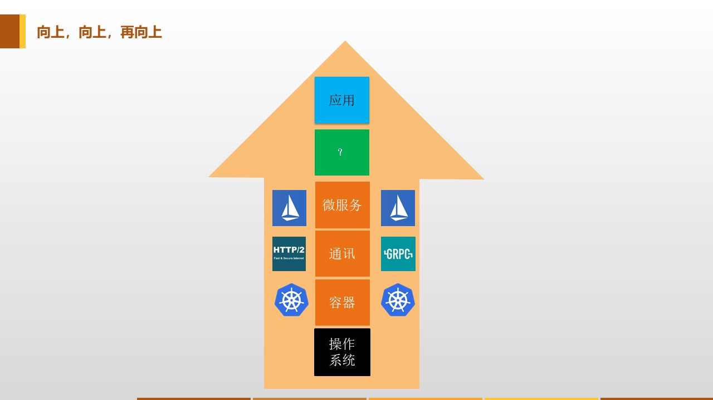

大家注意这张图，google现在是从底层一步步向上做，趋势非常明显。我们现在回头看这个布局。现在我不敢确定说Google是否真的在下这么一盘棋，但若真的有人在刻意下棋，只能说明这个棋手的能力太强了。现在要跟Google去争，如何去争？直接帮你将后面的东西全部铺好了。

当然，这里还有一个小小的悬念，如果一两年之内，Istio有能力将微服务这一块完全搞定，那么它的下一个目标会是什么？不出意外的话google会继续往上走，继续往业务上走，但会是什么现在还想不明白。

这里留一个悬念，两年之后大家再来看这个图，就可以知道这个问好是什么。

OK，是不是有种阴谋论的感觉？

回到微服务，在Servicemesh这个领域，Google这一次没有直接自己单干，而是搞了一套Istio，然后这次找了IBM。这里面有一个象征意义的东西，Google其实是标准互联网典型代表，但IBM是传统企业，虽然也一直在往互联网上走，一直往这方面做，但企业形象还是偏重传统。他的目标用户也是偏向传统企业用户，它们的合作象征意义是非常大的。

上面我一直在推一个概念，我们现在这个世界，这个技术潮流，有一个很重要的趋势是：传统企业用户向互联网技术做转型，大家注意到这个趋势，会非常明显。如果你在互联网工作，是没什么感觉的。但是如果看传统企业用户，会发现他们现在的技术完全是往互联网这边走，往微服务、容器、敏捷走，现在基本上他们都开始陆陆续续放弃weblogic、EJB、ESB，这个趋势非常明显。

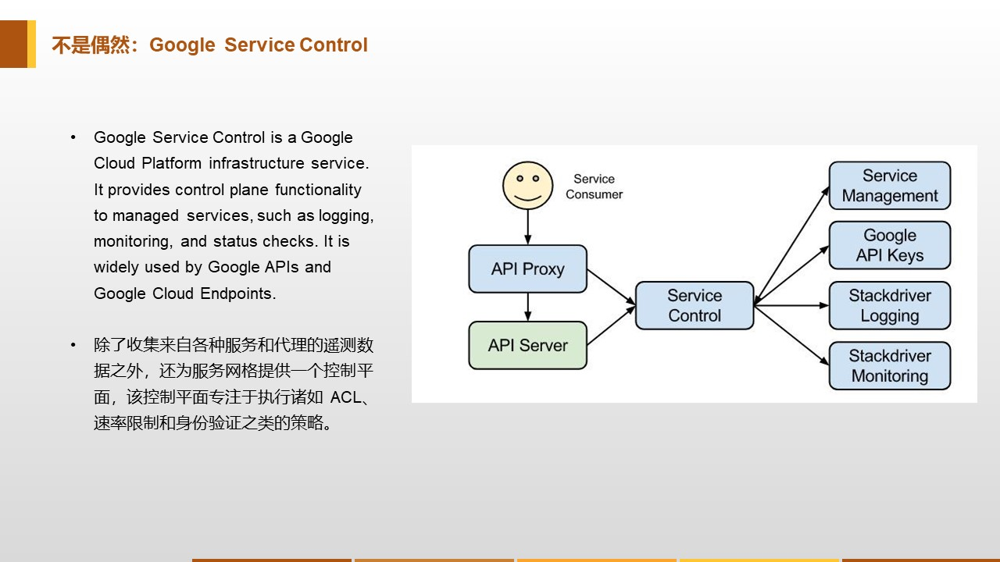

这样的一个合作很有意思。

Google在Istio之前是有一些项目的，当时做了一个Google Service Control，如果熟悉Envoy，会发现这个功能点和现在istio的功能点非常像。实际上当时的一个重要的事情是这样的，IBM的一个VP在istio出来之后发表的一篇文章，意思是说Google和IBM各自在各自的领域做了一些事情，后来他们彼此间了解之后，发现相互之间是可以互补的，而且方向一致。所以做了很重要的一个决策：各自放弃吧，合起来一起做一个。刚好套上Service mesh的概念，就这样一拍即合，搞定。

可以想象Google和IBM的影响力，一起合作是什么概念？我们可以看到Istio在社区里得到了非常积极的响应。这些东西是在0.1版本的时候就已经开始在响应了，0.1是在今年五月份。

这里面很重要的一个是Oracle。容器：K8S，这不出意外。微服务直接选Istio，这个有点出乎我意料。Serverless是直接收购了一个FN的项目。这里面很明确的是，他们的微服务就是Istio，这是它的战略决策。

Redhat就比较好理解，它一直跟Google和Kubernetes跟的很紧，所以它选择Istio完全可以理解。

反而是最后这一位，Pivotal，它的Cloud foundry非常明确要支持Istio。但是这里面有点古怪的地方是，这家公司本身是好像有点跟Google对着干的感觉。

后面几家公司相对比较小一点，但是它们各自领域都是比较特殊的。但是这几家公司除了Ambassador时间不确认，剩下五家公司都是在0.1版本出来的，今年五月份出来，就明确要支持。

这也体现了Google在社区可怕的号召力：一个新的开源产品才发布0.1版本，别人就已经开始站队，这是什么概念。

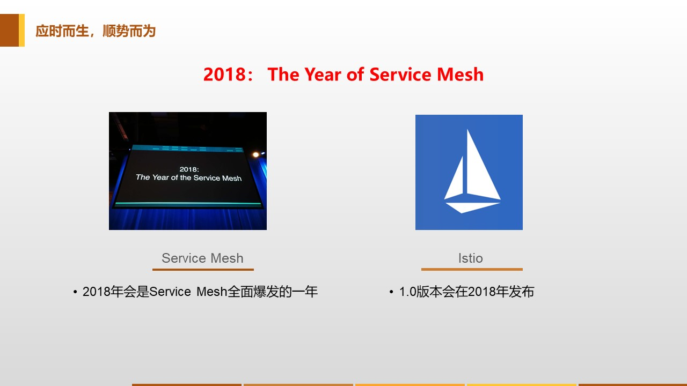

左边这张图，大家应该看过了，前一段时间在网上非常火，因为这个代表今年KubeConf非常标志性的一个东西，就是Servicemesh在这次会议上非常火爆。2018年预测它会全面的爆发，至少这个技术会在大多数的领域会被人关注、使用、探索，不排除落地，如果它的release版本发布足够快。

Istio应该会在2018年发布，我还顺便问过0.3版本，按照它的说法，是已经接近了Production ready。但是根据我们测试的结果，不行。这里面还有一些小障碍，可能0.4、0.5可能会，但是从目前看，差距不是特别远，但2018年这个产品肯定会发布的，具体是上半年还是下半年不好说。

再来看看IBM。

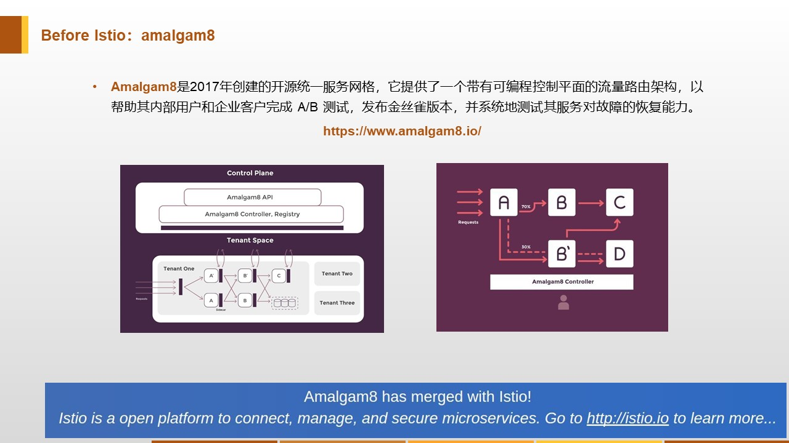

刚才说它有一个产品的，现在非常明确，这个产品已经停止演进。

现在的战略其实非常的明确，它自己的公有云改成基于Kubernetes，接下来会支持Istio，它的云服务商会推广。

而且听说已经在公有云上上线了，但是没有找到，不过很明显它接下来会直接在公有云上直接支持Istio。

这里面有一张图是Istio的Working Group，可以看到这个图上的leader，23位leader，基本上都是IBM和Google的人。而且这里面可以非常明确的看到一点，IBM在这个项目当中是属于深度参与的状态。它基本上和Google一对一了，基本上所有的团队都在，和Google平起平坐。目对于IBM来说也是投入非常大，也是非常重视的一个项目。

前面说到Istio有三位创始人，这里谈到两位，整个Working Group里只看到这两个公司，lyft哪里去了？lyft一直都没有出现。

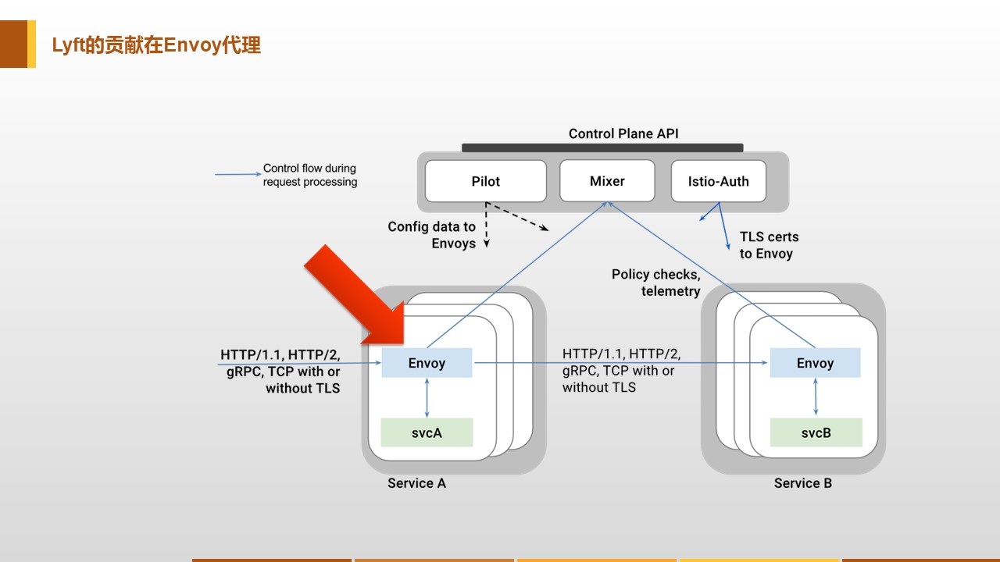

Lyft的贡献完全在Envoy代理，这张图是很经典的istio架构的图，红色箭头对应的位置是Envoy，它是做底层的数据平面。lyft所有的贡献都是集中在Envoy代理里面。其它的东西是Google和IBM在做，而这个地方是lyft在做。

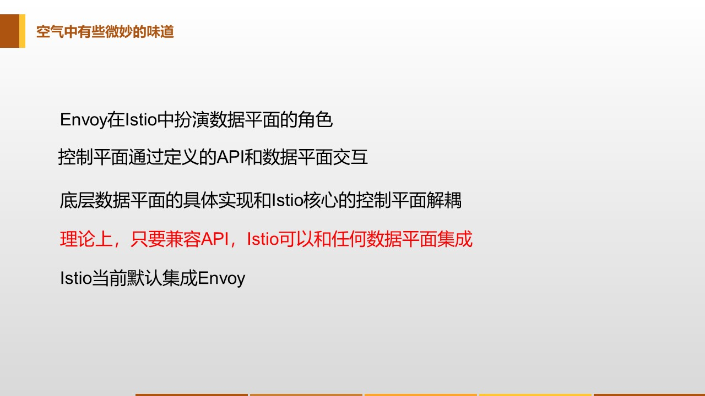

这里面有一些比较有意思的东西，有点阴谋论的感觉。

首先在Envoy这个角色上，它是扮演数据平面的角色。第二个是它的控制平面是通过API来跟数据平面交互，没有绑死，是一个明确的API。底层数据平面的具体实现和核心的控制平面是解耦的，是通过一个定义好的API来做这个约束。所以理论上有一个可能性，只要兼容这个API，Istio可以和任何一个数据平面集成。这是可以替换，当前默认集成是Envoy——这个地方有没有感觉到，似曾相识？

大家想一下K8S和Docker的关系，还有OCI规范，你会发现好像有这么回事。但是现在默认的是Envoy，但是这里面存在微妙的感觉，就是说它存在替换的可能性。有一些事情只要有可能，就有可能会发生，对不对？那会在什么情况下发生呢？

这个地方很有意思，Istio其实是给其他Service mesh留了一条活路。istio是来换代的，理论上它来了后，其他service mesh就死了，只有它能成，但是它还是留了一条活路。这个考虑，不太清楚，我个人的理解应该是“节约时间快速推出产品”，所以它刚刚出道的时候，选择了没有自己做数据平面而是集成。Istio出来时选择了集成envoy，envoy是c++。按照Google的习惯，做这种底层的东西，肯定是自己都做的。但是它选择集中精力去做控制平面，把数据平面给envoy去做。所以这个地方，原配是Envoy，但是原配是原配，没有说一定要白头偕老。linkerd就发现这个问题，只要努力就有机会，没有挖不动的墙角，只有不努力的小三。Linkerd就干了这个事情，他在1.2、1.3的版本当中，从半年前开始，他就开始做Istio的集成，努力的满足Google的API要求，往那边去走。这个兼容它一直在做，非常努力的在做，被我成为努力的小三。

有努力的小三，就意味着还有一个不努力的小三——nginmesh。今年大概九月份的时候，nginx突然宣布要搞出一个Servicemesh来。当时我个人很兴奋，当时它写了一篇文章，我就去翻译这些文档。文中说它要和istio集成，当时以为有一场好戏看，两个小三开始打原配了。结果后来发现这个项目开源三个多月，它几乎没提交。非常的不努力，不知道发生了什么事情。

接下来，在看Istio的核心模块，控制面板上面有三个核心模块，上面这三个模块都是Google自己在做，唯独留了下面Sidecar。四个东西做三个，留一个，大家能想到什么成语吗？

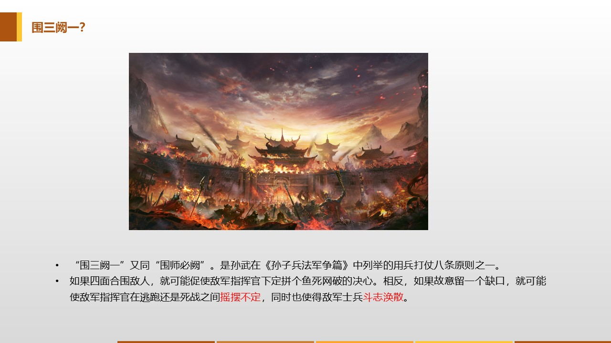

围三阙一，又名叫“围师必阙”，这是孙子兵法里的一条，打仗的八个原则之一。它的意思是，如果你要全面合围敌人的话，有可能会让对方的指挥官定下拼死一搏的决心。反而你故意留一个缺口，对方就会在到底是逃跑还是死战之间摇摆不定，同时会使对方的军心和斗志涣散。

现在有没有这种感觉，四个东西故意留了一个，给其他service mesh一条活路。但是这有点阴谋论，我也不确定它们是不是真的这么玩。如果是真的，只能说Google的心机太可怕了。但是感觉上是这样的，因为对其它的Service mesh而言，这个事情上就有选择。到底要不要跟Istio联手，到底要不要做这个小三。

这种事情因人而异，对不对？

对于Envoy和lyft来说，好啊好啊，就像图中一样握手。女神说，你要不要来啊，来啊来啊，搞定。所有envoy很开心，lyft也很开心，lyft直接把整个envoy贡献出来了，整个团队干这个事。

但是有一个问题，对于右边这个图，对于linkerd来说，这是荣幸吗？右边这个图是韩信当年的跨下之辱。同样是跟Istio联手，对于大家的选择是完全不一样的，为什么？你的屁股决定了你的脑袋。

这家公司是一家初创型的公司，现在才十几个人。它是一家技术型的创业公司，它不是lyft。lyft是做租车的，Envoy是它的一个开源项目，它不靠这个挣钱的，它把Envoy白送给Google，它有损失吗？它打车的市场会因为这个原因损失百分之一的份额吗？没有任何问题，所以它很开心，没问题。

但是对于buoyan这家公司来说，这是命根子，它创业的根基就在这里，它能把自己的根基扔出去吗？所以说，彼之蜜糖，吾之砒霜。Lyft扔可以，lyft可以扔掉envoy，白送都行啊，我还贴个团队给你做，没问题。但是linkerd能这么干吗？linkerd如果只是跟istio做集成，如果它的未来只是做集成，它还是以小三的身份，它都不是原配，那还有什么前途可言。

所以这个事情，后面一直困扰我，我看到它1.2版本做istio集成之后，我就没想明白这个事。一直到后来……

这里有一个很有意思的典故，三国中曹操大军压境，赤壁大战之前，当时孙权犹豫到底是投降还是反抗。鲁肃当时劝孙权，说我们可以投降，没问题，我们投降还是可以继续荣华富贵，将军迎操，欲安所归？你孙权投降曹操，你想怎么样？

道理是一样的，现在是Istio大军压境，linkerd考虑到底是战还是降。关键是你降了之后你能干什么？所以这个地方一直困扰我，因为我看到linkerd一直在投降，死命的在兼容，死命的做努力的小三，对方还不理你。我看到Istio从来没有提过linkerd，linkerd那边死命的说我要跟Istio集成，标准的热脸贴冷屁股的感觉。

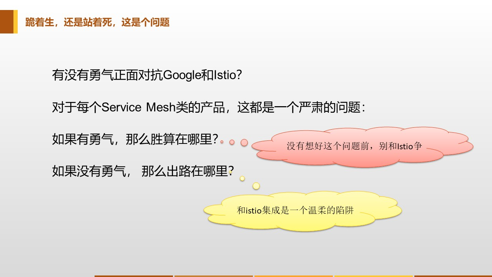

回到刚才那个问题，到底是想跪着生还是想站着死？因为站着真的会死，如果没有这个勇气，出路在哪里。很明显跟Istio做集成，这是一个非常温柔的陷阱，进去了，差不多就死在里面了，仅此而已。能做的空间很有限。它直接把天花板搁在那里了，剩下的东西它都做了，你只能做到这里而已，没有空间可言。

如果你看到这条死路，你就只能硬挺着跟它干一仗，但胜算在哪里？

如果没有想好这个问题，如果没有想好有什么机会，千万别跟Istio争了。

但是很明显，有个家伙想好了，这是非常令人惊讶的。至少对于我而言，当我第一次看到这个产品的时候，感觉突然兴奋了一把：真的有人搞出来了？

Conduit这个产品，是Buoyant的绝地大反击。在12月5号的时候，它突然发布了这个产品。先看看这个产品是什么？

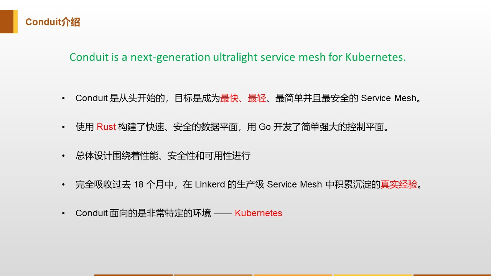

首先它是从头开始的，除了还是这个公司之外，它跟linkerd没有一毛钱关系。

然后它的目标是成为最快、最轻、最简单、最安全的Service mesh。最简单不好说，因为大家都刚开始，最安全我也没有测过，但是最轻和最快这两个词是比较容易做体验的。

它为了达到这两个目标，它使用了Rust这个编程语言。这个语言是很偏门的语言。

（注：现场互动环节，听过rust同学请举手。只有5个人）

这个语言是个非常偏门的语言，但是它最大的好处是性能超好，资源占用超级低，蛮梦幻的语言。除了有代码写的方式有点反人类之外，我之前说要学这个rust的时候，他们说告诉我说你小心，反人类哦。这个语言好处是你真的把它吃透了，它应该是目前最适合拿来做proxy的一个语言，资源消耗非常低。

conduit还有一个很重要的事情，就是它吸收了过去的经验。就是过去18个月，在linkerd上沉淀了各种真实的经验。因为linkerd是生产级的，而且linerd很多企业直接上生产，这一点非常重要。

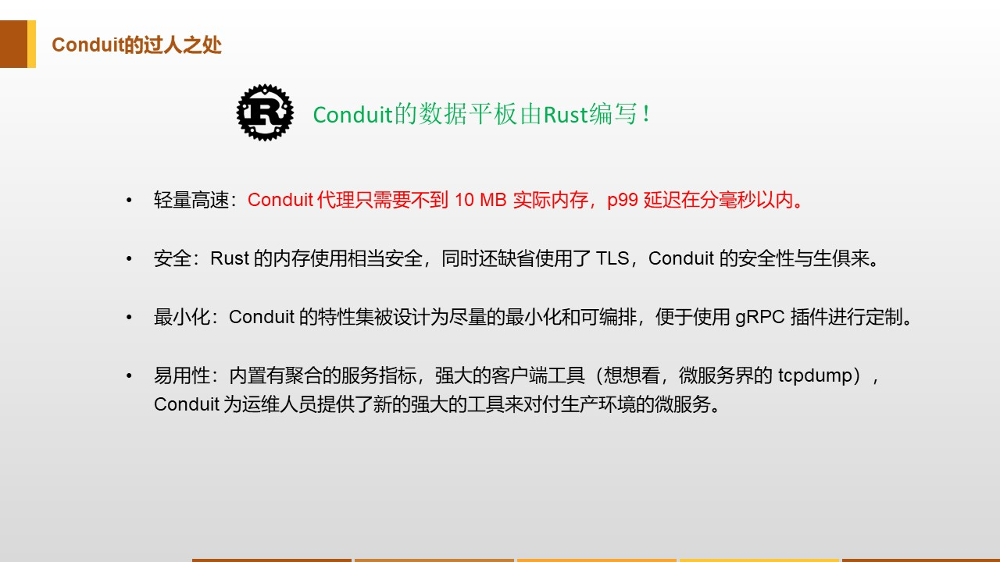

可以看到这个rust的过人之处。

后面三条数据不直白，但是第一条太明显了，Conduit代理用不到十兆实际内存，P99在分毫秒之内，这个可能不是太敏感，但是十兆应用太敏感了。proxy是跟每一个应用都直接对应启动起来，要启动n份，这个资源消耗其实是蛮大的。

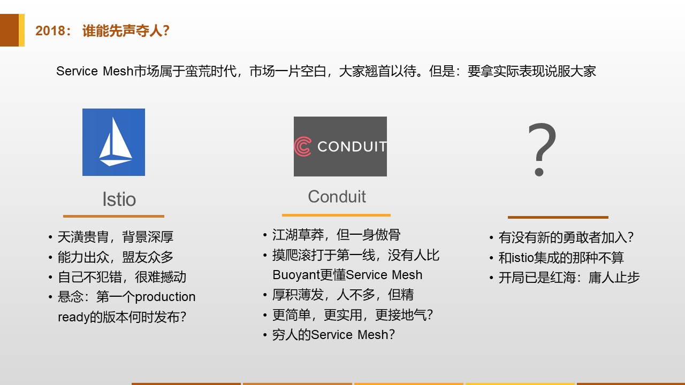

这个时候的关键点就在于2018年，2018年Service mesh这个市场几乎是蛮荒时代，除了linkerd和envoy有一小部分企业用户之外。大部分人都在等，等一个足够让大家放心的产品再用，市场基本上是空白的，但是要拿到这个市场有一个非常重要的事情：一定要用自己的实际表现说服大家，让大家觉得Service mesh可以落地，可以做商用，可以上线。

这点很重要！

2018年最重要的事情就是：谁能第一个达到这个目标，让大家敢用，敢在生产上用。

大家如果有注意的话，会注意到，Istio在发自己的release note的时候，都写了一句话：不要用，不要用，不要用......很搞笑的，你能想象吗？他自己发的release note，特别注明不要用它。

在这里面Istio基本上就算一个贵族了，背景非常深厚，自己能力也很出众，盟友众多。基本上可以看到Istio只要它自己不犯错，它这个地位非常难撼动。现在的唯一的悬念就是说它的1.0或者是它的Production Ready版本什么时候发布，它如果今天马上发布的话，这个市场基本上没有什么悬念可言。它如果拖到明年、后年发布，那就没它什么事了。拖到年底，如果Conduit够快，也很难说。

所以这里面有非常大的悬念，谁先搞定第一个生产可用的版本。

Buoyant算是江湖草莽吧，一个小公司但是一身傲骨。之前看它俯低做小伺候Istio的时候感觉还很奇怪，但是突然之间把Conduit拿出来。前面那个行为现在感觉有点变质了，有点像当年勾践卧薪尝胆的感觉，卧薪尝胆，然后突然间憋出一个大招来了。

Conduit还是有一些优势的，首先这家公司因为linkerd的原因，它一直是摸爬滚打在Service mesh的第一线，它是少有的几个真正在线上跑过的Service mesh，这一点是没人比的过的。它是最懂Servicemesh的，这是它最大的优势。人也不多，但是不多的几个人里面，有几个真的是高手，这也是一个优势。因为人不多，所以只能做简单一点，做的接地气一点，实用一点，基本上是可以预料的。但是现在打一个问号，我是预判的，实际是不是这样，还要看它产品真实表现。

最近也看到有人给了conduit一个标签，叫做穷人的Servicemesh，因为它的资源消耗非常低，也比较简单，所以有这么一个标签。但是究竟是不是，接下来2018年，我们能看到。

右边写了一个问号，这么大的一个市场，会不会有新的竞争者进来，这个不好说，说不定哪天就有人蹦进来了。但是跟Istio集成的就不算，没有什么意思，如果进来只是为了做一个小三就没意思了。对于Service mesh是一开局，开局就是红海，左边这两位已经在刀对刀的在拼杀了，所以如果是庸人，只能进来做个小三，打个酱油，基本上可以不用进来了。

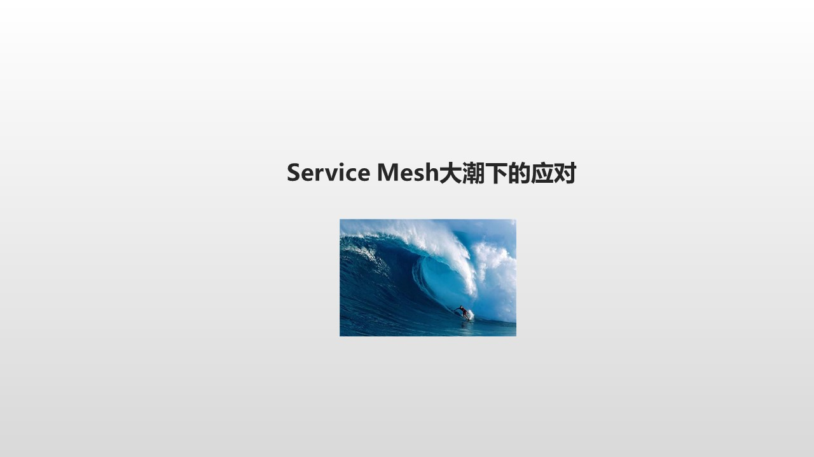

我们将整个service mesh的大潮，和市场，过了一遍。接下来我们看一下这个大潮下的应对。

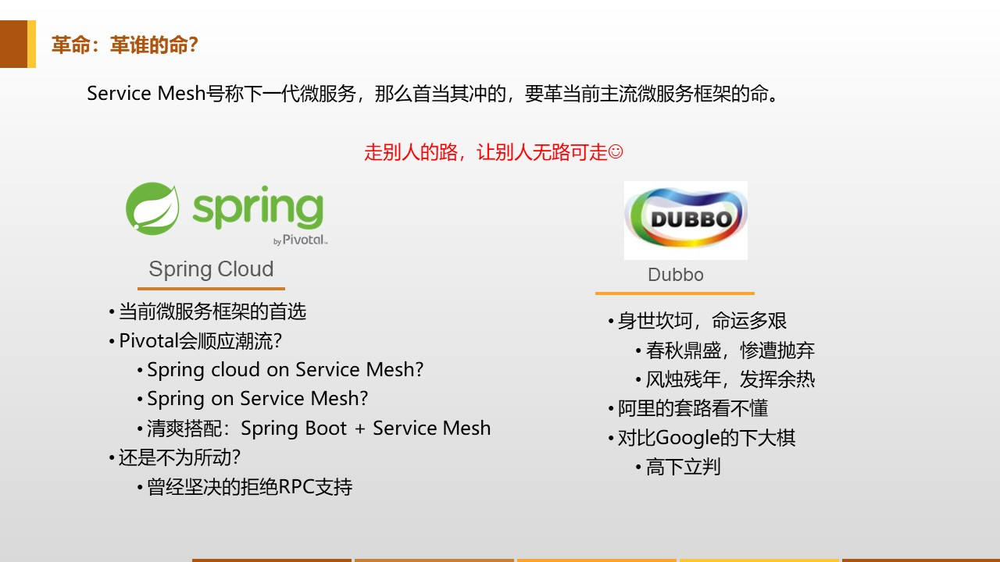

首先这个东西是个革命，革命就是两个问题：

1. 第一谁革命，大家都知道Servicemesh要革命。
2. 第二个问题是革谁的命，这是比较有意思的。

Service Mesh号称下一代的微服务，下一代的微服务概念是什么，当前的微服务是谁？大家很清楚，当前主流微服务框架是左边Spring Cloud，基本上首选。现在刀架在脖子上，Pivotal这个公司会怎么样，是会顺应潮流，说那也好，我们也搞Service Mesh吧。搞个spring cloud on service mesh,或者干脆砍掉整个Spring Cloud，说觉得Spring Cloud没意思，直接spring on service mesh。

其实后者我挺喜欢的。Spring Boot是很清爽的东西，觉得它的设计，实现，包括资源消耗是很好的。如果Spring Boot能跑到Service Mesh上，真的是很清爽的搭配。但是，这个毕竟只是我的主意，也许他们不为所动，说不定他们就不玩Service Mesh。

为什么会有这个想法，因为去年曾经给它们提议，让他们支持RPC，被拒绝了。Spring Cloud说我喜欢rest。就是这么固执，不好说它最后做什么决策，2018年我们可以看，它也许有动作，也许没动作。

OK，这个地方革命的对象非常明确，就是以新一代微服务的身份，把整个微服务这条路走过去：走别人的路，让别人无路可走。只要它把微服务全部搞定了，自然就没有上一代啥事了。

Service mesh实际上有一些天然的盟友，有一种类型的微服务框架它是比较容易向Service mesh靠拢的，即原来就是Sidecar模式，或者它有比较好的意愿可以快速转成Sidecar。

可以看到今年的全球架构师峰会上，华为在讲它的那个Mesh。它们原来有一个Golang sdk，最近好像是被我勾引了一把，他们快速堆出了一个Go版的Service mesh出来，现在看还挺成功的。

还有Motan，这个我就不细说了，一会另外一位讲师周晶同学会做详细的分享。

多说一下，其实很多企业用户，有没有开源的产品。在某些企业里，也有一些典型的服务化框架，比如说唯品会的OSP框架，它就是一个很典型的。内部一个sidecar模式在跑。对它而言，如果想向Service mesh靠拢是非常简单的，因为本身和Service mesh的方式非常相似。但是这里面有一个小悬念，它现在是基于Java的，那未来是不是还会基于Java还是把Java改掉，这就是一个悬念了。往后面看，看白衣到底是改不改。

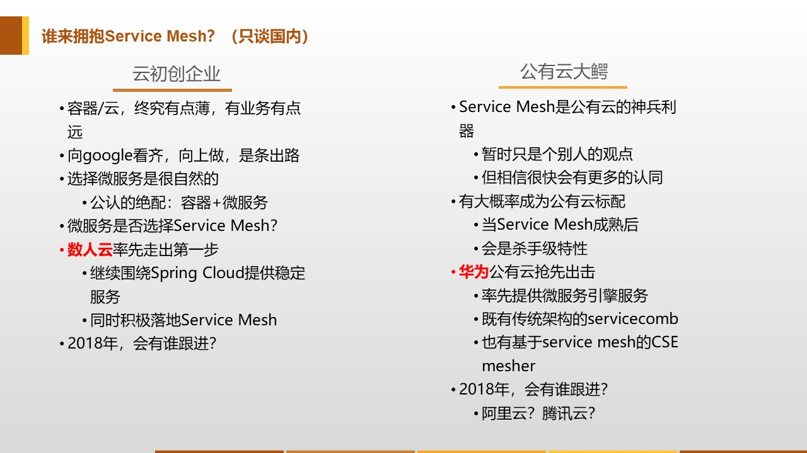

现在来看谁会拥抱Servicemesh？咱们只谈国内，不谈国外。

在国内有一大批初创企业，典型的就是某某云，包括我们数人云。这些企业大部分是做容器、云、或者大数据。有一个共同点：单只做云这一块东西稍微有点薄，而且离最终的业务应用有点远。所以，向Google看齐，向上做，这是一条出路。其实很多公司都有这样的共识，只是多少的问题，有些人可能选，有些人可能不选。

但是如果选择向上做，那微服务基本上是一个很自然的选择。业界也是公认的：微服务和容器的搭配非常的合适。但是选微服务是不是选择Service mesh，这是另外的事情。可以选择spring cloud，也可以选择Dubbo，虽然只剩几根骨头了。

我们数人云算是率先走出第一步的。一方面会继续在Spring Cloud基础上提供稳定的服务，另外一个会积极的落地Service mesh的方案，这是我们接下来会做的事情，我们走了第一步了。现在不知道2018年还会有谁跟进，我们预计肯定会有初创的公司跟我们一起走这条路的。现在的悬念就是说谁是第二个，第三个，会有多少个。

还有一些就是所谓的公有云的大鳄，它提供公有云的服务。Service mesh对于公有云而言，这是一个神兵利器，这个暂时只有我说这个话，相信时间越久就会有更多的认可。因为一旦Service mesh成熟，它会变成公有云的一个杀手锏的特性，到时候有没有Service mesh的功能，会是公有云非常重要的标识。这一点在2018年或者是2019年会变成一个大概率的事件，大家可以等着来挖坟，万一到时候service mesh没成功，那就打我脸好了。暂时这是我的一个判断。

我们现在能看到的是，华为的公有云已经抢先出击了，提供了微服务的服务，它们是第一家。现有的公有云里华为现在动作最快，既提供传统架构的ServiceComb，也有基于Servicemesh的CSE mesher的。

华为第一家出来没问题，问题是后面还有没有跟进，阿里云会不会跟，腾讯会不会跟，这个应该是2018年小小悬念：他们会不会跟？

然后神仙打架，会殃及池鱼。

一旦Service mesh成为主流，有一些领域会受到一些冲击，典型的像反向代理如Nginx、HAproxy，还有像API gateway。因为如果Service mesh成主流之后，没必要用反向代理了，直接Service mesh就好。也包括API gateway，有一部分功能其实istio会往上面去做。这两个领域会有一些冲击。

我们看到Nginx曾经喊着说自己做Service mesh，但是也没有下文。其它的像Zuul、Kong这些，之前了解到有一个朋友说Kong曾经也在想，要不要做Service mesh。但是想了半天，最后没下决心，估计也卡在我刚才说的问题。大家还记得吧？如果要做的话，怎么干掉Google，如果没有信心干掉它的话，做它干什么？

但是这两个领域，如果有人站出来，也是个好事，可能会多一个选择。

最后聊一下数人云。

之前也有人问过问题，为什么数人云会选Service mesh？数人云基本上是国内第一家力推Service mesh的公司，布道师、拓荒牛还是担的起的，为什么？只是为了玩一个概念吗？

其实这里面有非常大的背景，我们非常看好传统企业互联网技术转型这个市场，在我们看来，一方面这个市场非常巨大，我们的客户有非常多的微服务的需求。

实不相瞒，我昨天就在上海，见了两家客户，了解需求，都想做微服务，都没有经验。都是传统的企业，他们第一次玩微服务。这里面有一个非常现实的东西：理想是把微服务玩转，把微服务所有的优点搞定，但是现实很有可能是，有这个想法，但是缺人、缺经验，缺技术、也没这个体系，没这个理念。甚至spring cloud也不是说玩就能玩转的，让一支团队几十号人把业务程序转到Spring cloud之后稳定上线，不是三两天能搞定的事情。

传统的方案就是搞不定就死命搞，就把Spring cloud多学一下，一个月搞不定，三个月搞定；三个月搞不定，一年搞定。但是这样有一个麻烦：人力和物力投入非常大，时间和精力也耗不起，投入和产出比也不太好。所以这种情况下，最终我们选择了一个方案是两条腿走路。

一方面我们会继续围绕Spring cloud这个体系，因为这个体系非常的成熟，如果客户有需求，会按照这个方案给他们走。这里做一个小广告，我们接下来会提供一个开源的配置中心，对标携程的Appolo。不出意外的话下个月，最晚下下个月会开源。接下来会有一个服务治理中心，解决目前Springcloud最不好的一个地方，就是服务治理太弱的问题，2018年我们会做这两个体系。

除了Spring cloud体系之外，我们接下来会基于Service mesh探索新的方案，选择拥抱Istio和Conduit。暂时是两个都选择，因为不确定谁是最终最合适的。2018的目标是，希望这两个产品能够实实在在的帮我们解决客户存在的真实的问题，然后真真切切的帮客户落地微服务，把它的产品真正落在微服务上去上线，这是我们2018年的目标。我们要把这条路探索出来，具体到底是用Istio还是conduit不是问题，但是这条路要走通。

最后，“2018, the year of service mesh”，我们期待这样一个时刻的到来。

今天的演讲到此结束，非常感谢大家。

最后，如果您对service mesh技术感兴趣。请留意这里列出的信息。

- [servie mesh中国技术社区/中文网](http://www.servicemesh.cn/)
- [awesome service mesh资料清单](https://github.com/ServicemeshCN/awesome-servicemesh)
- [istio官方文档中文版](http://istio.doczh.cn/)：由servie mesh中国技术社区组织翻译
- [conduit官方文档中文版](http://conduit.doczh.cn/)：由servie mesh中国技术社区组织翻译

