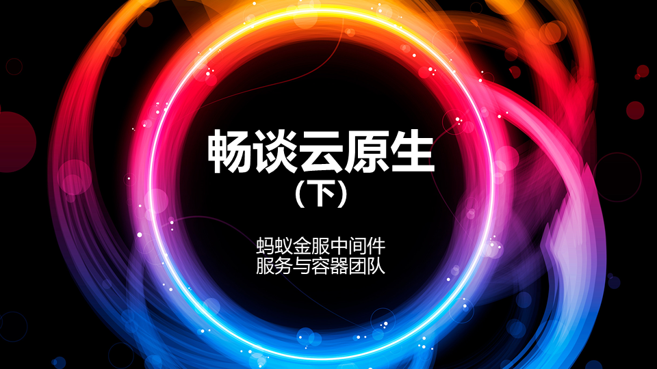

接上半场的内容，继续和大家一起聊一聊云原生这个话题，内容来自蚂蚁金服中间件服务与容器团队。

## 前言和上半场回顾

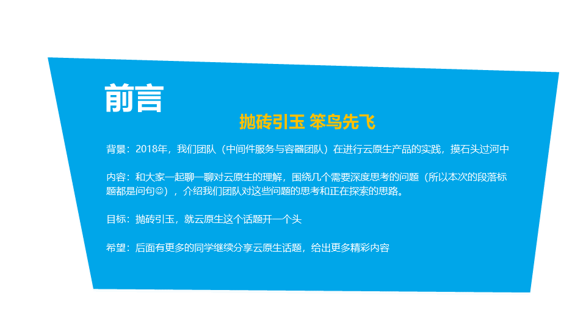

特别指出：这次分享主要是希望起到抛砖引玉的作用，让大家更多的参与到云原生这个话题的讨论，希望后面有更多更好的分享。我们笨鸟先飞，先来开个头。

在开始下半场的内容前，快速回顾一下上半场的内容。第一个话题是如何理解云原生，然后给出了一个我们团队的理解：应用原生被设计为在云上以最佳方式运行，充分发挥云的优势。

第二个话题是：云原生应用应该是什么样子？在这里给出了我们团队的一个初步想法：云原生应用应该往轻量化方向努力。

第三个话题：云原生的中间件该如何发展？同样尝试给出了一个我们团队目前的想法：中间件应该下沉到基础设施，然后中间价对应用的赋能方式要云原生化。

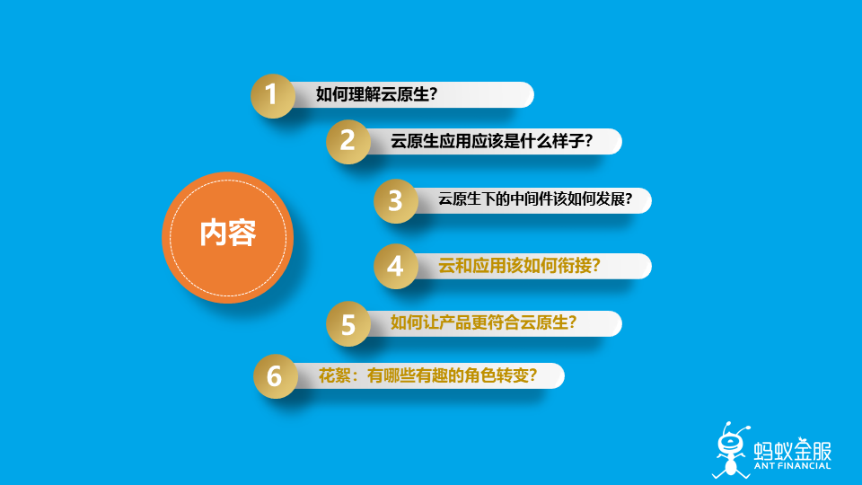

这是全部内容的目录，前面三个在上半场中，今天我们将继续下半场的三个话题。

## 云和应用该如何衔接？

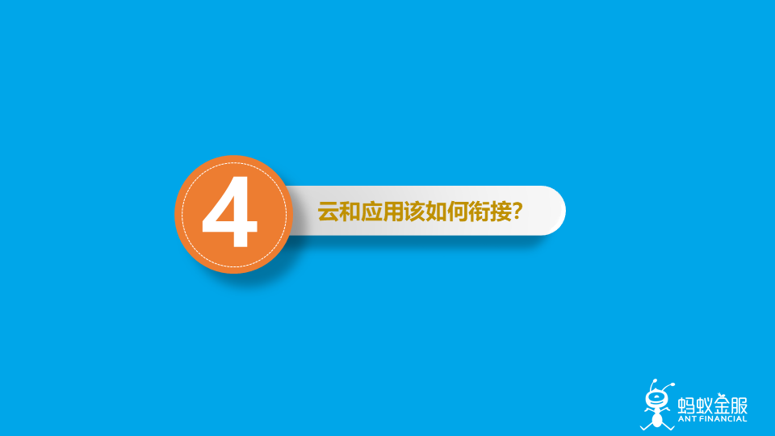

下半场的第一个话题：云和应用该如何衔接？

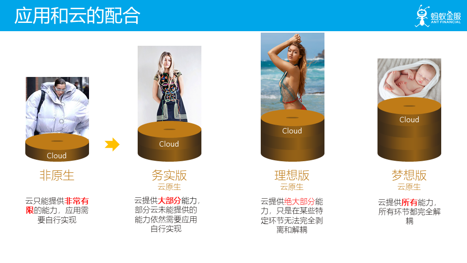

应用和云之间是需要密切配合的。

- 对于非云原生场景，由于云正提供非常有限的能力，因此应用需要自行实现各种能力，包括通过类库/框架的形式。
- 务实版本的云原生方案下，云可以提供大部分的能力，因此应用可以大幅减负，和非云原生相比在轻量化方面可以有明显的改观。但是依然存在部分能力云无法提供，因此应用还是需要自行实现部分能力。
- 比较理想的云原生，是希望云能够提供绝大部分的能力，只是在某些特定环节无法完全剥离和解耦，但是此时应用的轻量化已经达到了非常高的水准。
- 当然，理论上的最终目标，梦想中的云原生，应该是云提供所有能力，而且所有的环节都可以完全解耦，此时应用的轻量化可以做到极致，完全依赖云提供的能力。

整个演进过程中的哲学就是：将复杂留给云，将简单留给应用。

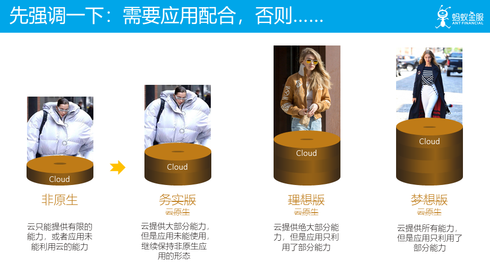

但是，这里需要先强调一下，云原生的演进过程，不仅仅需要云的努力，也需要应用作配合。否则，即便云已经可以提供各种能力，但是如果应用本身没有进行轻量化改造，未能使用云提供的能力，而是继续保持原有的非云原生的形态，那么效果就会大打折扣。

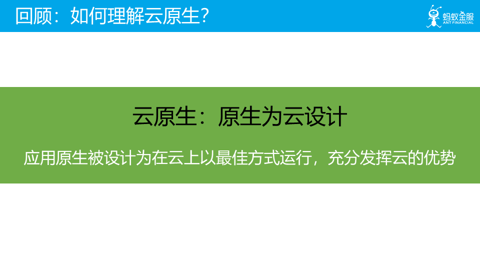

回顾上半场的第一个话题“如何理解云原生”：应用原生被设计为在云上以最佳方式运行，充分发挥云的优势。这里强调的是，应用需要以原生形态来设计，以充分发挥云的优势。

然后回到我们的话题，假设现在云已经准备妥当，各种能力都可以提供，而应用也按照云原生的理念设计，那当云原生应用部署在云上时，这些应用和云之间应该如何衔接？既可以让应用使用云提供的能力，又不至于侵入应用，破坏应用的云原生特性？简单说，就是要实现应用无感知。

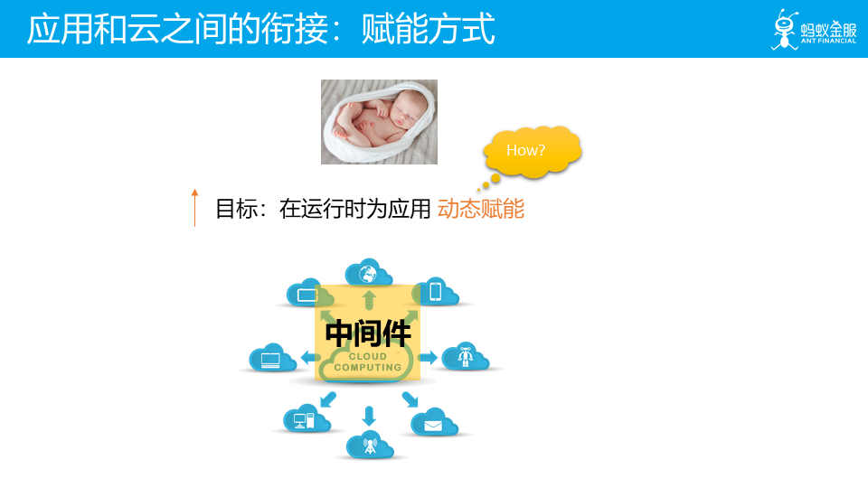

首先涉及到的就是赋能方式：即当云（包括下沉到云中的中间件）可以为应用提供各种能力时，这些能力又如何赋予应用呢？

为了满足应用轻量化的需求，不应在编译打包等阶段引入这些能力，以保持应用的云原生特性。因此，我们的目标是：应该在运行时为应用 **动态赋能**。这样可以让应用在开发设计阶段保持简单和专注业务，在部署运行于云上之时再通过赋予的这些能力来对外提供服务。

这个想法自然是非常理想化的，所以问题就来了：如何实现 动态赋能？

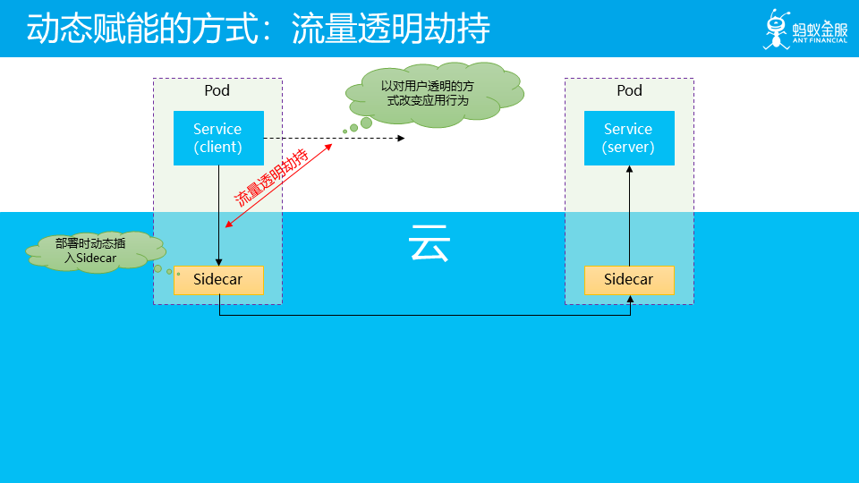

**流量透明劫持** 是我们目前比较认可的动态赋能方式之一，在上半场谈到 Service Mesh 模式的工作原理时，讲到当我们讲应用部署在 Service Mesh 中时，我们会在部署时动态的在应用所在的 pod 中插入 Sidecar 容器，然后在运行时，会以对用户透明的方式来改变应用的行为。典型如将应用发出的服务间远程调用的请求，改为转向本地部署的 Sidecar，从而引入 Service Mesh 能提供的各种能力。

这个在运行时透明的改变远程调用请求的行为，我们称之为 “流量透明劫持”。

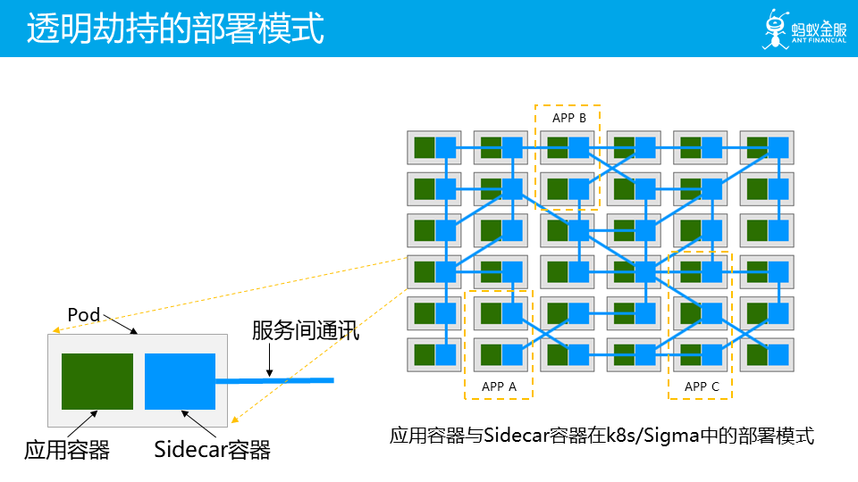

透明劫持的部署模式如上图所示，右边图片是应用容器与 Sidecar 容器在k8s/Sigma中的部署模式，左边图片是单个 pod 的放大。其中绿色方块为应用容器，蓝色方块为Sidecar容器，蓝色线条表示服务间通讯。

透明劫持的具体工作流程是这样，我们以 iptables 流量劫持方案为例：

- Init 流程(编号为0的两条紫色虚线)：在Pod启动时，通过Init Container特权容器，开启流量劫持并设置流量劫持规则（分为 Inbound 规则和 Outbound 规则）。注意这个流程时部署时进行，因为不是真实请求流量所以用的虚线表示。

- Inbound流程(左边编号为1,2,3的黄色实现)：Inbound请求，被 traffic interception 劫持，根据 Inbound规则请求被转发到Sidecar，然后Sidecar再转发给应用。这是用于劫持 Inbound流量，也就是外部访问当前应用的流量，使之在通过Sidecar再由Sidecar转发给应用。

- Outbound流程(右边编号为4,5,6的黑色实现)：应用发出的 Outbound 请求会被 traffic interception 劫持，根据 Outbound 规则请求被转发给 Sidecar，然后 Sidecar 处理之后将请求发送给目的地。这是用于劫持 Outbound 流量，也就是当前应用访问外部服务的流量，使之先通过Sidecar，然后由sidecar进行转发。

通过上述三个流程，我们就实现了让应用的 Inbound 请求和 Outbound 请求在运行时改变行为方式，在应用无感知的情况下实现了将流量劫持到 Sidecar 中。然后我们在 Sidecar 中就有机会为当前请求赋予各种能力，典型如服务发现/负载均衡/实施各种路由策略/认证/加密等一系列能力，从而实现了对应用的动态赋能。

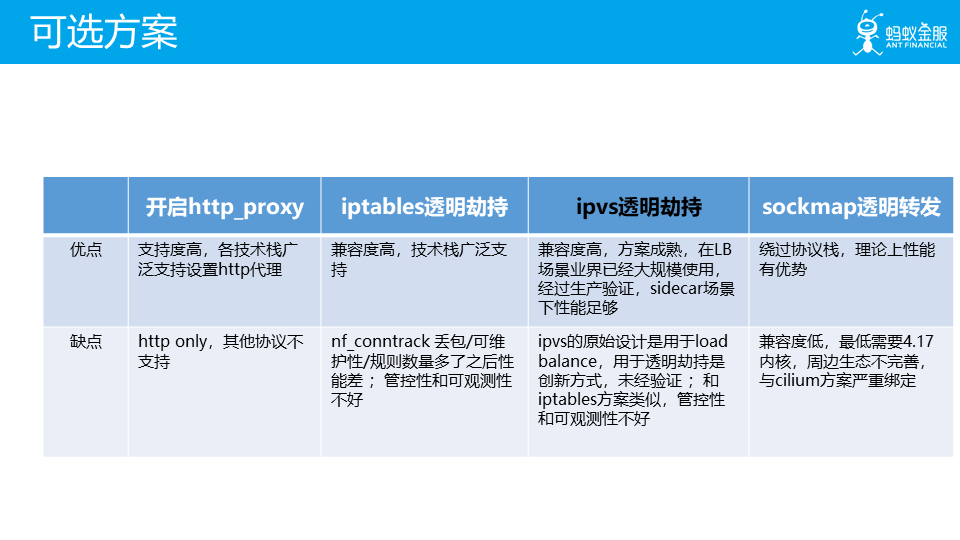

当前流量透明劫持的技术实现方案有多种，其优缺点如图所示。

透明劫持的最大优点是**对代码无侵入**：

- 业务应用在开始时无需关注各种功能的实现细节和调用方式，也不需要依赖SDK，这些能力会在运行时动态赋予
- 对于已有的应用，旧有代码可以无需改动就直接运行在service mesh上
- 从而避免修改代码，和相关的重新打包发布上线等复杂流程
- 另外透明劫持支持直连(不经过sidecar)/单跳(只经过一个Sidecar)/双跳(经过两个Sidecar)，方便开发调试，容易实现和现有系统的兼容

透明劫持近乎完美的实现了我们要求的目标：在运行时为应用 **动态赋能**，应用无感知。

另外透明劫持还有一个比较隐蔽但是又非常关键的优点：不丢失重要信息。这指的是在透明劫持模式下，请求的原始目标地址和端口信息(original_dest)得以保留，让应用可以工作在特定协议应该绑定的端口上，从而更符合12 factor中”Port Binding”的要求，关于这一点的细节，可以见最后的花絮部分。

由于原始目标地址和端口信息(original_dest)得以保留，因此透明劫持容许服务在多个端口上绑定多个不同协议而Sidecar只需要一个端口就可以实现流量转发。

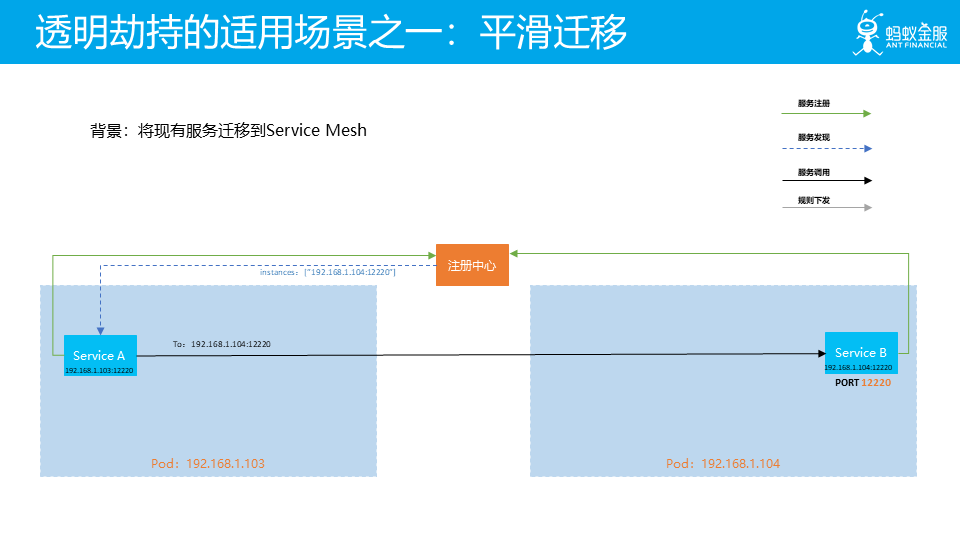

流量透明劫持的重要使用场景之一就是实现平滑迁移，即从现有的体系向 service mesh 体系逐渐迁移。

图中时典型的服务注册/服务发现机制：应用向注册中心注册，然后客户端在发起请求时通过服务发现获得目标服务的地址列表，再选择其中的某个地址发出请求。

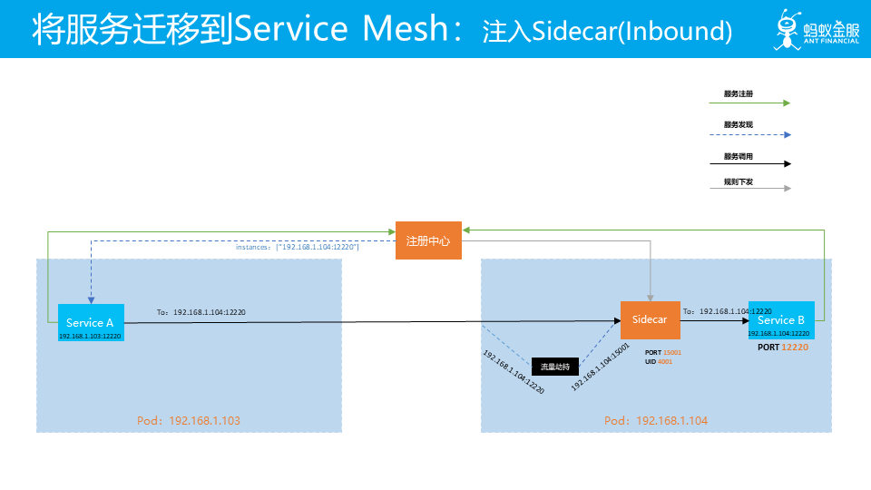

当我们将其中的一个应用 (如图中的 Servcie B) 迁移到 Service Mesh 中，此时会和 Service B 一起部署 Sidecar 并设置流量劫持的规则。当 Service B 作为服务器端接收客户端请求时的，原有请求 Service B 的流量就会被劫持到 Sidecar。此时 Service A 和 Service B 都对此无感知。

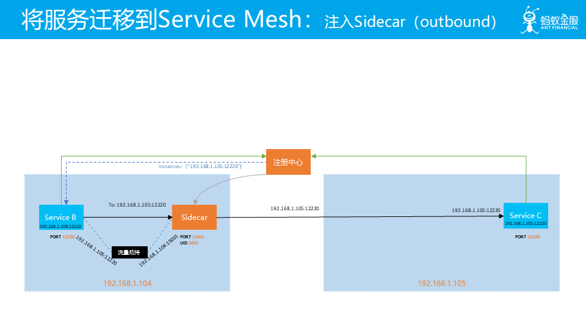

当 Service B 作为客户端对外发起请求时，请求会被流量劫持到 Sidecar，然后 Sidecar 再转发请求。同样，图中的 Service B 和 Service C 对此也是没有感知。

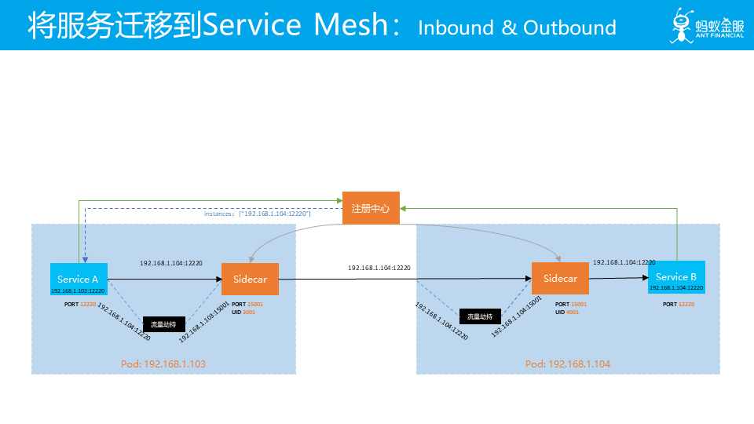

当客户端和服务器端的应用都迁移到 service mesh 之后，此时两端都部署有 Sidecar，请求会按照 service mesh 的标准方式在客户端和服务器端都做两次透明劫持进入Sidecar。依然，两端的服务对此无感知。

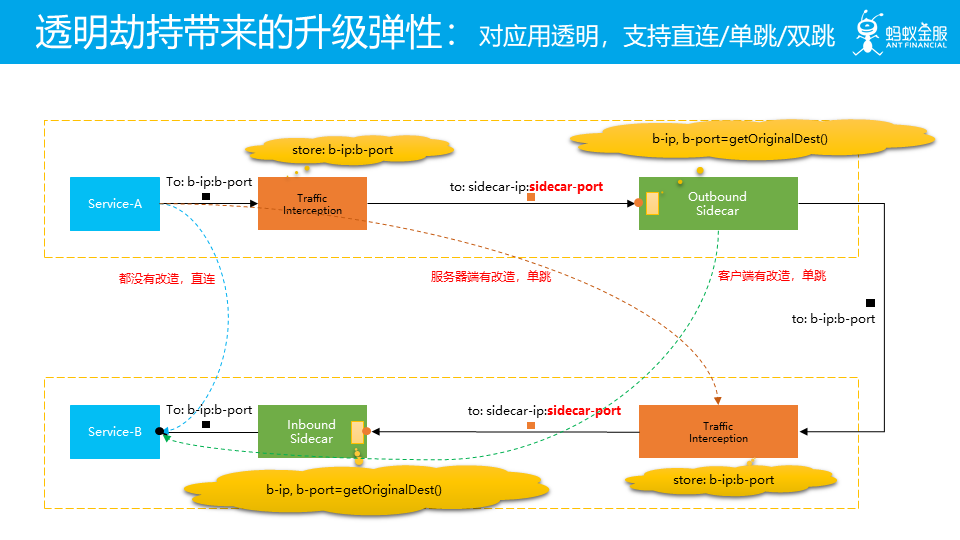

透明劫持对于现有系统的升级非常有帮助，主要体现在为升级带来的弹性。如图所示：

- 当客户端和服务器端都没有进行升级时，应用是直接连接的
- 当客户端接入 service mesh 时，客户端会有改造，有Sidecar和透明劫持，因此客户端会有一次流量劫持，再往服务器端发送请求时，由于服务器端没有改造，因此服务器端是继续沿用原有方式直接连接。此时流量只经过一次 sidecar，我们称为“单跳”，客户端单跳。
- 类似的，如果客户端没有改造，而服务器端有改造，则客户端工作方式不变而服务器端会有一次流量劫持，这也是单跳，服务器端单跳。
- 当客户端和服务器端都改造完成时，在客户端和服务器端会有两次流量劫持，称为双跳。

由于迁移的全过程都做到了对应用透明，因此在迁移过程中可以非常有弹性的安排应用的升级工作，包括个别应用升级失败时的回退。

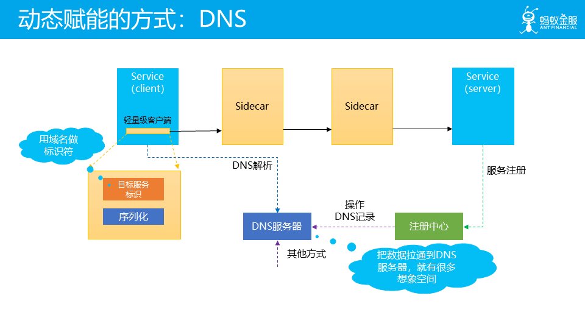

前面我们详细介绍流量透明劫持这种动态赋能的方式，下面我们继续介绍另外一种常见的动态赋能方式，DNS。

在上半场我们介绍 Service Mesh 的思路时，我们提到在让应用轻量化的过程中，最终在应用里面还是会有一个轻量级的客户端，里面保留有少数功能和信息。这其中就有“目标服务标识”这一项，用于标识当前请求要发送的目标服务。

而在此时，有一个很常见的方式就是用域名来做标识符，从而让客户端可以发起一次 DNS 解析请求到 DNS 服务器。而我们可以通过各种方式在 DNS 服务器中预设 DNS 信息，比如最中间的方式就是和服务注册中心拉通，通过某种方式将服务注册信息中的服务域名和IP地址信息（典型如k8s中使用ClusterIP）导入到 DNS 服务器中。

通过这样一个方式，就可以实现通过操作 DNS 记录来控制 DNS 解析的结果，从而实现特定目的。而将数据拉到到 DNS 服务器的方式可以有多种，域名和DNS记录信息的使用方式也可以有很多，配合流量透明劫持，Sidecar 也是可以获知这个请求的 DNS 解析结果…… 这里就有很多的想象空间了。

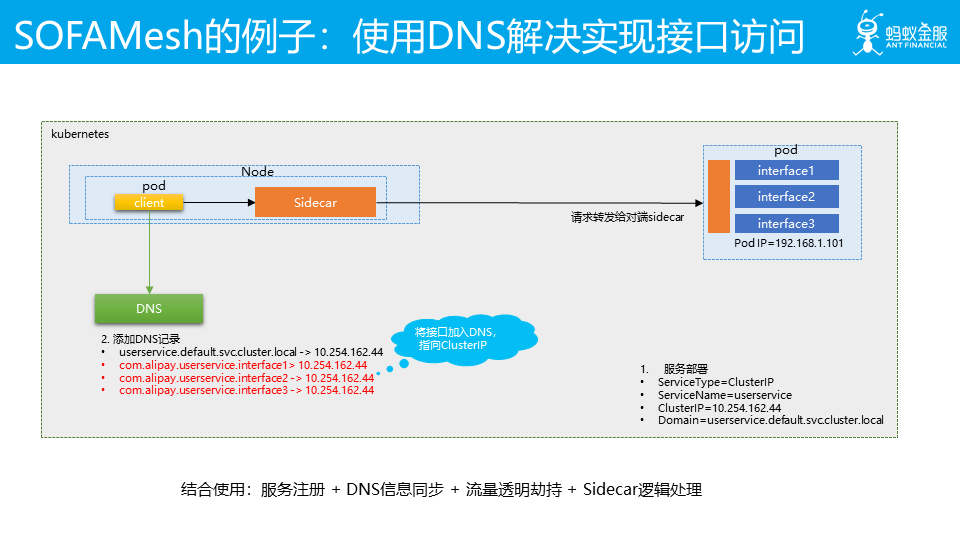

具体 DNS 赋能的典型例子，在 SOFAMesh 项目中，为了兼容现有的单进程多接口的应用，而且容许客户端代码继续维持原有的用接口名而不是应用名来进行访问，我们就是利用了 DNS。

如图，我们通过打通服务注册环节，在服务注册时获取到当前应用所提供的接口，然后将这些接口和应用的 ClusterIP 添加为 DNS 记录，使得这些接口名称对应的域名都指向 cluster ip。然后在请求过程中，客户端会通过接口名进行 DNS 解析，获取 cluster ip，接着以 cluster ip为目标地址发出请求，然后被透明流量劫持进Sidecar，sidecar 从请求的原始目标地址中获取到 cluster ip，就可以得到请求的目标服务，从而可以开始后面的各种流程。

在这一过程中，我们组合使用了服务注册 + DNS信息同步 + 流量透明劫持 + Sidecar逻辑处理，比较好的实现了对旧有应用的兼容。

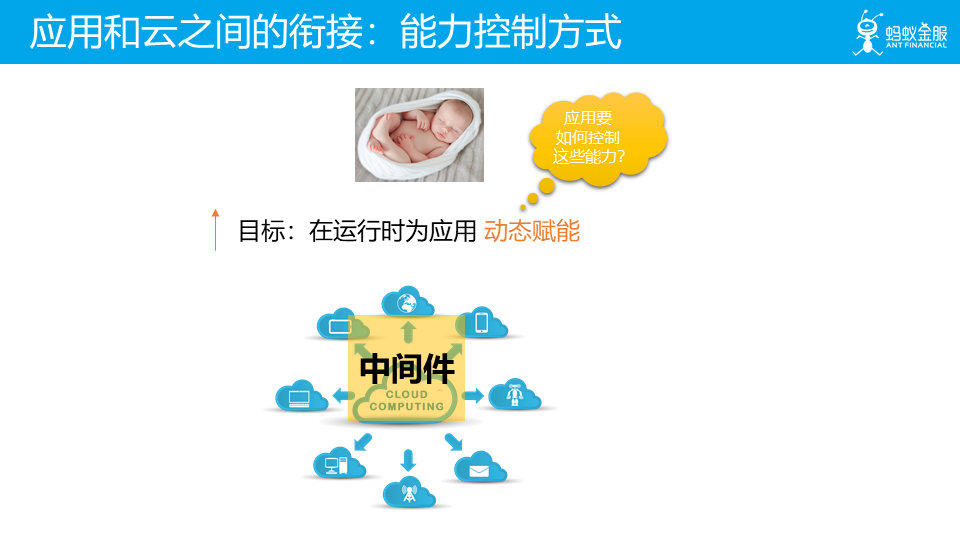

在介绍动态赋能方式之后，我们再来继续看应用和云衔接的另外一个话题：在应用被赋予能力之后，应用该如何控制这些能力？

控制的方式通常有两种：命令式和声明式。

对于对于我们云原生的场景而言，有些微妙：这些能力时动态赋予应用的，应用根本无法直接控制这些能力的具体实现，而且从云原生的理念上可说，应用也不应该知道这些来自云的能力的具体实现方式，因此，在动态赋能的场景下，命令式是不合适。

应用能为此做什么？应用肯定知道自己要达到的控制目标，即应用期待的目标状态。比如，应用可以要求说，当我访问某个服务时：

- 要用轮询的负载均衡算法
- 要10%的流量去v2版本，其他的去v1版本
- 要开启链路加密
- 要……

虽然这些能力会如何实现应用不清楚也无法直接控制，但是给出这些要求应用还是可以做到的。因此，声明式非常符合动态赋能场景下的控制需求。

使用 声明式API 的好处在于：

- 简单：应用不需要关心实现细节，这些能力的具体的实现方式/流程/细节都是能力提供方内部完成。而且这些能力隐藏在云下，对应用是透明的，在运行时才动态赋予，应用完全可以简单实用这些能力而无需关注其他。
- 自描述：声明描述的就是应用期望的目标状态

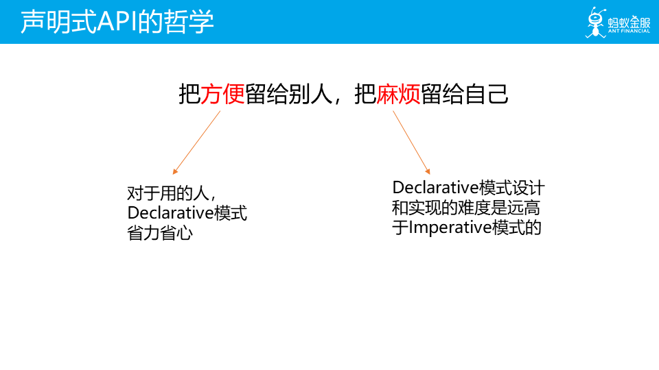

声明式API的哲学：把**方便**留给别人，把**麻烦**留给自己。

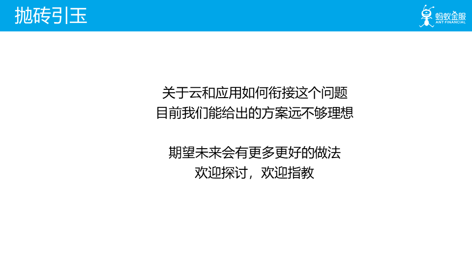

关于云和应用如何衔接这个话题，目前我们能给出的方案还不多，远谈不上理想，期望能够在未来会找到有更多更好的做法。对此有兴趣的同学，非常欢迎一起探讨这个话题，如果有好的想法和方式，欢迎随时指教。

## 如何让产品更符合云原生？

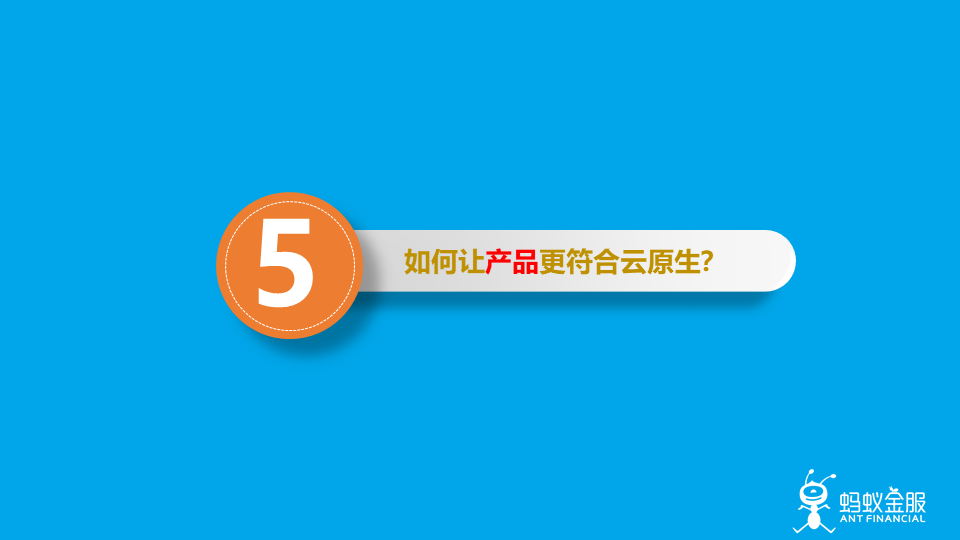

下半场的第二个话题：如何让**产品**更符合云原生？。

注意这里要说的是产品，而不是应用。如何让应用更符合云原生有足够多的文章和理论了，但是如何提供一个产品，让这个产品为云原生应用提供服务和支持，然后要让这个产品本身更符合云原生，能找到的资料就不多了。

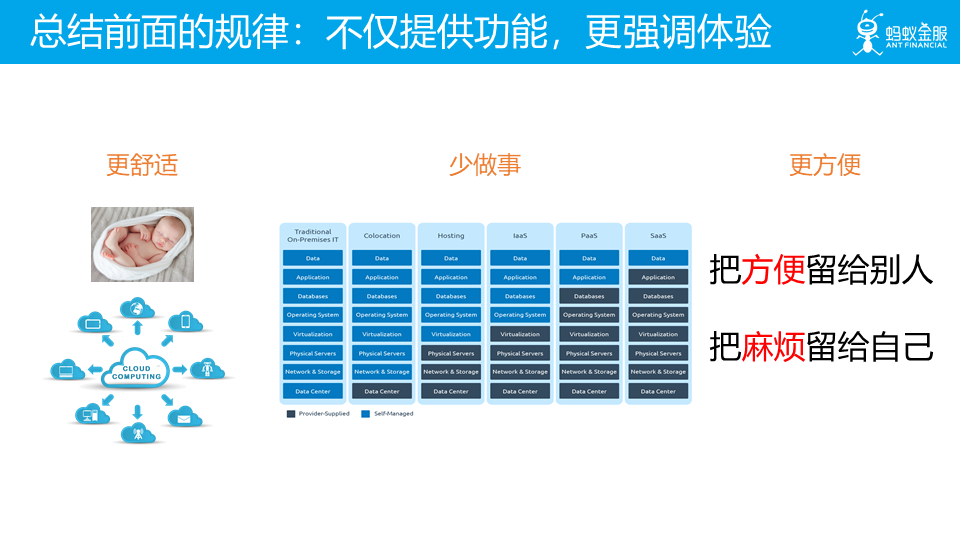

我们先总结一下从前面内容中得到的一些规律：其核心在于，不仅提供功能，更强调体验：

- 在讨论云原生应用应该是一个什么样子时提出，云原生应用就应该是原生形态，轻量化：云应该让应用更**舒服**
- 在回顾云计算历史，探讨云的形态变化时，我们给出了中间这个图表：云应该让应用少做事
- 刚刚探讨的声明式API的哲学，把**方便**留给别人，把**麻烦**留给自己：云应该让应用更方便。

那么，当我们在云上开发产品，试图将产品的能力融合进云，让云上应用可以自如的使用这些能力时，应该遵循什么样的方式？

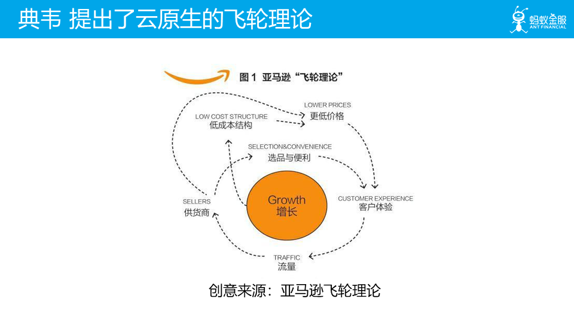

在这里，我们介绍一个云原生的飞轮理论，其创意由我们团队的 典韦 同学，参考了亚马逊的飞轮理论。

亚马逊的飞轮理论相信大家都很熟悉，在这里亚马逊努力打造了两个飞轮，即闭环循环，通过“选品与便利”和“更低价格”实现了更好的“客户体验”。

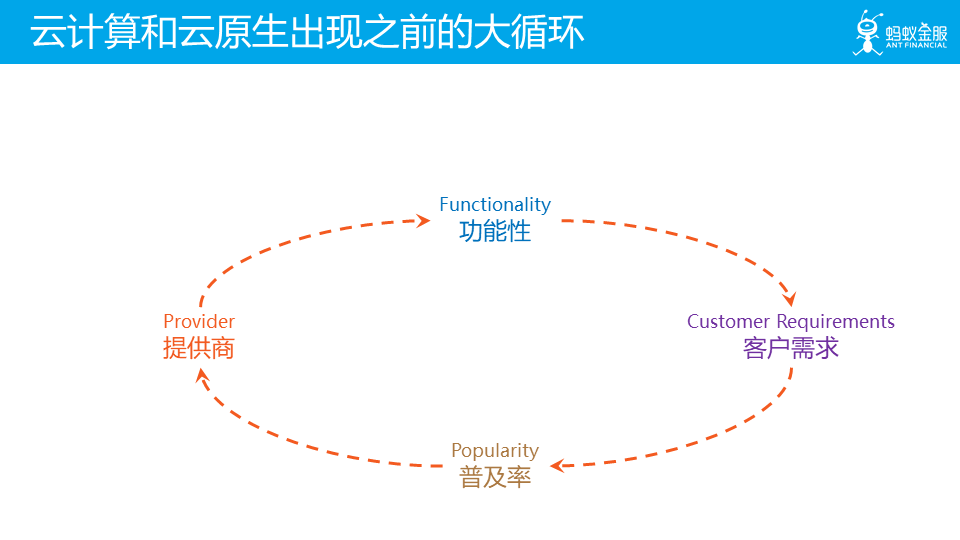

详细介绍一下云原生的飞轮理论。首先，在云计算和云原生出现之前，下面的这个大循环其实就已经存在了。这个循环主要关注的是功能性方面的需求，提供商的产品主要通过提供功能来满足客户需求，当然不是说没有功能性之外的其他需求，只是在早期对非功能性的需求远没有今天这么多。

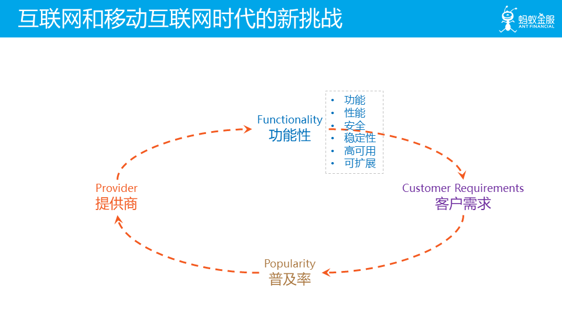

进入互联网时代，尤其是移动互联网时代之后，这个大循环面临新的挑战，一方面在功能性方面要求越来越高：除了简单功能实现之外，还有对性能/安全/稳定性/高可用/可扩展性的诸多要求，而且越来越苛刻。

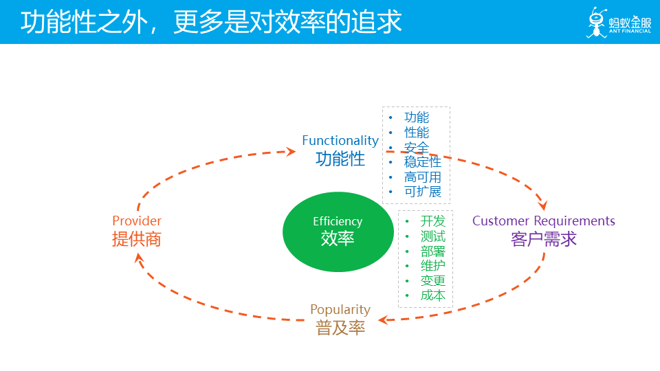

另一个方面，在功能性之外，更多的需求来自对效率的追求：包括开发、测试、部署、维护、变更的效率，以及对成本的要求。

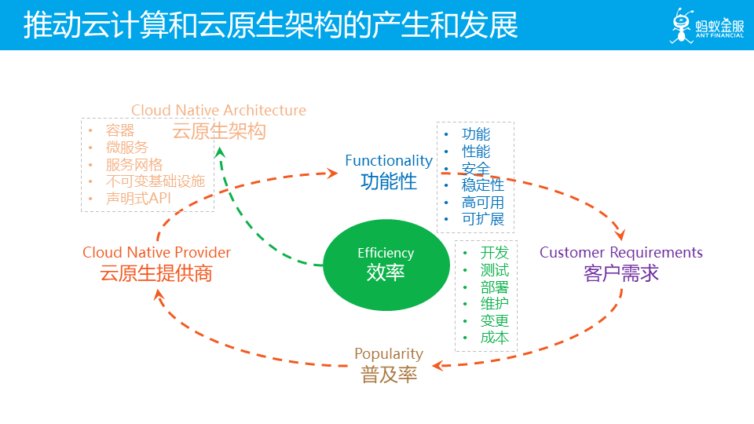

对效率的追求，推动了云计算的产生和发展，以及云原生理念和架构的产生，我们熟知的容器技术，微服务架构，以及新生的 Service Mesh 架构都由此诞生，不可变基础设施和声明式API 的理念也在实践中被总结出来，并为后续的云原生架构提供理论指导。

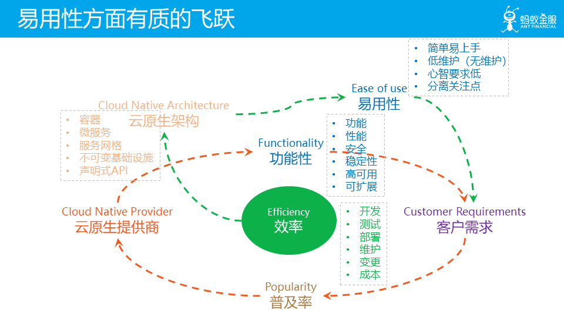

云计算的发展，云原生的推出，为云和云上产品带来了功能性之外的一个重要特征：易用性。体现在有了云的支撑之后，云上应用可以简单开发，开发人员容易上手，由于大部分维护工作由云承担，因此降低了客户的维护工作量（甚至 serverless 提出了无维护的理念）。这些产品使用简单，对客户心智要求低，无需客户具体相关的专业知识。

其核心在于分离关注点：客户和客户应用应该关注与业务实现，而非业务实现的内容应该由云和云上产品提供。

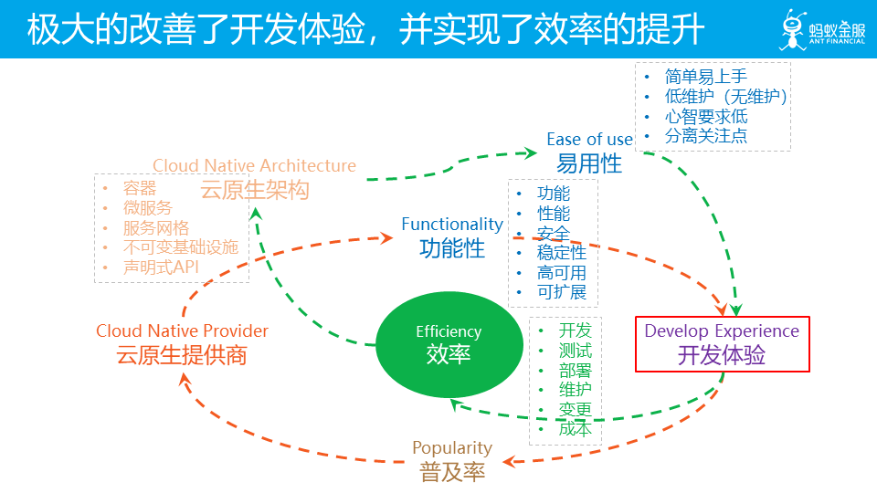

而易用性的飞跃，在满足各种功能性的前提下，不仅仅满足了客户需求，也极大的改善了开发体验。在开发、测试、部署、维护、变更等环节的效率提升，也帮助用户控制了成本。

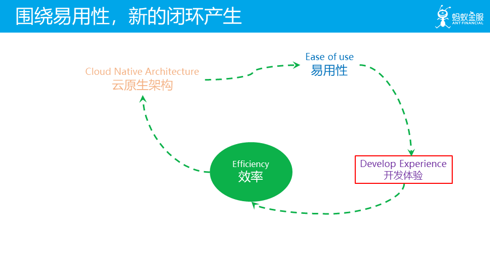

这样，围绕易用性，新的闭环循环产生：对效率的追求，催生了云和云原生架构，带来了易用性的提升，改善了开发体验，从而进一步提供了效率。这个环形的过程会持续发生，云原生架构就会沿着这个飞轮循环不断的发展演进。在过去几年间，这个飞轮循环已经在运转，云原生架构中的容器/微服务等架构都是在这个循环中不断完善和普及。

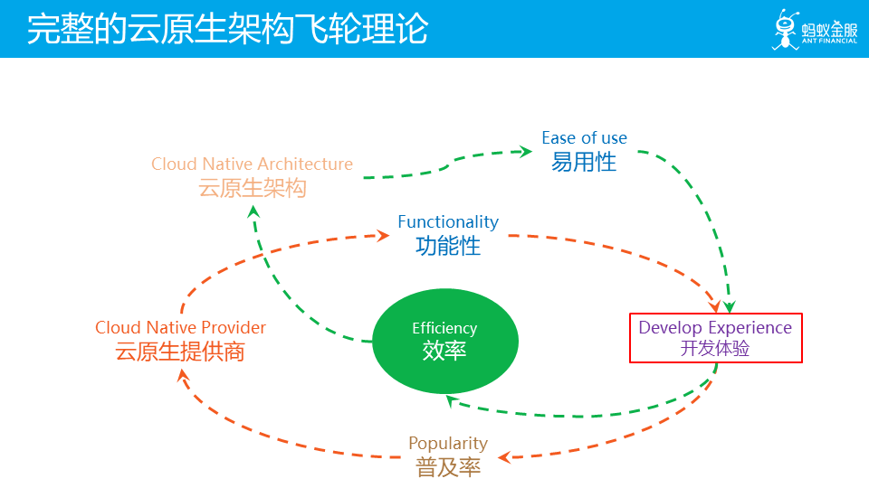

这是完整的云原生架构飞轮理论，两个飞轮分别关注功能性和易用性，两者结合来满足客户需求，改善开发体验，最终实现云原生架构的良性循环。

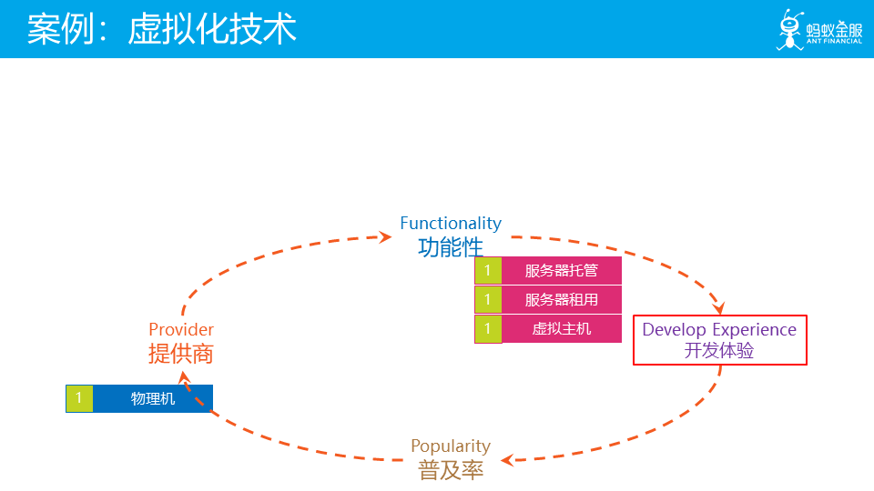

为了更好的理解云原生的飞轮理论，我们以云计算中至关重要的虚拟化技术为例，看看这二十年间以虚拟化技术为基础，云和云原生架构是如何一步一步演进和发展的。

首先，在物理机时代，在虚拟化技术出来之前，提供商只能提供服务器托管/服务器租用以及基于web服务器的虚拟主机服务，此时云还不存在。

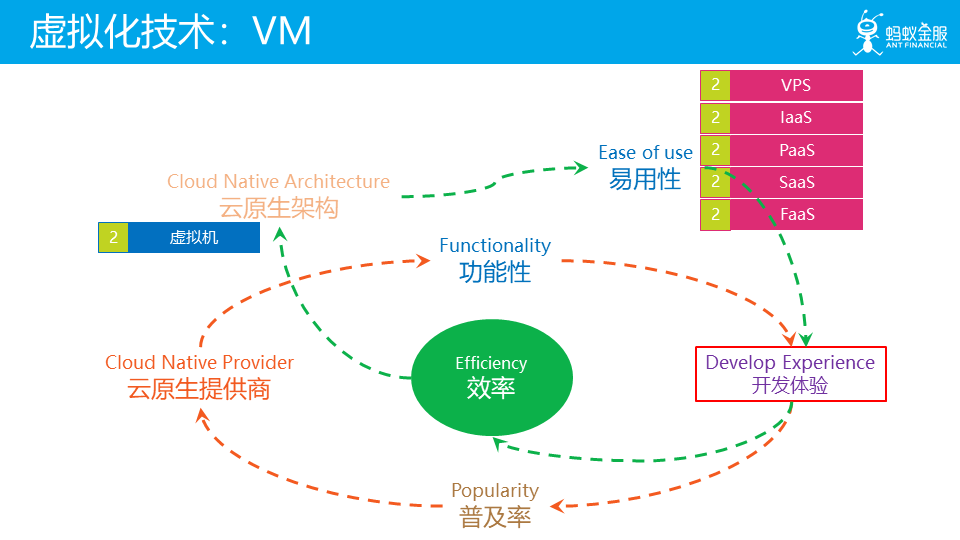

在2000年前后，出于对资源利用率的追求，在虚拟机技术成熟之后，基于虚拟机技术首先诞生了VPS，然后陆续出现了大家熟悉的VMWare/Xen/KVM/VirtalBox等技术和产品，云计算开始出现。

之后围绕易用性，先是amazon推出s3和EC2，IaaS出现；后面HeroKu推出了 PaaS。此时云已经走向成熟，而云原生架构也出现了早期形态，比如HeroKu提出的12 factor 应用，DevOps的流行。后面陆续出现了其他Xaas形态：SaaS/FaaS等。

此时的开发体验和物理机时代相比已经有质的飞跃。

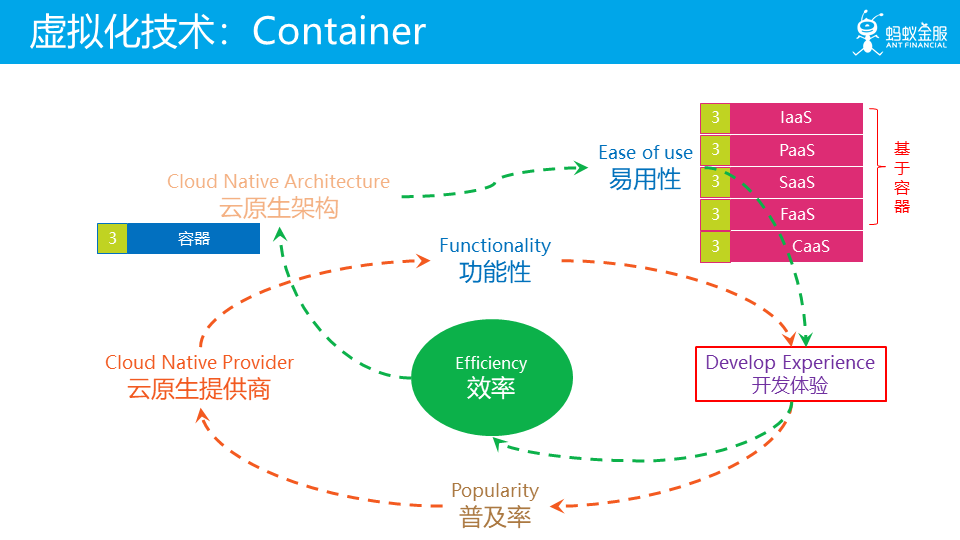

2013年前后，以docker为标志的容器技术开始成熟，催生了容器编排、不可变基础设施等技术和理念。而容器这种轻量化虚拟计划的出现也极大的促进了微服务架构等的演进，2015年前后，云原生架构被正式提出。而之前基于虚拟机技术的XaaS也开始向容器化方向转变。

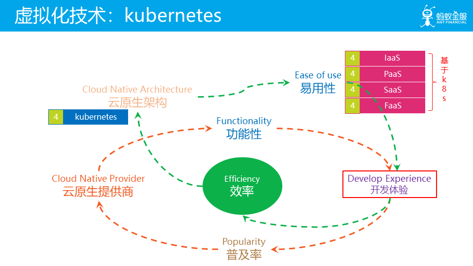

随着 kubernetes 完成了对容器编排市场的统一，云和云原生架构进入kubernetes时代，虽然底层虚拟化技术依然是虚拟机和容器，但是上层的XaaS形态已经开始陆陆续续开始向k8s转型。此时k8s奉行的声明式API等理念也成为云原生架构的指导思想之一。

最近安全容器技术发展迅速，预期未来一旦技术成熟，很可能会带来新一轮的变革，未来的云和XaaS会可能会转为基于安全容器，也许还会有新的未知的形态出现，值得期待。

从上述演进过程可以看到，随着虚拟化技术的一步一步演进，飞轮的一次一次循环，云开始诞生，XaaS形态开始出现，各种技术和理念相继诞生并日益完善，云原生架构出现并开始成熟，新的理念和架构出现/实践/改进，整个云原生架构就这样在一次一次的飞轮循环中走向成熟。

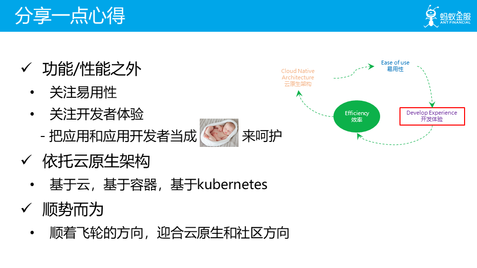

以云原生飞轮理论为基础和指导，分享一些我们团队在设计云原生产品的一点点心得：

- 首先，在关注功能/性能之外，应该更多的关注易用性，关注开发者的体验，要将应用和应用开发者当成bady来呵护，努力让产品的使用者可以更舒适更简单的使用产品
- 产品应该依托云原生架构，具体说，就是应该基于云，基于容器，基于kubernetes。其核心观点在于，要让产品表现的更符合云原生，产品本身就应该是云原生的。
- 顺势而为，要顺着飞轮的方向，迎合云原生的理念，迎合社区的发展方向。不要逆势而为，不要试图挑战整个社区。

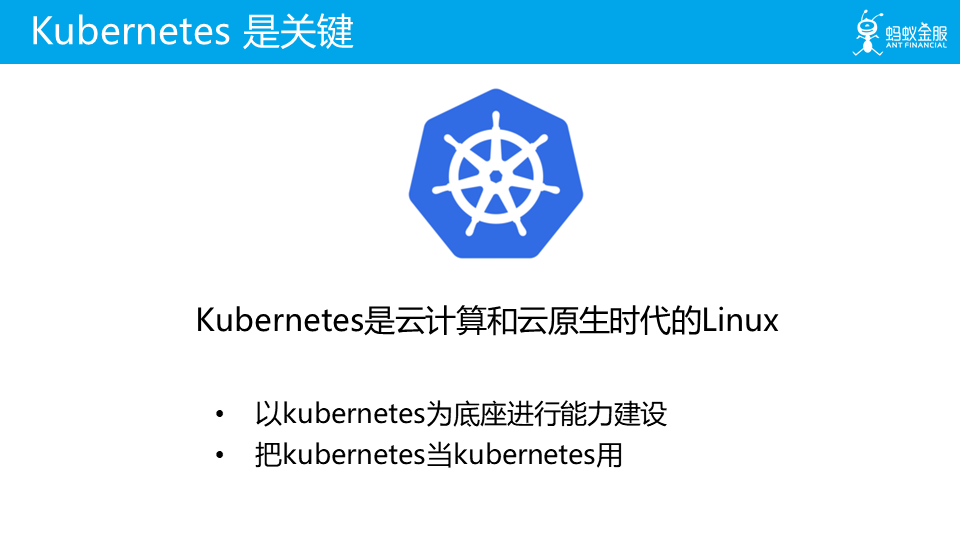

Kubernetes 是云原生的关键所在，怎么强调都不为过。这里有一个被越来越多人认可的说法：

**Kubernetes是云原生时代的Linux**

对这句话，我们有两个认识，在这里分享一下：

1. 应该以 kubernetes 为底座进行能力建设：简单说就是如果是 kubernetes 已有的能力则直接使用，如果 k8s 的能力不足，则在 kubernetes 上做改进和争强，充分利用k8s的能力，而不是选择无视。
2. 把kubernetes当kubernetes用：即要符合 kubernetes 的理念和设计，遵循kubernetes的游戏规则

谈到遵循kubernetes的游戏规则，我们深入一下，核心在于遵循kubernetes的 CRD + Controller 模型：

- 如果k8s底座的能力不够：则应该去补充和加强k8s的能力，体现为实现新的Controller
- 如果k8s的抽象不够：比如说对于某些复杂场景，现有CRD不适用或不够用，则应该定义新的抽象，体现为添加新的CRD

两者结合起来，加固k8s底座（Controller）+ 扩展k8s抽象（CRD），就可以得到新的云原生基础设施。

另外，重要的事情说三遍：声明式API，声明式API，声明式API！

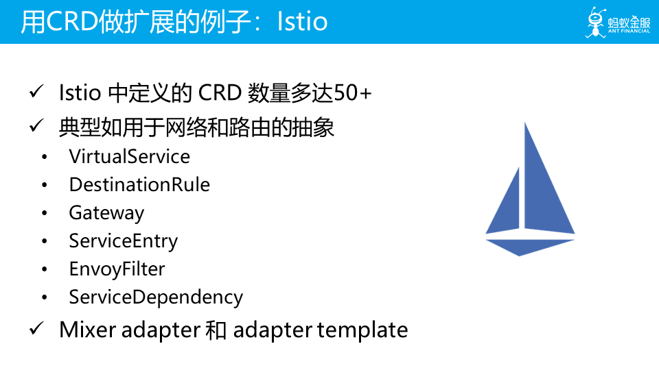

举几个用 CRD 做扩展的例子，典型如 Istio。

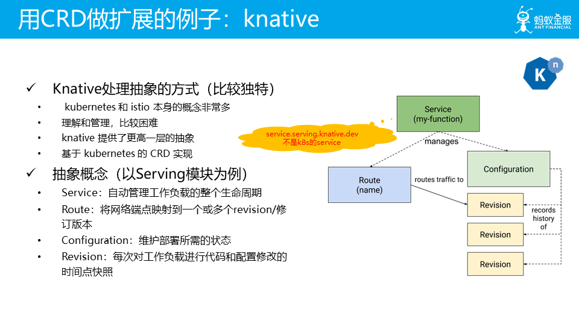

还有 Google 新推出的 serverless 项目 knative。

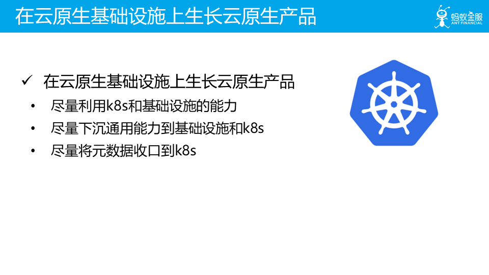

在通过以 加固k8s底座（Controller）+ 扩展k8s抽象（CRD）的方式打造新的云原生基础设施后，再在这些云原生基础设施的基础上，生长新的云原生产品。

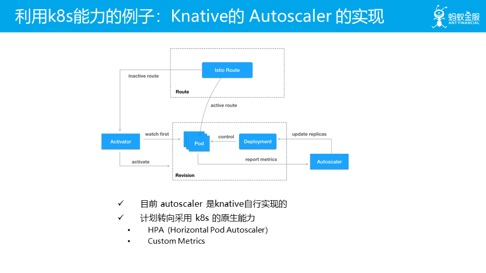

这里给出一个利用k8s能力的例子：Knative的 Autoscaler 的实现。

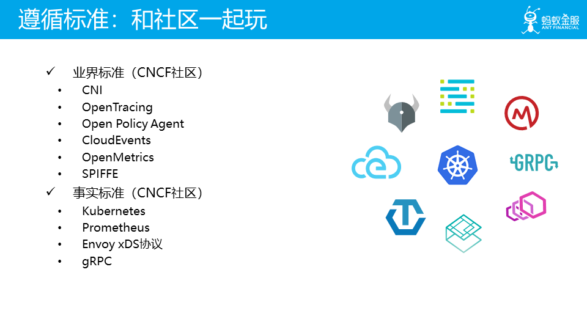

尽量遵循标准，尽量和社区一起玩：一方面可以从社区借力，跟随社区一起成长；另一方面，在产品对外输出时也容易被社区接受。

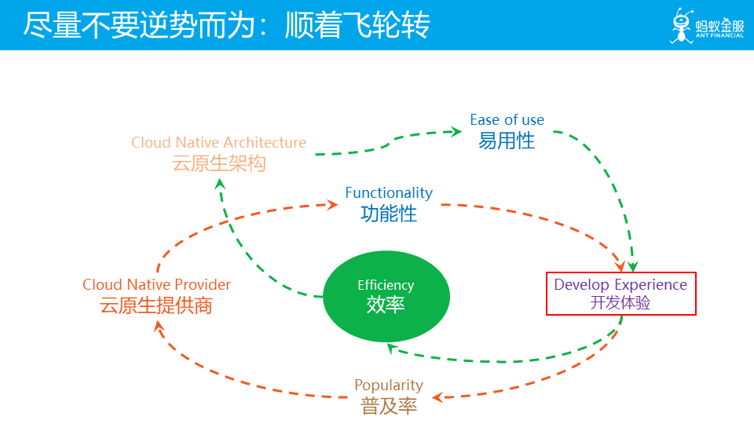

最后再次强调一点：尽量不要逆势而为，尽量顺着云原生飞轮转动的方向。

小结：

关于如何让产品更符合云原生这个话题，我们这次只带来了一些比较基础的想法，由于在云原生这个领域我们也还处于摸索阶段，所以目前的看法和想法可能都还不够成熟。而且，更具体更深入的建议应该结合实际产品讲，但是本次分享中不太适合再进一步深入展开了，希望后面会有机会。

此外，受工作范围限制，我们专注的领域偏中间件和服务间通讯，对于其他产品领域，期望后续有其他同学带来更深入分享。这也是我们本次分享的重要目的：抛砖引玉。

## 花絮：有哪些有趣的角色转变？

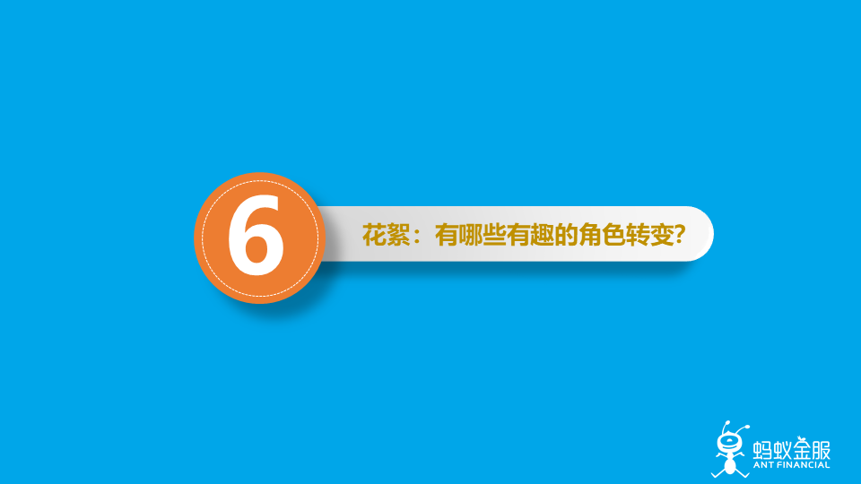

在本次分享的最后是花絮内容，我们轻松一下，来看看在云原生的演进过程中，有哪些有趣的角色转变？

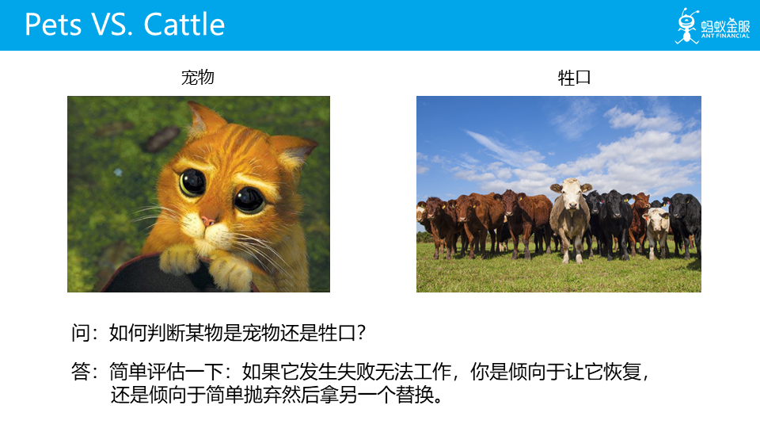

这里所说的角色，指的是一个云计算中的口头禅或者说典故，通常在英文资料中经常看到：Pets VS. Cattle。

宠物或者奶牛，为了表述的更形象一些，我喜欢翻译为宠物或者牲口。

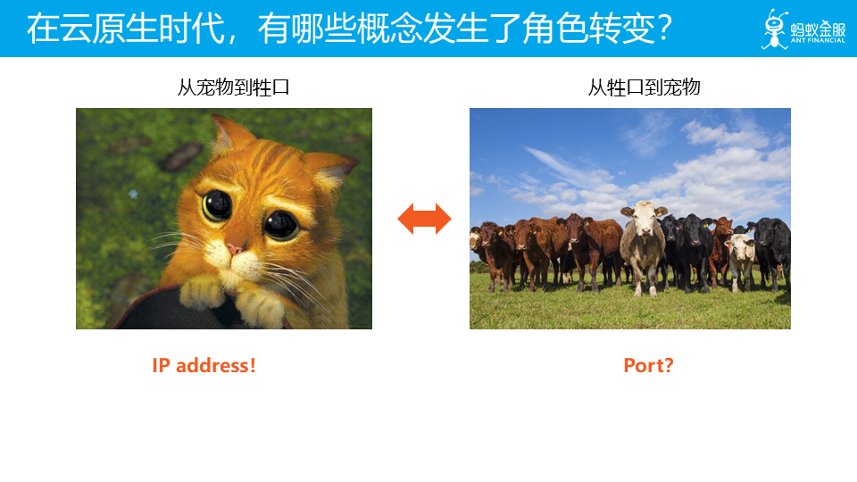

这里有个问题：在云原生时代，有哪些概念发生了角色转变？大家有兴趣可以试试回答一下。

我这里给出两个回答，一个是IP 地址，从宠物到牲口；另一个是 端口/port，从牲口到宠物。

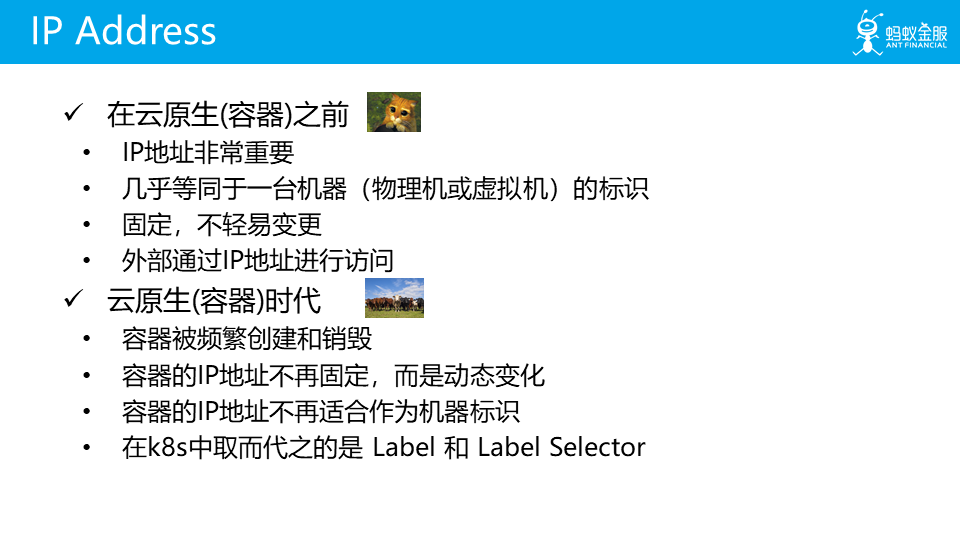

IP 地址在云原生时代，从宠物到牲口，基本大家都比较认可了。

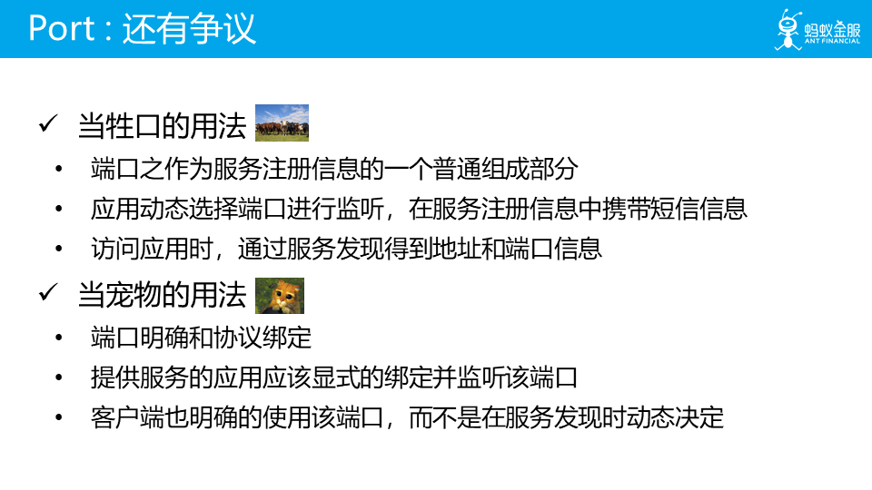

而端口/port，从云原生之前的牲口，转变为云原生之后的宠物，则还存在比较大的争议。这里列出当牲口和当宠物的两个不同的端口使用方式。

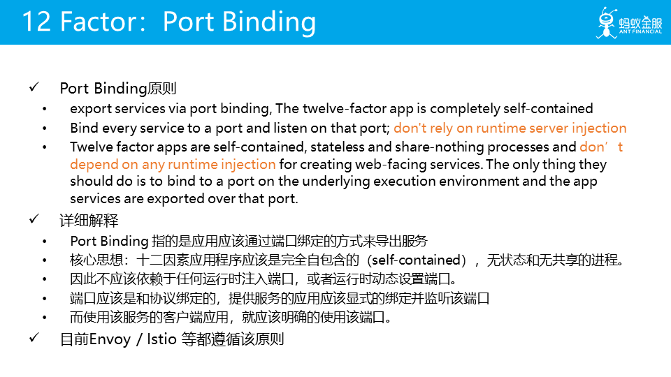

视端口为宠物的一个重要理论依据，来自 12 Factor 中的 Port Binding原则。实践中很多产品，包括 Envoy / Istio 等都遵循这一原则。在我们的SOFAMesh产品中，我们也同样遵循这一原则。

当然这个花絮的主要目的，还是希望可以借这个话题，让大家有个心理准备：在云原生之后，可能会有些之前理所当然的理念会发生变化。因此，请保持良好的心态 :)

## 总结

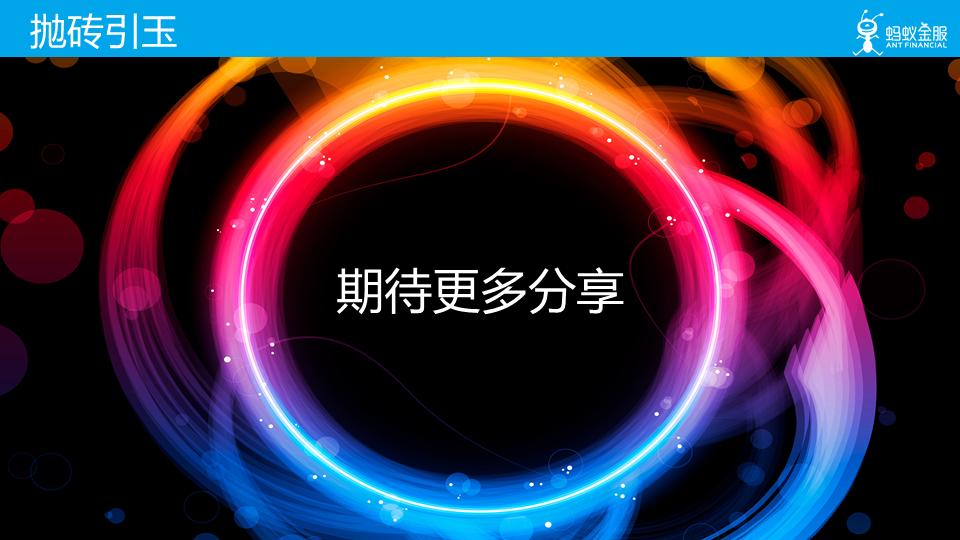

在最后，再一次强调，这次云原生分享是希望起到一个抛砖引玉的作用，期待后面会有更多同学出来就云原生这个话题进行更多的分享和讨论。我们团队目前在云原生这条全新的道路上努力的探索，但是云原生应该如何进行，这是一个非常大的话题，希望有更多的人一起来参与，一起来讨论，一起来交流。

