+++
title = "Service Mesh发展趋势(续)：棋到中盘路往何方"
date = "2019-08-10"
draft = false

# Authors. Comma separated list, e.g. `["Bob Smith", "David Jones"]`.

authors = ["敖小剑"]

# Publication type.

# Legend:
# 0 = Uncategorized
# 1 = Conference proceedings
# 2 = Journal
# 3 = Work in progress
# 4 = Technical report
# 5 = Book
# 6 = Book chapter
publication_types = ["1"]

# Publication name and optional abbreviated version.

publication = "ServiceMesh Meetup2019广州站"
publication_short = "ServiceMesh Meetup广州"

# Abstract and optional shortened version.
abstract = "继续探讨ServiceMesh发展趋势：深度分析Istio的重大革新Mixer v2，Envoy支持Web Assembly的意义所在; 深入介绍Google Traffic Director对虚拟机模式的创新支持方式，以及最近围绕SMI发生的故事。"
abstract_short = "继续探讨ServiceMesh发展趋势：深度分析Istio的重大革新Mixer v2，Envoy支持Web Assembly的意义所在; 深入介绍Google Traffic Director对虚拟机模式的创新支持方式，以及最近围绕SMI发生的故事。"

# Featured image thumbnail (optional)

image_preview = ""

# Is this a featured publication? (true/false)
featured = true

# Projects (optional).
#   Associate this publication with one or more of your projects.
#   Simply enter the filename (excluding '.md') of your project file in `content/project/`.
projects = []

tags = ["服务网格"]

# Links (optional).
url_pdf = ""
url_preprint = ""
url_code = ""
url_dataset = ""
url_project = ""
url_slides = ""
url_video = ""
url_poster = ""
url_source = ""

# Custom links (optional).
#   Uncomment line below to enable. For multiple links, use the form `[{...}, {...}, {...}]`.
url_custom = [{name = "PPT下载", url = "/files/pdf/201908-servicemesh-development-trend2.pdf"}, {name = "图文实录(PDF格式)", url = "/files/pdf/201908-servicemesh-development-trend2-text.pdf"},  {name = "Meetup资料介绍", url = "https://tech.antfin.com/community/activities/781"}]

# Does the content use math formatting?
math = false

# Does the content use source code highlighting?
highlight = true

# Featured image
# Place your image in the `static/img/` folder and reference its filename below, e.g. `image = "example.jpg"`.
[header]
image = "headers/talk/201905-servicemesh-development-trend.png"
caption = ""
+++

## 前言

本文内容整理自8月10日在 ServiceMesh Meetup 广州站发表的主题演讲。标题“Service Mesh发展趋势(续)”中的“续”是指在今年5月底，我在 CloudNative Meetup上做了一个“[ServiceMesh发展趋势：云原生中流砥柱](../201905-servicemesh-development-trend/)”的演讲，当时主要讲了三块内容：Service Mesh产品动态，发展趋势，与云原生的关系。后来有同学反应希望部分感兴趣的内容能讲的更深一些，所以今天将继续“ServiceMesh发展趋势”这个话题。

今天给大家分享的内容有部分是上次演讲内容的深度展开，如社区关心的Mixer v2；以及最近看到的一些业界新的技术方向，如web assembly技术，还有产品形态上的创新，如google traffic director对servicemesh的虚拟机形态的创新支持。

在ServiceMesh出道四年之际，也希望和大家一起带着问题来对ServiceMesh未来的发展进行一些深度思考。

在正式开始分享之前，让我们先轻松一下，下面是最近流行的梗，各种灵魂拷问：

而我们今天的分享内容，将效仿上面的方式，对 ServicMesh 进行四个深入灵魂的拷问。

## ServiceMesh灵魂拷问一：要架构还是要性能？

第一个灵魂拷问针对 Istio 的：要架构还是要性能？

### Istio的回答：要架构

Istio的回答很明确：架构优先，性能靠边。

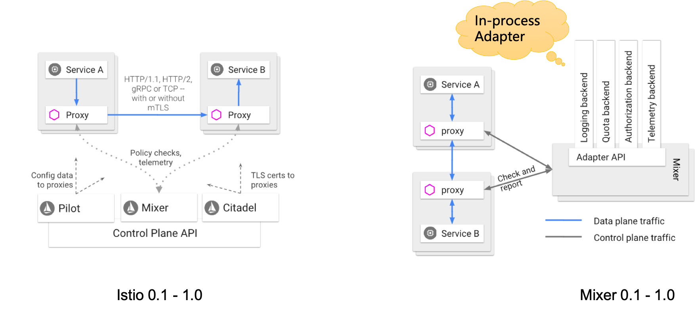

左边是 Istio 的架构图，从2017年的 0.1 版本开始，一直到 Istio1.0，控制平面和数据平面完全物理分离，包括我们今天要关注的Mixer模块。Sidecar 通过和 Mixer 的交互实现策略检查和遥测报告。

右边是 Mixer 的架构图，在 Mixer 内部提供了很多 Adapter 实现，用来提供各种功能。这些 Adapter 运行在 Mixer 进程中，因此被称为进程内适配器（In-Process Adapter）。

**为什么Istio选择Mixer和Proxy分离的架构？**

我们先来看这个架构的优点，概括地说优点主要体现为：

- 架构优雅
- 职责分明
- 边界清晰

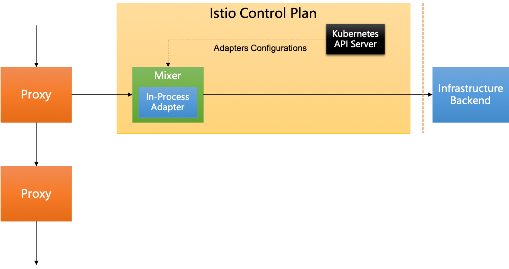

特别指出，上图右侧的红色竖线，是Istio 0.1 到 Istio 1.0 版本中 Istio 和后台基础设施的边界。这意味着，从k8s API Server 中读取 Adapter 相关的配置信息 （以 Istio CRD 的形式存在），是作为 Istio 功能的一部分。

具体的优点是：

- Mixer的变动不影响Sidecar：包括Mixer的部署调整和版本升级
- Sidecar无需和Adapter耦合，具体有：

	- Sidecar不需要读取配置，因此也无需直接连接到 k8s AP Server/Istio Galley
	- Adapter的运行时资源开销和Sidecar无关
	- Sidecar不受Adapter增减/更新/升级影响
- 保持 Sidecar 代码简单：数以几十计的Adapter的代码无需直接进入Sidecar代码
- 数据平面可替换原则：如果有替换数据平面的需求，则Mixer分离的架构会让事情简单很多

至于缺点，只有一个：**性能不好**。

而1.1版本之后，Istio 给出了新的回答：架构继续优先，性能继续靠边：

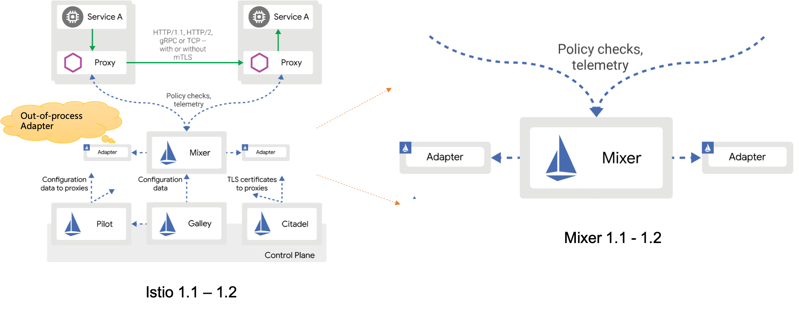

上图是Istio1.1版本之后新的架构图，和之前的差异在于Mixer发生了变化，增加了进程外适配器（Out-of-Process Adapter），而Mixer和新的Out-of-Process Adapter之前依然是远程调用。

为什么 Istio 改而选择 Out-of-Process Adapter?

下图是采用 Out-of-Process Adapter 之后的请求处理流程图，Mixer 通过 Bypass Adapter 选择需要的属性列表，然后通过远程调用发送给 Out-of-Process Adapter。Out-of-Process Adapter 实现和之前的 In-Process Adapter 类似的功能，但是改为独立于 Mixer 的单独进程。

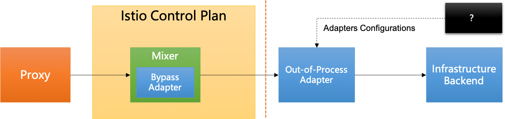

采用 Out-of-Process Adapter 之后，Istio的优点更加明显了，简单说就是：架构更优雅，职责更分明，边界更清晰。

而且，请注意：按照 Istio 的设想，此时 Out-of-Process Adapter 已经不再作为 Istio 的组成部分，它的代码实现、安装部署、配置、维护等职责也不再由 Istio 承担，请留意上图中的红色竖线位置。Out-of-Process Adapter 的引入，对于 Istio 来说职责和边界的改变会让 Istio 简单，但是对于使用者（主要指运维）来说则增加了额外的负担，因此造成了很大的争议。

至于缺点，除了上述的职责转移造成争议外，依然只有一个：**性能不好**，原来 Sidecar 和 Mixer 之间的远程调用已经让性能变得非常糟糕，现在 Mixer 和 Out-of-Process Adapter 之间再增多加一次远程调用，可谓雪上加霜。

### Mixer v1 架构的优缺点分析

Mixer v1 架构的优点主要体现为：

1. 集中式服务：提高基础设施后端的可用性，为前置条件检查结果提供集群级别的全局2级缓存

2. 灵活的适配器模型，使其以下操作变得简单：

	- 运维添加、使用和删除适配器
	- 开发人员创建新的适配器（超过20个适配器）

而 Mixer v1 架构的缺点，则主要体现为：

1. 管理开销

	- 管理Mixer是许多客户不想负担的
	- 而进程外适配器强制运维管理适配器，让这个负担更加重。

2. 性能

	- 即使使用缓存，在数据路径中同步调用Mixer也会增加端到端延迟
	- 进程外适配器进一步增加了延迟
	- 授权和认证功能是天然适合mixer pipeline的，但是由于mixer 设计的延迟和SPOF（单点故障）特性，导致直接在Envoy中实现(Envoy SDS)

3. 复杂性

	- Mixer使用一组称为模板的核心抽象，来描述传递给适配器的数据。这些包括“metrics”，“logentry”，“tracepan”等。这些抽象与后端想要消费的数据不匹配，导致运维需要编写一些手动配置，以便在规范的 Istio 样式和后端特定的样式之间进行映射。原本期望这种映射可以在适配器中实现很大程度上的自动化，但是最终还是太复杂并需要手动配置。

> 备注：上述优点和缺点的描述摘录自 mixer v2 proposal 。

其中，Mixer 性能问题一直以来都是 Istio 最被人诟病的地方。

那问题来了：如果要性能，该怎么做？

下图是 Mixer v1 的调用流程，Proxy/Sidecar 是请求数据的起点，Infrastructure Backend 是终点。Mixer v1性能不好的原因是多了 Mixer 的一次远程访问，而 Out-of-Process Adapter 因为又额外引入了一次远程调用，导致性能更加糟糕：

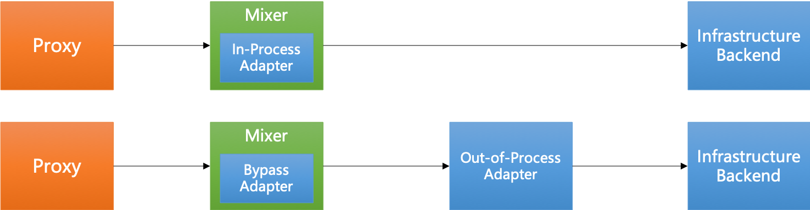

因此，要彻底解决远程调用引入太多而造成的性能问题，答案很明显：

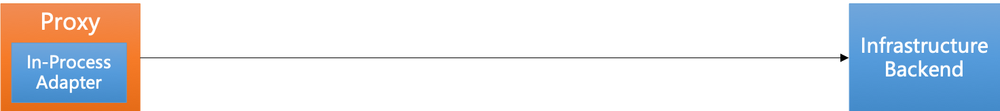

将 Mixer 的功能内置到 Sidecar 中，使用  In-Process Adapter ，直接连接 Sidecar 和 Infrastructure Backend。

### Mixer v2

Mixer 带来的性能问题，以及 Mixer Cache 的失效，导致为了得到一个可用的性能，必须合并 Mixer 到 Sidecar。关于这个论断和行动，蚂蚁先行一步，在去年我的演讲"[大规模微服务架构下的Service Mesh探索之路](../201810-ant-finance-service-mesh-practice/)" (演讲时间：2018-06-30)中就介绍了蚂蚁的ServiceMesh方案，其中和Istio最大的变化就是合并Mixer：

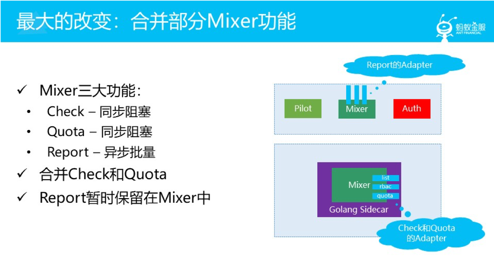

而在 2018年底，Istio社区终于提出了 Mixer v2 的 Proposal：Mixer V2 Architecture。

具体内容请见地址：

https://docs.google.com/document/d/1QKmtem5jU_2F3Lh5SqLp0IuPb80_70J7aJEYu4_gS-s/edit#heading=h.hvvcgepdykro

也可以看我之前对这个内容的摘要翻译：https://skyao.io/learning-istio/mixer/design/v2.html

下图是这个 Mixer V2 Architecture 的信息摘要，当前状态为 In Review，创建时间为 2018年12月18，迄今八个月：

Mixer v2 Proposal 的内容比较多，我们忽略各种细节，只看最核心的内容：

> **Mixer-In-Proxy**. Mixer will be rewritten in C++ and directly embedded in Envoy. There will no longer be any stand-alone Mixer service. This will improve performance and reduce operational complexity.
> 
> **Mixer合并进Proxy**。 Mixer 将用C++重写并直接嵌入到Envoy。 将不再有任何独立的 Mixer 服务。 这将提高性能并降低运维复杂性。

Mixer v2 的架构图如下：

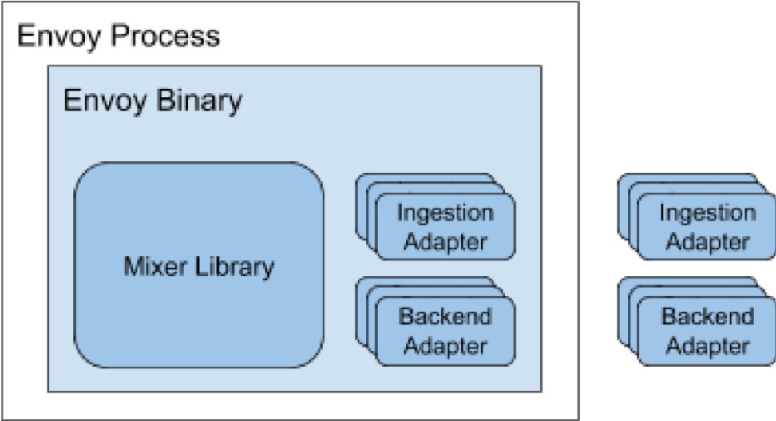

## ServiceMesh灵魂拷问二：性能有了，架构怎么办？

Mixer合并到Sidecar之后，性能有了，架构怎么办？这是我们今天的第二个灵魂拷问。

之所以提出这个问题，在于我们前面列出的mixer v1的各种优点，在将mixer简单合并到sidecar之后，这些原来的优点就会摇身一变成为新方式下的缺点，而这是比较难接受的。从这个角度说，Istio 选择 mixer v1 的架构也不是完全没有理由，只是性能上付出的代价过于高昂无法接受。

**Mixer v1的优点不应该成为Mixer v2的缺点**

这是我们对于将 Mixer 合并到 Sidecar 的要求，最起码，不要全部优点都成为缺点。

**合并没问题，如何合并才是问题！**

### envoy的可扩展设计

Envoy在设计上是可扩展的，设计有大量的扩展点：

- L4/L7 filters
- Access loggers
- Tracers
- Health checkers
- Transport sockets 
- Retry policy
- Resource monitors 
- Stats sink

而 Envoy 的扩展方式也有三种：

- C++：直接编码
- Lua：目前仅限于HTTP Traffic
- Go extensions：beta, 用于 Cilium

但是这三种扩展方式对于mixer 来说都并不理想，Lua 和 Go extension 不适用于 Mixer，而c++直接编码方式则就会真的让之前的所有优点直接变成缺点。

Envoy 最新尝试的新扩展方式 Web Assembly，则成为我们今天的希望所在：

最近 Envoy 在开始提供WASM的支持，具体可以看 [Support WebAssembly (WASM) in Envoy](https://github.com/envoyproxy/envoy/issues/4272) 这个 issue 的描述，目前从 github 的 milestone 中看到 Envoy 计划在1.12版本提供对 WASM 的支持（Envoy 1.11版本发布于7月12日）。

还有一个 [envoy-wasm项目](https://github.com/envoyproxy/envoy-wasm)，定位为"Playground for Envoy WASM filter"。

### WASM简单介绍

这里对 Web Assembly 做一个简单介绍，首先看来自 Mozilla 的官方定义：

> WebAssembly是一种新的编码方式，可以在现代的网络浏览器中运行 － 它是一种低级的类汇编语言，具有紧凑的二进制格式，可以接近原生的性能运行，并为诸如C / C ++等语言提供一个编译目标，以便它们可以在Web上运行。它也被设计为可以与JavaScript共存，允许两者一起工作。

更通俗的理解是：

> WebAssembly不是一门编程语言，而是一份字节码标准。WebAssembly字节码是一种抹平了不同CPU架构的机器码，WebAssembly字节码不能直接在任何一种CPU架构上运行，但由于非常接近机器码，可以非常快的被翻译为对应架构的机器码，因此WebAssembly运行速度和机器码接近。（类比Java bytecode）
> 
> 备注：摘录自 http://blog.enixjin.net/webassembly-introduction/

而使用 Web Assembly 扩展 Envoy 的好处是：

- 避免修改Envoy
- 避免网络远程调用（check & report）
- 通过动态装载（重载）来避免重启envoy
- 隔离性
- 实时A/B测试

### Envoy的WASM支持

Envoy支持Web Assembly的架构和方式如下图所示：

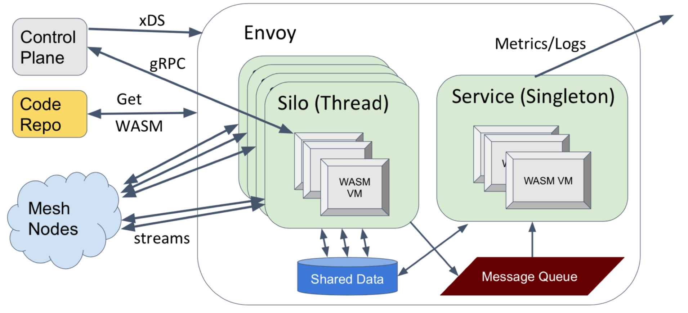

> 备注：内容来自演讲 [”Extending Envoy with WebAssembly”](https://www.youtube.com/watch?v=XdWmm_mtVXI)

目前Envoy支持的Web Assembly VM有：

- WAVM (https://github.com/WAVM/WAVM)
- V8(https://v8.dev/)
- Null Sandbox (use the API, compile directly into Envoy)

### Mixer v2和WASM

Mixer v2的终极目标形态应该是这样：

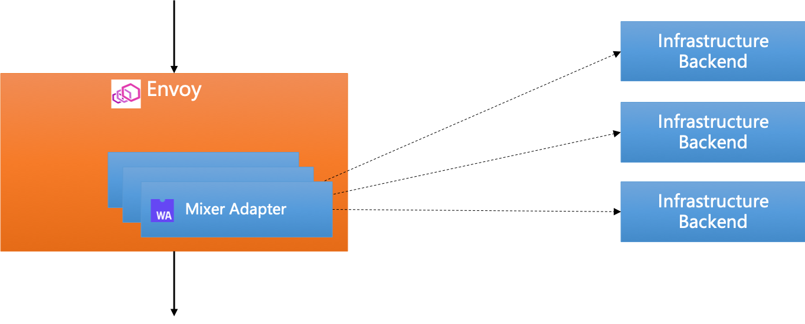

- Mixer 合并到 Envoy：Adapter 以 In-Proxy Adapter 的形式存在
- Envoy 支持 Web Assembly 扩展：各种 Adapter 以高级语言编写，然后编译为WASM，再被Envoy加载（静态/动态均可）

我们欣喜的看到，在 WASM 这样的“黑科技”的加持下，Istio终于可以在弥补性能缺陷的同时，在系统架构上依然最大限度的维持Mixer v1的架构优雅、职责分明和边界清晰。

基于WASM扩展的 Mixer v2 真是一个令人兴奋而期待的新颖设计。

而对于 Mixer 的性能问题的解决方案，广大Istio社区可谓望穿秋水，从2017年初Istio开源发布0.1版本到今天，两年多时间过去，终于 Mixer v2 开始正视 Mixer 性能问题。但是，Mixer v2 要真正落地，还有非常长的路要走。

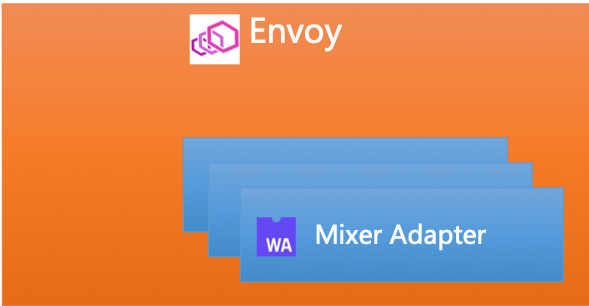

要实现如上图所示 Mixer v2 终极目标形态，需要：

1. Envoy 提供对 WASM 的支持
2. Istio 大规模架构调整，实施 mixer v2

目前，Envoy对Web Assembly的支持预计有希望在3-6个月内实现，具体情况可以通过下面的Issue来了解：

https://github.com/envoyproxy/envoy/issues/4272

我们从这个Issue中可以大体总结Envoy对WASM支持的过程：

- 2018年8月28日，Issue创建，提交对WASM支持的想法
- 2018年10月开始动手，进行poc
- 2019年5月poc完成，然后创建envoy-wasm项目
- 目前这个Issue放在envoy的下一个milestone1.12中

Envoy 最近刚发布了 1.11版本，根据最近两年中Envoy的稳健表现，Envoy一般三个月发布一个版本，这样预计1.12版本会在未来三个月内提供。即使1.12版本未能完成，延后到1.13版本，也会在六个月内提供。

但是 Istio 方面的进展，则非常不乐观：Mixer v2 从提出到现在8个月了，依然是In Review状态。

考虑到过去两年间 Istio 团队表现出来的组织能力和执行能力，我个人持悲观态度，我的疑问和担忧是：

- Istio能否接受Mixer v2？
- 如果接受，什么时候开工？
- 如果开工，什么时候完工？
- 如果完工，什么时候稳定？

Mixer v2 虽然前景美好，奈何还需时日，尤其取决于 Istio 的表现：社区的殷切期待和Istio的犹豫未决可谓耐人寻味。

最后感叹一声：**南望王师又一年，王师还是Review间**......

## ServiceMesh灵魂拷问三：要不要支持虚拟机？

在聊完性能与架构之后，我们继续今天的第三个灵魂拷问：在有了高大上的容器/k8s/云原生，还要不要支持土里土气的虚拟机？

### ServiceMesh 主流产品对虚拟机的支持

首先我们看一下 ServiceMesh 主流产品对虚拟机的支持情况：

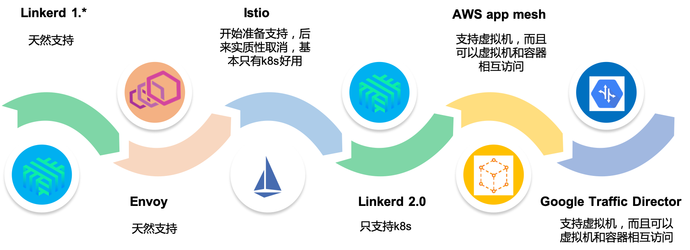

- ServiceMesh 的第一代产品，典型如 `Linkered 1.*` 和 Envoy，天然支持虚拟机
- ServiceMesh 的第二代产品，如 Istio，在刚开始发布时还计划提供对非k8s的支持，但是后面实质性的取消，基本只有在k8s上才好用。`Linkerd 2.*` 更是明确只提供k8s的支持。
- AWS 在2018年推出的 app mesh，不仅仅可以支持虚拟机，而且可以支持虚拟机和容器相互访问；稍后Google 推出了 Traffic Director 产品，也是同样思路。

稍加回顾，就会发现：历史总是惊人的相似，螺旋式上升？波浪式起伏？

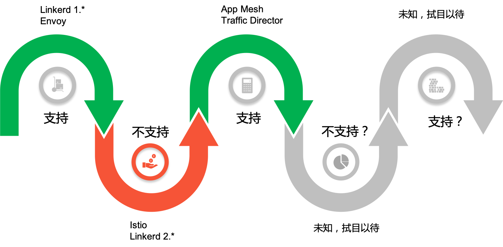

ServiceMesh 对于虚拟机的态度，从 `Linkerd 1.*` 和 Envoy的支持，到 Istio / `Linkerd 2.*` 的不支持，再到 AWS app mesh 和 Google Traffic Director 的支持，可谓一波三折。未来如果有新形态的 ServiceMesh 产品出现，对虚拟机的支持又会是如何？支持还是不支持，我们拭目以待。

### 虚拟机支持与否的背后

第一个转折容易理解：相比虚拟机，k8s提供了太多便利。随着容器的普及，k8s的一统天下，社区对云原生的日益接受，虚拟机模式失宠容易理解。

轻松一下，引用最近的一个梗 “小甜甜 VS 牛夫人”，感觉可以非常形象的描述虚拟机失宠的场面：

第二个转折该如何解释？

AWS App Mesh 提供对虚拟机支持是容易理解的，毕竟AWS上目前还是以虚拟机为主，而且k8s/云原生本来就是 Google 和 AWS 竞争的重要武器，AWS app mesh 提供对虚拟机的支持，并且可以打通就有的虚拟机体现和新的k8s体系，对AWS意义重大。

但是，作为 k8s 和云原生的主要推动力量， Google 为什么在 Traffic Director 这个产品上没有继续 Istio / Linkerd2 只支持k8s的做法，而是效仿 AWS 呢？

原因简单而直白：理想和现实的差距。

- 理想：云原生普及，容器普遍落地，生产上k8s广泛使用
- 现实：虚拟机大量存在，大量公司未能有效掌握k8s，大部分应用还是运行在虚拟机上

关于ServiceMesh形态和云原生未能普及的思考，去年（2018-02-10
）在 [DreamMesh抛砖引玉(2)-CloudNative](../../post/201802-dreammesh-brainstorm-cloudnative/) 这篇博客中我有详细描述，当时也和很多社区同学深入讨论。援引当时的一小段总结：

> 理想很丰满，现实很骨感。Cloud Native虽然令人向往，然而现实中，有多少企业是真的做好了Cloud Native的准备？
>
> 问题：到底该先容器/k8s，再上微服务/servicemesh；还是先微服务/servicemesh，再上容器/k8s？
>
> 每个公司都会有自己的实际情况和选择。

在去年底（2018-11-25），我和同事曾经做过一个名为 ["蚂蚁金服Service Mesh渐进式迁移方案"](../201811-service-mesh-step-by-step/) 的主题演讲，详细描述了 Service Mesh 和 k8s 落地可能的多种演进路线：

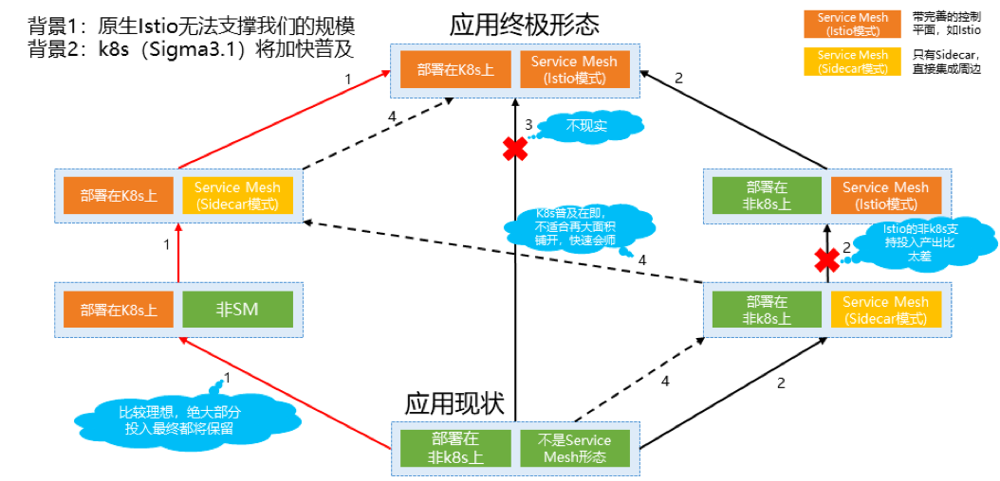

在关于先ServiceMesh，还是先k8s的这个问题上，Google Traffic Director的选择是：支持ServiceMesh先行。即容许应用在进行容器化改造和k8s落地之前，也能够从ServiceMesh获益。为此，Google Traffic Director在标准的k8s之外，为基于虚拟机的应用（未做容器化改造）和基于自管理的docker容器（有容器但不是k8s）提供支持：

对此，Traffic Director 官方文档是这样描述的：“按**您的节奏**进行现代化改造”。

### 创新：Google Traffic Director的虚拟机支持

对于如何在虚拟机上提供ServiceMesh的支持，Google Traffic Director 给出了一个创新的思路。

为了方便管理虚拟机实例，Google Traffic Director 提供了托管式实例组（Managed Instance Group，实际来自GCP），效仿容器和k8s的方式来管理虚拟机：

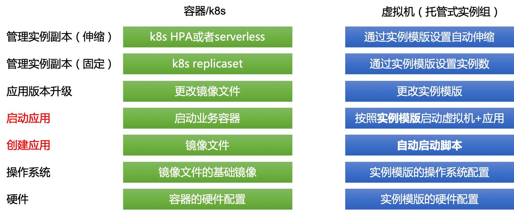

其中最重要的是提供实例模版（Instance Template）来进行虚拟机的硬件配置/操作系统配置，然后基于实例模版来创建虚拟机实例，并通过自动启动脚本来获取并启动应用，从而实现了从零启动一个运行于虚拟机的应用的全过程自动化。

而实例模版+自动启动脚本配合，可以实现类似容器和k8s下的很多类似功能，比如应用版本升级时只需要修改实例模版（和其中的自动启动脚本），类似容器下的修改镜像文件。实例模版提供对实例副本数的管理，包括固定大小和自动伸缩（由此提供类serverless的特性）。

类似的，为了方便管理运行于虚拟机上的应用实例，Traffic Director 效仿 k8s/Istio 的方式来管理服务：

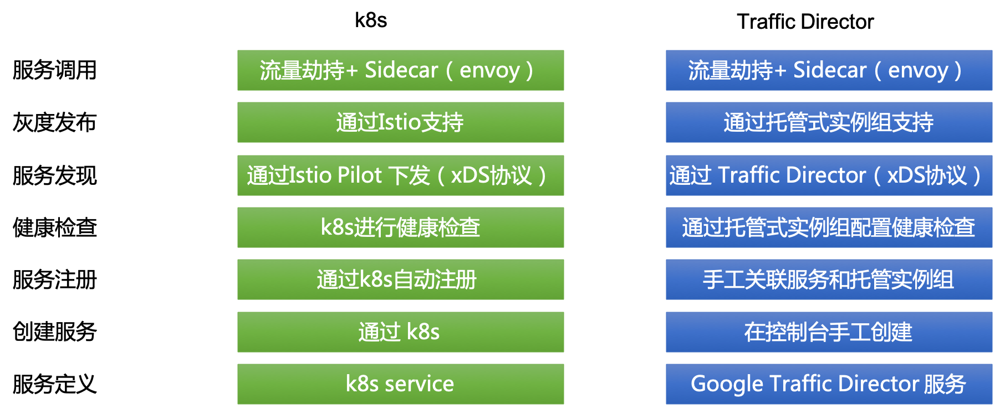

Traffic Director 提供了可同时用于k8s/容器/虚拟机三种模式下的统一的服务抽象，容许在控制台手工创建服务并关联到实例模版（以及实例模版背后的虚拟机实例和运行其上的应用），可以通过托管实例组配置健康检查/灰度发布等高级特性。

Google Traffic Director 在 ServiceMesh 虚拟机支持上的创新思路在于：**补齐虚拟机的短板，向容器看齐，维持一致的用户体验**。如下图所示，在通过托管式实例组向容器/k8s看齐（当然非常有限）之后，配合统一的 Traffic Director 服务抽象，就可以实现统一管理应用，如配置路由规则。从而实现在最上层为不同ServiceMesh模式提供一致的用户体验：

通过上述的创新方式，Traffic Director 将 ServiceMesh 对虚拟机的支持提升到新的高度。

> 备注：关于Google Traffic Director 对虚拟机支持的细节，请见我的另一篇博客文档 ["ServiceMesh先行：Google Traffic Director实践分析"](../../post/20190707-google-traffic-director-practice/)

## ServiceMesh灵魂拷问四：说好的供应商不锁定呢？

在夸赞完 google 和 Traffic Director 之后，我们进行今天的最后一个灵魂拷问，这个问题的目标直指 google：

说好的供应商不锁定呢？

供应商不锁定，是 google 和 CNCF 一直强调和倡导的理念，也是云原生最重要的基石之一。Google 一直用供应商不锁定这块大石头狠狠的砸AWS的脑袋，但是，这块石头也是可以用来砸google自己的脚的。

### SMI的意义和最近的社区支持情况

在 ServiceMesh 领域，供应商不锁定的典型代表，就是SMI（Service Mesh Interface）。

> 备注：关于 Service Mesh Interface 的介绍，我之前的博客文档 [Service Mesh Interface详细介绍](../../post/201906-service-mesh-interface-detail/) 有非常详细的描述。

让我们来共同回味 SMI 为整个 ServiceMesh 社区带来的美好愿景：

> “SMI 是在 Kubernetes 上运行服务网格的规范。它定义了由各种供应商实现的通用标准。这使得最终用户的标准化和服务网格供应商的创新可以两全其美。SMI 实现了灵活性和互操作性。”
> 
> “SMI API的目标是提供一组通用的，可移植的Service Mesh API，Kubernetes用户可以以供应商无关的方式使用这些API。通过这种方式，可以定义使用Service Mesh技术的应用程序，而无需紧密绑定到任何特定实现。”

下图这张图可以让我们更好的理解 SMI 在 ServiceMesh 生态中的位置和 SMI 对整个生态的重要：

在 SMI 发布之后，最近 ServiceMesh 社区的主要玩家都纷纷开始提供对 SMI 的支持：

- Linkerd：发布于 2019-07-11的 Linkerd 2.4.0 版本开始支持 SMI
- Consul Connect: 发布于 2019-07-09 的 Consul 1.6 版本开始支持 SMI

### Google在ServiceMesh标准化上的反常表现

标准化是供应商不锁定的基石，只有实现标准化，才能基于统一的标准打造社区和生态，上层的应用/工具等才有机会在不同的厂商实现之间迁移，从而打造一个有序竞争的积极向上的生态系统。

ServiceMesh 问世四年来，在标准化方面做的并不到位，而Google在ServiceMesh标准化上的表现更是反常。具体说，SMI出来之前：

- Istio迟迟未贡献给CNCF，可以说Istio至今依然是Google（还有IBM/Lyft）的项目，而不是社区的项目。
- Istio API 是私有API，未见有标准化动作
- Envoy xDS v2 API是社区事实标准，但这其实是Envoy的功劳
- 统一数据平面API（UDPA），感觉更像是Envoy在推动，和Istio关系不大

Google作为ServiceMesh界的领头羊，在标准化方面表现可谓消极怠工，几乎可以说是无所作为。以至于SMI这样的标准，居然是微软出面牵头。而在SMI出来之后，除Istio/AWS之外几乎所有ServiceMesh玩家都参与的情况下，依然未见Istio有积极回应。

AWS不加入社区容易理解，毕竟AWS自成体系，AWS本来也就是“供应商不锁定”的革命对象。而Google这位“供应商不锁定”运动的发起者，在 ServiceMesh 标准化上的反常表现，却是耐人寻味：屠龙的勇士，终将变成恶龙吗？

再次以此图，致敬AWS和google：

下图是目前的SMI阵营：汇集几乎所有ServiceMesh玩家，唯独AWS和Google缺席：

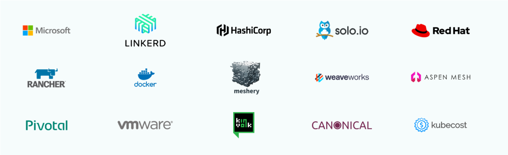

期待Google后续的行动，说好的供应商不锁定，请勿忘此初心。

## 总结与展望

ServiceMesh 出道四年，对于一个新技术，四年时间不算短，到了该好好反思当下和着眼未来的时候了，尤其是目前 ServiceMesh 在落地方面表现远不能令人满意的情况下。

正如标题所言：**棋到中盘，路往何方？**

今天的Servicemesh发展趋势探讨，我们以灵魂拷问的方式提出了四个问题。每一个问题和答案，都会深刻影响未来几年Servicemesh的走向，请大家在未来一两年间密切关注这些问题背后所代表的ServiceMesh技术发展走向和产品形态演进：

1. 要架构，还是要性能？：关注点在于ServiceMesh的落地，落地还有落地。性能不是万能的，但是没有性能是万万不能的
2. 性能有了，架构怎么办？：关注点在于回归性能之后的架构优化，以创新的方式实现性能与架构的兼得，用新技术来解决老问题
3. 要不要支持虚拟机？：关注点依然是落地，对现实的妥协或者说学会接地气，以创新思维来实现用新方法解决老问题
4. 说好的供应商不锁定呢？：关注点在于标准化，还有标准化之后的生态共建和生态繁荣。

本次ServiceMesh发展趋势的续篇到此为止，今年年底前也许还会有ServiceMesh发展趋势序列的第三篇（名字大概会叫做续2吧），希望届时能看到一些令人眼前一亮的新东西。敬请期待！
