## 前言

大家好，我是敖小剑，来自蚂蚁金服中间件团队，今天带来的主题是“诗和远方：蚂蚁金服 Service Mesh 深度实践”。

在过去两年，我先后在 QCon 做过两次 ServiceMesh 的演讲：

- 2017年，当时 ServiceMesh 在国内还属于蛮荒时代，我当时做了一个名为“[Servicemesh: 下一代微服务](https://skyao.io/talk/201710-service-mesh-next-generation-microservice/)”的演讲，开始在国内布道 ServiceMesh 技术
- 2018年，做了名为“[长路漫漫踏歌而行：蚂蚁金服Service Mesh实践探索](https://mp.weixin.qq.com/s?__biz=MzUzMzU5Mjc1Nw==&mid=2247484395&idx=1&sn=0210fa2fd78828a05ea29e5eff074e20&chksm=faa0ec31cdd76527ad5c123511b1b5e684db1954920c36c794ee5c7391c867979946ed0f3b77&token=729443254&lang=zh_CN#rd)”的演讲，介绍蚂蚁金服在 ServiceMesh 领域的探索性的实践，当时蚂蚁刚开始在 ServiceMesh 探索。

今天，有幸第三次来到QCon，给大家带来的依然是蚂蚁金服在 Servicemesh 领域的实践分享。和去年不同的是，今年蚂蚁金服进入了Servicemesh 落地的深水区，规模巨大，而且即将迎来双十一大促考验。

> 备注：现场做了一个调研，了解听众对 ServicveMesh 的了解程度，结果不太理想：在此之前对 ServiceMesh 有了解的同学目测只有10%多点（肯定不到20%）。Servicemesh 的技术布道，依然任重道远。

今天给大家带来的内容主要有三块：

1. 蚂蚁金服落地情况介绍：包括大家最关心的双十一落地情况；
2. 大规模落地的困难和挑战：分享一下我们过去一年中在大规模落地上遇到的问题；
3. 是否采用 ServiceMesh 的建议：这个问题经常被人问起，所以借这个机会给出一些中肯的建议供大家参考。

## 蚂蚁金服落地情况介绍

### 发展历程和落地规模

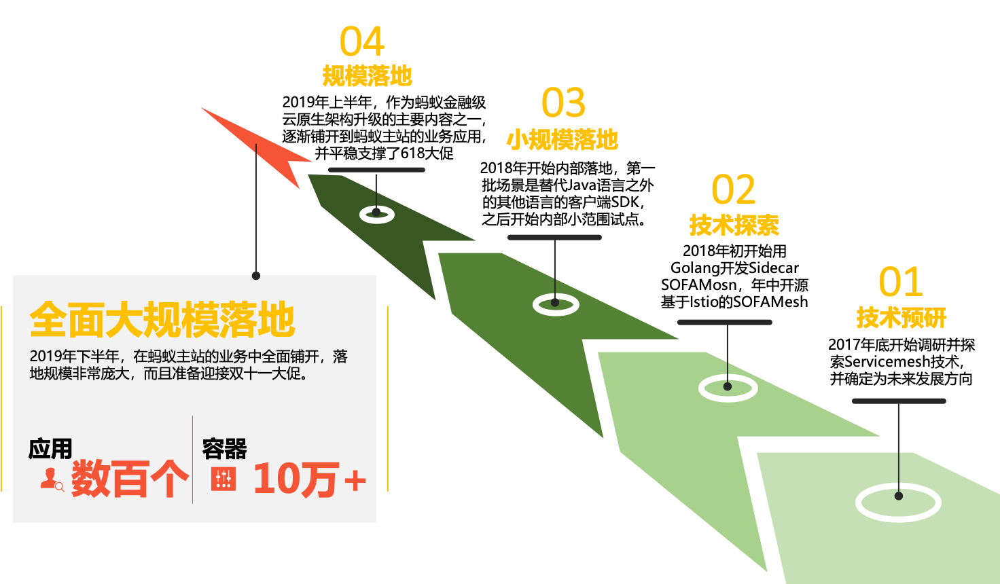

ServiceMesh 技术在蚂蚁金服的落地，先后经历过如下几个阶段：

- **技术预研** 阶段：2017年底开始调研并探索 Servicemesh 技术，并确定为未来发展方向；
- **技术探索** 阶段：2018年初开始用 Golang 开发 Sidecar SOFAMosn，年中开源基于 Istio 的 SOFAMesh；
- **小规模落地** 阶段：2018年开始内部落地，第一批场景是替代Java语言之外的其他语言的客户端SDK，之后开始内部小范围试点；
- **规模落地** 阶段：2019年上半年，作为蚂蚁金融级云原生架构升级的主要内容之一，逐渐铺开到蚂蚁主站的业务应用，并平稳支撑了618大促；
- **全面大规模落地** 阶段：2019年下半年，在蚂蚁主站的业务中全面铺开，落地规模非常庞大，而且准备迎接双十一大促。

目前 ServiceMesh 正在蚂蚁金服内部大面积铺开，我这里给出的数据是前段时间（大概9月中）在云栖大会上公布的数据：应用数百个，容器数量（pod数）超过10万。当然目前落地的pod数量已经远超过10万，这已经是目前全球最大的 ServiceMesh 集群，但这仅仅是一个开始，这个集群的规模后续会继续扩大，明年蚂蚁金服会有更多的应用迁移到 ServiceMesh。

### 主要落地场景

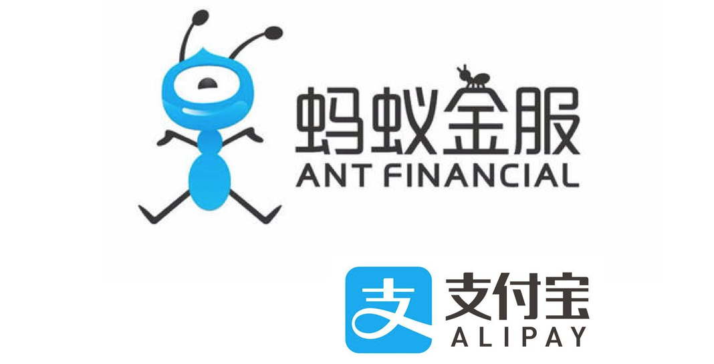

目前ServiceMesh在蚂蚁金服主站内部大量落地，包括支付宝的部分核心链路，落地的主要场景有：

- 多语言支持：目前除了支持 Java 之外，还支持 Golang，Python，C++，NodeJS 等语言的相互通信和服务治理；

- *应用无感知的升级*：关于这一点我们后面会有特别的说明；

- 流量控制：经典的Istio精准细粒度流量控制；

- RPC协议支持：和Istio不同，我们内部使用的主要是RPC协议；

- 可观测性

### ServiceMesh的实际性能数据

之前和一些朋友和客户交流过，目前在ServiceMesh方面大家最关心的是ServiceMesh的性能表现，包括对于这次蚂蚁金服ServiceMesh上双十一，大家最想看到的也是性能指标。

为什么大家对性能这么关注？

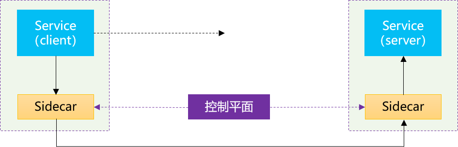

因为在ServiceMesh工作原理的各种介绍中，都会提到ServiceMesh是将原来的一次远程调用，改为走Sidecar（而且像Istio是客户端和服务器端两次Sidecar，如上图所示），这样一次远程调用就会变成三次远程调用，对性能的担忧也就自然而然的产生了：一次远程调用变三次远程调用，性能会下降多少？延迟会增加多少？

下图是我们内部的大促压测数据，对比带MOSN和不带MOSN的情况（实现相同的功能）。其中MOSN是我们蚂蚁金服自行开发的基于Golang的Sidecar/数据平面，我们用它替代了Envoy，在去年的演讲中我有做过详细的介绍：

SOFAMosn：https://github.com/sofastack/sofa-mosn

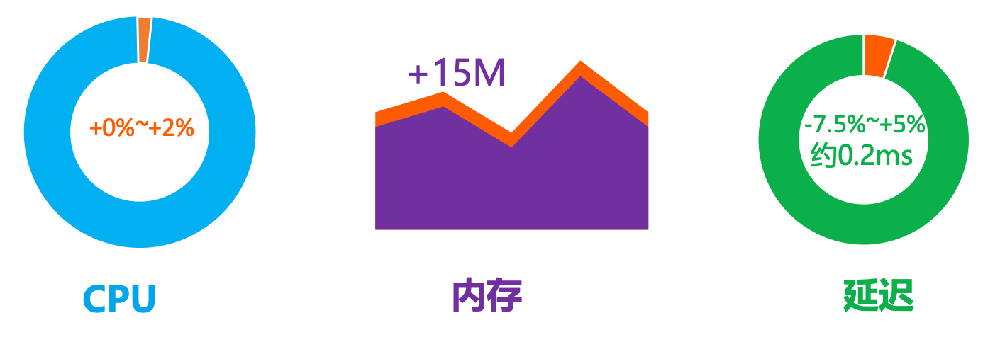

- CPU：CPU使用在峰值情况下增加8%，均值约增加2%。在最新的一次压测中，CPU已经优化到基本持平（低于1%）；
- 内存：带 Mosn 的节点比不带 Mosn 的节点内存占用平均多 15M；
- 延迟：延迟增加平均约0.2ms。部分场景带MOSN比不带MOSN RT增加约5%，但是有部分特殊场景带MOSN比不带MOSN RT反而降低7.5%。

这个性能表现，和前面"一次远程调用变三次远程调用"的背景和担忧相比有很大的反差。尤其是上面延迟的这个特殊场景，居然出现带MOSN（三次远程调用）比不带MOSN（一次远程调用） 延迟反而降低的情况。

是不是感觉**不科学**？

### ServiceMesh的基本思路

我们来快速回顾一下ServiceMesh实现的基本思路：

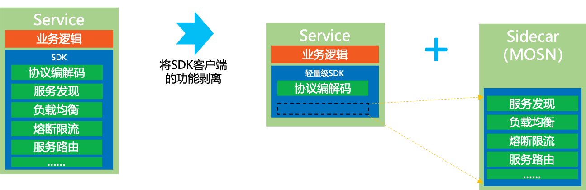

在基于SDK的方案中，应用既有业务逻辑，也有各种非业务功能。虽然通过SDK实现了代码重用，但是在部署时，这些功能还是混合在一个进程内的。

在ServiceMesh中，我们将SDK客户端的功能从应用中剥离出来，拆解为独立进程，以Sidecar的模式部署，让业务进程专注于业务逻辑：

- 业务进程：专注业务实现；无需感知Mesh
- Sidecar进程：专注服务间通讯和相关能力；与业务逻辑无关

我们称之为"**关注点分离**"：业务开发团队可以专注于业务逻辑，而底层的中间件团队（或者基础设施团队）可以专注于业务逻辑之外的各种通用功能。

通过Sidecar拆分为两个独立进程之后，业务应用和Sidecar就可以实现“**独立维护**”  ：我们可以单独更新/升级业务应用或者Sidecar。

### 性能数据背后的情景分析

我们回到前面的蚂蚁金服ServiceMesh落地后的性能对比数据：从原理上说，Sidecar拆分之后，原来SDK中的各种功能只是拆分到Sidecar中。整体上并没有增减，因此理论上说SDK和Sidecar性能表现是一致的。由于增加了应用和Sidecar之间的远程调用，性能不可避免的肯定要受到影响。

首先我们来解释第一个问题：为什么性能损失那么小，和"一次远程调用变三次远程调用"的直觉不符？

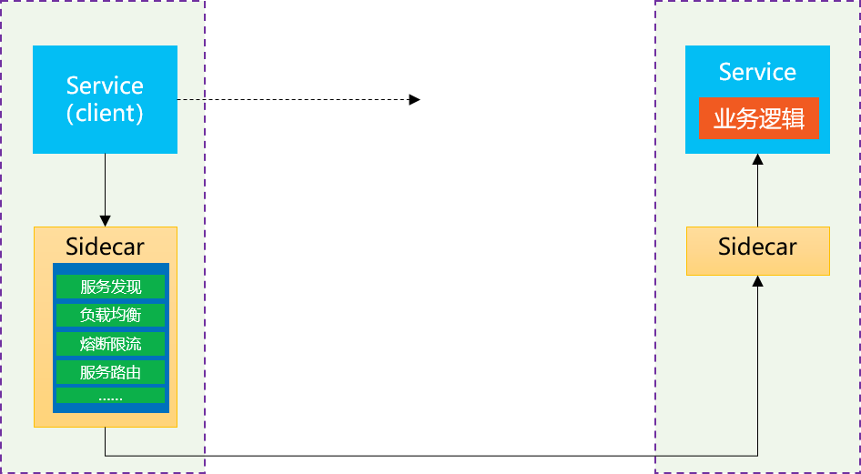

所谓的“直觉”，是将关注点都集中到了远程调用开销上，下意识的忽略了其他开销，比如SDK的开销、业务逻辑处理的开销，因此：

推导出来的结果就是有3倍的开销，性能自然会有非常大的影响。

但是，真实世界中的应用不是这样：

1. 业务逻辑的占比很高：Sidecar转发的资源消耗相比之下要低很多，通常是十倍百倍甚至千倍的差异。
2. SDK也是有消耗的：即使不考虑各种复杂的功能特性，仅仅就报文（尤其是body）序列化的编解码开销也是不低的。而且，客户端和服务器端原有的编解码过程是需要处理Body的，而在Sidecar中，通常都只是读取Header而透传Body，因此在编解码上要快很多。另外应用和Sidecar的两次远程通讯，都是走的Localhost而不是真实的网络，速度也要快非常多。

因此，在真实世界中，我们假定业务逻辑百倍于Sidecar的开销，而SDK十倍于Sidecar的开销，则：

推导出来的结果，性能开销从111增加到113，大约增加2%。这也就解释了为什么我们实际给出的ServiceMesh的CPU和延迟的性能损失都不大的原因。当然，这里我是刻意选择了100和10这两个系数来拼凑出2%这个估算结果，以迎合我们前面给出“均值约增加2%”的数据。这不是准确数值，只是用来模拟。

### 情理当中的意外惊喜

前面的分析可以解释性能开销增加不多的情景，但是，还记得我们的数据中有一个不科学的地方吗：“部分特殊场景带 SOFAMosn比不带 SOFAMosn RT反而降低7.5%”。

理论上，无论业务逻辑和SDK的开销比Sidecar的开销大多少，也就是不管我们怎么优化Sidecar的性能，其结果也只能接近零。无论如何不可能出现多两个Sidecar，CPU消耗和延迟反而降低的情况。

这个“不科学”是怎么出现的？

我们继续来回顾这个ServiceMesh的实现原理图：

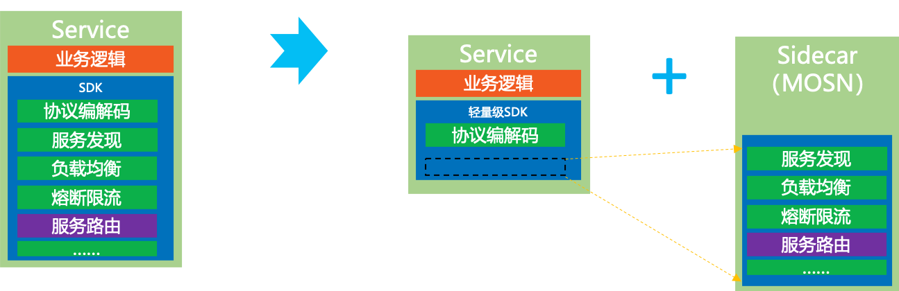

出现性能大幅提升的主要的原因，是我们在 SOFAMosn 上做了大量的优化，特别是路由的缓存。在蚂蚁金服内部，服务路由的计算和处理是一个异常复杂的逻辑，非常耗资源。而在最近的优化中，我们为服务路由增加了缓存，从而使得服务路由的性能得到了大幅提升。因此：

> 备注：这里我依然是刻意拼凑出-7%这个估算结果，请注意这不是准确数值，只是用来模拟示意。

也许有同学会说，这个结果不“公平”：这是优化了的服务路由实现在PK没有优化的服务路由实现。的确，理论上说，在Sidecar中做的任何性能优化，在SDK里面同样可以实现。但是，在SDK上做的优化需要等整个调用链路上的应用全部升级到优化后的SDK之后才能完全显现。而在传统SDK方案中，SDK的升级是需要应用配合，这通常是一个漫长的等待过程。很可能代码优化和发版一周搞定，但是让全站所有应用都升级到新版本的SDK要花费数月甚至一年。

此时 ServiceMesh 的优点就凸显出来了：ServiceMesh下，业务应用和 Sidecar 可以“**独立维护**” ，我们可以很方便的在业务应用无感知的情况下升级Sidecar。因此，任何Sidecar的优化结果，都可以非常快速的获取收益，从而推动我们对Sidecar进行持续不断的升级。

前面这个延迟降低7%的例子，就是一个非常经典的故事：在中秋节前后，我们开发团队的同学，不辞辛苦加班加点的进行压测和性能调优，在一周之内连续做了多次性能优化，连发了多个性能优化的小版本，以“小步快跑”的方式，最后拿到了这个令大家都非常开心的结果。

总结：**持续不断的优化 + 无感知升级 = 快速获得收益**  

这是一个意外惊喜，但又在情理之中：这是SDK下沉到基础设施并具备独立升级能力后带来的红利。

也希望这个例子，能够让大家更深刻的理解 ServiceMesh 的基本原理和优势。

## 大规模落地的困难和挑战

当Servicemesh遇到蚂蚁金服的规模，困难和挑战也随之而来：当规模达到一定程度时，很多原本很小的问题都会急剧放大。后面我将在性能、容量、稳定性、可维护性和应用迁移几个方面给大家介绍我们遇到的挑战和实践。

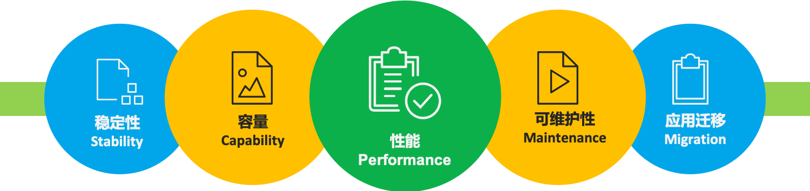

### 数据平面的优化

在数据平面上，蚂蚁金服采用了自行研发的基于Golang的方案：SOFAMosn，简称MOSN。关于为什么选择全新开发SOFAMosn，而不是直接使用Envoy的原因，在去年QCon的演讲中我有过详细的介绍，有兴趣可以了解。

前面我们给出的性能数据，实际上主要是数据平面的性能，也就是作为Sidecar部署的SOFAMosn的性能表现。从数据上看MOSN目前的性能表现还是很不错的，这背后是我们在MOSN上做了非常多的性能优化。

- CPU优化：在SOFAMosn中我们进行了Golang 的 writev 优化，将多个包拼装一次写以降低 syscall 调用。测试中发现，Golang 1.9 的时候 writev 有内存泄露的bug。当时debug的过程非常的辛苦...... 详情见我们当时给 Golang 提交的PR： https://github.com/golang/go/pull/32138

- 内存优化：在内存复用，我们发现报文直接解析会产生大量临时对象。SOFAMosn 通过直接复用报文字节的方式，将必要的信息直接通过 unsafe.Pointer 指向报文的指定位置来避免临时对象的产生。

- 延迟优化：前面我们谈到Sidecar是通过只解析Header而透传Body来保证性能的。针对这一点，我们进行了协议升级，以便快速读取header。比如我们使用的 TR 协议请求头和 Body 均为 hessian 序列化，性能损耗较大。而 Bolt 协议中 Header 是一个扁平化map，解析性能损耗小。因此我们升级应用改走 Bolt 协议来提升 Sidecar 转发的性能。这是一个典型的针对 Sidecar 特性而做的优化。

此外还有前面特意重点介绍的路由缓存优化（也就是那个不科学的延迟降低7%的场景）。犹豫蚂蚁内部路由的复杂性（一笔请求经常需要走多种路由策略最终确定路由结果目标），通过对相同条件的路由结果做秒级缓存，我们成功将某核心链路的全链路 RT 降低 7%。

这里我简单给出了上述几个典型案例，双十一之后会有更多更详细的SOFAMosn资料分享出来，有兴趣的同学可以多关注。

在双十一过后，我们也将加大 SOFAMosn 在开源上的投入，将 SOFAMosn 做更好地模块化地抽象，并且将双十一中经过考验的各种优化放进去，我们预计在 2020 年的 1 月底可以发布第一个优化后的版本。

### Mixer的性能优化

Mixer的性能优化是个老生常谈的话题，基本上只要谈及 Istio 的性能，都避无可避：

**Mixer的性能问题，一直都是Istio中最被人诟病的地方**。

尤其在Istio 1.1/1.2版本之后，引入 Out-Of-Process Adapter 之后，更是雪上加霜。

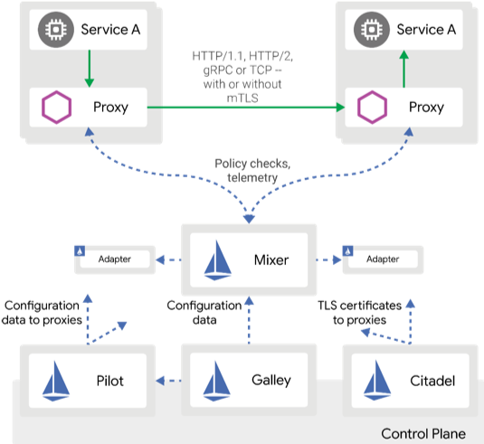

原来Sidecar和Mixer之间的远程调用已经严重影响性能，在引入 Out-Of-Process Adapter 之后又在 Traffic 流程中引入了新的远程调用，性能更加不可接受。

从落地的角度看，**Mixer V1** 糟糕至极的性能，已经是“生命无法承受之重”。对于一般规模的生产级落地而言，Mixer性能已经是难于接受，更不要提大规模落地……

Mixer V2方案则给了社区希望：将Mixer合并进Sidecar，引入web assembly进行Adapter扩展，这是我们期待的Mixer落地的正确姿势，是Mixer的未来，是Mixer的"诗和远方"。然而社区望穿秋水，但 Mixer V2 迟迟未能启动，长期处于 In Review 状态，远水解不了近渴。

因此在Mixer落地上，我们只能接受妥协方案，所谓"眼前的苟且"：一方面我们弃用Mixer v1，改为在 SOFAMosn 中直接实现功能；另一方面我们并没有实现Mixer V2的规划。实际的落地方式是：我们只在 SOFAMosn 中提供最基本的策略检查功能如限流，鉴权等，另外可观测性相关的各种能力也都是从 SOFAMosn 直接输出。

### Pilot的性能优化

在Istio中，Pilot是一个被Mixer掩盖的重灾区：长期以来大家的性能关注点都在Mixer，表现糟糕而且问题明显的Mixer一直在吸引火力。但是当选择放弃Mixer（典型如官方在Istio新版本中提供的关闭Mixer的配置开关）之后，Pilot的性能问题也就很快浮出水面。

这里简单展示一下我们在Pilot上做的部分性能优化：

- 序列化优化：我们全面使用types.Any类型，弃用types.Struct类型，序列化性能提升70倍，整体性能提升4倍。Istio最新的版本中也已经将默认模式修改为types.Any类型。我们还进行了CR(CustomResource)的序列化缓存，将序列化时机从Get/List操作提前至事件触发时，并缓存结果。大幅降低序列化频率，压测场景下整体性能提升3倍，GC频率大幅下降

- 预计算优化：支持Sidecar CRD维度的CDS /LDS/RDS 预计算，大幅降低重复计算，压测场景下整体性能提升6倍；支持Gateway维度的CDS / LDS / RDS 预计算；计算变更事件的影响范围，支持局部推送，减少多余的计算和对无关sidecar的打扰

- 推送优化：支持运行时动态降级，支持熔断阈值调整，限流阈值调整，静默周期调整，日志级别调整；实现增量ADS接口，在配置相关处理上，sidecar cpu减少90%，pilot cpu减少42%

这里简单解释一下，Pilot在推送数据给Sidecar时，代码实现上的有些简单：Sidecar连接上Pilot时；Pilot就给Sidecar下发xDS数据。假定某个服务有100个实例，则这100个实例的Sidecar连接到Pilot时，每次都会进行一次下发数据的计算，然后进行序列化，再下发给连上来的Sidecar。下一个sidecar连接上来时，重复这些计算和序列化工作，而不管下发的数据是否完全相同。我们称之为“千人千面”。

而实际中，同一个服务往往有多个实例，Pilot下发给这些实例的Sidecar的数据往往是相同的。因此我们做了优化，提前做预计算和序列化并缓存结果，以便后续重复的实例可以直接从缓存中取。因此，“千人千面”就可以优化为“千人百面”或者“千人十面”，从而大幅提高性能。

另外，对于整个ServiceMesh体系，Pilot至关重要。因此Pilot本身也应该进行保护，也需要诸如熔断/限流等特性。

### ServiceMesh的运维

在ServiceMesh的运维上，我们继续坚持“线上变更三板斧”原则。这里的变更，包括发布新版本，也包括修改配置，尤其特指修改Istio的CRD。

线上变更“三板斧”指的是：

1. 可灰度：任何变更，都必须是可以灰度的，即控制变更的生效范围。先做小范围内变更，验证通过之后才扩大范围。
2. 可监控：在灰度过程中，必须能做到可监控，能了解到变更之后对系统的应用。如果没有可监控，则可灰度也就没有意义了。
3. 可回滚：当通过监控发现变更后会引发问题时，还需要有方法可以回滚。

我们在这里额外引入了一个名为“ScopeConfig”的配置变更生效范围的控制能力，即配置变更的灰度。什么是配置变更的灰度呢？

Istio的官方实现，默认修改配置（Istio API 对应的各种CRD）时新修改的配置会直接全量推动到所有生效的Sidecar，即配置变更本身无法灰度。注意这里和平时说的灰度不同，比如最常见的场景，服务A调用服务B，并假定服务A有100个实例，而服务B有10个v1版本的服务实例正在进行。此时需要更新服务B到新的v2版本。为了验证v2新版本，我们通常会选择先上线一个服务B的v2版本的新实例，通过Istio进行流量百分比拆分，比如切1%的流量到新的v2版本的，这被称为“灰度发布”。此时新的“切1%流量到v2”的CRD被下发到服务A的Sidecar，这100个Sidecar中的每个都会执行该灰度策略。如果v2版本有问题不能正常工作，则只影响到1%的流量，即此时Istio的灰度控制的是CRD配置生效之后Sidecar的流量控制行为。

但是，实际生产中，配置本身也是有风险的。假设在配置Istio CRD时出现低级错误，不小心将新旧版本的流量比例配反了，错误配置成了99%的流量去v2版本。则当新的CRD配置被下发到全部100个服务A的实例时并生效时，Sidecar控制的流量就会发生非常大的变化，造成生产事故。

为了规避这个风险，就必须引入配置变更的范围控制，比如将新的CRD配置下发到少数Sidecar，验证配置无误后再扩展到其他Sidecar。

### 应用平滑迁移的终极方案

在ServiceMesh落地的过程中，现有应用如何平滑迁移到ServiceMesh，是一个至关重要的话题。典型如基于传统微服务框架如SpringCloud/Dubbo的应用，如何逐个（或者分批）的迁移到ServiceMesh上。

蚂蚁金服在去年进行落地实践时，就特别针对应用平滑迁移进行了深入研究和探索。这个问题是 ServiceMesh 社区非常关注的核心落地问题，今天我们重点分享。

在今年9月份的云栖大会上，蚂蚁推出了双模微服务的概念，如下图所示：

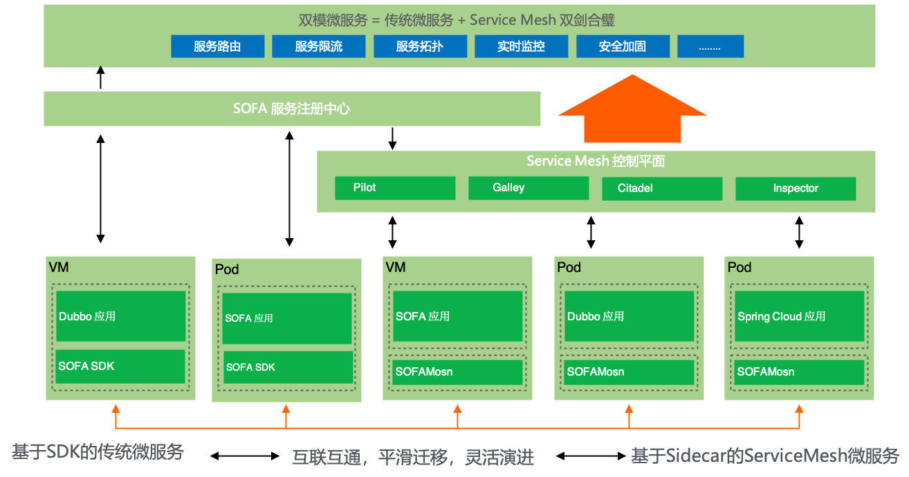

“双模微服务”是指传统微服务和 ServiceMesh 双剑合璧，即“基于SDK的传统微服务”可以和“基于Sidecar的ServiceMesh微服务”实现下列目标：

- 互联互通：两个体系中的应用可以相互访问
- 平滑迁移：应用可以在两个体系中迁移，对于调用该应用的其他应用，做到透明无感知
- 灵活演进：在互联互通和平滑迁移实现之后，我们就可以根据实际情况进行灵活的应用改造和架构演进

双模还包括对应用运行平台的要求，即两个体系下的应用，既可以运行在虚拟机之上，也可以运行在容器/k8s之上。

怎么实现这么一个美好的双模微服务目标呢？

我们先来分析一下传统微服务体系和ServiceMesh体系在服务注册/服务发现/服务相关的配置下发上的不同。

首先看传统微服务体系，其核心是服务注册中心/配置中心，应用通过引用SDK的方式来实现对接各种注册中心/配置中心。通常不同的注册中心/配置中心都有各自的实现机制和接口协议，SDK和注册中心/配置中心的交互方式属于内部实现机制，并不通用。

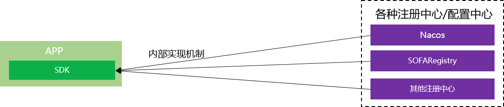

优点是支持海量数据（十万级别甚至百万级别），具备极强的分发能力，而且经过十余年间的打磨，稳定可靠可谓久经考验。市面上有很多成熟的开源产品，各大公司也都有自己的稳定实现。如阿里集团的Nacos，蚂蚁金服的SOFARegistry。

SOFARegistry：https://github.com/sofastack/sofa-registry

缺点是注册中心/配置中心与SDK通常是透传数据，即注册中心/配置中心只进行数据的存储和分发。大量的控制逻辑需要在SDK中实现，而SDK是嵌入到应用中的。因此，任何变更都需要改动SDK并要求应用升级。

再来看看ServiceMesh方案，以Istio为例：

ServiceMesh的优点是引入了控制平面（在Istio中具体指Pilot组件），通过控制平面来提供强大的控制逻辑。而控制平面的引入，MCP/xDS等标准协议的制订，实现了数据源和下发数据的解耦。即存储于注册中心/配置中心（在Istio中体现为k8s api server + Galley）的数据可以有多种灵活的表现形式，如CRD形式的Istio API，通过运行于Pilot中的Controller来实现控制逻辑和格式转换，最后统一转换到xDS/UDPA。这给API的设计提供了非常大的施展空间，极具灵活度，扩展性非常好。

缺点也很明显，和成熟的注册中心/配置中心相比，支持的容量有限，下发的性能和稳定性相比之下有很大差距。

控制平面和传统注册中心/配置中心可谓各有千秋，尤其他们的优缺点是互补的，如何结合他们的优势？

此外，**如何打通两个体系是ServiceMesh社区的老大难问题**。尤其是缺乏标准化的社区方案，只能自行其是，各自为战。

最近，在综合了过去一年多的思考和探索之后，蚂蚁金服和阿里集团的同事们共同提出了一套完整的解决方案，我们戏称为“终极方案”：希望可以通过这个方案打通传统微服务体系和ServiceMesh体系，彻底终结这个困扰已久的问题。

这个方案的核心在于： **以MCP和xDS/UDPA协议为基础，融合控制平面和传统注册中心/配置中心**。

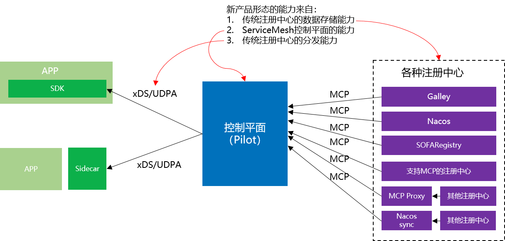

如上图所示，如果我们将融合控制平面和传统注册中心/配置中心而来的新的产品形态视为一个整体，则这个新产品形态的能力主要有三块：

1. 传统注册中心的数据存储能力：支持海量数据
2. ServiceMesh控制平面的能力：解耦之后API设计的弹性和灵活度
3. 传统注册中心的分发能力：性能、速度、稳定性

这个新的产品形态可以理解为“带控制平面的注册中心/配置中心”，或者“存储/分发能力加强版的控制平面”。名字不重要，重要的是各节点的**通讯交互协议必须标准化**：

- MCP协议：MCP协议是Istio中用于Pilot和Galley之间同步数据的协议，源自xDS协议。我们设想通过MCP协议将不同源的注册中心集成起来，目标是聚合多注册中心的数据到Pilot中，实现打通异构注册中心（未来也会用于多区域聚合）。  
- xDS/UDPA协议：xDS协议源自Envoy，是目前数据平面的事实标准，UDPA是正在进行中的基于xDS协议的标准化版本。Sidecar基于xDS/UDPA协议接入控制平面，我们还有进一步的设想，希望加强SDK方案，向Istio的功能靠拢，具体表现为SDK支持xDS协议（初期版本先实现最小功能集）。目标是希望在对接控制平面的前提下，应用可以在ServiceMesh和SDK方案之间自由选择和迁移。

基于这个思路，我们给出如下图所示的解决方案，希望最大限度的整合传统微服务框架和ServiceMesh。其基本指导原则是：**求同存异**，**保持兼容**。  

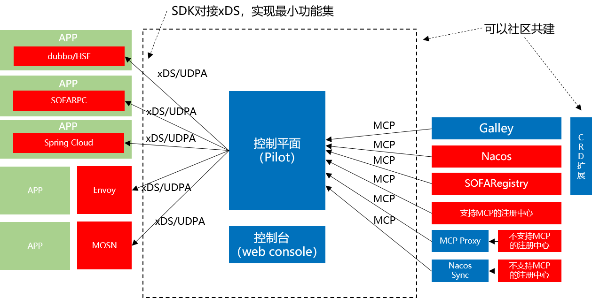

上图中，蓝色部分是通用的功能模块，我们希望可以和社区一起共建。红色部分是不兼容的功能模块，但是保持API兼容。

具体说，右边是各种注册中心（配置中心同理）：

- Galley和底下的k8s API Server可以视为一个特殊的注册中心，这是Istio的官方方式。
- Nacos/SOFARegistry 是阿里集团和蚂蚁金服的注册中心，支持海量规模。我们计划添加MCP协议的支持，直接对接Pilot。
- 其他的注册中心，也可以通过提供MCP协议支持的方式，接入到这个方案中
- 对于不支持MCP的注册中心，可以通过开发一个MCP Proxy模块以适配器模式的方式间接接入。当然最理想的状态是出现成熟的通用开源方案来统一解决，比如Nacos Sync 有计划做类似的事情。

左边是数据平面：

- ServiceMesh体系下的Sidecar（如Envoy和我们蚂蚁金服的MOSN）目前都已经支持xDS/UDPA。
- 相对来说，这个方案中比较“脑洞”的是在SDK方案如Spring Cloud/Dubbo/SOFARPC中提供xDS的支持，以便对接到已经汇总了全局数据的控制平面。从这个角度说，支持xDS的SDK方案，也可以视为广义的数据平面。我们希望后面可以推动社区朝这个方向推进，短期可以先简单对接，实现xDS的最小功能集；长期希望SDK方案的功能能向Istio看齐，实现更多的xDS定义的特性。

这个方案对运行平台没有任何特别要求，只要网络能通，应用和各个组件可以灵活选择运行在容器（k8s）中或虚拟机中。

需要特别强调的是，这个方案最大的优点在于它是一个**高度标准化的社区方案**：通过MCP协议和xDS协议对具体实现进行了解耦和抽象，整个方案没有绑定到任何产品和供应商。因此，我们希望这个方案不仅仅可以用于阿里集团和蚂蚁金服，也可以用于整个 Istio 社区。阿里集团和蚂蚁金服目前正在和Istio社区联系，我们计划将这个方案贡献出来，并努力完善和加强Pilot的能力，使之能够满足我们上面提到的的美好愿景：融合控制平面和传统注册中心/配置中心的优点，打通传统微服务框架和ServiceMesh，让应用可以平滑迁移灵活演进。

希望社区认可这个方案的同学可以参与进来，和我们一起努力来建设和完善它。

## 是否采用ServiceMesh的建议

在过去一年间，这个问题经常被人问起。借这个机会，结合过去一年中的实践，以及相比去年此时更多的心得和领悟，希望可以给出一些更具参考价值的建议。

### 建议一：有没有直接痛点

有没有短期急迫需求，通常取决于当前有没有迫切需要解决的痛点。

在ServiceMesh的发展过程中，有两个特别清晰而直接的痛点，它们甚至对ServceMesh的诞生起了直接的推动作用：

1. 多语言支持

	

	这是SDK方案的天然局限，也是ServiceMesh的天然优势。需要支持的编程语言越多，为每个编程语言开发和维护一套SDK的成本就越高，就有越多的理由采用ServiceMesh。

2. 类库升级困难

	

	同样，这也是SDK方案的天然局限，也是ServiceMesh的天然优势（还记得前面那个不科学的-7%吗？）。SDK方案中类库和业务应用打包在一起，升级类库就不得不更新整个业务应用，而且是需要更新所有业务团队的所有应用。在大部分公司，这通常是一个非常困难的事情，而且每次SDK升级都要重复一次这种痛苦。

而且，这两个痛点有可能会同时存在：有多个编程语言的类库需要升级版本......

所以，第一个建议是先检查是否存在这两个痛点。

### 建议二：老应用升级改造

ServiceMesh的无侵入性，在老应用升级改造，尤其是希望少改代码甚至完全不改代码的情况下，堪称神器。

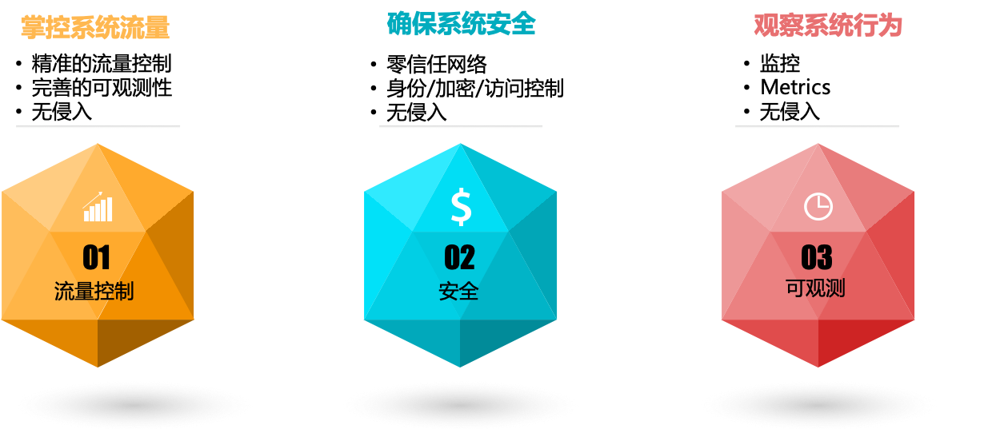

所以，第二个建议是，如果有老应用无改动升级改造的需求，对流量控制、安全、可观测性有诉求，则可以考虑采用 ServiceMesh。

### 建议三：维护统一的技术栈

这个建议仅仅适用于技术力量相对薄弱的企业，这些企业普遍存在一个问题：技术力量不足，或者主要精力投放在业务实现，导致无力维护统一的技术栈，系统呈现烟囱式架构。  

传统烟囱式架构的常见问题有：

- 重复建设，重复造轮子
- 不同时期，不同厂商，用不同的轮子
- 难以维护和演进，后续成本高昂
- 掌控力不足，容易受制于人

这种情况下，建议引入 ServiceMesh 技术，通过 ServiceMesh 将非业务逻辑从应用剥离并下沉的特性，来统一整个公司的技术栈。

特别需要强调的是，对于技术力量不足、严重依赖外包和采购的企业，尤其是银行/保险/证券类金融企业，引入 ServiceMesh 会有一个额外的特殊功效，至关重要：

**将乙方限制在业务逻辑的实现上**

即企业自行建设和控制 ServiceMesh，作为统一的技术栈，在其上再开发运行业务应用。由于这些业务应用运行在 ServcieMesh 之上，因此只需要实现业务逻辑，非业务逻辑的功能由 ServcieMesh 来提供。通过这种方式，可以避免乙方公司借项目机会引入各种技术栈而造成技术栈混乱，导致后期维护成本超高；尤其是要避免引入私有技术栈，因为私有技术栈会造成对甲方事实上的技术绑定（甚至技术绑架）。

### 建议四：云原生落地

最后一个建议，和云原生有关。在去年的QCon演讲中，我曾经提到我们在探索 kubernetes / servicemesh / serverless 结合的思路。在过去一年，蚂蚁金服一直在云原生领域做深度探索，也有一些收获。其中，有一点我们是非常明确的：**Mesh化是云原生落地的关键步骤**。

下图展示了蚂蚁金服在云原生落地方面的基本思路：

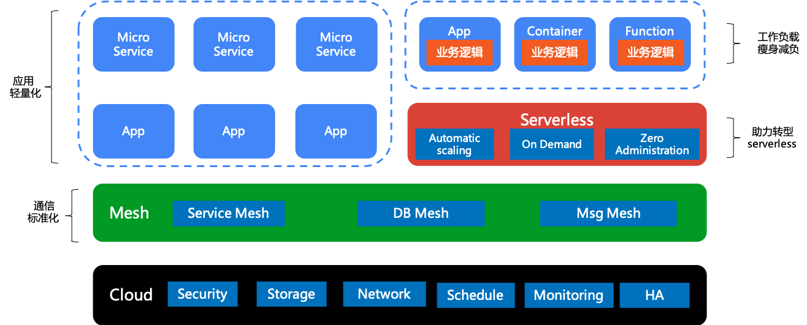

- 最下方是云，以kubernetes为核心，关于这一点社区基本已经达成共识：kubernetes 就是云原生下的操作系统
- 在kubernetes之上，是Mesh层。不仅仅有我们熟悉的 ServiceMesh，还有诸如Database Mesh和Message Mesh等类似的其他 Mesh 产品形态，这些Mesh组成了一个标准化的通信层。
- 运行在各种 Mesh 的应用，不管是微服务形态，还是传统非微服务形态，都可以借助Mesh的帮助实现应用轻量化。非业务逻辑的各种功能被剥离到Mesh中后，应用得以“瘦身减负”。
- 瘦身之后的应用，其内容主要是业务逻辑实现。这样的工作负载形式，更适合 serverless 的要求，为接下来转型 serverless 做好准备。

所以，我的最后一个建议是，请结合你的长远发展方向考虑：**如果云原生是你的诗和远方，那么ServiceMesh 就是必由之路**。  

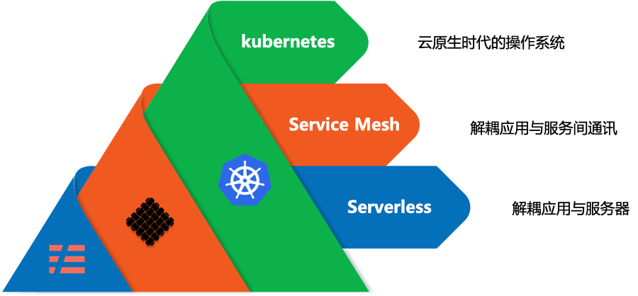

kubernetes / servicemesh / serverless 是当下云原生落地实践的三驾马车，相辅相成，相得益彰。

### ServiceMesh 的核心价值

在最后，重申一下 ServiceMesh 的核心价值：

**实现业务逻辑和非业务逻辑的分离**

前面的关于要不要采用 ServiceMesh 四个建议，归根到底，最终都是对这个核心价值的延展。只有在分离业务逻辑和非业务逻辑并以Sidecar形式独立部署之后，才有了这四个建议所依赖的特性：

- ServiceMesh的多语言支持和应用无感知升级
- 无侵入的为应用引入各种高级特性如流量控制，安全，可观测性
- 形成统一的技术栈
- 为非业务逻辑相关的功能下沉到基础设施提供可能，帮助应用轻量化，使之专注于业务，进而实现应用云原生化。

希望大家在理解 ServiceMesh 的核心价值之后，再来权衡要不要采用ServiceMesh，也希望我上面给出的四个建议可以对大家的决策有所帮助。

## 总结

在今天的内容中，首先介绍了蚂蚁金服ServiceMesh的发展历程，给大家展示了双十一大规模落地的规模和性能指标，并解释了这些指标背后的原理。然后分享了蚂蚁金服在ServiceMesh大规模落地中遇到的困难和挑战，以及我们为此做的工作，重点介绍了应用平滑迁移的所谓“终极方案”；最后结合蚂蚁金服在云原生和ServiceMesh上的实践心得，对于是否应该采用ServiceMesh给出了几点建议。

目前蚂蚁金服正在静待今年的双十一大考，这将是 ServiceMesh 的历史时刻：全球最大规模的ServiceMesh集群，ServiceMesh 首次超大规模部署......一切都是如此的值得期待。

请对ServiceMesh感兴趣的同学稍后继续关注，预期在双十一之后会有一系列的分享活动：

- 经验分享：会有更多的技术分享，包括落地场景，经验教训，实施方案，架构设计…
- 开源贡献：蚂蚁金服会将落地实践中的技术实现和方案以不同的方式回馈社区，推动Servicemesh落地实践。目前这个工作正在实质性的进行中， 请留意我们稍后公布的消息。
- 商务合作：蚂蚁金服即将推出ServiceMesh产品，提供商业产品和技术支持，提供金融级特性，欢迎联系
- 社区交流：Servicemesher技术社区继续承担国内Servicemesh布道和交流的重任；欢迎参加我们今年正在持续举办的ServiceMesh Meetup活动。

今年是我在QCon演讲的第三年，这三年中的三次演讲，可以说是从一个侧面反映了国内ServiceMesh发展的不同阶段：

- 2017年，国内ServiceMesh一片蛮荒的时候，我做了ServiceMesh的**布道**，介绍了ServiceMesh的原理，喊出了“下一代微服务”的口号
- 2018年，以蚂蚁金服为代表的国内互联网企业，陆陆续续开始了 ServiceMesh 的落地探索，所谓摸着石头过河不外如是。第二次演讲我分享了蚂蚁金服的**探索**性实践，介绍了蚂蚁金服的ServiceMesh落地方式和思路。
- 今天，2019年，第三次演讲，蚂蚁金服已经建立起了全球最大规模的ServiceMesh集群并准备迎接双十一的严峻挑战，这次的标题也变成了**深度实践**。

从布道，到探索，再到深度实践，一路走来已是三年，国内的ServiceMesh发展，也从籍籍无名，到炙手可热，再到理性回归。ServiceMesh的落地，依然还存在非常多的问题，距离普及还有非常远的路要走。然而ServiceMesh的方向，已经被越来越多的人了解和认可。

高晓松说："生活不止眼前的苟且，还有诗和远方"。对于ServiceMesh这样的新技术来说，也是如此。

感谢鸣谢 InfoQ 和 Qcon 提供的机会，让我得以每年一次的为大家分享 ServiceMesh 的内容。2020年，蚂蚁金服将继续推进和扩大 ServiceMesh 落地的规模，继续引领 ServiceMesh 在金融行业的实践探索。希望明年，可以有更多更深入的内容带给大家！

