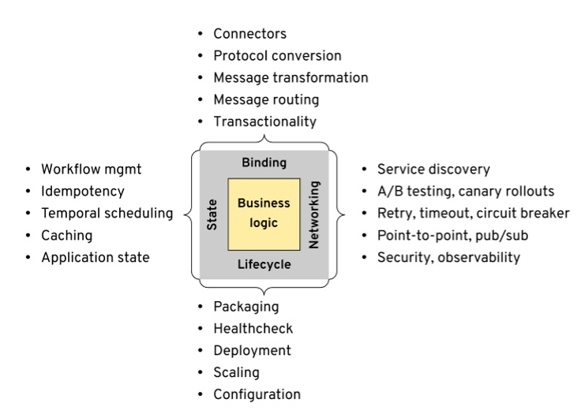

+++
title = "Reactive：为Mecha构建坚实基础"
date = "2020-05-08"
draft = true

# Authors. Comma separated list, e.g. `["Bob Smith", "David Jones"]`.

authors = ["敖小剑"]

# Publication type.

# Legend:

# 0 = Uncategorized
# 1 = Conference proceedings
# 2 = Journal
# 3 = Work in progress
# 4 = Technical report
# 5 = Book
# 6 = Book chapter
publication_types = ["4"]

# Publication name and optional abbreviated version.

publication = "技术前沿探索"
publication_short = "技术前沿探索"

# Abstract and optional shortened version.
abstract = "Mecha下分布式能力众多，如何为Mecha构建一个坚实的底层传输机制和编码模式？"
abstract_short = "Mecha下分布式能力众多，如何为Mecha构建一个坚实的底层传输机制和编码模式？"

# Featured image thumbnail (optional)

image_preview = ""

# Is this a featured publication? (true/false)
featured = false

# Projects (optional).

#   Associate this publication with one or more of your projects.
#   Simply enter the filename (excluding '.md') of your project file in `content/project/`.
projects = []

tags = ["Mecha", "云原生", "Reactive"]

# Links (optional).
url_pdf = ""
url_preprint = ""
url_code = ""
url_dataset = ""
url_project = ""
url_slides = ""
url_video = ""
url_poster = ""
url_source = ""

# Custom links (optional).
#   Uncomment line below to enable. For multiple links, use the form `[{...}, {...}, {...}]`.

url_custom = []

# Does the content use math formatting?

math = false

# Does the content use source code highlighting?

highlight = true

# Featured image
# Place your image in the `static/img/` folder and reference its filename below, e.g. `image = "example.jpg"`.

[header]
image = "headers/talk/202004-mecha-mesh-through-to-the-end.jpg"
caption = ""
+++

## 前言

在 ["Mecha：将Mesh进行到底"](../202004-mecha-mesh-through-to-the-end/) 一文中，我给大家介绍 Multiple Runtime 和 Mecha 的新理念，以及微软Dapr这个参考项目，接下来我将就Mecha的实现和落地做进一步的分析和讨论。由于目前实践  Multiple Runtime  和 Mecha 理念的开源项目暂时还只有微软Dapr，而且Dapr项目也处于非常早期的状态。因此关于如何实践  Multiple Runtime / Mecha 还是一个有待探索的全新领域，这里

## Mecha的挑战

Mecha需要实现的功能：如此之多

我们先回顾一下，Bilgin Ibryam 首先分析并总结了分布式应用的四大需求:

