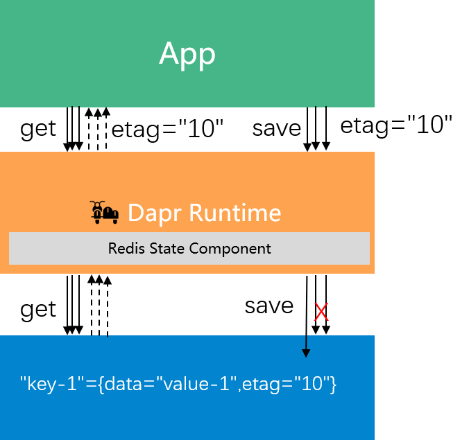

## 快速回顾：什么是Dapr？

Dapr 的全称是 "Distributed Application Runtime"，即 "分布式应用运行时"。Dapr 是一个开源项目，由微软发起，目前正在申请成为CNCF孵化器项目。


本文是 Dapr 的进阶内容分享和讨论，因此在本文中我假定读者对 **Dapr** 已有初步的了解，如果之前没有接触过 Dapr，建议在阅读本文之前先阅读这篇 Dapr 的介绍文章：

[Dapr v1.0展望：从servicemesh到云原生](https://skyao.net/talk/202103-dapr-from-servicemesh-to-cloudnative/) 

在这里我们对 Dapr 进行一个快速而简单的介绍。首先来看ServiceMesh，和传统RPC框架相比，servicemesh的创新之处在于引入了 Sidecar 模式：


而 Servicemesh 只解决了服务间通讯的需求，而现实中的分布式应用存在更多的需求，Multi-Runtime 理论将这些需求归结为四大类：


在 Servicemesh 初步成功，Sidecar 模式被云原生社区普遍接受之后，效仿 Servicemesh，将应用需要的其他分布式能力外移到各种 Runtime 变成为一个趋势。这些 Runtime 会逐渐整合，最后和应用 Runtime 共同组成微服务，形成所谓的 "Multi-Runtime" 架构，又称 Mecha：


Dapr 项目是目前业界第一个 Multi-Runtime  / Mecha 实践项目，下图来自 Dapr 官方，比较完善的概括了 Dapr 的能力和层次架构：


Dapr 的愿景：any language, any framework, anywhere。

> 划重点: 请特别注意这里的 **anywhere** 一词，这是 Dapr 的核心价值之一，本文后面要对此详细展开。

## 本质差异：Dapr vs ServiceMesh

在快速回顾完成 Dapr 之后，我们来正式展开本文的内容。首先需要回答这样一个问题：

**Dapr 和 ServiceMesh 有什么区别？**

### 核心都是Sidecar模式

这个问题也是大多数读者在了解 Dapr 之后最常问到的一个问题，原因是 Dapr 和 Servicemesh 在架构上实在太像了，都是以 Sidecar 模式为核心：


Dapr 的基本思路也是和 Servicemesh 保持一致：通过引入 sidecar来实现 **关注点分离** + **独立维护**。 


### Dapr有更多的功能和使用场景

Dapr 和 Servicemesh 最明显的不同之处是 **Dapr 的场景比 Servicemesh 要复杂**: Servicemesh关注于服务间通讯，即下图中虚线部分；而 Dapr 除了服务间通讯之外，还适用于诸多其他的场景，如状态存储、消息的发布订阅、资源绑定、配置等。


下图是 Dapr 目前已有的构建块和他们提供的能力的简单描述（其中 Service Invocation 对应 Servicemesh 的服务间通讯能力）：


### 本质差异在于工作模式

功能的差异是很直白的，容易理解。但是，如果只是功能上的差异，那么问题来了：

**如果 Servicemesh 也提供同样的能力，是不是就和 Dapr 一样了？**

我们来看 Envoy 的功能，Envoy 原生支持 HTTP1.1/REST 和 HTTP2 / gRPC 协议，社区增加了对 Dubbo、Thrift 等RPC协议的支持，而 Envoy 也在提供对 Kafka、Redis 等原生协议的支持，未来 Envoy 提供更多原生协议支持也是可以预期的。那是不是意味着随着功能的增加，以 Envoy、Istio 为代表的 Servicemesh 就和 Dapr 一样了呢？

答案当然是否定的—— Dapr 和 Servicemesh 的本质差异在于其**工作模式**：

- Servicemesh 的工作模式是**原协议转发**

   

   Servicemesh 的 Sidecar 接收到是 app 发出的原生协议的请求，然后转发给另一端的 Sidecar 进而转发给目标 app；或者，对于 redis/kafka 等的支持是 Sidecar 将原协议转发给 redis/kafka 服务器。

   在这个过程中，Servicemesh 的 Sidecar 原则上不修改协议，只做**转发**（"Forwarding"），Sidecar 扮演的是**代理**（"Proxy"）的角色。

- Dapr 的工作模式是**能力抽象**

   

   Dapr Sidecar 接收到是 app 发出的遵从标准API的请求，这些标准API对能力进行了抽象；对于服务间通讯的场景，Sidecar 会将请求转发给另一端的 Sidecar；对于服务间通讯之外的能力的支持则需要将标准API转换为底层组件对应的原生协议。

   在这个过程中，Sidecar 原则上对应用只暴露抽象之后的分布式能力，屏蔽了底层具体的实现和通讯协议，不做"转发"而是提供"能力"，sidecar 扮演的是**运行时**("Runtime") 的角色。

### 设计目标不同：Dapr强调可移植性

工作模式不同的背后，反应的是 Dapr 和 Servicemesh 在设计目标上的差异：

- Servicemesh 的主要设计目标是 **低侵入**，采用原协议转发的方式可以尽可能的降低对应用的侵入，为了达到无侵入的目标甚至采用了流量劫持的方式。
- Dapr 的主要设计目标是 **可移植性**，即在跨云跨平台的前提下实现无厂商绑定，采用的方式是在将分布式能力抽象为标准API，并在各种开源项目和云平台上提供这套标准API的不同实现，从而达到在不同平台上运行的目标，这即 Dapr 愿景中的 "**anywhere**".

总结一下 Dapr 和 Servicemesh 的差异以及适用场景：

- Servicemesh 强调对应用无侵入，支持原协议转发和流量劫持，不仅仅适用于新应用，相比 Dapr 也更加适用于老应用。
- Dapr 提供 "标准API"、"语言SDK" 和 "Runtime"，需要应用进行适配（这意味着老应用需要进行改造），侵入性比较大。因此 Dapr 更适合新应用开发 （所谓 Green Field），对于现有的老应用（所谓 Brown Field）则需要付出较高的改造代价。但在付出这些代价之后，Dapr 就可以提供跨云跨平台的可移植性，这是 Dapr 的核心价值之一。

因此，在决策是否该采用 Dapr 时，可移植性是一个非常关键的考虑因素。

## 死生之地：API标准化的价值 

在上一篇文章 [Dapr v1.0展望：从servicemesh到云原生](https://skyao.net/talk/202103-dapr-from-servicemesh-to-cloudnative/)  中，我曾经指出：Dapr 的本质是面向云原生应用的 **分布式能力抽象层**：


而在上一节我们也刚刚认识到 **可移植性** 是 Dapr 的重要目标和核心价值。Dapr 的愿景， "any language, any framework, **anywhere**"，这里的 anywhere 包括：

- 公有云

- 私有云

- 混合云

- 边缘网络

而 Dapr 可移植性的基石在于 **标准 API** + **可拔插可替换的组件**，下面这张来自 Dapr 官方网站的图片非常形象的展示了 Dapr 的这一特性：


从架构设计的角度看，Dapr 的精髓在于：通过**抽象/隔离/可替换**，**解耦能力和实现**，从而实现可移植性。


在传统的应用开发方式中，应用需要面向具体的实现编程，即当应用需要使用到某个能力时，就需要找到能提供该能力的底层组件，如上图中的 redis / consul / memcached / zookeeper 都可以提供分布式状态的存储能力。应用在选择具体组件之后，就需要针对该组件进行编程开发，典型如引入该组件的客户端SDK，然后基于这些SDK实现需要的分布式能力，如缓存、状态、锁、消息通讯等具体功能。

而在 Dapr 中，Dapr 倡导 "**面向能力编程**"，即：

- Dapr API 提供了对分布式能力的**抽象**，并提取为标准API

- Dapr 的 Runtime **隔离** 应用和底层组件的具体实现

- 而这些组件都是**可替换**的，可以在运行时才进行绑定。

Dapr 通过这样的方式，实现了能力和实现的解耦，并给出了一个美好的愿景：在有一个业界普遍认可并遵循的标准化API的基础上，用户可以自由选择编程语言开发云原生，这些云原生可以在不同的平台上运行，不被厂商和平台限制——终极目标是使得云原生应用真正具备跨云跨平台的可移植性。

理想很美好，但现实依然残酷：和 Servicemesh 相比，Dapr 在落地时存在一个无可回避的问题——应用改造是有成本的。


从落地的角度来看， Servicemesh 的低侵入性使得应用在迁移到 Servicemesh 时无需太大的改动，只需要像往常一样向 sidecar 发出原生协议的请求即可，甚至在流量劫持的帮助下可以做到应用完全无感知。从工作模式上说，基于原生协议转发的 Servicemesh 天然对旧有应用友好。而 Dapr 出于对可移植性目标的追求，需要为应用提供一个标准的分布式能力抽象层来屏蔽底层分布式能力的具体实现方式，应用需要基于这个抽象层进行开发，才能获得跨云跨平台无厂商绑定等可移植性方面的收益。因此，在 Dapr 落地过程中，新应用需要基于 Dapr API 全新开发，老应用则不可避免的需要进行改造以对接 Dapr API。

API 标准化是 Dapr 成败的关键，为 Dapr 的发展建立起良性循环：


1. API 标准化

   定义 Dapr API，对某一个分布式能力进行良好的抽象，覆盖日常使用的大部分场景，满足应用的常见需求。

2. 提供组件支持

   基于标准 Dapr API ，为开源产品和公有云商业产品提供支持组件，覆盖主流产品和厂商

3. 具备可移植性

   基于标准 Dapr API 开发的应用，可以在主流开源产品和公有云商业产品之间自行选择适合的组件，不受平台和厂商的限制

4. API 得到更多认可

   可移植性为 Dapr 构建核心价值，Dapr API 得到更多的认可，逐渐成为业界的事实标准

5. 更广泛的组件支持

   Dapr API 越接近业界标准，就会有越多的产品和厂商愿意提供支持 Dapr API 的组件

6. 可移植性更强

   越来越多的组件支持，可以覆盖更多的开源产品和厂商，从而更接近 anywhere 的愿景

理想情况下，"标准化" / "组件支持" / "可移植性" 之间的相互促进和支撑将成为 Dapr 发展源源不断的动力。反之，如果 API 标准化出现问题，则组件的支持必然受影响，大大削弱可移植性，Dapr 存在的核心价值将受到强烈挑战。

## 左右为难：取舍之间何去何从

既然 API 标准化如此重要，那 Dapr 该如何去定义 API 并推动其标准化呢？我们以 Dapr State API 为例，介绍在 API 定义和标准化过程中常见的问题。

### State API的基本定义

State 形式上是 key-value 存储，即状态信息被序列化为 byte[] 然后以 value 的形式存储并关联到 key，当然实践中非 kv 存储也可以实现 State 的功能，比如 mysql 等关系型数据库。Dapr 的 State API 的定义非常简单明了，除了基于key的CRUD基本操作外，还有CRUD的批量操作，以及一个原子执行多个操作的事务操作：

```protobuf
rpc GetState(GetStateRequest) returns (GetStateResponse) {}
rpc GetBulkState(GetBulkStateRequest) returns (GetBulkStateResponse) {}
rpc SaveState(SaveStateRequest) returns (google.protobuf.Empty) {}
rpc DeleteState(DeleteStateRequest) returns (google.protobuf.Empty) {}
rpc DeleteBulkState(DeleteBulkStateRequest) returns (google.protobuf.Empty) {}
rpc ExecuteStateTransaction(ExecuteStateTransactionRequest) returns (google.protobuf.Empty) {}
```

上述 API 定义貌似非常简单，毕竟kv基本操作的语义非常容易理解。但是，一旦各种高级特性陆续加入之后，API 就会逐渐复杂：数据一致性 / 并发保护 / 过期时间 / 批量操作等。

### State API的高级特性

以 GetState() 为例，我们展开 GetStateRequest 和 GetStateResponse 这两个消息的定义，了解一下数据一致性 / 并发保护这两个高级特性：


我们可以看到 GetStateRequest 中的字段 key 和 GetStateResponse 中以bytes[] 格式定义的字段 data，对应于 key-value 中的 key 和 value。 GetState() 的基本语义非常明显的呈现：请求中给出 key，在应答中返回对应的 value。除此之外，在 API 的设计中还有三个字段：

1. 请求中的consistency字段用于数据一致性

   

   当组件支持多副本时，consistency字段将用于指定对数据一致性的要求，其取值有两种：eventual:（最终一致性）和 strong:（强一致性）。除了getState()方法外，这个参数也适用于saveState()和 deleteState() 方法。

2. 应答中的 etag 字段用于并发，实现乐观锁

   

   乐观锁的工作原理如上图所示，假定有三个请求同时查询同一个key，三个应答中都会返回当前key的etag(值为"10")。当这三个线程同时进行并发修改时，在saveState()的请求中需要设置之前获取到的etag，第一个save请求将被接受然后对应key的etag将修改为"11"，而后续的两个save请求会因为etag不匹配而被拒绝。

   etag 参数在 getState() 方法中返回，在 saveState() 方法中设置，每次对key进行写操作都要求必须修改etag。

   concurrency 参数在 saveState()方法中设置，有两个值可选：first_write（启用乐观锁) 和 last_write（无乐观锁，简单覆盖）。

3. 请求和应答中都有的metadata

   类型定义为`map<string, string>` ，可以方便的传递未在 API 中定义的参数，为 API 提供扩展性：即提供实现个性化功能（而不是通用功能）的扩展途径。

### 对批量操作的处理

State API 提供的批量操作，用于一次性操作多个key，和应用多次调用单个操作的 API 相比，减少了多次往返的性能开销和延迟。考虑到组件原生对批量操作的支持程度，Dapr 中的批量操作的实现方式有两种:


1. 原生支持批量操作：Dapr 组件将多个key一起打包提交给组件的后端实现，此时批量操作的实现由后端完成，Dapr 只是简单转发了多个key
2. 原生不支持批量操作：Dapr 组件将多次调用组件的后端实现，此时批量操作的实现由 Dapr 组件完成

我们展开细节看一下 Dapr 中 GetBulkState() 方法的代码实现，忽略细节代码和加密处理，只看主体逻辑：

```go
func (a *api) GetBulkState(ctx context.Context, in *runtimev1pb.GetBulkStateRequest) (*runtimev1pb.GetBulkStateResponse, error) {
    // try bulk get first
	bulkGet, responses, err := store.BulkGet(reqs)

	// if store supports bulk get
	if bulkGet {
		return bulkResp, nil
	}
    
    // if store doesn't support bulk get, fallback to call get() method one by one
	limiter := concurrency.NewLimiter(int(in.Parallelism))
	n := len(reqs)
	for i := 0; i < n; i++ {
		fn := func(param interface{}) {
			req := param.(*state.GetRequest)
			r, err := store.Get(req)
			item := &runtimev1pb.BulkStateItem{
				......
			}
		}
		limiter.Execute(fn, &reqs[i])
	}
	limiter.Wait()
    ......
}
```

Dapr 的 GetBulkState() 方法先尝试调用组件实现的 BulkGet()，如果组件支持批量操作则直接返回结果。而当组件不支持批量操作时，GetBulkState() 方法会做两个事情：

1. 兜底：Dapr 通过多次调用单个 getState() 方法来模拟实现批量操作，对于应用来说是没有感知的
2. 优化：如果只是简单的循环调用，当key比较多时延迟累加会比较大，因此 Dapr 做了一个并行查询的优化，容许启动多线程同时发起多个查询，然后将结果汇总起来后再一起返回。

Dapr 这样做的好处是：对于支持批量操作的组件可以充分发挥其功能，同时对于不支持批量操作的 组件由 Dapr 模拟出了批量操作的功能并提供了基本的性能优化。最终使得批量操作的API可以被所有组件都支持，从而让使用者在使用批量API时可以有统一的体验。


### 对事务操作的处理

相对于批量操作的简单处理方式，事务的支持在 Dapr 中就要麻烦的多，是目前 State API 在实现中最大的挑战，其根源在于：很多组件不支持事务！而且，事务性也无法像批量操作那边在 Dapr 侧进行简单补救。

以下是实现了 Dapr State API 的组件对事务支持的情况，其中支持事务的组件有：

- Cosmosdb
- Mongodb
- Mysql
- Postgresql
- Redis
- Rethinkdb
- Sqlserver

不支持事务的组件有：

- Aerospike
- Aws/dynamodb
- Azure/blobstorage
- Azure/tablestorage
- Cassandra
- Cloudstate
- Couchbase
- Gcp/firestore
- Hashicorp/consul
- hazelcase
- memcached
- zookeeper

因此，Dapr State API 的组件被是否支持事务分成了两大类。这些组件在开发时和运行时调用上需要就是否支持事务进行区分：

1. 组件在初始化时需要指明是否支持事务

   

2. Dapr 在启动时进行过滤，支持事务的组件单独放在一个集合中

   

3. Dapr 在收到事务请求时，会检查当前组件是否支持事务

   

这直接导致了一个严重的后果：当用户使用 Dapr State API 时，就必须先明确自己是否会使用到事务操作，如果是，则只能选择支持事务的组件。

### 残酷的现实：高级特性的支持度

 在前面我们讲述API标准化的价值时，是基于一个基本假设：在能力抽象和API标准化之后，各种组件都可以提供对 Dapr API 的良好实现，从而使得基于这些标准API开发的应用在功能得到满足的同时也可以获得可移植性。

这是一个非常美好的想法，但这个假设的成立是有前提条件的：

1. **API定义全部特性**：即API 提供的完整的能力，包括各种高级特性，从功能的角度满足用户对分布式能力的各种需求
2. **所有组件都完美支持**：每个组件可以完整的实现API抽象和标准化的这些能力，不存在功能缺失，从而保证在任意一个平台上都可以以相同的体验获取同样的功能


而现实是残酷的：**特性越是高级，就越难于让所有组件都支持**。

以 Dapr State API 为例，如上图所示从做向右的各种特性，组件的支持程度越来越差：

- 基本操作：这些是基本的KV语义，CURD操作，而且是每次操作单个key。所有组件都支持，支持度=100%
- 批量操作：在基本操作的基础上增加对多个key同时操作的支持，部分组件不能原生支持，但是 Dapr 可以在单个的基本操作上模拟出批量操作来进行弥补，因此也可以视为都支持，支持度~=100%
- 过期时间：可选特性，设置过期时间可以让key在该时间之后自动被清理，有部分组件原生支持这个特性，但也有部分组件无法支持。这是一个可选特性，Dapr 的设计是通过在请求中提供名为 TtlInSeconds 的 metadata 来指定。 
- 并发支持：乐观锁机制，要求组件为每个key提供一个etag字段（或者称为version），每次修改时都要比对etag，修改后要更新etag。这个特性也是只有部分组件支持，需要在组件支持特性中明确指出是否支持。
- 数据一致性：容许在请求中提供参数指定操作对数据一致性的要求，可以是强一致性或最终一致性，组件如果支持就可以依照这个参数的指示进行操作。这个特性同样只有部分组件支持
- 事务：提供对多个写操作的原子性支持，只有部分组件支持（按照前面列出来的组件支持情况，大概是40%），需要在组件支持特性中明确指出是否支持。

但实际上，在 API 定义和标准化的过程中，我们不得不面对这样一个残酷的现实：**API定义全部特性**  和 **所有组件都完美支持** 无法同时满足！

这导致在定义 Dapr API 时不得不面对这么一个痛苦的抉择：向左？还是向右？


- 向左，只定义基本特性，最终得到的API倾向于功能最小集

  - **优点：所有组件都支持，可移植性好**

  - **缺点：功能有限，很可能不满足需求**

- 向右，定义各种高级特性，最终得到的API倾向于功能最大集

  - **优点：功能齐全，很好的满足需求**
  - **缺点：组件只提供部分支持，可移植性差**

### API定义的核心挑战

Dapr API定义的核心挑战在于：**功能丰富性和组件支持度难于兼顾**。

如下图所示，当API定义的功能越丰富时，组件的支持度越差，越来越多的组件出现无法支持某个定义的高级特性，导致可移植性下降：


Dapr 现有的各种API，包括上面我们详细介绍的 State API，基本都经历过这样一个流程： 

- 每个Dapr构建块的 API 在初始创建时，通常会从基本功能开始，相对偏左侧

- 随着时间的推移，为了满足更多场景下的用户需求，会向右移动，在API中增加新功能

- 新增的功能可能会导致部分组件无法提供支持，损害可移植性

因此 Dapr API 在定义和后续演进时需要做权衡和取舍：

- 不能过于保守：太靠近左侧，虽然可移植性得以体现，但功能的缺失会影响使用

- 不能过于激进：太靠近右侧，虽然功能非常齐备，但是组件的支持度会变差，影响可移植性

### Metadata的引入和实践

在 Dapr 现有的设计中，为了在标准API定义之外提供扩展功能，引入请求级别的 metadata 来进行自定义扩展：


metadata 字段的类型定位为`map<string, string>`，可以方便的携带任意的key-value，在不改变API定义的情况下，组件和使用者可以约定在请求级别的metadata中通过传递某些参数来使用更多的底层能力。

下图是在阿里云在内部落地 Dapr 时，对 Dapr State API 的各种 metadata 自定义扩展：


注意：State API 中，expire 的功能在通过名为 `ttlInSeconds` 的 metadata 来实现，而没有直接在 getStateRequest 中定义固定字段。

metadata 的引入解决了API功能不足的问题，但是也造成了另外一个严重问题：**破坏可移植性**。

1. 可移植性是Dapr的核心价值：因此定义Dapr API时应尽量满足可移植性的诉求

2. API设计时会偏功能最小集

   为了提供最大限度的可移植性，设计时往往会倾向于从功能最小集出发，如下图所示：

   

3. 出现功能缺失

   功能最小集合意味着Dapr API只定义基本功能，自然会导致缺乏各种高级特性，落地时会遇到无法满足应用需求的情况

4. 进行自定义扩展

   为了满足需求，使用请求级别的 metadata 进行自定义扩展，提供 Dapr API 没有定义的功能。

5. 优点：满足功能需求

   metadata 的使用扩展了功能，使得底层组件的能力得以释放

6. 缺点：严重破坏可移植性

   自定义扩展越多，在迁移到其他组件时可能丢失的功能就越多，可移植性就越差。


从图上看，当从可移植性为出发点进行API设计时，由于功能缺失迫使引入 metadata 进行自定义扩展，在解决功能问题的同时，造成了可移植性的严重破坏。从而偏离了我们的初衷，也造成整个API设计和落地打磨的流程无法形成闭环，无法建立良性循环。

### Dapr在阿里内部落地时遭遇的重大挑战

阿里是 Dapr 最早期的用户之一，在阿里内部落地 Dapr 时遭遇了重大挑战：

**之前有的功能现在都要有！**

这是来自业务团队的普遍需求，其背景是落地时遇到的三个现状：

1. 十余年打磨下来，阿里内部中间件各种五花八门的功能都有

2. 社区开源版本/其他云平台提供的产品往往没有这些功能

3. Dapr在内部落地时功能方面的GAP非常大

其结果就是迫使在落地时不得不引入 request 级别 metadata —— 这在短期内满足了功能需求，但从长期考虑损害了可移植性。

### 反思：左右为难，何去何从？

回顾前面我们谈及的 Dapr API定义的核心挑战：**功能丰富性和组件支持度难于兼顾**。


因此，在 Dapr API 定义和标准化过程中，在功能丰富性和组件支持度（可移植性）上如何取舍，就成为必须慎重考虑和严谨对待的关键问题。

## 实践为先：在落地中探索打磨

空想无益，实践为先，让我们以目前 state API 为例分析 Dapr 在 API 定义和标准化上的一些实践，让我们对此有更加深刻的理解。

### 换角度看问题：组件提供的能力不平齐

首先，让我们换一个角度看待这个问题，功能丰富性和组件支持度难于兼顾的核心在于**组件提供的能力不是平齐的**。


如上图所示，不同组件所能提供的能力是不同的，因此他们能够支持的API高级特性也有所不同：有些组件支持的特性多一些，有些组件支持的特性少一些。体现在上图的左侧，当我们把这些组件的能力都罗列出来时，得到的时一个高低不平的图形。

最小功能集和最大功能集对应了这个图形中的最低处和最高处（简单起见我们假定最小功能集和最大功能集都刚好有组件可以直接对应），而 Dapr API 的设计关键就在于如何权衡功能丰富性和组件支持度，最终选择一个合适的功能集合。

### 解决思路一：Dapr Runtime 弥补组件缺失能力

还记得我们前面详细看过的 GetBulkState() 方法的实现代码吗？为了弥补部分组件无法支持批量操作的问题，Dapr 采用的方式是在 Dapr Runtime 中通过多次调用来模拟出批量操作的功能：

```go
func (a *api) GetBulkState(ctx context.Context, in *runtimev1pb.GetBulkStateRequest) (*runtimev1pb.GetBulkStateResponse, error) {
    // try bulk get first
	bulkGet, responses, err := store.BulkGet(reqs)

	// if store supports bulk get
	if bulkGet {
		return bulkResp, nil
	}
    
    // if store doesn't support bulk get, fallback to call get() method one by one
	limiter := concurrency.NewLimiter(int(in.Parallelism))
	n := len(reqs)
	for i := 0; i < n; i++ {
		fn := func(param interface{}) {
			req := param.(*state.GetRequest)
			r, err := store.Get(req)
			item := &runtimev1pb.BulkStateItem{
				......
			}
		}
		limiter.Execute(fn, &reqs[i])
	}
	limiter.Wait()
    ......
}
```

用让子弹飞的方式来解释这段代码的功能，就是这个画风：我给了他（组件）一把手枪(部署了Dapr Sidecar)，他要是体面（支持批量操作），你就让他体面（调用组件的批量方法）；他要是不体面（不支持批量操作），你就帮他体面（多次调用单个操作的方法来模拟批量操作）。


前面我们在介绍 Dapr 和 Servicemesh 的本质差异时强调过：Dapr 的工作模式是**能力抽象**，Sidecar 原则上对应用只暴露抽象之后的分布式能力，屏蔽了底层具体的实现和通讯协议，不做"转发"而是提供"能力"，sidecar 扮演的是**运行时**("Runtime") 的角色。

所谓"组件能力缺失"，是指底层组件原生无法提供API定义的功能，如上面 State API 中定义的批量操作，现实中就是有不少 Dapr State 的组件原生不支持批量操作。而 Dapr 的工作模式使得 Dapr 有机会对组件缺失的能力进行弥补，请牢记：Dapr 的 Sidecar 是 Runtime， 而不是 Proxy。


如上图右侧所示，Dapr Sidecar 对批量操作的实现进行了"干预"：当发现底层组件不支持批量操作时，Dapr Runtime 会改用多次调用组件的单个操作方法的方式来模拟批量操作，从而在功能上实现了 State API 定义中的批量操作。

这是 Dapr 中解决功能缺失比较理想的方式，应优先采纳，当然这个代价是 Dapr 需要做更多的工作。但成效时非常明显的，如下图所示，在 Dapr 进行功能补齐之后，左侧组件功能不对齐的问题会得以缓解，相关的这些功能也就可以放心的纳入 Dapr API 的范围而无需担心组件支持度。


### 解决思路二：Dapr Component 弥补组件缺失能力

思路和前面是一致的，功能出现缺失时由 Dapr Sidecar 来进行补救。但差异在于进行补救的地方的不是 Dapr 的通用代码，而是 Dapr 中该组件对应的组件实现代码，因此这个补救只能在当前组件中生效，无法复用到其他组件。

我们以并发支持为例，Dapr State API 通过 etag 的方式定义了乐观锁的功能，但是在使用 Redis 实现 State API 时就会遇到这样一个问题：Redis 原生是不支持 etag （或者叫做version）的。而且这个功能缺失还无法在 Dapr 中通过通用的方式（如前面通过多次调用单个操作的方式来模拟批量操作）来进行弥补。为了支持etag，Dapr 中的 redis state component 在代码实现中就采用了 hashmap 类型的 value，通过 data 和 version 两个 hashmap key 来实现 etag 的功能:



而为保证对 data 和 version 这两个 hashmap 值操作的原子性，引入了LUA脚本:


类似的实现在 Dapr 各组件的代码中有不少，这种方式也可以很好的弥补功能缺失。

### 解决思路三：Dapr无法弥补，但可以模糊处理

State API 中的 saveState() 方法，请求中的 consistency 字段用于数据一致性，当组件支持多副本时，consistency字段将用于指定对数据一致性的要求，其取值有两种：eventual:（最终一致性）和 strong:（强一致性）。


下面是支持强一致性的 redis state 实现代码：

```go
func (r *StateStore) setValue(req *state.SetRequest) error {
    ......
    if req.Options.Consistency == state.Strong && r.replicas > 0 {
        _, err = r.client.Do(r.ctx, "WAIT", r.replicas, 1000).Result()
        if err != nil {
            return fmt.Errorf("redis waiting for %v replicas to acknowledge write, err: %s", r.replicas, err.Error())
        }
    }
    ......
}
```

如果组件不支持强一致性，或者当前组件并没有配置集群不存在多副本，则可以忽略 consistency 参数。即使请求中的 consistency字段明确要求强一致性，在不能实现或者无需实现时，可以简单忽略该参数而无需报错。

类似的，超时的实现在 State API 中是通过名为 `ttlInSeconds` 的 metadata 来实现。如果组件不支持超时，则可以简单的忽略该 metadata 。

### 解决思路四：无法弥补又不能模糊处理

有些功能的缺失，是前面三种解决方式都无法解决的，例如前面提到的 State API 中的事务支持：

- 刚需：从需求上说，这个功能必须有，比如 Dapr Secret Store 就严重依赖 State API 的事务方法
- 硬伤：从实现上说，的确很多组件原生是不支持事务
- 弥补：Dapr 目前无力弥补
- 模糊：不能模糊处理，必须明确支持或者不支持，在有事务需求的场景下必须选择支持事务的组件不然无法保证多个操作的事务性

Dapr State API 目前的做法是：

- 按照是否支持事务来区分 state components

- 用户如果需要事务支持，必须选择支持事务的组件

- 需要事务支持时，可移植性的范围被限制为支持事务的组件列表

这个解决方案的缺陷在于：

- 会对可移植性造成灾难性后果：如上面 State API，一旦要求支持事务，则只有约40%的组件可以支持

- 必须严格限制使用：只能为个别关键特性开特例，不能滥用，不然使用者选择组件时会非常痛苦

### 更大挑战：比 State API 复杂的多的 Configuration API

虽然我们前面详细列出了在 State API 中为了实现各种高级特性而进行的各种解决方式，但 State API 其实本质上还是一个比较简单的API，高级特性也屈指可数。

而 Dapr API 中还有其他比 State API 要复杂的多的API，如 Dapr 社区在今年开始深入讨论和尝试加入的 Configuration API。由于目前各种配置产品的差异性实在太大，甚至连最基本的配置模型都存在巨大差异，导致 Configuration API 在制定时遇到非常大的阻力。简而言之，和 State API 相比， Configuration API 要复杂10倍。

对此感兴趣的同学请浏览：https://github.com/dapr/dapr/issues/2988


## 路阻且长：但行好事莫问前程

虽然 Dapr 还很稚嫩，虽然多运行时(Mecha)的理论还在早期实践的过程中，但我坚信 Dapr 作为多运行时理论的第一个实践项目是符合云原生的大方向，Dapr 能为云原生应用带来巨大的价值。而从产品形态来说，目前 Dapr 是走在云原生社区的前面，作为 Dapr 的早期实践者、代码贡献者和 Dapr 项目的 Approver，我很骄傲的说：我们是云原生的开拓者，我们正在创造云原生新的历史。

而 Dapr API 是 Dapr 成败的关键之一，从云原生发展的角度未来也需要这么一个通用的分布式能力的API标准，诚然目前的 Dapr API 需要在不断实践中补充和完善，而且这个过程注定会很艰难，就像前面这个迟迟未能顺产的 Configuration API。

欢迎更多的公司和个人参与到 Dapr 项目，仅以下图，与君共勉：


备注：Dapr 已经于2021年11月正式加入CNCF成为孵化器项目。

## 后记

这篇文章的出处是今年5月22日我在云原生社区Meetup第四期广州站上的演讲，当时我正在主导 Configuration API 的设计和社区讨论。由于 Configuration API 中我试图引入了一系列的解决方案来处理本文中提到的 "功能丰富性和组件支持度（可移植性）" 之间的矛盾，因此我推迟了这次演讲的文字稿的发表，原想等  Configuration API 的设计方案定型之后，将在 Configuration API 中使用到的解决方案增加进本文。

这些处理方式包括：

- 在API中引入分层能力模型：将 Configuration API 的能力划分为 level-0（必须支持） / level-1 / level-2 等
- 建立组件的成熟度模型：根据每个组件对API的支持程度决定其成熟度
- key model 和 document model 的同时支持和平滑迁移：最大限度的避免API分裂

但遗憾的是， Configuration API 的设计一拖再拖，始终未能确定下来，从5月底演讲迄今已等了五个月了依然未能定稿（目前讨论已经是v0.4了，而Dapr 1.5中的第一版实现的内容只是讨论范围中非常小的一个子集）。我只好先把之前演讲的已有内容发布出来， Configuration API 相关的细节内容我后续再补一个文章来进行深入介绍和探讨。

